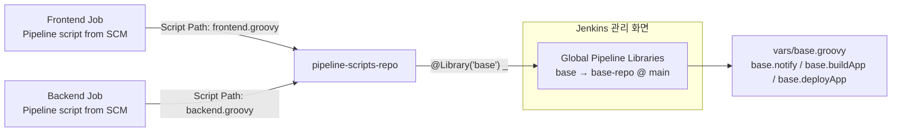

# 키즈노트 CI/CD 파이프라인 진화기: 없던 것을 만들고, 만든 것을 통합하기까지

## Part 5 — 중복을 코드로: Shared Library 도입과 Git 기반 전환

> 이 글에 등장하는 코드와 설정 화면은 실제 운영 코드 원본이 아니라, 당시 기억을 바탕으로 재구성한 예시입니다. 시간이 꽤 지나 세부 옵션명이나 정확한 구현까지는 남아있지 않아, 개념과 흐름을 전달하는 용도로 참고해주세요.
{: .prompt-info }

---

### 1. 네 플랫폼을 만들고 나서 보인 것들

Frontend, iOS, Android, Backend. 네 플랫폼의 파이프라인을 모두 Jenkins Scripted Pipeline으로 전환하고 나자, 처음에는 성취감이 컸다. 더 이상 수동 배포도, 담당자 개인의 기억에 의존하는 배포도 없었다.

하지만 각 파이프라인 스크립트를 나란히 열어보고 나서야 진짜 문제가 보이기 시작했다.

Slack 알림을 보내는 코드, 아티팩트를 처리하는 코드, 환경 변수를 치환하는 코드, 타임아웃을 거는 코드. 플랫폼마다 조금씩 다르게 생겼지만, 결국 하는 일은 똑같은 코드들이 각 파이프라인 스크립트 안에 따로따로 박혀 있었다.

Backend 파이프라인에서 썼던 `slackSendFunc()`, `withTimeoutForStage()`, `sedEscape()` 같은 함수들이 대표적이었다. 이 함수들은 Backend 스크립트 안에만 존재했고, Frontend나 Mobile 파이프라인에는 비슷한 역할을 하는 또 다른 버전의 함수가 각각 따로 존재했다.

```groovy
// Backend 파이프라인 안에 있던 Slack 알림 함수
def slackSendFunc(slackResponse, msg, msgColor, threadCheck, blockCheck = 'FALSE') {
    def tmpSlackOption = [:]
    tmpSlackOption['color'] = msgColor
    tmpSlackOption['botUser'] = true
    tmpSlackOption['tokenCredentialId'] = slackToken
    // ... 이하 생략
}
```

문제는 이 함수와 거의 같은 코드가 Frontend, iOS, Android 파이프라인 스크립트 안에도 각각 복사되어 있었다는 점이다. Slack 메시지 포맷을 하나 바꾸려면 네 곳을 다 찾아서 고쳐야 했다. 타임아웃 정책을 조정하려 해도 마찬가지였다.

파이프라인 스크립트는 처음부터 Git 레포에서 관리하고 있었다. 하지만 그건 어디까지나 "형상관리"였을 뿐, 실제로 잡이 그 레포를 참조하는 구조는 아니었다. 각 Jenkins 잡 설정 화면에는 레포에 있는 스크립트를 복사해서 붙여넣은 텍스트가 그대로 들어 있었다. 레포의 스크립트를 고쳐도 잡에는 반영되지 않았고, 반대로 잡에서 스크립트를 급하게 수정해도 레포에는 반영되지 않는 일이 반복됐다.

한 곳을 고치면 네 군데를 다 고쳐야 하는 상황. 그리고 그 네 군데가 서로 동기화되어 있다는 보장도 없는 상황.

다음 단계가 명확해졌다. **중복을 코드로 흡수하는 것.**

---

### 2. Shared Library 설계 — `base` 하나로

Jenkins에는 이런 중복을 위한 공식 **Shared Library** 기능이 있다. Jenkins 관리 화면(Manage Jenkins → System → Global Pipeline Libraries)에 라이브러리 이름과 소스 레포, 기본 브랜치(또는 태그)를 등록해두면, 파이프라인 스크립트 맨 위에 `@Library` 애노테이션 한 줄로 그 레포의 `vars/` 함수를 끌어다 쓸 수 있는 구조다.

```groovy
// 스크립트 상단에 남겨두었던 애노테이션 문법 메모
// @Library('<libName>[@<version>]') _ [<import statement>]

// 라이브러리 기본 버전 로드
// @Library('myLib') _

// 기본 버전 대신 특정 버전(브랜치/태그) 로드
// @Library('yourLib@2.0') _

// 한 문장으로 여러 라이브러리 로드
// @Library(['myLib', 'yourLib@master']) _

// 임포트와 함께 사용하는 애노테이션
// @Library('myLib@1.0') _ import static org.demo.Utilities.*

@Library('base') _
```

`base`는 이렇게 등록한 라이브러리 이름이었고, 실제로는 `vars/base.groovy` 파일 하나에 그동안 플랫폼마다 흩어져 있던 함수들(`bashOption()`, `curlTimeoutOption()`, `sedEscape()`, `slackSendFunc()`, `convertTime()` 등)을 모아둔 형태에 가까웠다. `vars/base.groovy`는 `call()` 메서드를 따로 두지 않고 여러 개의 일반 메서드를 나열해두었기 때문에, 라이브러리를 로드하면 `base` 자체가 하나의 객체가 되어 `base.함수명()` 형태로 호출하는 방식이었다.

```groovy
// 실제로 이런 모양으로 쓰였다 (Part 4의 vaultToken() 로직 일부)
def response = sh(
    script: "${base.bashOption()} curl -sL -H \"X-Vault-Token: ${VaultTokenRuntime}\" ${base.curlTimeoutOption()} ${vaultUrl}",
    returnStdout: true
).trim()
```

Part 4에서 봤던 `bashOption()`, `curlTimeoutOption()` 같은 함수들이 `base.bashOption()`, `base.curlTimeoutOption()`으로 이름만 바뀐 채 그대로 재등장한 것이었다. 각 플랫폼 스크립트 안에 흩어져 중복되던 함수들이, 이제는 `base` 하나를 통해서만 존재하게 됐다.

설계 원칙은 단순했다.

> **일단 중복되는 함수부터 `base`로 모으고, 필요에 따라 세분화는 나중에 한다.**

처음부터 깔끔하게 `vars/buildApp.groovy`, `vars/deployApp.groovy`, `vars/notify.groovy`처럼 파일을 나누는 이상적인 구조를 그리진 않았다. 실제로는 기존에 중복되던 함수들을 `base` 하나로 옮기는 것부터 시작해서, 이후 필요에 따라 조금씩 정리해나가는 쪽에 가까웠다.

---

### 3. 공통 함수 추상화

`base`로 옮긴 함수들은 크게 두 종류였다. 하나는 이미 있던 저수준 유틸리티, 다른 하나는 그 위에서 플랫폼별 차이를 흡수하도록 새로 정리한 함수였다.

#### 기존 유틸리티 — `bashOption`, `curlTimeoutOption`, `sedEscape`

Part 4에서 다뤘던 함수들이 그대로 `base`로 옮겨갔다. 호출하는 쪽 문법만 `base.` 접두사가 붙는 걸로 바뀌었을 뿐, 로직 자체는 손대지 않았다.

```groovy
// vars/base.groovy (일부)
def bashOption() {
    return '#!/bin/bash -e \n'
}

def curlTimeoutOption() {
    return '--max-time 10'
}

def sedEscape(escapeItem) {
    // Part 4에서 다룬 sed 특수문자 이스케이프 로직과 동일
}
```

#### `notify` — Slack 알림 통일

플랫폼마다 조금씩 다르게 구현되어 있던 `slackSendFunc()` 계열 함수들을 하나의 `notify()`로 정리했다. 성공, 실패, 진행 중 세 가지 상태에 대한 색상과 문구를 한 곳에서 관리하도록 했다.

```groovy
// vars/base.groovy (일부)
def notify(String status, String message, Map options = [:]) {
    def colorMap = [
        loading : '#959595',
        success : '#46e261',
        failure : '#f54434',
        aborted : '#959595'
    ]

    slackSend(
        channel: options.channel ?: '#jenkins-deploy',
        color: colorMap[status],
        message: message,
        tokenCredentialId: 'Slack-Jenkins-Bot'
    )
}
```

#### `buildApp` / `deployApp` — 플랫폼 차이 흡수

빌드와 배포는 플랫폼마다 실제 로직이 완전히 달랐기 때문에(iOS는 `xcodebuild`, Android는 `gradlew`, Backend는 소스 갱신), 이걸 하나의 진입점 뒤로 숨기는 함수도 `base`에 추가했다. 아래 코드는 그 구조를 단순화해 보여주는 예시다.

```groovy
// vars/base.groovy (일부, 개념을 단순화한 예시)
def buildApp(String platform, Map options = [:]) {
    switch (platform) {
        case 'ios':
            sh "${bashOption()} xcodebuild -workspace ${options.workspace} -scheme ${options.scheme} build"
            break
        case 'backend':
            // Backend는 별도 빌드 과정이 없으므로 소스 갱신으로 대체
            sh "${bashOption()} ssh deploy@${options.targetServer} 'cd source && git pull origin ${options.branch}'"
            break
        // ... 이하 플랫폼별 분기
    }
}

def deployApp(String platform, List targets, Map options = [:]) {
    def tasks = [:]
    targets.each { target ->
        tasks[target] = {
            // 플랫폼/타겟별 실제 배포 로직 분기
        }
    }
    parallel tasks
}
```

호출하는 쪽인 각 플랫폼의 파이프라인 스크립트는 이렇게 단순해졌다.

```groovy
@Library('base') _

node {
    stage('Build') {
        base.notify('loading', '백엔드 빌드 시작')
        base.buildApp('backend', [targetServer: DEPLOY_SERVER, branch: params.BRANCH])
    }
    stage('Deploy') {
        base.deployApp('backend', selectTargetList)
        base.notify('success', '백엔드 배포 완료')
    }
}
```

플랫폼마다 다른 세부 로직은 `base` 내부에서 분기 처리하고, 바깥에서 보이는 인터페이스는 `base.buildApp()`, `base.deployApp()`, `base.notify()`로 통일했다.

---

### 4. Git 기반 전환 — 형상관리에서 실제 참조로

`base` 자체를 만든 건 준비 작업이었다. 진짜 전환점은 이걸 각 Jenkins 잡이 **실행 시점에 직접 참조**하도록 만든 것이었는데, 여기엔 두 겹의 설정이 있었다.

**첫째**, `base` 라이브러리 자체를 Jenkins 관리 화면에 Global Pipeline Library로 등록했다. 라이브러리 이름(`base`), 소스 Git 레포 주소, 기본 브랜치를 지정해두면 `@Library('base') _` 선언만으로 어떤 파이프라인 스크립트에서든 불러올 수 있었다.

**둘째**, 각 플랫폼의 파이프라인 스크립트 자체도 Jenkins 잡 설정 화면에서 텍스트 박스에 붙여넣는 방식이 아니라, **Pipeline Definition을 `Pipeline script from SCM`으로 지정해 Git 레포에서 직접 가져오도록** 바꿨다(정확한 필드명은 기억에 의존한 예시다).



- **`base` 라이브러리 레포**: Global Pipeline Library로 등록된 `vars/base.groovy`가 있는 별도 레포.
- **`pipeline-scripts-repo`**: 플랫폼별 진입 스크립트(`frontend.groovy`, `ios.groovy`, `android.groovy`, `backend.groovy`)를 담은 레포. 각 Jenkins 잡은 자기 플랫폼의 스크립트 경로만 다르게 지정해 이 레포를 참조했다.

두 겹 다 이전과는 달랐다. 이전까지는 Jenkins 잡 설정 화면 텍스트 박스에 스크립트를 통째로 붙여넣는 방식이었기 때문에, Git 레포의 스크립트와 실제 실행되는 스크립트가 서로 다른 버전일 수 있었다. 전환 이후에는 빌드가 시작될 때마다 Jenkins가 지정된 레포/브랜치에서 최신 스크립트와 라이브러리를 가져와 실행하는 구조가 됐다. 그 간극이 사라진 것이다.

- **파이프라인 변경 = Git 커밋.** 스크립트를 고치는 유일한 방법이 PR을 올리고 머지하는 것이 됐다. `vars/base.groovy`를 고치면, 그걸 참조하는 네 플랫폼 잡 모두에 다음 빌드부터 반영됐다.
- **Jenkins 잡 설정 화면은 "어느 레포/브랜치를 볼 것인가"만 남기고, 스크립트 내용 자체를 편집하는 일은 거의 사라졌다.**
- 결과적으로 **GitOps의 초석**이 놓였다. 파이프라인의 진실은 이제 Jenkins 화면이 아니라 Git 레포에 있었다.

작아 보이는 변화였지만, "배포 파이프라인도 코드처럼 리뷰하고 이력을 남긴다"는 인식이 이때부터 조직에 자리잡기 시작했다.

---

### 5. 도입 과정의 현실

Shared Library로 전환하는 과정이 순탄하지만은 않았다.

#### 추상화 수준 논쟁

가장 먼저 부딪힌 건 "얼마나 숨길 것인가"였다. `base.deployApp('backend', targets)` 한 줄로 배포가 끝나는 건 편리했지만, 문제가 생겼을 때는 이야기가 달랐다. 배포 중 에러가 나면 로그에는 `base` 내부 어디에서 실패했는지가 한눈에 보이지 않았고, `vars/base.groovy`를 직접 열어봐야 원인을 찾을 수 있는 경우가 많아졌다. 편의를 위해 추상화한 코드가 오히려 디버깅 시간을 늘리는 딜레마였다.

#### 신뢰 기반 apply 사건 — 잘못된 레포를 체크아웃하다

이런 구조의 리스크가 실제로 터진 적이 있다.

당시 파이프라인 잡은 두 단계로 소스를 다뤄야 하는 구조였다. Jenkins 잡 자체가 파이프라인 스크립트를 SCM(파이프라인 스크립트 레포)에서 가져오는 방식이었기 때문에, 빌드가 시작되는 순간 워크스페이스에는 이미 **파이프라인 스크립트 레포의 내용**이 체크아웃되어 있었다. 그런데 그 스크립트 안에서 실제로 빌드·배포해야 할 건 파이프라인 스크립트가 아니라 **서비스 자체의 레포**였다. 이 두 번째 체크아웃이 처음에는 워크스페이스를 그대로 재사용하는 방식이라 명시적으로 비우고 새로 받는 절차가 부실했고, 그 결과 서비스 레포로 전환되어야 할 시점에도 워크스페이스에는 계속 파이프라인 스크립트 레포의 내용이 남아 있는 문제가 반복됐다. 검증 없이 머지했던 변경이 이 문제를 만들었고, 이 구조를 공유하는 잡 전체에 영향을 줄 수 있는 사안이었다.

그래서 서비스 레포 체크아웃 부분을 다음과 같이 명시적으로 다시 구성했다.

```groovy
gitParameter(
    branch: '',
    branchFilter: 'origin/(.*)',
    defaultValue: 'develop',
    description: '',
    name: 'BRANCH',
    quickFilterEnabled: true,
    selectedValue: 'DEFAULT',
    sortMode: 'ASCENDING',
    tagFilter: '*',
    useRepository: '.*' + gitRepo('url').split('/')[-1],
    type: 'PT_BRANCH',
    listSize: '20'
)
```

```groovy
def gitRepo(rType) {
    if (rType.toLowerCase() == 'url') {
        env.gitUrlItem = 'https://github.com/~.git'
    }
    if (rType.toLowerCase() == 'credentials') {
        env.gitUrlItem = 'Github-Bot'
    }

    return env.gitUrlItem
}
```

```groovy
def scmVars
cleanWsAddOption() {
    scmVars = checkout([
        $class                           : 'GitSCM',
        doGenerateSubmoduleConfigurations: false,
        extensions                       : [[$class: 'CleanCheckout']],
        submoduleCfg                     : [],
        userRemoteConfigs                : [[url: gitRepo('url'), credentialsId: gitRepo('credentials')]],
        branches                         : [[name: "${params.BRANCH}"]]
    ])
}
```

핵심은 세 가지였다.

- **`extensions: [[$class: 'CleanCheckout']]`** — 체크아웃 전에 워크스페이스를 완전히 비우도록 명시했다. 이 옵션을 붙여서, 잡이 시작되며 자동으로 남아 있던 파이프라인 스크립트 레포의 잔여물을 지우고 매번 깨끗한 상태에서 서비스 레포를 새로 받도록 강제했다.
- **`checkout([$class: 'GitSCM', ...])`을 파이프라인 코드 안에서 별도 스텝으로 명시적으로 한 번 더 실행** — 잡이 시작될 때 자동으로 이뤄지는 파이프라인 스크립트 체크아웃에 기대지 않고, `gitRepo('url')`과 `params.BRANCH`를 넘겨 실제 서비스 레포를 가리키는 체크아웃을 코드 상에서 다시 못박아 두었다. "레포 소스를 한 번 가져오되 다시 소스를 가져오는 방식으로 구성해 해결했다"는 게 바로 이 부분이다.
- **`gitParameter`의 `useRepository: '.*' + gitRepo('url').split('/')[-1]`** — 브랜치 선택 단계에서부터 서비스 레포가 아닌 다른 레포의 브랜치가 선택지에 섞여 들어올 여지를 없앴다.

여기에 `cleanWsAddOption()`(재시도 중 실패 시 `cleanWs()`로 워크스페이스를 정리하고 다시 시도하는 래퍼)까지 더해서, 체크아웃이 중간에 꼬이더라도 워크스페이스를 강제로 비우고 재시도하도록 안전장치를 추가했다.

이 사건 이후로 공통으로 쓰는 체크아웃/소스 관련 로직을 바꿀 때는 실제로 어떤 레포가 워크스페이스에 체크아웃됐는지 확인하는 절차를 거치고 나서 머지하는 쪽으로 방식을 바꿨다.

"공통 코드는 편리한 만큼, 한 곳의 실수가 전체로 퍼진다"는 걸 몸으로 배운 사건이었다.

---

### 6. 팀 간 협업

#### 소유권은 그대로, 가시성은 달라졌다

`base`를 만들고 나니 새로운 질문이 생겼다. **이걸 누가 관리하는가?**

답은 명확했다. 여전히 나(DevOps) 혼자였다. 파이프라인 스크립트를 Git 레포로 관리하기 시작했다고 해서, 다른 팀이 직접 PR을 올리고 함수를 고치는 구조로 바뀐 건 아니었다. 실제로 수정하고 그 결과에 책임지는 사람은 처음부터 끝까지 DevOps 하나였다.

달라진 건 소유권이 아니라 **가시성**이었다. 예전에는 파이프라인 스크립트가 Jenkins 잡 설정 화면 안에 박혀 있었기 때문에, 그 안을 들여다볼 생각을 하는 사람 자체가 거의 없었다. 하지만 스크립트가 레포로 관리되고 나서는 다른 개발자, 각 파트장, 그리고 CTO까지 마음만 먹으면 코드를 열어볼 수 있게 됐다. 실제로 CTO가 파이프라인 스크립트에 코드 리뷰를 해준 적도 있었다.

#### 의견은 받되, 수정은 혼자

이런 리뷰나 의견 제시가 아예 없었던 건 아니다. "이 부분은 이렇게 하는 게 낫지 않겠냐"는 식의 피드백은 종종 받았고, 그 의견을 반영해서 스크립트를 고치는 일도 있었다. 하지만 그 과정에서 실제로 코드를 수정하고 머지하는 건 항상 DevOps 몫이었다. 다른 팀이나 CTO가 직접 PR을 올리는 구조는 아니었다.

돌이켜보면 이건 "협업 문화가 자리잡았다"기보다는, **파이프라인이 더 이상 블랙박스가 아니게 됐다**는 쪽에 가까웠다. 예전에는 Jenkins 잡 설정 화면 안에 있어서 누구도 신경 쓰지 않던 코드가, 레포에 올라가면서 다른 사람 눈에 띄고, 가끔은 의견도 듣는 대상이 됐다. 다만 그 코드를 실제로 만지는 사람은 바뀌지 않았다.

---

### 7. 회고

Shared Library 도입과 Git 기반 전환은 기술적으로는 "함수를 한 곳에 모으는 리팩토링"에 불과했다. 하지만 실제로 겪어보니 그 이상의 의미가 있었다.

중복 코드를 제거하는 작업은 동시에, 그동안 Jenkins 잡 설정 화면 안에 숨어 있던 코드를 다른 사람들도 볼 수 있는 자리로 꺼내놓는 작업이기도 했다. 소유권과 책임은 여전히 DevOps 혼자에게 있었지만, 코드가 레포에 있다는 것만으로도 다른 팀과 CTO가 들여다보고 의견을 줄 수 있는 통로가 생겼다. 추상화 수준을 두고 고민했던 것도, 신뢰 기반 apply 사건으로 검증 프로세스를 만든 것도, 결국은 "혼자 관리하는 코드라도 여러 팀이 함께 의존하고 있다는 걸 전제로 다뤄야 한다"는 걸 배워가는 과정이었다.

네 플랫폼 파이프라인을 각각 만들 때는 "어떻게 자동화할 것인가"가 문제였다면, Shared Library 단계에서는 "혼자 관리하는 공통 코드를 어떻게 안전하게 다룰 것인가"가 문제였다. 기술적 난이도는 오히려 낮아졌지만, 책임져야 할 범위는 더 커졌다.

그리고 이 변화는 자연스럽게 다음 질문으로 이어졌다.

플랫폼별 파이프라인을 다 만들었고, 중복도 제거했다. 그렇다면 이 모든 과정을 통해 우리는 무엇을 얻었고, 무엇이 남았는가.

---

> 다음 글에서는 이 시리즈의 마지막 편으로,
> **없던 것을 만들고, 만든 것을 통합하기까지의 전 과정을 돌아보는 회고**를 다룬다.
> Frontend부터 Backend, 그리고 Shared Library까지 이어진 여정에서
> 무엇을 배웠고 무엇이 남았는지를 이야기할 것이다.

---

*본 시리즈는 총 6부로 구성됩니다.*

| 파트 | 제목 |
|---|---|
| Part 1 | 시작 전야: 플랫폼마다 달랐던 배포 풍경 |
| Part 2 | 첫 번째 삽: Frontend Pipeline 만들기 |
| Part 3 | Mobile로의 확장: iOS와 Android Pipeline 구축 |
| Part 4 | 마지막 퍼즐: Backend Pipeline 구축 |
| **Part 5** | **중복을 코드로: Shared Library 도입과 Git 기반 전환** ← 현재 글 |
| Part 6 | 회고: 없던 것을 만들고 통합하기까지 |
