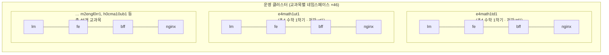

# [배포 9시간 → 10분 #1] 왜 배포가 9시간이나 걸렸나 — 문제와 병목 분석

> **시리즈 안내** — 이 시리즈는 교과목별 네임스페이스로 쪼개진 대규모 LMS(AIDT) 플랫폼에서, 프론트엔드+백엔드 전체 배포에 9시간이 걸리던 체계를 10분 내외로 단축한 과정을 처음부터 끝까지 기록한 것이다.
>
> 1. **왜 배포가 9시간이나 걸렸나 — 문제와 병목 분석** (이번 글)
> 2. Jenkins on Kubernetes 재구축 — 죽지 않는 실행 기반 만들기
> 3. 파이프라인 병렬화 — 2단 parallel과 "1회 선빌드" 캐시 전략
> 4. 결과와 회고 — 무엇이 바뀌었고 무엇이 남았나

---

## 1. 숫자로 보는 당시 상황

- 프론트엔드 + 백엔드 **전체 배포에 약 9시간** 소요
- 개발 환경을 제외하고도 **주 3회 안팎의 배포**, 운영 배포는 새벽 2시·5시 등 불규칙하게 잦음
- Jenkins가 **월 5~6회 OOM으로 완전히 다운**, 그때마다 처음부터 재세팅
- 배포 후 **HPA(파드 수) 수동 조정** 작업이 매번 뒤따름

배포 담당자는 밤샘 대기를 하고, 개발팀은 배포 피드백을 다음 날에야 받고, 그래서 배포 요청이 또 새벽으로 밀리는 악순환이 반복됐다. 문제는 도구가 아니라 구조였다.

## 2. 9시간의 뿌리 — 교과목 46개가 곧 네임스페이스 46개

이 LMS는 AIDT(AI 디지털교과서) 특성상 **교과목 하나가 곧 하나의 쿠버네티스 네임스페이스**다. 그리고 여기서 말하는 "교과목"은 흔히 생각하는 과목 단위보다 훨씬 잘게 쪼개져 있다. 검정 교과서 체계상 같은 학년·같은 과목이라도 **저자(출판사)별로 별도의 교과서가 존재**하기 때문이다.

당시 서비스 대상은 초등 3~4학년, 중학교 1~2학년, 고등학교 1~2학년이었고, 이 학교급 × 학년 × 과목 × 학기 × 저자 조합으로 **총 46개 교과목**이 각각의 네임스페이스로 운영되고 있었다. 교과목 코드가 이 조합을 그대로 담는다.

```
e4math1td1
│ │  │ │└─ 저자(출판사) 코드
│ │  │ └── 학기 (1학기)
│ │  └──── 과목 (수학)
│ └─────── 학년 (4학년)
└───────── 학교급 (e: 초등 / m: 중등 / h: 고등)
```

예컨대 `e4math1td1`은 "초등 4학년 수학 1학기, 저자 td1"의 교과목이고, 같은 초등 4학년 수학 1학기라도 저자가 다르면 `e4math1sp1`처럼 별개의 교과목·별개의 네임스페이스가 된다. (현재는 수학·영어 중심으로 재편됐지만, 문제가 터지던 당시엔 저자별로 다양한 과목이 46개까지 벌어져 있었다.)

그리고 각 네임스페이스마다 백엔드(lm), 프론트(fe), bff, 웹서버(nginx)가 **한 세트씩** 뜬다.



중요한 사실이 하나 있다. **이 46개 교과목의 백엔드 소스는 동일하고, 프론트 소스도 동일하다.** 교과목마다 다른 것은 네임스페이스, DB 정보, 도메인 등이지 코드가 아니다. 그런데도 기존 배포 스크립트는 이 46개를 **for 루프로 하나씩 직렬 처리하며 매번 처음부터 빌드**했다. 교과목 하나에 빌드+배포로 10분 남짓 걸린다고 치면, 46개 교과목 × 서비스 4종을 순차로 도는 순간 9시간은 이상한 숫자가 아니라 산술적 귀결이다. 게다가 스크립트 자체가 파이프라인이라기보다 거대한 if-else 덩어리에 가까운 Groovy 코드여서, 어디서부터 손대야 할지도 막막한 상태였다.

## 3. 병목은 세 겹이었다

단계별로 시간을 쪼개 분석해 보니 병목은 하나가 아니었다.

**첫째, 직렬 수행 구조 — 그리고 중복 빌드.** 교과목 간에는 의존성이 전혀 없는데도 순차로 돌았다. 병렬화하면 이론상 (교과목 수)분의 1로 줄일 수 있는 가장 큰 낭비 구간이었다. 더 뼈아픈 것은, 소스가 같은 46개 교과목이 각자 46번 빌드를 반복하고 있었다는 점이다. 배포 시간의 상당 부분이 "이미 한 일을 또 하는" 시간이었다.

**둘째, Jenkins 리소스 구조.** 당시 Jenkins는 사실상 단일 인스턴스 서버였다. request/limit이 제대로 산정되지 않았고, 전체 배포처럼 부하가 몰리면 OOM으로 프로세스가 죽었다. **볼륨(persistence)조차 설정되어 있지 않아** 죽으면 잡 설정, 플러그인, 크리덴셜을 처음부터 다시 세팅해야 했다. 팀 내에 "죽었을 때 재세팅 가이드"가 공유되어 있을 정도로, 죽는 게 일상이었다는 뜻이다. 부하 분산을 위해 단일 인스턴스 Jenkins를 여러 대 두는 시도도 있었지만, 각 인스턴스가 같은 OOM 문제를 그대로 안고 있어서 리소스만 이중으로 낭비될 뿐 해결이 되지 않았다.

**셋째, 수동 작업 구간.** 배포는 파드 1개로 내린 뒤 사람이 클러스터에 접속해 HPA를 다시 조정하는 방식이었다. 배포 자체가 끝나도 사람 손이 한 번 더 가야 끝나는 구조였고, 부하가 높은 시간대에 파드가 15개에서 1개로 확 줄어드는 위험까지 내포하고 있었다.

## 4. 판단: 스케일 업으로는 아무것도 해결되지 않는다

여기서 중요한 판단을 했다. **하드웨어 증설로는 세 병목 중 어느 것도 근본적으로 해결되지 않는다.** 서버를 키워도 직렬 구조와 46중복 빌드는 그대로고, 단일 인스턴스의 OOM 리스크도 그대로고, 수동 HPA 작업도 그대로다. 필요한 것은 더 큰 서버가 아니라 다른 구조였다.

방향은 세 가지로 정리됐다.

1. **실행 기반을 바꾼다** — 단일 인스턴스 Jenkins를 버리고, 빌드 부하를 격리·확장할 수 있는 Kubernetes 기반으로 재구축한다.
2. **파이프라인을 병렬화한다** — 의존성 없는 교과목들을 동시에 배포한다.
3. **중복 빌드를 제거한다** — "한 번 빌드, 46번 배포"가 되도록 산출물을 공유한다.

이 세 가지는 순서가 있다. 병렬화(2)는 실행 기반(1)이 받쳐주지 않으면 기존 Jenkins를 더 빨리 죽이는 방법일 뿐이고, 산출물 공유(3)는 병렬 잡들이 공유할 수 있는 저장 구조를 실행 기반(1) 설계 단계에서 심어둬야 가능하다. 그래서 다음 편은 이 모든 것의 토대인 **Jenkins on Kubernetes 재구축**부터 다룬다.

> **다음 편 예고** — 왜 `numExecutors: 0`인가, 에이전트 파드 스펙을 왜 2core/8Gi에 request=limit으로 고정했는가, 그리고 모든 에이전트가 공유하는 NAS PVC 하나가 어떻게 병렬 배포의 숨은 주인공이 되는가.
