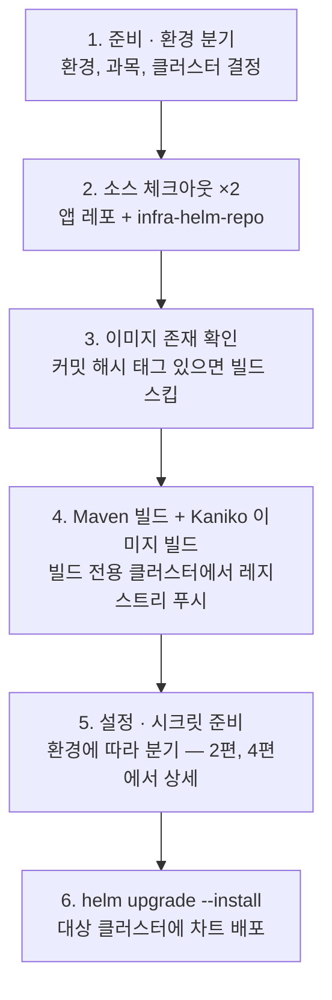
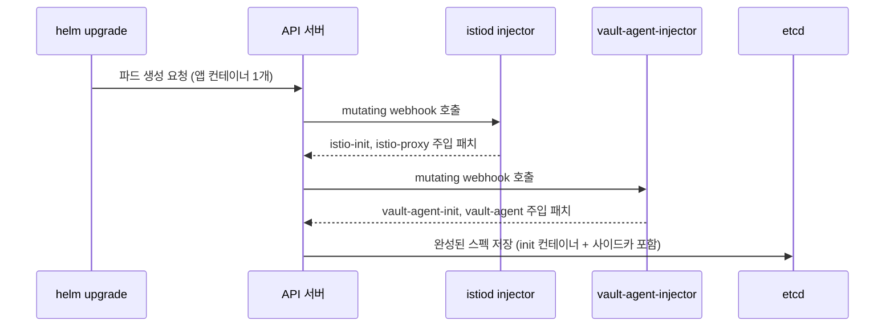

# [시크릿 관리 전환기 1편] 백엔드 CI/CD의 전체 구조 — 젠킨스, Kaniko, 헬름, 그리고 웹훅

> 이 시리즈는 운영 중인 교육 플랫폼 백엔드의 시크릿 관리를 Spring Config Server → ConfigMap/Secret → Vault로 전환한 과정의 기록이다. 1편에서는 전환 이야기의 무대가 되는 백엔드 CI/CD 전체 구조를 먼저 정리한다. 이후 편에서 다룰 모든 변화가 이 파이프라인 위에서 일어나기 때문이다.
>
> 시리즈 구성
> 1. **백엔드 CI/CD의 전체 구조** (본 편)
> 2. Spring Config Server를 떠나 ConfigMap/Secret으로
> 3. Vault 도입 — 외부 볼트와 에이전트 인젝터 구축
> 4. Vault를 CI/CD에 녹여내기, 그리고 회고

## 시스템 개요

운영 환경은 퍼블릭 클라우드의 관리형 쿠버네티스 위에 있다. 백엔드는 Spring Boot 애플리케이션이고, 과목(도메인)별로 네임스페이스를 분리해 같은 애플리케이션을 여러 벌 배포한다. 과목군에 따라 클러스터도 나뉜다 — 예컨대 과목군 A는 `prod-a`, 과목군 B는 `prod-b`에 배포된다. 클러스터를 과목군별로 분리한 사유는 트래픽 피크(개학, 시험 기간)가 과목군마다 다르게 오기 때문에 장애와 스케일링의 폭발 반경을 분리하기 위해서였다.

주요 구성 요소는 다음과 같다.

| 구성 요소 | 역할 |
|---|---|
| GitLab — 앱 소스 레포 | Spring Boot 백엔드 소스 |
| GitLab — `infra-helm-repo` | 헬름 차트, Dockerfile, 배포 스크립트, 설정 파일의 단일 저장소 |
| Jenkins | 파이프라인 오케스트레이터 |
| 빌드 전용 클러스터 | Kaniko 파드가 이미지를 빌드하는 곳 |
| 컨테이너 레지스트리 | 환경(stg/prod)별 분리 |
| 배포 대상 클러스터 | `stg-a/b`, `prod-a/b` |
| Istio + Prometheus 스택 | 서비스 메시, 관측 |

## 파이프라인의 여섯 단계

배포 잡 하나가 아래 여섯 단계를 순서대로 수행한다.



몇 가지 설계 결정과 그 사유를 짚는다.

**이미지 캐싱 — 커밋 해시 기반.** 3단계에서 `git rev-parse HEAD`로 얻은 커밋 해시가 포함된 태그가 레지스트리에 이미 있으면 4단계를 통째로 건너뛴다. 같은 소스로 두 번 빌드할 이유가 없고, 덕분에 재배포와 롤백이 소스 재빌드 없이 몇 분 만에 끝난다. 태그는 `{timestamp}-{commit_hash}` 형식으로 만들어 시간 순 정렬과 소스 추적을 동시에 잡았다.

**빌드와 배포의 클러스터 분리.** 이미지 빌드는 항상 빌드 전용 클러스터의 전용 네임스페이스에서 Kaniko 파드로 수행하고, 운영 클러스터는 완성된 이미지를 pull만 한다. 운영 클러스터에 빌드 부하와 빌드 권한이 들어가지 않게 하기 위해서다. Kaniko를 쓴 사유는 Docker 데몬 없이 이미지를 빌드할 수 있기 때문인데, 젠킨스 에이전트에 Docker 소켓을 물리는 것은 사실상 루트 권한을 주는 것과 같아 피하고 싶었다.

**Dockerfile을 ConfigMap으로 전달.** Kaniko 파드에 Dockerfile을 파일 복사가 아니라 ConfigMap으로 밀어 넣고 마운트해 쓰게 했다. 빌드 자체도 별도의 헬름 차트(`image-build` 차트)로 배포하는데, "빌드조차 헬름 릴리스"라는 일관성을 유지하면 빌드 파드의 스펙 변경도 차트 수정 한 곳으로 수렴하기 때문이다.

```groovy
// 젠킨스 잡 — Kaniko용 override values를 heredoc으로 생성하는 부분 (발췌)
sh """
/usr/bin/cat<<EOF>${app}-${env}-${BUILD_ID}-override-values.yml
pod:
  namespace: build
  dockerfile: Dockerfile
  destination: registry.example.com/edu-api:${last_commit_hash}
  build_env: ${img_target_stage}
  commit_hash: ${last_commit_hash}
EOF
helm upgrade --install kaniko-${BUILD_ID} ./image-build -n build \\
  -f ${app}-${env}-${BUILD_ID}-override-values.yml
"""
```

## CI 주도 배포 모델 — values는 젠킨스가 만든다

이 시스템의 가장 큰 특징은 **헬름 values 파일을 Git에 두지 않고 젠킨스가 매 빌드마다 heredoc으로 즉석 생성**한다는 점이다. 환경별 설정의 진짜 원본(source of truth)이 Git이 아니라 젠킨스 파이프라인 코드 안의 변수라는 뜻이고, GitOps가 아니라 CI 주도(push) 배포 모델이다.

```groovy
// 배포용 override values 생성 (발췌)
sh """
/usr/bin/cat<<EOF>k8s-override-values.yml
deploy:
  name: edu-api
  namespace: ${namespace}
  tag: ${last_commit_hash}
  strategy:
    type: ${deploy_strategy}      # stg: Recreate, prod: RollingUpdate
mesh:
  enabled: ${mesh_config}
vault:
  enabled: ${vault_config}        # 4편의 주인공
EOF
helm upgrade --install edu-api ./charts/edu-api -n ${namespace} -f k8s-override-values.yml
"""
```

환경별 차이는 파이프라인 초반의 환경 분기 스테이지에서 변수로 결정된다. 대표적인 것만 추리면 다음과 같고, 각 값에는 사유가 있다.

| 항목 | stg | prod | 사유 |
|---|---|---|---|
| 배포 전략 | Recreate | RollingUpdate | stg는 replica 1 + 리소스 절약, prod는 무중단 |
| 종료 유예 | 5초 | 30초 | stg는 빨리 교체, prod는 처리 중 요청 배수(排水) |
| probe delay | 120초 | 50~60초 | stg는 CPU 할당이 작아 기동이 느리다 |
| 시크릿 백엔드 | k8s Secret | Vault | 2~4편의 주제 |

이 모델의 장점은 파이프라인 하나만 보면 배포의 전 과정이 보인다는 것이고, 단점은 설정 변경 이력이 Git이 아니라 젠킨스 잡 코드의 커밋 이력에 묻힌다는 것이다. 이 트레이드오프는 알고 선택했다 — 당시 우선순위는 "배포 과정의 단일 진입점"이었기 때문이다.

## 배경지식 — 파드는 제출한 대로 만들어지지 않는다

이 시리즈를 이해하는 데 가장 중요한 배경지식 하나를 여기서 깔아둔다. 헬름이 제출하는 Deployment에는 앱 컨테이너가 딱 하나 있다. 그런데 실제로 뜬 파드에는 init 컨테이너 여러 개와 사이드카가 붙어 있다. 이 변신은 쿠버네티스 API 서버의 **Mutating Admission Webhook** 단계에서 일어난다.

파드 생성 요청은 다음 관문을 통과한다.

> 인증 → 인가 → **Mutating Admission(스펙을 고칠 기회)** → 스키마 검증 → Validating Admission → etcd 저장 → 스케줄링 → kubelet 기동

클러스터에 `MutatingWebhookConfiguration`을 등록해두면 "파드 CREATE 요청이 저장되기 *전에* 나에게 먼저 보내라"고 API 서버에 예약을 걸 수 있다. 웹훅 서버는 파드 스펙을 받아 JSON Patch("initContainers에 이것을 추가하라")를 돌려주고, API 서버가 패치를 적용한 뒤에야 etcd에 저장한다.



왜 이런 위임 구조를 쓰는가. Istio 프록시나 Vault 에이전트를 모든 앱 차트가 직접 정의하면, 프록시 버전 업그레이드 하나에 수십 개 차트를 전부 수정해야 한다. 웹훅 방식이면 앱 차트는 annotation 한 줄(선언)만 붙이고, "무엇을 어떤 버전으로 어떻게 주입할지"는 플랫폼(istiod, vault-agent-injector)이 중앙에서 관리한다. 관심사 분리가 인프라 레벨에서 일어나는 것이다.

앱 차트 쪽 스위치는 annotation이다. 차트에서는 이 annotation들을 helper 템플릿으로 분리해 조건부로 렌더링한다.

```yaml
# Deployment.yml (발췌) — 주입은 "선언"만 하고 실행은 웹훅에 위임한다
template:
  metadata:
    annotations:
      {{- if eq (include "mesh.enabled" .) "true" }}
      {{- include "mesh.all.annotations" . | nindent 8 }}
      {{- end }}
      {{- if .Values.vault.enabled }}
      {{- include "vault.annotations" . | nindent 8 }}
      {{- end }}
```

Istio 쪽은 스위치가 이중이다. 웹훅의 `namespaceSelector`가 `istio-injection=enabled` 라벨이 붙은 네임스페이스만 대상으로 삼고, 파드 annotation(`sidecar.istio.io/inject: "true"`)이 2차 스위치다. 그래서 배포 잡에는 `kubectl label namespace ... istio-injection=enabled --overwrite`가 배포 직전에 들어 있다. 라벨(젠킨스)과 annotation(차트)이 둘 다 맞아야 주입된다.

## 정리

이 편에서 기억할 것은 세 가지다.

1. 배포의 원본은 젠킨스 파이프라인이며, 헬름 values는 매 빌드마다 생성된다.
2. 이미지는 커밋 해시로 캐싱되고, 빌드는 전용 클러스터에 격리된다.
3. 파드의 최종 모습은 차트가 아니라 mutating webhook이 완성한다 — 차트는 annotation으로 선언만 한다.

3번이 특히 중요하다. 4편에서 Vault 에이전트가 파드에 들어오는 방식이 정확히 이 구조를 타기 때문이다. 다음 편에서는 이 파이프라인 위에서 벌어진 첫 번째 전환 — Spring Config Server를 떠나 ConfigMap/Secret으로 옮긴 이야기를 다룬다.
