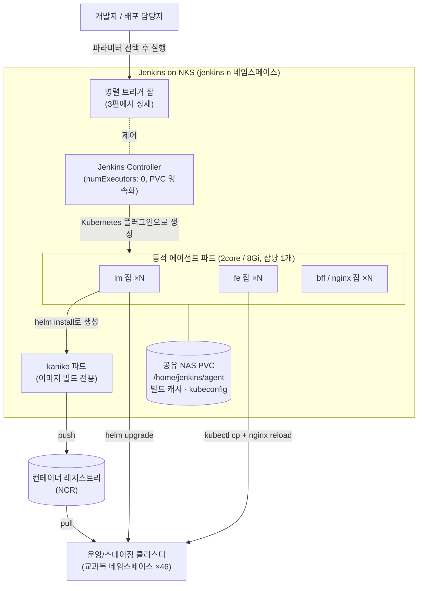

# [배포 9시간 → 10분 #2] Jenkins on Kubernetes 재구축 — 죽지 않는 실행 기반 만들기

> 1. 왜 배포가 9시간이나 걸렸나 — 문제와 병목 분석
> 2. **Jenkins on Kubernetes 재구축 — 죽지 않는 실행 기반 만들기** (이번 글)
> 3. 파이프라인 병렬화 — 2단 parallel과 "1회 선빌드" 캐시 전략
> 4. 결과와 회고 — 무엇이 바뀌었고 무엇이 남았나

[1편](/posts/jenkins-deploy-01)에서 병목이 "직렬 + 중복 빌드", "단일 인스턴스 Jenkins의 OOM", "수동 HPA" 세 겹이라는 것과, 스케일 업이 아니라 구조 재설계로 가야 한다는 판단까지 정리했다. 이번 글은 그 토대가 되는 실행 기반 — Jenkins 자체를 어떻게 다시 세웠는지에 대한 이야기다.

## 1. 왜 "Jenkins on Kubernetes"였나

이전 직장(키즈노트)에서 여러 서버 배포를 `parallel`로 고도화했던 경험이 있어, 파이프라인 병렬화가 효과적이라는 확신은 있었다. 문제는 **병렬화를 받아줄 실행 기반**이었다. 단일 인스턴스 Jenkins에서 `parallel`을 돌리면 executor와 메모리를 한 프로세스가 다 감당해야 하므로, 지금까지 월 5~6회 죽던 놈을 더 자주 죽이는 결과밖에 안 된다.

마침 회사 인프라가 이미 Kubernetes(NCP NKS) 위에 있었다. 그렇다면 Jenkins도 클라우드 네이티브하게 가는 것이 맞다고 판단했다.

- **Jenkins 공식 Helm 차트 + Kubernetes 플러그인** 기반으로 재구축한다. 빌드는 컨트롤러가 아니라 **잡마다 동적으로 생성되는 에이전트 파드**에서 수행된다. 병렬 잡이 N개면 에이전트 파드가 N개 뜨고, 끝나면 사라진다. 병렬화에 필요한 수평 확장을 클러스터 스케줄러가 알아서 해주는 구조다.
- 이렇게 하면 **부하 격리**도 따라온다. 특정 잡이 메모리를 터뜨려도 죽는 것은 그 에이전트 파드 하나이지, Jenkins 컨트롤러 전체가 아니다. "한 번의 OOM = Jenkins 전체 재세팅"이라는 기존 최악의 실패 모드를 구조적으로 제거하는 것이 핵심 목적이었다.
- 대안으로 GitLab CI나 Argo Workflows도 검토 대상이 될 수 있었지만, 기존 잡 자산과 팀의 운영 경험이 모두 Jenkins에 있었고, 당장의 목표가 "도구 교체"가 아니라 "배포 시간과 안정성"이었기 때문에 Jenkins를 유지한 채 실행 모델만 바꾸는 쪽이 리스크 대비 효과가 컸다.

## 2. 목표 아키텍처



## 3. 설계 결정과 그 이유

### 결정 1 — 컨트롤러는 빌드하지 않는다 (`numExecutors: 0`)

컨트롤러에서 빌드를 허용하면 병렬 부하가 다시 컨트롤러 프로세스로 모여 기존 OOM 문제를 재현하게 된다. 컨트롤러는 스케줄링과 UI만 담당하고, 모든 빌드는 에이전트 파드로 격리했다. 이 한 줄이 "컨트롤러가 죽는 원인" 자체를 제거하는 출발점이다.

### 결정 2 — 에이전트 파드는 2core/8Gi, request = limit

스펙 산정 근거는 가장 무거운 단일 잡이었다. 백엔드는 Maven 빌드, 프론트는 Vite 빌드(노드 힙을 크게 열어주는 대신 캐시 재사용을 전제 — 3편에서 다룬다)까지 감안하면 2core/8Gi에서 안정적으로 수행 가능했다.

request와 limit을 같게 둔 이유는 두 가지다.

첫째, 병렬 배포 시 에이전트 파드가 수십 개 동시에 뜨는데, request < limit이면 노드에 오버커밋이 발생해 **하필 전체 배포 중에 OOMKill이 나는** — 즉 가장 피하고 싶은 시나리오가 재현될 수 있다. 둘째, request = limit(Guaranteed QoS)이면 파드당 자원 소비가 예측 가능해져 "동시에 몇 개까지 띄울 수 있는가"를 노드 풀 용량으로 정확히 계산할 수 있다. 병렬 배포는 부하가 예측 가능할 때만 안전하다.

같은 맥락에서 `containerCap: 10`으로 동시 에이전트 수 상한도 함께 걸었다. 배포 잡이 클러스터 전체 리소스를 잠식해 정작 서비스 워크로드에 영향을 주는 상황을 막기 위한 가드레일이다.

### 결정 3 — 컨트롤러와 에이전트 모두에 영속 볼륨

컨트롤러에는 PVC(`jenkins-n-pvc`, NAS 스토리지 클래스)를 붙여 잡 설정·플러그인·이력을 영속화했다. "죽으면 재세팅"의 직접적인 해결책이다. 이제 컨트롤러 파드가 재시작되어도 상태는 볼륨에 남는다.

에이전트에는 **공유 NAS PVC(`jenkins-n-agent-pvc`)를 모든 에이전트 파드의 `/home/jenkins/agent`에 마운트**했다. 에이전트 파드는 `podRetention: Never`로 잡이 끝나면 사라지는 일회용인데, 볼륨이 없으면 매 잡마다 의존성 다운로드와 빌드를 처음부터 반복하게 된다.

공유 볼륨 **하나**를 모두가 마운트하는 구조로 만든 이유는 단순한 캐시를 넘어선다. 이 볼륨은 **병렬 잡 간 빌드 산출물 공유 채널**이다. 백엔드는 컨테이너 레지스트리를 공유 지점으로 쓸 수 있지만, 프론트는 이미지가 아니라 정적 파일을 파드에 주입하는 구조라 레지스트리를 쓸 수 없다. 첫 교과목이 빌드한 정적 파일을 이 공유 볼륨의 커밋 해시 경로에 올려두면, 병렬로 도는 나머지 45개 교과목 잡이 같은 경로에서 가져다 쓴다. 1편에서 말한 "한 번 빌드, 46번 배포"의 프론트 쪽 절반이 바로 이 볼륨 위에서 성립한다. (구체적인 캐시 로직은 3편에서 코드로 본다.)

### 결정 4 — 에이전트 이미지는 사내 레지스트리의 커스텀 이미지

빌드에 필요한 툴체인(JDK, Maven, Node, kubectl, helm)을 파드 기동 시 설치하는 방식은, 파드가 일회용인 이 구조에서 매 잡마다 수 분을 낭비하게 만든다. 그래서 툴체인을 구운 커스텀 에이전트 이미지를 만들어 사내 레지스트리(NCR)에 두고 쓰도록 했다.

사내 레지스트리를 고집한 이유는 하나 더 있다. Docker Hub 등 외부 레지스트리의 pull rate limit은 병렬 배포와 정면으로 충돌한다. 실제로 과거 구조에서 배포 중 6시간당 100 pull 제한에 걸려본 경험이 있었다. 수십 개 파드가 동시에 이미지를 당기는 구조에서 외부 레지스트리 의존은 그 자체가 장애 요인이다.

kubeconfig는 이미지에 굽지 않고 Secret 마운트로 주입했다. 클러스터 접근 권한이 이미지 유출과 함께 새어나가는 경로를 차단하기 위해서다.

## 4. values.yaml — 설정으로 보는 위 결정들

Jenkins 공식 Helm 차트를 override하는 `values.yaml`의 핵심만 추리면 다음과 같다. 위의 결정 1~4가 각 항목에 어떻게 대응되는지 주석으로 남긴다.

```yaml
controller:
  numExecutors: 0            # [결정 1] 컨트롤러는 빌드 금지 — 부하 격리의 출발점
  image:
    registry: "<사내 레지스트리>"   # [결정 4] 외부 레지스트리 rate limit/장애와 격리
    repository: "jenkins"
  resources:                 # 컨트롤러는 빌드를 안 하므로 가볍게
    requests: { cpu: "50m",  memory: "256Mi" }
    limits:   { cpu: "2000m" }

persistence:
  enabled: true
  existingClaim: "jenkins-n-pvc"       # [결정 3] '죽으면 재세팅'의 종결
  storageClass: "jenkins-n-nas-storage"

agent:
  enabled: true                        # Kubernetes 플러그인 동적 에이전트
  image:
    registry: "<사내 레지스트리>"       # [결정 4] 툴체인 포함 커스텀 이미지
    repository: "jenkins-agent"
  resources:                           # [결정 2] request = limit → Guaranteed QoS
    requests: { cpu: "2048m", memory: "8192Mi" }
    limits:   { cpu: "2048m", memory: "8192Mi" }
  podRetention: "Never"                # 잡 종료 시 파드 폐기 — 상태는 볼륨에만
  idleMinutes: 0
  containerCap: 10                     # [결정 2] 동시 에이전트 상한 — 클러스터 잠식 방지
  volumes:
    - type: Secret                     # [결정 4] kubeconfig는 시크릿 마운트로 주입
      mountPath: /home/jenkins/kube_config/config
      secretName: kubeconfig-comm
    - type: PVC                        # [결정 3] ★ 모든 에이전트가 공유하는 캐시 볼륨
      claimName: jenkins-n-agent-pvc
      mountPath: /home/jenkins/agent
      readOnly: false
```

이 구성으로 실행 기반이 갖춰졌다. 잡이 실행되면 에이전트 파드가 뜨고, 공유 볼륨과 kubeconfig를 물고, 일을 마치면 사라진다. 컨트롤러는 죽어도 재세팅이 필요 없고, 어떤 잡이 터져도 다른 잡과 컨트롤러는 무사하다.

하지만 기반만으로는 배포 시간이 줄지 않는다. 이 위에서 46개 교과목을 **어떤 순서와 구조로 동시에 돌릴 것인가** — 그것이 다음 편의 주제다.

> **다음 편 예고** — 교과목 × 서비스 2단 `parallel` 구조, 그리고 46개 잡을 그냥 병렬로 던지면 벌어지는 참사(thundering herd)를 막는 "1회 선빌드" 패턴. Groovy 클로저의 변수 캡처 함정까지.
