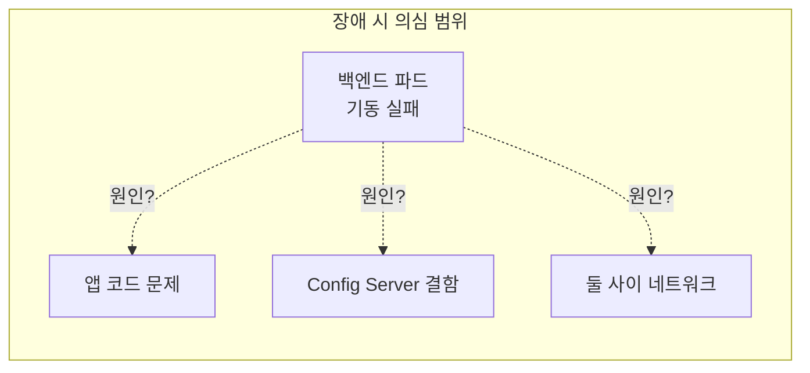
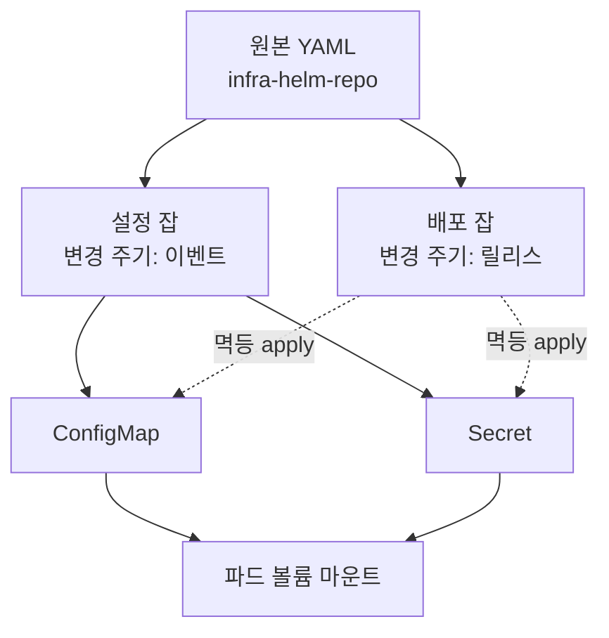

# [시크릿 관리 전환기 2편] Spring Config Server를 떠나 ConfigMap/Secret으로

> 1편에서 백엔드 CI/CD의 전체 구조를 정리했다. 이번 편은 그 위에서 벌어진 첫 번째 전환 — Spring Config Server를 걷어내고 쿠버네티스 네이티브 오브젝트(ConfigMap/Secret)로 설정 관리를 옮긴 과정이다.

## 발견 — 새벽을 갉아먹는 장애

초기 구성은 이랬다. Spring Cloud Config Server를 별도로 구축하고, 과목별 `application.yml` 파일들을 별도의 Git 레포지토리로 관리했다. 백엔드 파드는 기동할 때 Config Server에 HTTP로 설정을 받아와서 뜨는 구조였다.

문제는 반복적으로, 그리고 항상 나쁜 시간에 왔다. 백엔드 배포 과정에서 Config Server와의 통신이 실패하면 백엔드 파드 자체가 구동되지 않았다. Config Server 자체의 결함으로 통신이 안 되는 일이 잦았는데, 증상만 보면 백엔드가 안 뜨는 것이라서 **이게 백엔드 애플리케이션의 문제인지 Config Server의 문제인지 구분할 수가 없었다.** 트러블슈팅의 첫 단계인 원인 도메인 분리가 안 되니, 배포가 있는 날이면 새벽 내내 밤샘 작업으로 이어지곤 했다.



## 분석 — 문제는 결합이었다

돌이켜보면 개별 장애가 문제가 아니라 구조가 문제였다.

첫째, **기동 경로에 런타임 의존성이 하나 더 있었다.** 앱이 뜨려면 Config Server가 살아 있어야 하고, 네트워크가 통해야 하고, 해당 시점의 Git 레포 상태가 유효해야 했다. 의존성 하나가 늘어날 때마다 장애 확률은 곱해지고, 장애 시 의심 범위는 더해진다.

둘째, **설정의 관리 주체가 둘이었다.** 코드(레포의 기본 설정)와 Config Server(외부 설정)가 동시에 설정을 관리하면서, "지금 이 파드가 실제로 어떤 값으로 떠 있는가"를 추적하기가 어려웠다. 설정 충돌과 추적 불가가 반복되며 운영 복잡도가 계속 올라갔다.

셋째, **과목별 `application.yml`을 일일이 손으로 고치는 과정에서 휴먼 에러가 났다.** 과목(네임스페이스)이 수십 개인 구조에서, 같은 변경을 파일마다 반복하는 작업은 실수를 부르는 설계다.

## 배경지식 — 왜 쿠버네티스 네이티브가 답인가

쿠버네티스에는 설정을 위한 오브젝트가 둘 있다. **ConfigMap**(비밀 아닌 설정)과 **Secret**(민감 정보)이다. 이 둘을 쓰면 위의 세 문제가 구조적으로 사라진다.

- 설정이 **파드 스펙의 일부(볼륨 마운트)**가 되므로, 파드가 스케줄되는 순간 kubelet이 파일로 깔아준다. 기동 경로에 외부 서버가 없다. Config Server가 죽어서 앱이 못 뜨는 시나리오 자체가 소멸한다.
- "지금 이 파드의 설정"은 `kubectl get configmap -o yaml` 한 줄로 확인된다. 관리 주체가 클러스터 하나로 수렴한다.
- 클라우드 네이티브 설계 관점에서도 설정과 시크릿을 오케스트레이터가 관리하는 것이 정석이다 — 앱은 파일을 읽을 뿐, 설정이 어디서 왔는지 몰라도 된다.

## 구현 — 스크립트로 오브젝트를 찍어낸다

전환의 핵심은 "원본 YAML → 쿠버네티스 오브젝트" 변환을 자동화하는 것이었다. 휴먼 에러를 막는 것이 목표 중 하나였으므로, 손으로 매니페스트를 만들지 않고 스크립트가 만들게 했다.

```bash
# generate_cm.sh (발췌) — 로컬 YAML을 ConfigMap 매니페스트로 조립해 apply한다
cat > "$CONFIGMAP_YAML" << EOF
apiVersion: v1
kind: ConfigMap
metadata:
  name: $CONFIGMAP_NAME
  namespace: $NAMESPACE
data:
  $CONFIG_KEY: |-
EOF
# 원본 파일 내용을 4칸 들여쓰기해 |- 블록에 삽입한다
sed 's/^/    /' "$YAML_PATH" >> "$CONFIGMAP_YAML"

kubectl apply -f "$CONFIGMAP_YAML" --kubeconfig="$KUBECONFIG_PATH"
```

Secret 생성 스크립트도 구조는 같고, base64 인코딩(`data`)과 평문(`stringData`)을 옵션으로 고를 수 있게 했다. 한 가지 장치를 더 넣었는데, 키 이름을 지정하지 않으면 **파일명을 그대로 키로** 쓰게 했다. 파일명에 과목과 환경이 인코딩되어 있어(`{과목}-edu-api-{환경}.yml`), Secret 내용만 봐도 어느 환경의 어떤 과목 것인지 식별되게 하려는 사유였다.

차트 쪽은 이 오브젝트들을 파일로 마운트한다.

```yaml
# 차트 — Secret을 application.yml 파일로 마운트 (발췌)
volumes:
  - name: secret-config
    secret:
      secretName: {{ .Values.deploy.namespace }}-{{ .Values.deploy.name }}-secret
      items:
        - key: {{ .Values.secret.itemkey }}   # 파일명 형태의 키
          path: application.yml                # 앱이 읽을 이름으로 리네임
volumeMounts:
  - name: secret-config
    mountPath: /app/secret-config
    readOnly: true
```

그리고 Spring에게 이 파일들을 읽으라고 알려주는 것은 이미지의 ENTRYPOINT다.

```dockerfile
ENTRYPOINT ["sh", "-c", "java $JAVA_OPTS -jar /app.jar \
  --spring.config.location=file:/app/config/application.yml,file:/app/secret-config/application.yml"]
```

`spring.config.location`은 `additional-location`과 달리 기본 탐색 경로를 **대체(replace)**한다. jar 내장 설정까지 무시되므로 모든 설정이 두 파일에서만 온다. 그리고 `optional:` 접두사가 없으므로 파일이 없으면 부팅 자체가 실패한다 — 언뜻 위험해 보이지만, "설정 없이 뜬 앱"이라는 더 나쁜 상태를 원천 차단하는 fail-fast라서 의도적으로 유지했다.

## 설계 결정 — 설정 수명주기를 배포 잡에서 분리한다

이 전환에서 함께 내린 결정이 하나 더 있다. **ConfigMap/Secret의 생성·갱신을 애플리케이션 배포 잡과 별도의 잡으로 분리**했다. 사유는 운영의 명확성이다.

- 애플리케이션 수명주기(소스 → 이미지 → 파드)와 설정 수명주기(DB 비밀번호 로테이션, 엔드포인트 교체)는 변경 주기가 다르다. 설정만 바뀌었는데 전 과목을 재빌드할 이유가 없다.
- 잡 이력만 봐도 "이 변경은 코드인가 설정인가"가 구분된다. 장애 시 원인 도메인 분리 — Config Server 시절 가장 아팠던 그 지점 — 가 잡 단위에서 이루어진다.

다만 배포 잡도 배포 시점에 같은 스크립트를 멱등하게 호출한다. 새 네임스페이스 첫 배포가 설정 잡의 사전 실행에 의존하지 않도록, 배포가 스스로 전제조건을 채우게 하기 위해서다. `kubectl apply`의 멱등성 덕분에 중복 실행은 무해하다.



분리의 대가도 있다. 마운트된 파일은 kubelet 동기 주기에 갱신되지만 Spring은 기동 시 한 번 읽고 끝이므로, **설정 잡 실행 후 rollout restart까지가 한 세트**라는 운영 규약이 필요하다. 이건 지금도 개선 여지로 남아 있다(설정 잡에 선택적 restart 파라미터를 넣는 방향).

## 결과, 그리고 남은 문제

결과는 명확했다.

- Config Server 제거 — 기동 경로의 외부 의존성이 사라지면서 "배포했는데 안 뜨는" 장애의 한 축이 통째로 없어졌다.
- 운영 단순화 — 설정 확인이 kubectl 한 줄이 됐고, 원인 도메인이 잡 단위로 분리됐다.
- 스크립트 자동화로 과목별 반복 작업의 휴먼 에러가 사라졌다.

그런데 전환을 끝내고 보니 찜찜함이 하나 남았다. **Secret 오브젝트의 원본이 여전히 Git 레포지토리의 평문 `application.yml`이라는 것.** 스크립트가 아무리 자동화되어 있어도, 시크릿 값이 소스 레포에 평문으로 존재한다는 사실 자체는 달라지지 않았다. 레포 접근 권한이 곧 전 과목 DB 비밀번호 열람 권한이라는 뜻이고, 커밋 이력에는 과거의 비밀번호까지 남는다. 보안은 항상 신경 써야 한다는 원칙에 비추어 이건 미완이었다.

이 찜찜함이 다음 전환의 출발점이 된다. 3편에서는 이 문제를 풀기 위해 Vault를 도입하고 구축한 과정을 다룬다.

## 배운 점

반복되는 장애 앞에서 재시도 로직이나 타임아웃 튜닝 같은 증상 대응을 먼저 떠올리기 쉽다. 하지만 이 사례에서 효과가 있었던 것은 **장애가 발생할 수 있는 구조 자체를 제거하는 것**이었다. 기동 경로에서 외부 서버를 빼는 순간, 그 서버와 관련된 장애 시나리오 전부가 함께 사라졌다. 증상을 고치지 말고 구조를 바꿔라 — 이 시리즈 전체를 관통하는 교훈이다.
