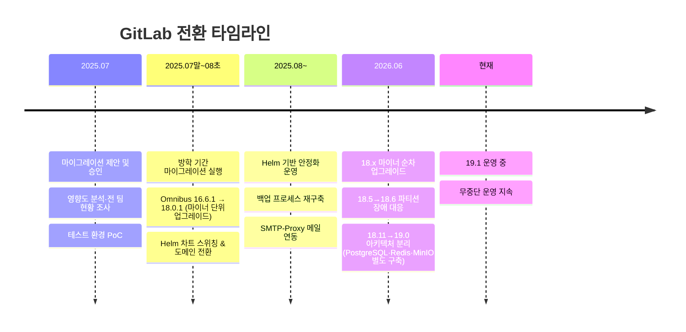

# [GitLab 마이그레이션 연대기 #0] 시리즈를 시작하며 — Omnibus 16.6.1에서 Helm 19.0.2까지

> 이 글에 등장하는 클러스터 등 자원 명은 실제 자원 명이 아니라, 임의로 재구성한 예시입니다. 보안상의 이유로 빠지거나 다르게 수정한 부분이 있으니, 이 점 참고해주세요.
{: .prompt-info }

> **이 시리즈는 누구를 위한 글인가**
> GitLab을 운영하게 될 다음 담당자, 그리고 단일 인스턴스 GitLab을 클라우드 네이티브 구조로 전환하려는 모든 DevOps 엔지니어를 위해 해당 시리즈를 작성하였다. 내가 이 작업을 다시 한다면 "이 순서로, 이 함정들을 피해서" 하라고 말해주고 싶은 내용을 그대로 담았다.

## 이 시리즈가 다루는 여정

한 문장으로 요약하면 이렇다.

**월 2~3회 중단되던 Omnibus 단일 인스턴스 GitLab 16.6.1을, Helm 차트 기반으로 마이그레이션하고 19.0.2까지 업그레이드하여 무중단 운영을 달성한 기록.**

## 시리즈 목차

| 편 | 제목 | 핵심 내용 |
|---|---|---|
| #1 | 왜 갈아엎기로 했나 | 반복 장애의 해부, "임시조치 vs 구조 개선"의 의사결정, Helm을 선택한 사유 |
| #2 | 출사표 — 설계와 계획 | 영향도 분석, 백업/롤백 전략, 일정 산정, 팀장 승인까지의 과정 |
| #3 | 실전 마이그레이션 | 3단계 이관(중간 깃랩 → 마이너 릴레이 → Helm 전환) 절차 전체 |
| #4 | 업그레이드 여정과 3번의 DB 장애 | 18.x 마이너 릴레이, fork_networks NULL, 파티션 고아화, 19.0 아키텍처 분리 |
| #5 | 회고 — 무엇을 얻고 무엇이 남았나 | 신뢰 회복, 매니지드 서비스 교훈, SMTP-Proxy, 그리고 아쉬움 |

## 아키텍처 한눈에 보기

전환 전후 구조는 아래 두 다이어그램으로 요약된다. (본문 각 편에서 세부적으로 다시 다룬다.)

{: width="100%" }
_AS-IS — Omnibus 단일 인스턴스: 모든 컴포넌트가 한 파드의 프로세스로 동거, Delete 정책 블록 스토리지, 백업 tar가 파드 내부에 누적되는 구조_

{: width="100%" }
_TO-BE — Helm 19.x: 컴포넌트별 독립 파드, PostgreSQL/Redis/MinIO/Gitaly 분리, Retain 정책 NAS 스토리지, toolbox 기반 백업_

## 읽기 전에 알아두면 좋은 전제

이 시리즈의 모든 판단에는 아래 제약 조건이 깔려 있다. **왜 이런 선택을 했는지 이해하려면 이 배경이 필요하기 때문에** 먼저 밝혀둔다.

1. **교과서 성격의 서비스를 운영하는 환경** — 이 제약 때문에 오픈소스만 사용 가능했고, GitHub 같은 SaaS는 애초에 선택지가 아니었다. GitLab CE(Community Edition)를 계속 쓸 수밖에 없는 이유이기도 하다.
2. **NCP(Naver Cloud Platform) 기반 NKS 클러스터** — StorageClass, 컨테이너 레지스트리, Outbound Mailer 등 이후 등장하는 모든 인프라 선택은 NCP 생태계를 전제로 한다.
3. **사용자 약 86명, 10여 개 부서** — 인프라팀만의 도구가 아니라 전사 개발 조직의 코드 저장소다. "마이그레이션 실패 = 전사 개발 중단"이라는 무게가 모든 일정·롤백 설계에 반영되어 있다.

## 이 시리즈에서 얻어갈 수 있는 것

- Omnibus → Helm 마이그레이션의 **실제 명령어 수준 절차** (검증된 순서 그대로)
- GitLab 메이저 업그레이드에서 만나는 **PostgreSQL 장애 3종의 원인 분석과 복구 SQL**
- "왜 그렇게 했는가"가 병기된 의사결정 기록 — 명령어보다 이게 더 오래 남는 자산이라고 믿는다

> **표기 원칙**: 본문의 비밀번호·액세스 키·레지스트리 주소는 전부 `<placeholder>`로 치환했다. 실제 값은 팀 내부 시크릿 관리 경로를 참조할 것. 외부 공개 문서에 실값을 남기지 않기 위함이다.

다음 편에서 시작한다 — **#1. 왜 갈아엎기로 했나.**
