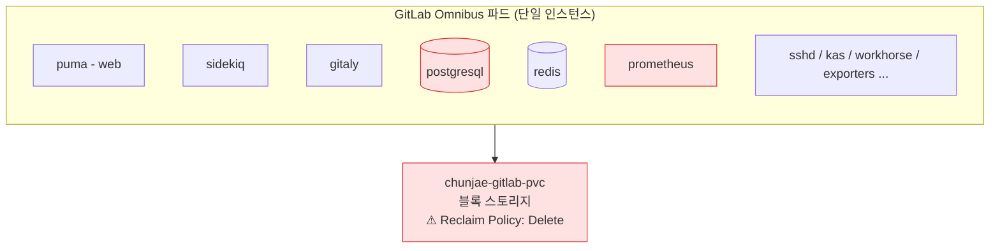

# [GitLab 마이그레이션 연대기 #1] 왜 갈아엎기로 했나 — 월 2~3회 장애의 해부

> 이 글에 등장하는 클러스터 등 자원 명은 실제 자원 명이 아니라, 임의로 재구성한 예시입니다. 보안상의 이유로 빠지거나 다르게 수정한 부분이 있으니, 이 점 참고해주세요.
{: .prompt-info }

## 1. 물려받은 시스템

우리 팀의 초기 DevOps 플랫폼은 프리랜서 분이 구축한 것을 물려받았다. GitLab과 Jenkins 모두 사실상 단일 인스턴스 기반이었고, 나는 **구축이 아니라 운영**부터 시작했다.

이 사실을 먼저 밝히는 이유가 있다. "처음부터 내가 만들었다"가 아니라 **초기 구축 → 운영 → 문제 발견 → 원인 분석 → 재설계**의 순서로 이 시스템을 이해했기 때문에, 기존 설계자와 충분히 대화하며 초기 설계 의도를 파악하는 과정을 거쳤고, 그 위에서 개선 방향을 잡을 수 있었다. 남이 만든 시스템을 비판하기 전에 "왜 이렇게 만들었는가"를 먼저 이해하는 것 — 이것이 이 시리즈 전체를 관통하는 태도다.

### 당시 GitLab의 형태

GitLab 16.6.1이 **Omnibus 방식**(도커 공식 이미지)으로 NKS 클러스터에 파드 하나로 떠 있었다. 헬름으로 릴리스 관리는 되고 있었지만, 정작 이미지가 Omnibus 단일 인스턴스라 **"쿠버네티스 위에 올라간 VM"에 가까운 상태**였다. 클라우드 네이티브라고 부르기 어려운 구조였다.

## 2. 장애의 해부 — 왜 한 달에 2~3번 멈췄나

운영을 시작하고 겪은 장애 패턴은 놀랍도록 일관적이었다.

### 장애 시나리오 A: /dev/shm 메트릭 캐시 → Disk Full

GitLab 내부 `/dev/shm`에서 **메트릭 캐시가 계속 증가하면서 Disk Full**이 발생하고, 그 결과 GitLab 전체가 500 Error를 반환하며 중단됐다. 처음에는 캐시를 삭제하는 임시조치로 대응했다.

### 장애 시나리오 B: 백업 데이터 적재 → PostgreSQL 중단

매일 새벽 2시 백업이 돌면서 생성된 tar 파일이 파드 내부 `/var/opt/gitlab/backups`에 쌓였다. 문제는 **PostgreSQL 데이터 경로(`/var/opt/gitlab`)와 같은 볼륨**이라는 점이다. 백업 데이터가 디스크를 채우면 → PostgreSQL이 DB 적재 과정에서 에러 → GitLab 구동 자체가 멈추는, 백업이 서비스를 죽이는 아이러니한 구조였다.

### 왜 프로세스 하나의 문제가 전체 장애가 되는가

Omnibus는 여러 컴포넌트가 **하나의 파드 안에서 프로세스로 동거**하는 구조다. puma, sidekiq, gitaly, postgresql, redis, prometheus... 이 중 하나만 이상이 생겨도 GitLab 전체가 영향을 받는다. 특히 DB 역할인 PostgreSQL에 문제가 생기면 즉시 전면 장애다.

여기에 구조적 리스크가 두 가지 더 있었다.

- **볼륨의 Reclaim Policy가 Delete** — PVC가 삭제되는 순간 데이터가 통째로 사라지는 설정. GitLab 서버가 내려가면 운영 자체를 못 할 정도로 위태로운 상태였다.
- **리소스 부족** — 사용자 약 86명, 10여 개 부서가 쓰는 저장소인데 단일 파드 리소스가 프로젝트 규모를 감당하지 못했다.

## 3. "이건 플랫폼 문제가 아니라 신뢰 문제다"

기술적 진단보다 중요한 게 있었다. 장애가 반복되자 **개발팀이 GitLab을, 그리고 우리 팀을 신뢰하지 않기 시작**했다는 것이다.

임시조치는 항상 통했다. 캐시를 지우면 살아났으니까. 하지만 임시조치로는:

- **재현성이 없다** — 같은 구성을 다시 만들 수 없음
- **멱등성이 없다** — 조치할 때마다 상태가 조금씩 달라짐
- **재발을 막지 못한다** — 원인 구조가 그대로이므로 언제든 같은 장애가 옴

그래서 판단했다. **증상을 고치는 게 아니라 구조를 바꿔야 한다.**

## 4. 결정의 트리거 — 어차피 이사 가야 했다

구조 개선을 결심하게 한 직접적 계기는 따로 있었다. GitLab이 떠 있던 `lms-comm-1` 클러스터에 두 가지 인프라 요구사항이 겹친 것이다.

1. **하이퍼바이저 XEN → KVM 전환 필요** — 그런데 KVM으로 바꾸는 방법은 **클러스터 재생성뿐**
2. **쿠버네티스 1.26 버전 업그레이드 필요**
3. 클러스터 리소스 자체도 부족

즉, 어차피 신규 클러스터를 만들어 GitLab을 옮겨야 하는 상황이었다. 그렇다면 선택지는 둘이었다.

| 선택지 | 내용 | 판단 |
|---|---|---|
| A. 그대로 이관 | Omnibus 16.6.1을 신규 클러스터에 복제 | 장애 구조가 그대로 따라옴. 이사 비용만 쓰고 문제는 유지 |
| B. 전환하며 이관 | 버전 업그레이드 + Helm 차트 구조로 전환 | 이관 작업에 구조 개선을 얹어 **한 번의 다운타임으로 두 가지를 해결** |

**"어차피 옮겨야 한다면, 옮기는 김에 구조를 바꾸자"** — 이것이 팀장에게 제안한 핵심 논리였고, 승인의 근거가 됐다.

## 5. 왜 Helm이었나 — 선택지 비교

대안을 검토할 때 전제 조건이 하나 있었다. **교과서 성격의 서비스를 운영하기 때문에 오픈소스를 사용해야 한다**는 제약이다. GitHub 같은 SaaS는 애초에 검토 대상이 아니었다.

그 전제에서 요구사항을 정리하면:

1. **코드로 지속 관리 가능할 것** — 팀에서 구성을 코드(values.yaml)로 리뷰·이력 관리할 수 있어야 재현성과 멱등성이 생김
2. **컴포넌트를 분리 운영할 수 있을 것** — 장애 반경을 프로세스 전체가 아닌 컴포넌트 단위로 줄이는 것이 이번 전환의 목적 그 자체
3. **확장성** — 사용자·프로젝트가 늘어도 컴포넌트별로 리소스를 조정할 수 있어야 함

이 세 가지를 모두 만족하는 것은 **GitLab 공식 Helm 차트**뿐이었다. Helm 전환 후에는 webservice, sidekiq, gitaly, toolbox 등이 각각 독립된 쿠버네티스 리소스로 운영되고, 스토리지 구조도 다시 설계할 수 있어 운영 유연성이 훨씬 높아진다.

### 짚고 넘어가기: Helm 전환 ≠ HA

여기서 흔한 오해 하나를 짚어야 한다. (실제로 면접에서도 받았던 질문이다.)

**Helm으로 옮겼다고 고가용성(HA)이 되는 게 아니다.** Helm은 GitLab을 쿠버네티스에 배포하는 *방법*일 뿐이다. 진짜 HA는 GitLab 바깥의 것들 — **PostgreSQL, Redis, Object Storage, Gitaly** — 까지 함께 이중화되어야 성립한다.

StatefulSet으로 PostgreSQL HA를 직접 구성할 수도 있지만, 그 경우 Backup / Replication / Failover / Upgrade를 전부 운영자가 직접 책임져야 한다. 그래서 나는 "**GitLab HA는 GitLab만 HA여서는 안 된다. DB와 Object Storage까지 함께 HA여야 한다**"는 원칙 아래, 데이터 계층은 매니지드 서비스로 가는 것이 맞다고 봤다. (이 논의가 어떻게 흘러갔는지는 #5 회고에서 다룬다 — 스포일러: 비용 문제로 승인받지 못했다.)

## 6. 이번 편 요약

- 장애의 근본 원인은 **단일 인스턴스 구조**(프로세스 동거 + 볼륨 공유 + Delete 정책)였고, 임시조치로는 재발을 막을 수 없었다.
- 장애 반복은 기술 문제를 넘어 **팀 신뢰의 문제**로 번졌다.
- 하이퍼바이저 전환이라는 "어차피 해야 할 이사"에 구조 개선을 얹는 전략으로 승인을 얻었다.
- 오픈소스 제약 + 코드 관리 + 컴포넌트 분리 요구를 모두 만족하는 답은 Helm 차트였다. 단, **Helm ≠ HA**임을 명확히 인지한 상태로.

다음 편은 실제 팀장 보고에 썼던 **마이그레이션 계획서(출사표)** 를 해부한다 — 영향도 분석, 백업/롤백 전략, 일정 산정의 근거까지.
