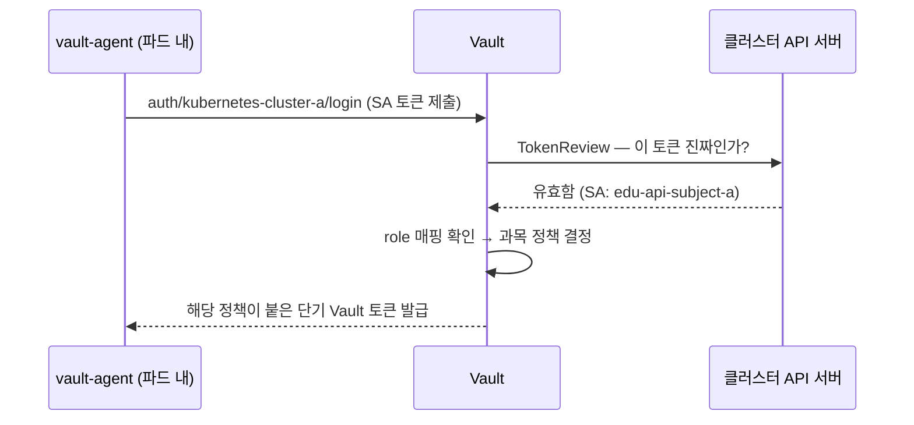
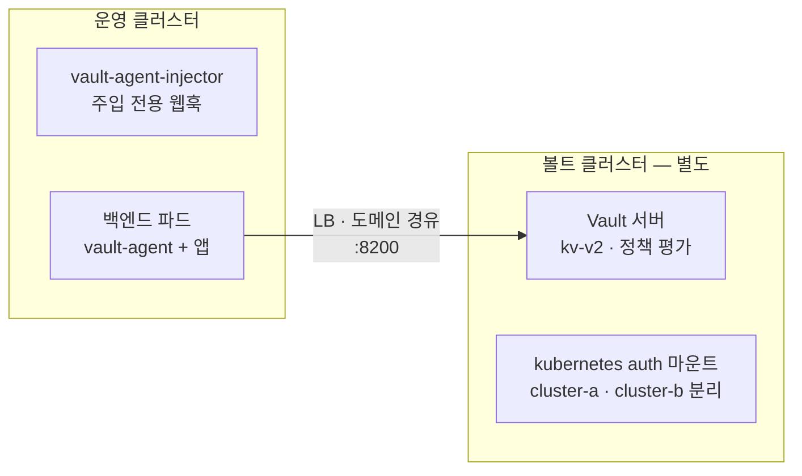

# [시크릿 관리 전환기 3편] Vault 도입 — 외부 볼트와 에이전트 인젝터 구축

> 2편에서 Config Server를 걷어내고 ConfigMap/Secret으로 옮겼지만, 시크릿의 원본이 Git에 평문으로 남는 문제가 미완으로 남았다. 이번 편은 그 문제를 풀기 위해 HashiCorp Vault를 선택하고 구축한 과정이다.

## 왜 Vault였나

목표는 명확했다. **시크릿 값을 Git 레포지토리에서 완전히 걷어내고, 별도의 도구에서 중앙 관리한다.**

첫 후보는 클라우드 벤더의 관리형 Secret Manager였다. 운영 부담이 가장 작기 때문이다. 그런데 당시 공공기관용 클라우드 환경에서는 Secret Manager가 제공되지 않았다. 관리형이 막히니 자체 구축으로 방향을 틀어야 했고, 여기서 Vault를 골랐다. 사유는 셋이다.

1. **이전 직장에서 운영해본 경험이 있었다.** 도입 리스크의 절반은 학습 곡선인데, 이건 이미 지불한 비용이었다.
2. 쿠버네티스 통합(agent injector)이 성숙해서, 앱 코드를 건드리지 않고 주입할 수 있었다. 2편에서 만든 "앱은 파일만 읽는다" 구조를 그대로 유지할 수 있다는 뜻이다.
3. 헬름 차트가 공식 제공되어, 기존의 "인프라는 헬름으로" 원칙과 맞았다.

## 배경지식 — Vault를 이해하는 네 가지 개념

구축 과정을 따라가기 전에 필요한 개념을 깔아둔다.

**① Seal/Unseal과 Shamir 비밀 분산.** Vault는 재시작하면 잠긴(sealed) 상태로 뜨고 마스터 키가 있어야 열린다. 마스터 키를 통째로 보관하면 단일 유출점이 되므로, Shamir 방식으로 여러 조각(unseal key)으로 쪼개 "n개 중 k개를 모아야 열림"으로 만든다.

```bash
vault operator init -key-shares=5 -key-threshold=3
# Unseal Key 1~5와 Initial Root Token이 출력된다.
# root token은 최초 관리 권한이므로 분실하면 안 된다.
```

**② kv-v2 엔진.** 시크릿을 key-value로 저장하는 스토리지 백엔드이고, v2는 버전 관리가 된다. 실수로 덮어쓴 시크릿을 이전 버전으로 복구할 수 있어야 하므로 v2를 썼다. v2는 API 경로에 `/data/`가 끼는 것이 특징이다 — 이후 차트 템플릿에서 `secret/data/{과목}/db` 같은 경로가 나오는 이유다.

**③ 정책(Policy).** "경로 X에 read 허용" 식으로 작성하는 HCL 권한 문서. 우리는 과목(네임스페이스)별 정책을 스크립트로 생성했다. 과목 A의 서비스가 과목 B의 DB 비밀번호를 못 읽게 격리하기 위해서다.

**④ Kubernetes Auth — 파드가 자신을 증명하는 방법.** 파드에는 비밀번호가 없다. 대신 쿠버네티스가 발급하는 ServiceAccount 토큰이 있다. Kubernetes auth method는 이걸 이용한다.



Vault가 남의 클러스터 토큰을 스스로 검증할 수 없으므로 해당 클러스터의 API 서버에 되물어보는(TokenReview) 구조다. 이를 위해 사전에 3종 세트를 등록해야 한다 — 클러스터 CA 인증서(API 서버를 신뢰하기 위해), API 엔드포인트(어디에 물어볼지), 그리고 Vault가 물어볼 때 쓸 신분증인 token_reviewer_jwt(`system:auth-delegator` 클러스터롤이 바인딩된 SA의 토큰. 이 롤이 정확히 "타인의 토큰 검증을 위임받는" 권한이다).

## 구성 결정 — 외부 볼트(External Vault) 구조

가장 중요한 구성 결정은 **Vault 서버와 agent injector를 서로 다른 클러스터에 두는 것**이었다.



사유는 두 가지다.

1. **생명주기 분리.** 시크릿 저장소를 워크로드 클러스터와 떼어놓으면, 운영 클러스터를 갈아엎거나 세대 교체를 해도 시크릿은 무사하다. 실제로 운영 클러스터의 연차별 전환이 예정되어 있었다.
2. **다중 클러스터 공유.** 여러 운영 클러스터(`prod-a`, `prod-b`)가 하나의 Vault를 공유할 수 있다. 클러스터가 늘 때마다 auth 마운트만 하나씩 추가하면 된다 — 클러스터마다 CA와 API 엔드포인트가 다르므로 마운트를 `kubernetes-cluster-a`, `kubernetes-cluster-b`로 분리했다.

Vault 서버는 LoadBalancer 타입 서비스로 노출하고 도메인을 매핑했다(`vault.example.com:8200`). 운영 클러스터 쪽에는 같은 vault-helm 차트를 **injector만 켜서** 설치한다.

```bash
# 운영 클러스터에서 — 서버 없이 injector만 설치한다.
# 사유: Vault 서버는 별도 클러스터에 있고, 이 클러스터는 주입 기능만 필요하다.
helm upgrade --install vault ./vault-helm \
  -n vault --create-namespace \
  -f values_override.yaml \
  --set server.enabled=false \
  --set injector.enabled=true \
  --set injector.externalVaultAddr=https://vault.example.com:8200
```

## 구축 과정

전체 순서는 넷이다. ① 베이스 vault-helm 차트를 인프라 레포에 클론해 관리 ② override values 수정 ③ `helm upgrade --install`로 설치 ④ 정책·접근/인증 설정. ①에서 차트 소스를 인프라 레포에 넣어 관리한 사유는, 업스트림 차트 버전과 우리 override의 조합을 Git 이력으로 추적하기 위해서다.

④가 실질이므로 상세히 적는다.

**Kubernetes Auth 등록** — 운영 클러스터마다 한 번씩 수행한다.

```bash
# 운영 클러스터에서: CA 인증서 추출
kubectl config view --raw --minify --flatten \
  -o jsonpath='{.clusters[0].cluster.certificate-authority-data}' | base64 -d > cluster-a.crt

# TokenReview 권한을 위임받을 SA 생성 + 롤 바인딩
kubectl create sa vault-auth -n kube-system
kubectl create clusterrolebinding vault-auth-binding \
  --clusterrole=system:auth-delegator \
  --serviceaccount=kube-system:vault-auth
kubectl create token vault-auth -n kube-system --duration=87600h > reviewer-token.txt

# Vault에서: 이 클러스터용 auth 마운트에 3종 세트 등록
vault write auth/kubernetes-cluster-a/config \
  kubernetes_host="<클러스터 API 엔드포인트>" \
  kubernetes_ca_cert=@cluster-a.crt \
  token_reviewer_jwt="<reviewer-token.txt 내용>"
```

**정책·롤의 IaC 관리.** 정책과 롤은 UI에서 클릭으로 만들지 않고 인프라 레포의 셸 스크립트로 관리했다. 과목이 수십 개라 반복 작업이고, 반복 작업은 스크립트여야 휴먼 에러가 없기 때문이다 — 2편에서 얻은 교훈의 재적용이다.

```bash
# create-subject-policies.sh — 과목별 정책 HCL 생성 (개념 발췌)
for subject in "${SUBJECTS[@]}"; do
cat > "policy/${subject}.hcl" << EOF
path "secret/data/${subject}/*" {
  capabilities = ["read"]
}
EOF
done

# 이후 apply-subject-policy.sh 로 일괄 적용:
#   vault policy write ${subject}-policy policy/${subject}.hcl
# 그리고 create-subject-roles.sh 로 role 등록:
#   vault write auth/kubernetes-cluster-a/role/${subject}-spring-boot \
#     bound_service_account_names=edu-api-${subject}-sa \
#     bound_service_account_namespaces=${subject} \
#     policies=${subject}-policy
```

role이 SA 이름·네임스페이스와 정책을 묶는 지점이다. "subject-a 네임스페이스의 edu-api SA로 로그인하면 subject-a 경로만 읽을 수 있다"가 여기서 성립한다.

## 시크릿 값 채우기 — Git에서 Vault로

마지막으로 시크릿 값 자체를 Vault에 넣는다. 갱신은 CI(설정 잡)가 수행하되, 실제 로직은 인프라 레포의 스크립트에 두었다. 잡은 트리거와 파라미터만 담당하고 로직은 레포에서 버전 관리하기 위해서다.

```bash
# 원본 YAML에서 값을 추출해 과목별 경로에 저장한다 (발췌)
vault kv put "secret/${SUBJECT}/db" \
  host="$DB_HOST" port="$DB_PORT" name="$DB_NAME" \
  username="$DB_USER" password="$DB_PASS" \
  driver="$DB_DRIVER" max_pool_size="$MAX_POOL"

vault kv put "secret/${SUBJECT}/redis"      host=... password=...
vault kv put "secret/${SUBJECT}/viewer-api" url=... client_secret=...
```

시크릿을 db, redis, 외부 API처럼 **용도별 경로로 쪼갠** 사유는 두 가지다. 부분 갱신(DB 비밀번호만 로테이션)이 가능해지고, 이후 정책을 더 잘게 쪼갤 여지가 생긴다. 또 스크립트에 과목 화이트리스트 검증을 넣어 오타로 엉뚱한 경로에 시크릿이 생기는 것을 막았다.

여기까지가 "저장" 쪽 이야기다. 이제 저장된 시크릿을 파드가 **꺼내 쓰는** 쪽 — 1편에서 깔아둔 웹훅 구조 위에서 vault-agent가 주입되고, init 컨테이너 체인이 시크릿을 렌더링하고, Spring이 그 파일을 읽어 기동하는 전 과정 — 이 남았다. 그 이야기와 PoC에서 운영 적용까지의 과정, 그리고 회고를 4편에서 다룬다.
