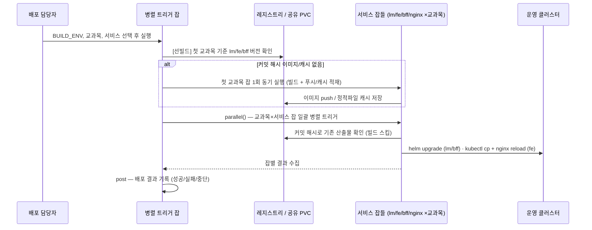

# [배포 9시간 → 10분 #3] 파이프라인 병렬화 — 2단 parallel과 "1회 선빌드" 캐시 전략

> 1. 왜 배포가 9시간이나 걸렸나 — 문제와 병목 분석
> 2. Jenkins on Kubernetes 재구축 — 죽지 않는 실행 기반 만들기
> 3. **파이프라인 병렬화 — 2단 parallel과 "1회 선빌드" 캐시 전략** (이번 글)
> 4. 결과와 회고 — 무엇이 바뀌었고 무엇이 남았나

[2편](/posts/jenkins-deploy-02)에서 죽지 않는 실행 기반을 만들었다. 이번 글은 그 위에서 46개 교과목을 실제로 어떻게 동시에, 그리고 중복 없이 배포하는지를 코드로 본다. 파이프라인은 세 종류다 — 전체를 지휘하는 **병렬 트리거 잡**, 백엔드를 담당하는 **lm 서비스 잡**, 프론트를 담당하는 **fe 서비스 잡**.

## 1. 전체 실행 플로우

한 번의 전체 배포에서 실제로 일어나는 일을 시퀀스로 그리면 다음과 같다.



## 2. 트리거 잡: 병렬 작업 맵과 선빌드 패턴

트리거 잡의 심장은 교과목 × 서비스 조합을 클로저 맵으로 만들어 `parallel()`에 넘기는 부분이다.

```groovy
// 교과목 × 서비스 조합으로 병렬 작업 맵 구성
def all_parallel_builds = [:]

domain_list.eachWithIndex { domain, index ->
    for (String application : application_list) {
        def jobKey = "${domain}-${application}-${BUILD_ENV}"

        // Groovy 클로저는 변수를 참조로 캡처하므로,
        // 루프 변수를 그대로 쓰면 모든 클로저가 마지막 값을 보게 된다.
        // 반드시 지역 변수로 고정(capture)한 뒤 클로저에 넘긴다.
        def finalBuildEnv    = buildenv
        def finalDomain      = domain
        def finalApplication = application
        def finalCluster     = get_cluster_name(temp_build)
        def finalFeList      = get_fe_branch_name(temp_build)

        // ── 캐시 선빌드(warm-up): 첫 번째 교과목에서만 수행 ──
        if (index == 0 && application == "lm") {
            lm_last_commitHash = get_last_commit_hash("lm", bebranch)
            // 최신 커밋 해시로 태깅된 이미지가 레지스트리에 없으면
            // 여기서 '동기적으로' 1회 빌드해 푸시해 둔다.
            if (!check_lm_version(domain, buildenv, containerregistry,
                                  "lm-${buildenv}", lm_last_commitHash)) {
                run_build_job(finalApplication, finalBuildEnv, finalDomain,
                              finalCluster, finalFeList)
            }
        }
        // fe / bff도 동일 패턴 (fe는 레지스트리 대신 공유 PVC 캐시 확인)

        // 병렬 작업 등록
        all_parallel_builds[jobKey] = {
            run_build_job(finalApplication, finalBuildEnv, finalDomain,
                          finalCluster, finalFeList)
        }
    }
}

// 등록된 모든 잡을 동시에 실행
if (all_parallel_builds.size() > 0) {
    parallel(all_parallel_builds)
}
```

여기서 두 가지 "왜"가 이 시리즈 전체에서 가장 중요하다.

**왜 선빌드를 병렬 시작 전에 동기로 하는가.** 46개 잡을 그냥 병렬로 던지면, 이미지가 아직 없으므로 46개 잡이 **동시에 각자 빌드를 시작**한다. 캐시 미스가 46번의 중복 빌드로 폭발하는 것이다(thundering herd). 첫 교과목에서 딱 한 번 빌드를 끝내 산출물을 공유 지점(백엔드는 레지스트리, 프론트는 공유 PVC)에 올려둔 뒤 병렬을 시작하면, 나머지 45개는 전부 캐시 히트로 빌드를 건너뛴다. 소스가 동일한 교과목 구조([1편](/posts/jenkins-deploy-01) 참고)이기에 성립하는, 병렬 배포의 실효 시간을 결정한 가장 중요한 한 수였다.

**왜 클로저 밖에서 `final*` 변수로 캡처하는가.** Groovy 클로저는 바깥 변수를 참조로 물기 때문에, 루프 변수를 그대로 클로저 안에서 쓰면 실행 시점에 모든 클로저가 루프의 마지막 값을 보게 된다. 병렬 잡 46개가 전부 마지막 교과목만 배포하는 사고를 막으려면 반복마다 지역 변수로 값을 고정해야 한다. 병렬 Groovy에서 흔하게 밟는 지뢰라 명시적으로 남긴다.

`run_build_job()` 내부는 서비스 종류에 따라 실제 서비스 잡(`build job:`)을 호출하는데, `all` 선택 시에는 lm/fe/bff/nginx를 **또 한 번 내부 `parallel`로** 돌린다. 교과목 차원의 병렬 × 서비스 차원의 병렬, **2단 병렬 구조**인 셈이다. 교과목 안에서도 서비스 간 의존성이 없으므로 직렬로 기다릴 이유가 없기 때문이다.

## 3. 파라미터 설계: 사람이 실수하기 어렵게

트리거 잡은 Active Choices 플러그인으로 파라미터를 구성했다. `BUILD_ENV`(stg05, prod05, stg05-all …)를 고르면 그 환경에 존재하는 교과목 목록만 `DOMAIN_LIST` 체크박스로 연동(cascade)되어 나온다.

```groovy
[$class              : 'CascadeChoiceParameter',
 choiceType          : 'PT_CHECKBOX',
 name                : 'DOMAIN_LIST',
 referencedParameters: 'BUILD_ENV',   // BUILD_ENV 선택에 따라 목록이 바뀜
 script              : [ /* 환경별로 존재하는 교과목 코드만 반환 */ ]]
```

이렇게 한 이유는 단순하다. 새벽 배포는 사람이 가장 실수하기 좋은 시간대다. 존재하지 않는 환경-교과목 조합을 아예 선택할 수 없게 UI 차원에서 막고, 잘못된 조합은 스크립트 초입에서 명시적 예외로 끊는다(`"배포하실 교과목을 선택해 주세요"`). 배포 자동화에서 파라미터 검증은 부가 기능이 아니라 안전장치다. 트리거의 `post { success / failure / aborted }` 블록에서 배포 결과를 기록하도록 한 것도 같은 맥락 — 새벽에 실행된 배포일수록 "무엇을 어떤 결과로 배포했는지"가 데이터로 남아야 한다.

## 4. 백엔드(lm) 잡: 커밋 해시 기반 이미지 재사용 + kaniko

lm 서비스 잡의 스테이지 흐름은 이렇다.

```
준비 → 빌드 환경 변수 설정 → 라이브러리 버전 체크 → 코드 가져오기
→ 이미지 확인 → 코드 빌드(조건부) → 컨테이너 빌드/배포(kaniko, 조건부)
→ 이미지 빌드 대기 → 빌드 로그 확인 → 쿠버네티스 배포(helm)
```

핵심은 "이미지 확인" 스테이지다. 소스의 HEAD 커밋 해시가 이미 이미지 태그로 레지스트리에 존재하면, 코드 빌드와 이미지 빌드를 통째로 건너뛴다.

```groovy
git_last_commit_hash = sh(script: "git rev-parse --verify HEAD",
                          returnStdout: true).trim()

result_tag_name = check_img_exist( /* 레지스트리 태그 목록 조회 */, git_last_commit_hash)

if (result_tag_name != "is_exist") {          // 태그명이 반환됨 = 이미지 존재
    last_commit_hash = result_tag_name        // 기존 이미지 태그 재사용
    img_exist = true
} else {                                      // "is_exist" = 아이러니하게도 '없음'
    // 태그: 빌드시각-커밋해시 → 같은 커밋의 재빌드도 구분 가능
    last_commit_hash = sh(script: "date '+%Y%m%d%H%M%S'",
                          returnStdout: true).trim() + "-" + git_last_commit_hash
    img_exist = false
}
```

**왜 커밋 해시를 태그로 쓰는가.** `latest` 태그 방식은 "지금 레지스트리의 latest가 어느 소스인지"를 아무도 보장하지 못한다. 커밋 해시를 태그에 넣으면 이미지 존재 확인이 곧 "이 소스는 이미 빌드됐는가"라는 질문과 동치가 되고, 이것이 46개 교과목이 안전하게 이미지를 공유할 수 있는 근거가 된다. 태그 앞에 빌드 시각을 붙인 것은 같은 커밋을 강제로 재빌드했을 때 이전 이미지와 구분하기 위해서다.

(코드 정리 여담: `check_img_exist()`가 이미지를 **못 찾았을 때** `"is_exist"`라는 문자열을 반환하는 원본 구현은 읽는 사람을 두 번 생각하게 만든다. 실제 반영 시에는 `null` 반환이나 `found/not-found` 같은 명시적 값으로 바꾸는 것을 권한다. 동작에는 문제가 없지만, 새벽 장애 대응 중에 읽을 코드일수록 네이밍이 정직해야 한다. 해당 스크립트에서는 편의상 수정하지 않고 그대로 두었으나, 명확히 따지자면 혼동 방지를 위해 위와 같이 수정되는 것이 옳다.)

이미지 빌드가 필요한 경우에는 kaniko 파드를 헬름으로 생성한다.

```groovy
stage('컨테이너 빌드/배포 진행') {
    when { expression { params.IMAGE_BUILD == true && img_exist == false } }
    steps {
        sh """
            # 이번 빌드 전용 override values 생성 (destination = 커밋해시 태그)
            cat <<EOF > ${app}-${str3}-${BUILD_ID_NUM}-override-values.yml
            pod:
              namespace: jenkins-n
              dockerfile: Dockerfile
              destination: ${repo_host}/${str3}:${last_commit_hash}
              ...
            EOF

            # Dockerfile은 ConfigMap으로 주입 → 빌드 컨텍스트를 이미지에 굽지 않음
            kubectl create configmap ${str3}-${last_commit_hash}-cm \\
                --from-file=Dockerfile=.../Dockerfile-lm-cm -n jenkins-n

            # kaniko 빌드 파드를 helm으로 생성 (끝나면 로그 확인 후 삭제)
            helm install kaniko-${str2} .../image-build-nn -n jenkins-n \\
                -f ${app}-${str3}-${BUILD_ID_NUM}-override-values.yml
        """
    }
}
```

**왜 kaniko이고, 왜 helm으로 감쌌는가.** 에이전트 파드 안에서 docker build를 하려면 DinD(Docker-in-Docker)나 노드 도커 소켓 마운트가 필요한데, 전자는 privileged 컨테이너를 요구하고 후자는 노드 보안 경계를 깨뜨린다. kaniko는 데몬 없이 유저 스페이스에서 이미지를 빌드해 푸시할 수 있어 클러스터 내 빌드에 적합했다. 이를 helm 차트(`image-build-nn`)로 감싼 이유는 빌드 파드의 스펙·시크릿·컨텍스트를 values 파일 하나로 선언하고, `BUILD_ID`를 이름에 넣어 **병렬로 여러 빌드 파드가 떠도 서로 충돌하지 않도록** 하기 위해서다. 이후 스테이지에서 해당 파드 로그를 출력하고 삭제하므로, 이미지 빌드도 "생성 → 실행 → 폐기"되는 일회용 파드 패턴을 따른다.

마지막 "쿠버네티스 배포" 스테이지의 helm override values에는 Deployment/Service만이 아니라 HPA가 함께 들어간다.

```yaml
hpa:
  name: aidt-api-lm-hpa
  namespace: ${namespace}
  minReplicas: ${minReplicas}          # 환경별 산정값
  maxReplicas: ${maxReplicas}
  targetCPUUtilizationPercentage: ${targetCPUUtilizationPercentage}
lr:                                    # LimitRange — 네임스페이스 리소스 가드레일
  ...
mesh:                                  # Istio VirtualService/DestinationRule
  ...
```

### HPA 수동 조정의 단계적 제거 — 임시 처방에서 선언적 편입까지

사실 HPA 자동화는 한 번에 헬름 편입으로 간 것이 아니라 두 단계를 거쳤다.

**1단계(임시 처방): TSV 기반 일괄 패치 스크립트.** 헬름 차트를 손볼 여유가 없던 시기에, 우선 "사람이 네임스페이스 46개를 돌며 `kubectl edit hpa`를 반복하는" 최악의 형태부터 없앴다. 교과목(네임스페이스)마다 조정해야 할 파드 수가 다르므로, 그 산정값을 **TSV 파일 하나에 데이터로 분리**하고 스크립트는 그 파일을 읽어 일괄 패치만 하도록 했다. 조정값이 바뀌면 스크립트가 아니라 TSV만 고치면 되고, 그 TSV가 곧 "현재 각 교과목의 파드 수 기준표" 문서 역할까지 겸하게 하려는 의도였다.

```tsv
# prodn_hpa_config.tsv — 네임스페이스별 HPA 조정 기준표
NAMESPACE	HPA_NAME	MIN	MAX
e4math1td1	aidt-api-lm-hpa	3	15
e4math1sp1	aidt-api-lm-hpa	3	15
m2engl0ss1	aidt-api-lm-hpa	2	10
...
```

```bash
#!/usr/bin/env bash
# 네임스페이스별 HPA min/max를 TSV 기준표대로 일괄 패치한다.
# 사용법: ./patch_hpa.sh [tsv파일] [--dry-run]
set -euo pipefail   # 실패 무시 없이 즉시 중단 — 배포 스크립트의 기본기

TSV_FILE="${1:-prodn_hpa_config.tsv}"
DRY_RUN="${2:-}"

[[ -f "$TSV_FILE" ]] || { echo "[ERROR] 설정 파일 $TSV_FILE 이 존재하지 않습니다." >&2; exit 1; }

ok=0; skip=0; fail=0

# 첫 줄(헤더) 제외, CRLF로 저장된 파일도 안전하게 처리
while IFS=$'\t' read -r NAMESPACE HPA_NAME MIN MAX _; do
    MAX="${MAX%$'\r'}"

    # 누락/형식 검증: 잘못된 한 줄이 46개 네임스페이스 패치를 오염시키지 않도록
    if [[ -z "$NAMESPACE" || -z "$HPA_NAME" || -z "$MIN" || -z "$MAX" ]]; then
        echo "[SKIP] 누락된 항목 → ${NAMESPACE:-?}/${HPA_NAME:-?}"; ((skip++)); continue
    fi
    if ! [[ "$MIN" =~ ^[0-9]+$ && "$MAX" =~ ^[0-9]+$ ]] || (( MIN > MAX )); then
        echo "[SKIP] 값 오류(min=$MIN, max=$MAX) → $NAMESPACE/$HPA_NAME"; ((skip++)); continue
    fi

    echo "▶ 패치: $NAMESPACE/$HPA_NAME → min=$MIN, max=$MAX"
    if [[ "$DRY_RUN" == "--dry-run" ]]; then
        ((ok++)); continue    # 새벽 운영 반영 전, 낮에 대상·값만 검증하는 용도
    fi

    if kubectl patch hpa "$HPA_NAME" -n "$NAMESPACE" --type=merge \
         -p "{\"spec\":{\"minReplicas\":$MIN,\"maxReplicas\":$MAX}}"; then
        ((ok++))
    else
        echo "[FAIL] $NAMESPACE/$HPA_NAME 패치 실패" >&2; ((fail++))
    fi
done < <(tail -n +2 "$TSV_FILE")

echo "완료: 성공 $ok / 생략 $skip / 실패 $fail"
(( fail == 0 )) || exit 1   # 하나라도 실패하면 비정상 종료 → Jenkins 잡을 실패로 표시
```

이 스크립트를 Jenkins 잡에서 배포 후속 스텝으로 실행하거나 배포 스크립트 안에 녹여, HPA 조정을 반자동화했다. 원본 대비 다듬은 지점에도 각각 이유가 있다. `set -euo pipefail`은 패치 도중 오류를 조용히 넘기지 않기 위해서고, 숫자·min≤max 검증은 TSV 오타 한 줄이 운영 파드 수를 엉뚱하게 바꾸는 사고를 줄 단위에서 차단하기 위해서다. `--dry-run`은 새벽 운영 반영 전에 낮 시간대에 대상과 값을 미리 검증하려는 용도이고, 마지막에 성공/생략/실패를 집계해 실패가 하나라도 있으면 비정상 종료하는 것은 **Jenkins 잡 상태가 곧 "46개 전부 반영됐는가"에 대한 답**이 되도록 하기 위해서다. 절반만 패치되고 성공으로 끝나는 잡이 가장 위험하다.

**2단계(근본 해결): 헬름 차트 편입.** 다만 이 스크립트는 어디까지나 임시 처방이다. 배포와 HPA 조정이 여전히 별개의 행위여서, 스크립트 실행을 잊으면 파드 1개 상태가 유지되는 구조적 위험이 남는다. 그래서 최종적으로는 위에서 본 것처럼 HPA를 배포 헬름 차트 안으로 편입시켰다. 배포와 동시에 HPA가 선언적으로 적용되므로 "배포 후 파드 수 조정"이라는 행위 자체가 사라졌고, TSV에 있던 네임스페이스별 산정값은 헬름 override values(`minReplicas`/`maxReplicas`)로 이관됐다. 파드 1개로 내렸다가 수동으로 올리는 기존 방식은 부하 상황에서 파드가 15개에서 1개로 꺼지는 사고 가능성까지 안고 있었으므로, 이 결정은 시간 단축 이상으로 안전 문제이기도 했다.

여기서 배운 것을 한 줄로 요약하면 — **수동 작업을 없애는 최종 형태는 자동화 스크립트를 하나 더 만드는 것이 아니라, 그 작업을 배포 산출물의 선언 안으로 편입시키는 것**이다. 스크립트 자동화(1단계)는 유효한 중간 단계였지만, "실행해야 하는 것"인 이상 잊힐 수 있다. 선언에 편입되면 잊는 것이 불가능해진다.

## 5. 프론트(fe) 잡: 공유 PVC 캐시 + kubectl cp + nginx reload

프론트는 구조가 특수하다. 이미지를 말지 않고, 각 교과목 네임스페이스의 웹서버 파드 안 정적 파일 경로에 빌드 산출물을 직접 주입한다. 그래서 공유 지점이 레지스트리가 아니라 [2편](/posts/jenkins-deploy-02)에서 깔아둔 **공유 NAS PVC**다.

```groovy
stage('프런트엔드 빌드') {
    steps { script { ws("$AGENT_WORKSPACE_BUILD_PATH") {
        git_last_commit_hash = sh(script: "git rev-parse --verify HEAD",
                                  returnStdout: true).trim()

        // 공유 PVC 상의 커밋 해시 키 캐시 확인
        def is_build = sh(script: "check_front_build.sh $cache_path " +
                          "$git_last_commit_hash $cache_history_path",
                          returnStdout: true).trim()

        if (is_build == "none_exist") {
            sh "npm ci"    // package-lock 기준 재현 가능한 설치 (npm install 대신)
            // Vite 대규모 번들 빌드 → 노드 힙 상향, 로그는 파일로 남김
            sh 'export NODE_OPTIONS="--max-old-space-size=16384" && ' +
               "npm run build:$buildenv > $HISTORY/build-$git_last_commit_hash 2>&1"
            // 빌드 로그에 'built in'(Vite 성공 마커)이 있을 때만 캐시에 적재
            sh "if grep -q 'built in' $HISTORY/build-$git_last_commit_hash; " +
               "then cp -rf target/ $cache_path/$git_last_commit_hash; " +
               "else rm -rf $cache_path/$git_last_commit_hash; fi"
        }
    }}}
}
```

디테일마다 이유가 있다. `npm install`이 아니라 `npm ci`인 것은 lock 파일 기준의 재현 가능한 설치가 캐시 공유의 전제이기 때문이고, 빌드 로그를 파일로 남겨 Vite의 성공 마커(`built in`)를 grep으로 확인한 뒤에만 캐시에 넣는 것은 **깨진 산출물이 캐시를 오염시키면 46개 교과목 전체에 깨진 프론트가 배포되는 참사**를 막기 위해서다. 캐시는 공유되는 순간 오염도 공유된다는 점을 설계에 반영한 것이다.

배포 스테이지는 이렇다.

```groovy
stage('Vue Dist 쿠버네티스 배포 (POD 볼륨 마운트)') {
    steps { script {
        replica = sh(/* 해당 교과목 웹서버 Deployment의 replicas 조회 */).toInteger()

        for (int i = 0; i < replica; i++) {
            pod = sh(/* i번째 웹서버 파드 이름 조회 */)
            if (i == 0) {
                // 첫 파드에만 정적 파일 주입 —
                // 웹서버 파드들이 정적 파일 경로를 공유 볼륨으로 마운트하므로
                // 한 파드에 넣으면 전 파드에 반영된다.
                deployToFirstPod(pod, ...)  // 내부: kubectl cp target/. → /var/www/.../frontend/
                                            //       + 환경별 env.js 생성 주입
            }
            // 모든 파드에서 nginx 설정/캐시 리로드 (다운타임 0)
            sh "kubectl exec $pod -n $namespace -- nginx -s reload"
        }
    }}
}
```

**왜 재배포(rollout) 대신 `kubectl cp` + `nginx -s reload`인가.** 정적 파일 교체를 위해 웹서버 파드를 재기동하면 그 자체로 순단 리스크와 시간이 생긴다. 정적 파일 경로가 공유 볼륨이므로 파일만 갈아끼우고 nginx를 graceful reload하면 **무중단으로, 파드 수와 무관하게 수 초 안에** 교체가 끝난다. 첫 파드에만 `cp`하고 나머지 파드는 reload만 도는 루프 구조가 이 볼륨 공유 전제를 그대로 반영한다. (뒤집어 말하면, 이 구조는 볼륨 공유가 깨지는 순간 함께 깨진다. 웹서버 볼륨 구성을 바꿀 일이 있다면 이 잡부터 확인해야 한다는 운영 노트를 남겨둔다.)

이렇게 세 파이프라인이 맞물리며 "한 번 빌드, 46번 병렬 배포"가 완성됐다. 그래서 결과는 어땠는가 — 숫자와 함께, 숫자에 안 잡히는 변화까지 다음 편에서 정리한다.

> **다음 편 예고** — 9시간이 10분이 된 것의 분해(병렬화 몫과 캐시 몫), OOM 소멸, 그리고 솔직한 한계: 스크립트 복잡성, 커스텀 이미지 기반 구축의 대가, 여전히 남은 배포 요청 구조.
