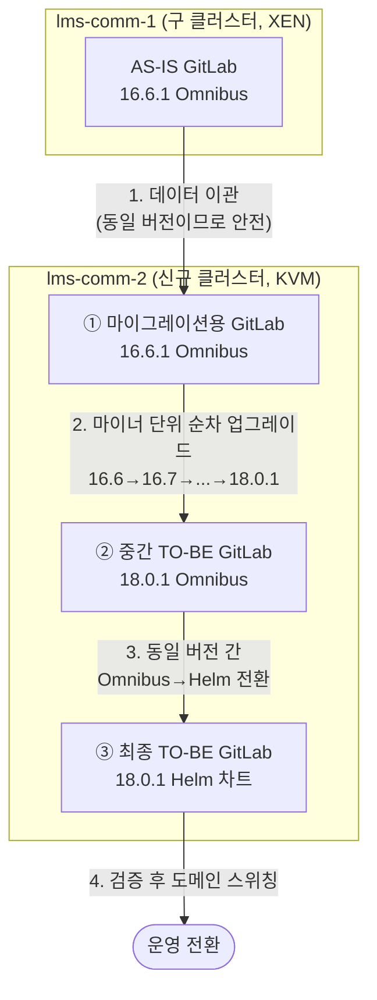
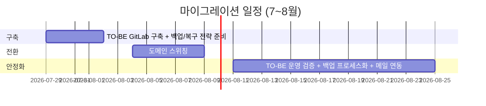

# [GitLab 마이그레이션 연대기 #2] 출사표 — 설계와 계획

> 이 글에 등장하는 클러스터 등 자원 명은 실제 자원 명이 아니라, 임의로 재구성한 예시입니다. 보안상의 이유로 빠지거나 다르게 수정한 부분이 있으니, 이 점 참고해주세요.
{: .prompt-info }

마이그레이션 승인을 받으려면 "하고 싶다"가 아니라 **"이렇게 하면 안전하다"** 를 증명해야 한다. 이번 편은 팀장 보고에 실제로 사용한 계획 문서를 해부한다. 각 설계 항목마다 **왜 그렇게 정했는지**를 함께 적었다. 절차서는 시간이 지나면 낡지만, 판단 근거는 다음 담당자에게도 유효하기 때문이다.

## 1. 시작은 현황 파악 — 모든 팀에 물어보다

마이그레이션 설계에서 가장 먼저 한 일은 기술 검토가 아니라 **전 부서 문의**였다.

**사유**: 우리 팀이 구축한 GitLab을 실제로 누가, 어떻게 쓰는지 정확히 모르는 상태였기 때문이다. 영향도를 모르면 롤백 기준도, 검증 항목도 만들 수 없다. 그래서 모든 팀에 사용 현황과 요구 조건을 물어 건의 사항을 취합했고, 이를 마이그레이션 설계에 반영했다.

조사 결과 드러난 사용 지형:

| 부서 | 사용 방식 | 마이그레이션 시 검증 포인트 |
|---|---|---|
| AIDT 인프라팀 | LMS 프론트/백엔드 1·2년차 프로젝트 웹훅 → Jenkins 자동 배포 | 웹훅 재설정 및 트리거 동작 |
| 서비스개발팀 | 액세스 토큰으로 자체 Jenkins 연동 배포 | **액세스 토큰 이전 여부 확인** |
| UI/UX팀 | Jira ↔ GitLab 통합 연동 | **Jira 연동이 마이그레이션 후에도 유지되는지** |
| 그 외 (AI 관련 부서, 플랫폼팀, 보안팀, 협력업체 등 약 86명) | 순수 깃 저장소 | clone / commit / push 기본 동작 |

여기서 중요한 발견이 하나 있었다. **전 부서가 GitLab을 사실상 "깃 저장소"로만 사용**하고 있었다는 점이다. 이 발견이 큰 결정을 가능하게 했다 — **메이저 버전을 두 단계(16→18) 올려도 사용자 영향이 거의 없다**는 판단의 근거가 됐기 때문이다. UI 차이는 있어도 개발자 워크플로우가 깨질 업데이트는 16.6→18.0.1 릴리스 노트 전수 검토 결과 없었다.

## 2. 마이그레이션 전략 — 왜 "2단계 스위칭"인가

최종 전략은 아래와 같은 다단계 구조다.

이렇게 잘게 쪼갠 데에는 명확한 사유가 있다.

**사유 1 — GitLab은 메이저 점프 업그레이드가 불가능하다.** 16.6 → 17.6처럼 건너뛰면 에러가 나며 진행되지 않는다. 반드시 16.6→16.7→16.8... 식으로 **마이너 버전 단위**로 밟아야 한다. 이는 사전 테스트로 직접 확인했다.

**사유 2 — "버전 변경"과 "구조 변경"을 한 스텝에서 동시에 하지 않는다.** 문제가 생겼을 때 원인이 버전 때문인지 구조 때문인지 분리할 수 없기 때문이다. 그래서 ②(같은 구조에서 버전만 변경)와 ③(같은 버전에서 구조만 변경)을 의도적으로 나눴다.

**사유 3 — 프로토타입 기간 확보.** 새 버전(18.0.1)도, 새 구조(Helm)도 처음이므로 각각 일정 기간 검증하며 운영하는 완충 구간을 뒀다. 한 달간 중간 형태로 운영한 뒤 헬름 차트로 스위칭하는 계획이다.

**주의사항으로 명시했던 것**: 마이그레이션 시점의 데이터와 도메인 스위칭 시점의 데이터 사이에 커밋 차이가 생길 수 있다는 점. 그래서 실행 당일에는 **AS-IS 도메인을 먼저 내리고(DNS 제거) 백업을 뜨는** 순서를 강제했다. 데이터를 뜨는 동안 새 커밋이 들어오면 유실되기 때문이다.

## 3. 백업/복원 전략 — 무엇을, 왜 백업하는가

GitLab 백업 대상은 세 가지이며, 각각의 역할이 다르기 때문에 하나라도 빠지면 복구가 불완전해진다.

| 대상 | 내용 | 빠지면 생기는 일 |
|---|---|---|
| GitLab 백업 tar | 레포지토리, 사용자, DB 데이터 | 코드·계정 유실 |
| `gitlab-secrets.json` | 프로젝트별 토큰, 암호화 키 (2FA, CI 변수 등) | **복구해도 암호화된 데이터 전부 복호화 불가** |
| `gitlab.rb` | 인스턴스 설정 | 설정 재구축 수작업 |

특히 secrets를 강조하는 이유: 백업 tar만으로 복원하면 GitLab은 뜨지만 암호화 키가 달라 CI/CD 변수·토큰이 전부 깨진다. 이건 복구 리허설을 해보지 않으면 모르는 함정이다.

### TO-BE 백업 설계의 핵심 변경 세 가지

1. **백업 데이터를 파드 내부에 쌓지 않는다** — toolbox 파드로 백업을 수행하되 결과물은 즉시 버킷(`sto-bak-01`)으로 보내고 파드에는 남기지 않는다. **사유**: AS-IS에서 백업 tar 누적이 디스크 풀 → PostgreSQL 중단 → 전면 장애로 이어진 바로 그 원인을 제거하기 위함이다. toolbox는 "오로지 워커 역할만" 한다고 원칙을 못 박았다.
2. **Reclaim Policy를 Retain으로** — PostgreSQL, MinIO, Redis, Gitaly 볼륨을 사용자 정의 StorageClass와 연동해 만들고 Retain으로 설정. **사유**: AS-IS의 Delete 정책에서는 PVC 삭제 = 데이터 전멸이었다. Retain이면 릴리스를 실수로 지워도 PV와 데이터가 남는다.
3. **/dev/shm 등 파티션 재설계** - 기존 GitLab에서 문제가 되었던 /dev/shm의 경우, default로 되어있던 값에서 어느 정도 올리되, override되는 values.yaml에서 언제든지 조정 가능하도록 설정하였다. 이를 통해 상황에 따라 용이하게 값을 수정 가능하도록 설정하였다.

## 4. 위험 요소와 롤백 전략

계획서에 적었던 위험 평가는 솔직했다.

- 16.6.1→18.0.1 업그레이드 및 Omnibus→Helm 스위칭 과정 자체의 위험 요소는 사전 검증으로 통제됨
- **단, 되돌릴 수 없는 지점이 있다**: 18.0.1로 업그레이드한 뒤에는 16.6.1로 돌아갈 수 없다. 18.0.1 기준으로 백업된 데이터를 다운그레이드 복원하는 것은 검증되지 않았기 때문이다.
- 오히려 진짜 위험은 현행 유지였다 — 디스크 풀로 PostgreSQL이 언제든 멈출 수 있는 현재 상태, 그리고 퇴사자 계정이 정리되지 않아 소스 탈취가 가능한 현재 상태.

롤백 전략은 단순하게 설계했다: **문제 발생 시 신규 클러스터에 AS-IS 버전·구성 그대로 다시 띄운다.** 백업 스크립트는 파드 명과 클러스터 정보만 바꿔 스케줄링하면 된다. **사유**: 롤백 절차가 복잡하면 장애 상황(= 판단력이 떨어진 상황)에서 실행할 수 없다. 롤백은 "생각 없이 실행 가능한 수준"으로 단순해야 한다.

## 5. 일정 산정 — 왜 방학이고, 왜 하루 9시간인가

- **왜 7월 말~8월 초인가**: 교육 서비스 특성상 **방학이 사용량 최저 구간**이다. 개발자 작업과 운영 영향도를 최소화할 수 있는 유일한 창이었다.
- **왜 하루 9시간인가**: 마이그레이션 자체는 어렵지 않지만, 16.6→18.0.1을 마이너 단위로 수동 업그레이드해야 해서 단계당 1시간 미만으로 줄지 않는다. 실측 기반으로 넉넉히 잡아 "하루 안에 끝난다"를 보장하는 산정이다. 일정 산정에서 낙관 편향을 빼는 것은 신뢰를 지키는 문제이기도 하다.
- **실행 당일 운영 원칙**: 전날 공지 + 당일 오전 리마인드 공지 후 **오후 6시에 실행**. 그리고 TO-BE GitLab에는 **도메인을 매칭하지 않은 상태로 작업**한다. 사유는 개발자가 실수로 TO-BE URL에 접속해 작업하는 불상사를 원천 차단하기 위해서다.

## 6. 사전 검증 체크리스트

계획서에 포함했던 테스트 항목과 사전 검증 결과다. "될 것 같다"가 아니라 "해봤다"로 채우는 것이 목적이었다.

- [x] 16.6.1 → 18.0.1 업그레이드 경로 자체 검증 (테스트 환경에서 완료)
- [x] git clone / commit / push 정상 동작
- [x] PostgreSQL·MinIO 볼륨: SC 연동 + Retain 정책 적용 확인
- [x] 16.6 → 18.0.1 릴리스 노트 전수 검토 — 개발자 워크플로우에 영향 줄 변경 없음
- [x] 백업·복구 리허설 완료 (스크립트화·스케줄링은 이관 후 과제로)
- [x] SMTP-Proxy 연동 메일 발송 동작 확인
- [x] 웹훅 트리거 동작 확인
- [ ] 실시간 퀴즈팀 액세스 토큰 → 자체 Jenkins 배포 (당일 검증)
- [ ] UI/UX팀 Jira 연동 (당일 검증) — **가장 예측이 어려운 항목이라 마지막까지 리스크로 관리**

## 7. 이번 편 요약

- 설계의 출발은 기술이 아니라 **영향도 조사**였고, "전원 깃 저장소로만 사용"이라는 발견이 메이저 2단계 업그레이드 결정을 가능하게 했다.
- 버전 변경과 구조 변경을 분리한 다단계 전략으로 실패 시 원인 격리가 가능하게 했다.
- 백업 설계는 AS-IS 장애 원인(파드 내 tar 누적, Delete 정책)을 정면으로 제거하는 방향으로.
- 일정은 실측 기반, 롤백은 단순하게, 실행은 사용량 최저 구간에.

다음 편은 이 계획이 실제로 어떻게 실행됐는지 — **명령어 수준의 실전 마이그레이션 기록**이다.
