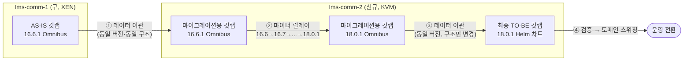
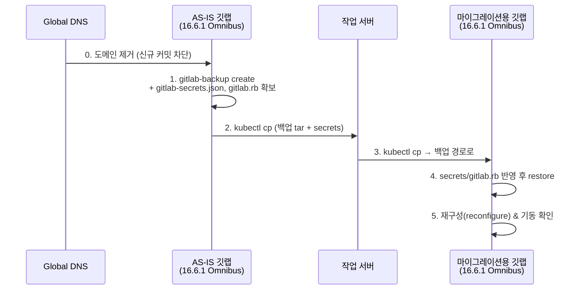
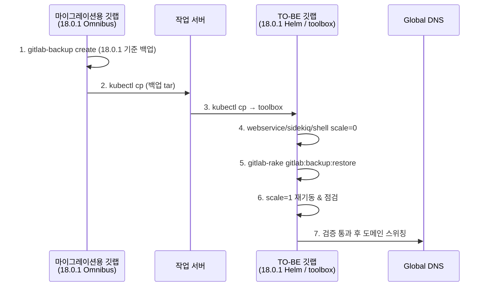

# [GitLab 마이그레이션 연대기 #3] 실전 — Omnibus에서 Helm으로

> 이 글에 등장하는 클러스터 등 자원 명은 실제 자원 명이 아니라, 임의로 재구성한 예시입니다. 보안상의 이유로 빠지거나 다르게 수정한 부분이 있으니, 이 점 참고해주세요.
{: .prompt-info }

이번 편은 실행 기록이다. 당시 작업하며 남긴 메모를 기반으로, 실제 순서 그대로 재구성했다. 각 단계마다 **왜 이 순서인지**를 병기한다 — 순서를 바꾸면 실제로 사고가 나는 지점들이 있기 때문이다.

> 이하 명령의 네임스페이스·파드명·시크릿 값은 예시/플레이스홀더다.

## 0. 전체 골격 먼저 — 3단계 이관

이번 마이그레이션은 한 번에 옮기는 작업이 아니다. #2에서 설계한 대로, **세 번에 걸쳐 옮긴다.**

1. **[1단계]** AS-IS 깃랩(구 클러스터, 16.6.1 Omnibus) → **마이그레이션용 깃랩**(신규 클러스터, 16.6.1 Omnibus 그대로 구축)으로 데이터 이관
2. **[2단계]** 마이그레이션용 깃랩에서 **16.6 → 18.0.1까지 마이너 버전 단위로 버전 업그레이드**
3. **[3단계]** 18.0.1 도달 후, **TO-BE 깃랩(18.0.1 Helm 차트)을 별도로 구축**하고 그 TO-BE 깃랩으로 데이터 이관 → 검증 → 도메인 스위칭



**이렇게 3단계로 쪼갠 사유** (하나의 변수만 바꾸는 원칙):

- **①은 동일 버전·동일 구조 간 이관**이라 호환성 변수가 0이다. "클러스터를 옮기는 것" 하나만 검증하면 된다.
- **②는 같은 구조(Omnibus) 안에서 버전만** 올린다. 문제가 나면 100% 버전 이슈다.
- **③은 같은 버전(18.0.1) 안에서 구조만** 바꾼다. 문제가 나면 100% Helm 전환 이슈다.
- 그리고 이 구조 덕분에 **AS-IS 깃랩 원본은 전 과정 동안 손대지 않고 보존**된다. 업그레이드가 어느 단계에서 터지든 AS-IS는 무손상이므로, #2에서 세운 "AS-IS 구성 그대로 다시 띄우면 되는" 단순한 롤백 전략이 성립한다. (버전 업그레이드는 되돌릴 수 없다 — 18.0.1 백업의 다운그레이드 복원은 검증된 바 없으므로, 되돌릴 수 없는 작업은 반드시 사본 위에서 한다.)

**실행 당일 선행 원칙 하나**: 이관을 시작하기 전에 **AS-IS 도메인부터 내린다(Global DNS에서 제거)**. 사유: 백업을 뜨는 순간 이후에 들어온 커밋은 이관본에 존재하지 않게 된다. 접속을 먼저 끊어야 "백업 시점 = 서비스 마지막 시점"이 보장된다. 같은 이유로 TO-BE 쪽에는 **도메인을 매칭하지 않은 상태로 작업**한다 — 개발자가 실수로 접속해 새 커밋을 만드는 불상사를 원천 차단하기 위함이다.

## 1. [1단계] AS-IS → 마이그레이션용 깃랩 이관 (Omnibus → Omnibus)

신규 클러스터에 AS-IS와 **동일한 16.6.1 Omnibus 깃랩을 그대로 구축**한 뒤, 데이터를 붓는다.

**왜 굳이 신규 클러스터에 옛 버전(16.6.1)을 또 세우는가**: 이관과 업그레이드를 분리하기 위해서다. 신규 클러스터에서 처음부터 18.0.1을 세우고 AS-IS 백업을 부으면 "16.6.1 백업 → 18.0.1 복원"이라는 검증 안 된 점프가 발생한다. GitLab 백업/복원은 **동일 버전 간에만 안전**하므로, 받는 쪽도 16.6.1이어야 한다.



```bash
# 1. AS-IS에서 백업 생성 (Omnibus 내장 백업)
gitlab-backup create

# 2. 백업 tar + 시크릿 파일 반출
#    gitlab-secrets.json을 함께 옮기는 사유: 암호화 키가 다르면
#    복원해도 CI 변수·토큰이 전부 복호화 불가가 된다 (#2 참조)
kubectl cp <asis-ns>/<asis-pod>:/var/opt/gitlab/backups/<ts>_gitlab_backup.tar ./<ts>_gitlab_backup.tar
kubectl cp <asis-ns>/<asis-pod>:/etc/gitlab/gitlab-secrets.json ./gitlab-secrets.json

# 3. 마이그레이션용 깃랩 파드로 반입 후, 내부에서 복원
kubectl cp ./<ts>_gitlab_backup.tar <mig-ns>/<mig-pod>:/var/opt/gitlab/backups/
kubectl exec -it -n <mig-ns> <mig-pod> -- gitlab-backup restore BACKUP=<백업 파일명, .tar 제외>
```

복원 후 clone/push 기본 동작을 확인하고 나서야 다음 단계로 간다. **사유**: 여기서의 이상은 "이관 문제"임이 확정적이므로, 지금 잡는 것이 가장 싸다.

## 2. [2단계] 마이너 릴레이 — 16.6.1 → 18.0.1, 그리고 첫 장애

이제 마이그레이션용 깃랩에서 버전을 올린다. #2에서 확인했듯 **GitLab은 메이저 점프 업그레이드가 불가능**하므로(16.6→17.6 시도 시 에러로 중단됨을 사전 테스트로 확인), 16.6→16.7→16.8→... 식으로 마이너 버전 단위로 하나씩 밟는다. 단계당 1시간 미만으로 줄지 않아 하루 9시간을 산정했던 그 구간이다.

순조롭게 올라가던 중, **17.11 → 18.0 구간에서 첫 DB 장애**를 만났다.

```text
PG::NotNullViolation:
ERROR: column "organization_id" of relation "fork_networks" contains null values
```

### 원인 분석

GitLab 18.0부터 Organization 기능 강화로 `fork_networks.organization_id`에 **NOT NULL 제약이 추가**됐다. 그런데 17.11 이전 데이터에는 이 컬럼이 NULL인 레코드가 존재했고, 마이그레이션의 `SET NOT NULL`이 기존 데이터와 충돌해 거부된 것이다. 전형적인 "새 스키마 요구사항 vs 옛 데이터" 충돌이다.

### 왜 임의값이 아니라 UPDATE-FROM인가

핵심은 **없는 값을 지어내지 않았다**는 점이다. `fork_networks`는 `root_project_id`로 원본 프로젝트를 참조하고, 원본 프로젝트(`projects`)에는 이미 `organization_id`가 있다. 즉 정답이 이미 DB 안에 존재하므로, 관계를 따라가 복사해오면 데이터 무결성을 해치지 않는다.

```text
fork_networks.root_project_id → projects.id → projects.organization_id
                                                (이미 존재하는 정답)
```

```sql
-- GitLab 커뮤니티 포럼의 동일 사례로 교차 검증 후 적용
UPDATE fork_networks
SET organization_id = projects.organization_id
FROM projects
WHERE fork_networks.root_project_id = projects.id
AND fork_networks.organization_id IS NULL;
```

조치 절차:

```bash
gitlab-psql                          # 1. Omnibus 내부 PostgreSQL 접속
# 2. NULL 레코드 확인 (SELECT ... WHERE organization_id IS NULL)
# 3. 위 UPDATE 실행
gitlab-rake db:migrate               # 4. 마이그레이션 재실행 → 성공
```

이 사건에서 얻은 교훈은 #4에서 반복 검증된다: **메이저 업그레이드 실패는 대부분 버전 문제가 아니라 데이터 정합성 문제**이고, 공식 문서만큼 커뮤니티 사례 교차 검증이 유효하다는 것.

이 장애를 넘고 18.0.1까지 도달하면 2단계 완료다.

## 3. [3단계-a] TO-BE Helm 깃랩 구축 — 스토리지부터

이제 같은 클러스터에 **최종 TO-BE 깃랩(18.0.1, Helm 차트)을 데이터 없이 "깡통"으로 별도 구축**한다. 구축 순서는 SC → rails secret → Helm 릴리스 → toolbox 세팅이다.

### 3-1. StorageClass 선행 구축

Helm 릴리스를 올리기 **전에** StorageClass 4종(gitaly / minio / postgresql / redis)을 먼저 apply한다.

**사유**: PVC는 SC를 참조해 생성되므로 SC가 먼저 있어야 하고, 무엇보다 이 SC 설정에 이번 마이그레이션의 핵심 목적 하나가 담겨 있기 때문이다 — `reclaimPolicy: Retain`.

```yaml
# gitlab-postgresql-sc.yaml (gitaly/minio/redis도 동일 패턴)
apiVersion: storage.k8s.io/v1
kind: StorageClass
metadata:
  namespace: gitlab
  name: gitlab-postgresql-sc
mountOptions:
  - hard        # NFS 응답 없을 때 무한 재시도 → 쓰기 유실 방지 목적
  - nolock
  - nfsvers=3
provisioner: nas.csi.ncloud.com   # 블록 스토리지가 아닌 NAS 기반 — NCP CSI 드라이버
reclaimPolicy: Retain             # ★ PVC 삭제돼도 데이터 보존 (AS-IS Delete 정책의 반성)
volumeBindingMode: WaitForFirstConsumer
allowVolumeExpansion: true
```

설계 의도 정리:

- **NAS(`nas.csi.ncloud.com`) 선택 사유**: AS-IS는 블록 스토리지 + Delete 조합으로 "PVC 삭제 = 데이터 전멸" 구조였다. NAS + Retain 조합으로 파드/릴리스 라이프사이클과 데이터 라이프사이클을 분리했다.
- **PVC 대상은 5개(postgresql, minio, redis, gitaly, prometheus)로 한정**하고, 그중 prometheus를 제외한 4개만 Retain. 사유: 메트릭은 유실돼도 재수집 가능한 데이터라 보존 비용을 쓸 이유가 없기 때문이다. "모든 데이터가 같은 등급은 아니다"는 원칙이다.

### 3-2. Rails Secret — 이걸 놓치면 복구가 무의미해진다

Omnibus의 `gitlab-secrets.json` 안에 있는 `gitlab_rails` 섹션(세션 키, DB 암호화 키, OTP 키 등)을 **Helm 차트가 사용할 쿠버네티스 Secret으로 변환**해야 한다.

**사유**: GitLab은 CI/CD 변수, 2FA, 토큰 등을 이 키들로 암호화해 DB에 저장한다. 백업 tar를 복원해도 키가 다르면 이 데이터들은 전부 복호화 불가 쓰레기가 된다. Helm 차트는 기본적으로 rails secret을 자동 생성하므로, **자동 생성분을 버리고 마이그레이션용 깃랩의 키를 명시적으로 주입**해야 한다.

변환 스크립트 (jq로 필요한 키만 추출 → secrets.yml 구성 → base64 → k8s Secret 매니페스트 생성):

```bash
#!/bin/bash
# gitlab-secrets.json이 있는 경로에서 실행
INPUT_JSON="gitlab-secrets_backup.json"
TMP_SECRETS_YML="tmp_secrets.yml"

# Helm 차트의 secrets.yml 스키마에 맞춰 필요한 5개 키만 추출
jq '{
  production: {
    secret_key_base: .gitlab_rails.secret_key_base,
    db_key_base: .gitlab_rails.db_key_base,
    otp_key_base: .gitlab_rails.otp_key_base,
    encrypted_settings_key_base: .gitlab_rails.encrypted_settings_key_base,
    openid_connect_signing_key: .gitlab_rails.openid_connect_signing_key
  }
}' "$INPUT_JSON" > "$TMP_SECRETS_YML"

ENCODED=$(base64 -w 0 "$TMP_SECRETS_YML")

cat <<EOT > gitlab-rails-secret.yaml
apiVersion: v1
kind: Secret
metadata:
  name: gitlab-rails-secret
  namespace: gitlab
type: Opaque
data:
  secrets.yml: ${ENCODED}
EOT
```

적용 순서 — **차트가 자동 생성한 시크릿을 지우고 → 내 것으로 교체 → values로 고정**:

```bash
# 1. 차트가 만들어둔 기존 시크릿 제거
kubectl delete secret -n <gitlab-ns> gitlab-rails-secret

# 2. 마이그레이션용 깃랩의 키로 만든 시크릿 적용
kubectl apply -f gitlab-rails-secret.yaml

# 3. values.yaml에 명시 — "차트야, 시크릿 자동 생성하지 말고 이걸 써라"
# global:
#   railsSecrets:
#     secret: gitlab-rails-secret

# 4. helm upgrade로 반영
helm upgrade gitlab gitlab/gitlab --namespace <gitlab-ns> \
  -f override-values.yaml \
  --set global.useConfigMapForReleaseInfo=true
```

### 3-3. Helm 릴리스 구축과 toolbox 세팅

이때 습관으로 만든 패턴 하나 — **`helm template`으로 렌더링 결과를 먼저 뽑아보고, 이상 없으면 `helm upgrade --install`**:

```bash
# 렌더링 결과를 파일로 떠서 육안 검증 → 실제 적용
# 사유: values 오타/차트 버전 불일치를 클러스터에 적용하기 전에 잡기 위함
#
# ./upgrade/18-0-1-version-upgrade-values.yaml
#   → 우리 팀의 버전별 override values 파일. "GitLab 18.0.1 버전 배포에 쓰는 values"라는 뜻의
#     자체 네이밍 규칙(<GitLab버전>-version-upgrade-values.yaml)이다.
#     버전마다 파일을 분리해 관리하는 사유는 각 버전에서 유효했던 설정의 이력을 남겨
#     롤백·재현을 가능하게 하기 위함이다. (#4에서 이 규칙으로 릴레이를 뛴다)
# --version 9.0.1
#   → GitLab 차트 버전. 차트 9.0.1 = GitLab 18.0.1 (차트:앱 버전은 1:1 매핑, #4 표 참조)
helm template gitlab-n gitlab/gitlab --namespace gitlab-n \
  -f ./upgrade/18-0-1-version-upgrade-values.yaml --version 9.0.1 \
  --set global.useConfigMapForReleaseInfo=true > rendered.yaml

helm upgrade --install gitlab-n gitlab/gitlab --namespace gitlab-n \
  -f ./upgrade/18-0-1-version-upgrade-values.yaml --version 9.0.1 \
  --set global.useConfigMapForReleaseInfo=true
```

toolbox 파드에는 사전 세팅이 필요하다. **이 디렉터리들이 없으면 백업/복구 자체가 실패**하므로 절차서에 고정해뒀다:

```bash
kubectl exec -it -n gitlab-n <toolbox-pod> -- /bin/bash

# 백업 작업 경로
cd /srv/gitlab/tmp/ && mkdir backups

# external-diffs 경로 — 이게 있어야 backup rake task가 진행됨
mkdir -p /srv/gitlab/shared/external-diffs
chown -R git:git /srv/gitlab/shared/external-diffs

# ssh 키 경로 권한 세팅
mkdir -p /home/git/.ssh
touch /home/git/.ssh/authorized_keys
chown -R git:git /home/git/.ssh
chmod 700 /home/git/.ssh
chmod 600 /home/git/.ssh/authorized_keys
```

## 4. [3단계-b] 마이그레이션용 깃랩 → TO-BE Helm 깃랩 데이터 이관

이제 **같은 18.0.1 버전끼리, 구조만 Omnibus → Helm으로** 데이터를 옮긴다. 골격은 한 문장이다: **마이그레이션용 깃랩의 백업 데이터를 TO-BE 깃랩의 toolbox 파드로 복사한 뒤, toolbox 안에서 restore한다.**



```bash
# 1. 마이그레이션용 깃랩(18.0.1 Omnibus)에서 백업 생성
gitlab-backup create

# 2. 마이그레이션용 파드 → 로컬 → TO-BE toolbox로 tar 복사
kubectl cp <mig-ns>/<mig-pod>:/var/opt/gitlab/backups/<ts>_gitlab_backup.tar ./<ts>_gitlab_backup.tar
kubectl cp ./<ts>_gitlab_backup.tar gitlab-n/<toolbox-pod>:/srv/gitlab/tmp/backups/

# 3. 복원 전 서비스 중단 — 복원 중 쓰기 트래픽이 들어오면 데이터 정합성이 깨지므로
kubectl scale deployment -n gitlab-n gitlab-n-webservice-default --replicas=0
kubectl scale deployment -n gitlab-n gitlab-n-sidekiq-all-in-1-v2 --replicas=0
kubectl scale deployment -n gitlab-n gitlab-n-gitlab-shell --replicas=0

# 4. toolbox에서 복원
# 주의: Helm의 toolbox에는 gitlab-backup 명령이 없다 → rake로 수행해야 함
kubectl exec -it -n gitlab-n <toolbox-pod> -- /bin/bash
cd /srv/gitlab/tmp/backups
gitlab-rake gitlab:backup:restore BACKUP=<백업 파일명, .tar 제외>

# 5. 서비스 재기동
kubectl scale deployment -n gitlab-n gitlab-n-gitlab-shell --replicas=1
kubectl scale deployment -n gitlab-n gitlab-n-sidekiq-all-in-1-v2 --replicas=1
kubectl scale deployment -n gitlab-n gitlab-n-webservice-default --replicas=1
```

### 실전에서 배운 함정 하나

마이그레이션용 깃랩에서 TO-BE Helm 깃랩으로 데이터를 부을 때, **TO-BE 헬름 릴리스를 한 번 `helm uninstall`로 완전히 밀고 새로 시작해야** 했다. 사유: 사전 구축해뒀던 TO-BE에 이미 생성돼 있던 secret.yml 설정이 자꾸 마이그레이션 소스 쪽과 어긋났기 때문이다. Retain 정책 덕분에 릴리스를 밀어도 PV 데이터는 남으므로 부담 없이 초기화할 수 있었다 — **Retain 설계가 여기서 첫 배당금을 지급한 셈이다.**

## 5. 전환 완료 체크리스트

도메인 스위칭 전 실제로 점검한 항목이다. 항목 구성의 사유: #2의 영향도 조사에서 나온 부서별 사용 방식이 곧 검증 항목이 된다 — 조사가 곧 체크리스트다.

- [x] git clone / commit / push
- [x] 웹훅 → Jenkins 자동 배포 트리거
- [x] 서비스개발팀 액세스 토큰 배포
- [x] UI/UX팀 Jira 연동
- [x] SMTP-Proxy 경유 메일 발송
- [x] 백업 생성 → 버킷 전송 → 복원 리허설

모든 항목 통과 후 도메인을 스위칭했고, TO-BE 운영 검증 기간을 거쳐 AS-IS 깃랩과 마이그레이션용 깃랩을 삭제하며 마이그레이션을 종료했다. (불필요해진 깃랩을 삭제하는 사유: 방치된 인스턴스는 리소스 낭비이자, 퇴사자 접근 같은 보안 구멍이 된다 — AS-IS에서 이미 겪은 위험 요소다.)

## 6. 이번 편 요약

- 이관은 3단계: **① 동일 버전 이관 → ② 마이너 릴레이 업그레이드 → ③ 동일 버전 Helm 전환** — 각 단계는 변수를 하나만 바꾼다.
- AS-IS 원본은 전 과정 무손상 보존 → 단순한 롤백 전략이 성립하는 근거.
- Rails secret 이전을 빼먹으면 "복구는 됐는데 아무것도 안 되는" GitLab이 된다.
- SC의 Retain 정책은 설계 단계의 보험이었고, 실전(릴리스 재설치)에서 즉시 효과를 봤다.
- 첫 DB 장애(fork_networks)에서 배운 원칙 — **NULL을 지우지 말고, 관계를 따라가 복원하라.**

다음 편은 이 시리즈의 하이라이트다 — **18.x 업그레이드 릴레이와 3번의 PostgreSQL 장애, 그리고 19.0의 아키텍처 격변.**
