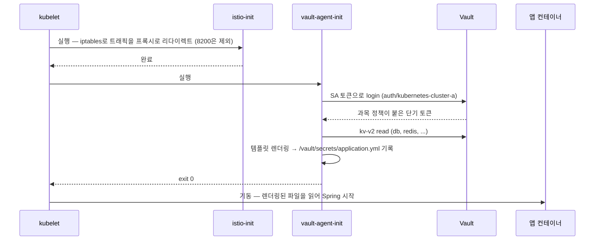

# [시크릿 관리 전환기 4편] Vault를 CI/CD에 녹여내기, 그리고 회고

> 3편에서 Vault를 구축하고 시크릿을 채웠다. 마지막 편은 저장된 시크릿을 백엔드 파드가 꺼내 쓰게 만드는 과정 — annotation 설계, 파드 기동 타임라인, PoC에서 운영 적용까지 — 과 이 전환 전체의 회고다.

## 소비 쪽 설계 — 앱은 끝까지 파일만 읽는다

2편에서 세운 원칙이 있다. 앱은 설정이 어디서 왔는지 몰라야 한다. Vault를 붙이면서도 이 원칙을 지키고 싶었고, 그래서 앱 코드에 Vault SDK를 넣는 방식(Spring Cloud Vault)이 아니라 **agent injector 방식**을 골랐다. 사유는 명확하다 — SDK 방식은 기동 경로에 외부 서버 의존성을 다시 넣는 것이라, Config Server 시절로 회귀하는 구조이기 때문이다. injector 방식은 시크릿을 "앱이 뜨기 전에 파일로 만들어두는" 방식이라 앱 입장에서는 2편과 아무것도 달라지지 않는다.

차트에는 vault helper 템플릿을 만들어 annotation을 조건부로 렌더링했다. `vault.enabled`일 때만 붙는다.

```yaml
{{/* _vault-helpers.tpl (발췌) */}}
{{- define "vault.annotations" -}}
{{- if .Values.vault.enabled }}
vault.hashicorp.com/agent-inject: "true"
vault.hashicorp.com/auth-path: "auth/kubernetes-cluster{{ .Values.deploy.auth_path }}"
vault.hashicorp.com/role: "{{ .Values.deploy.namespace }}-spring-boot"
vault.hashicorp.com/agent-run-as-user: "65534"
vault.hashicorp.com/agent-inject-secret-application.yml: "secret/data/{{ .Values.deploy.namespace }}/db,..."
vault.hashicorp.com/agent-inject-template-application.yml: |
  spring:
    datasource.hikari:
      jdbc-url: "jdbc:mysql://{{`{{ with secret "secret/data/`}}{{ .Values.deploy.namespace }}{{`/db" }}{{ .Data.data.host }}:{{ .Data.data.port }}/{{ .Data.data.name }}{{ end }}`}}"
      username: "{{`{{ with secret "secret/data/`}}{{ .Values.deploy.namespace }}{{`/db" }}{{ .Data.data.username }}{{ end }}`}}"
      password: "{{`{{ with secret "secret/data/`}}{{ .Values.deploy.namespace }}{{`/db" }}{{ .Data.data.password }}{{ end }}`}}"
vault.hashicorp.com/agent-cache-enable: "true"
traffic.sidecar.istio.io/excludeInboundPorts: "8200"
traffic.sidecar.istio.io/excludeOutboundPorts: "8200"
{{- end }}
{{- end }}
```

annotation 한 줄 한 줄이 담당하는 역할을 정리하면 이렇다.

| annotation | 역할 | 사유 |
|---|---|---|
| `agent-inject: "true"` | 주입 스위치 | injector 웹훅이 이것만 본다 |
| `auth-path` | 인증 창구 선택 | 클러스터별 auth 마운트가 분리되어 있다(3편) |
| `role` | 정책 묶음 선택 | 과목별 격리의 실행 지점 |
| `agent-inject-template-*` | 렌더링 템플릿 | 여러 kv 경로를 완성된 Spring 설정 파일 하나로 조립 |
| `agent-run-as-user: 65534` | 에이전트 권한 | nobody로 실행 — 최소 권한 |
| `excludeIn/OutboundPorts: 8200` | Istio 우회 | 아래 "함정" 절 참조 |

템플릿의 이중 중괄호 이스케이프(`{{` ... `}}`)가 낯설 수 있는데, 헬름의 Go 템플릿과 vault agent의 Consul Template이 같은 문법을 쓰기 때문에 헬름 렌더링 단계에서는 살아남고 agent 렌더링 단계에서 해석되도록 처리한 것이다.

젠킨스 쪽은 환경 분기에서 스위치만 결정해 values로 넘긴다. 이로써 볼트(값·권한), 차트(사용 선언), 젠킨스(환경별 스위치)의 삼각 분업이 완성된다.

```groovy
if (buildcluster == "prod-a") { vault_config = true; auth_path = "a" }
else if (buildcluster == "prod-b") { vault_config = true; auth_path = "b" }
```

## 파드 기동 타임라인 — init 체인이 시크릿을 보장한다

배포하면 파드 안에서 이런 일이 순서대로 벌어진다. 1편의 웹훅 구조가 여기서 실전이 된다.



이 구조의 핵심 성질은 **"시크릿 없이 앱이 뜨는 상황"이 구조적으로 불가능**하다는 것이다. init 컨테이너는 순차 실행되고, vault-agent-init이 성공(파일 기록)해야만 앱 컨테이너가 시작된다. 앱과 에이전트는 공유 emptyDir 볼륨으로만 만난다.

Spring이 그 파일을 읽는 메커니즘은 이미지 ENTRYPOINT에 있다.

```dockerfile
# prod 스테이지 ENTRYPOINT (발췌)
ENTRYPOINT ["sh", "-c", "java $JAVA_OPTS -jar /app.jar \
  --spring.config.location=file:/app/config/application.yml,file:/vault/secrets/application.yml"]
```

`optional:` 없는 `spring.config.location`이므로 파일이 없으면 부팅이 실패한다. vault-agent-init의 보장과 이중 잠금이 되는 fail-fast다.

## PoC에서 만난 함정 — istio-init과 8200 포트

PoC 단계에서 vault-agent-init이 Vault에 접속하지 못하고 무한 대기하는 문제를 만났다. 원인은 실행 순서에 있었다.

istio-init은 파드의 모든 아웃바운드 트래픽을 iptables로 istio-proxy에 강제 우회시킨다. 그런데 vault-agent-init이 도는 시점에는 **istio-proxy가 아직 떠 있지 않다** — 사이드카는 init 체인이 끝난 뒤에 뜨기 때문이다. 결과적으로 Vault로 가는 트래픽이 존재하지 않는 프록시로 리다이렉트되어 블랙홀에 빠진다.

해법이 위 annotation의 `traffic.sidecar.istio.io/excludeOutboundPorts: "8200"`이다. Vault 포트만 iptables 리다이렉트에서 제외해, 프록시 부재 시점에도 직접 통신이 가능하게 한다. 서비스 메시와 injector류 도구를 함께 쓸 때 반드시 만나는 상호작용이라, 같은 조합을 쓰는 분이라면 기억해둘 가치가 있다.

## 결과 — 발견에서 배운 점까지

전환 전체를 정리한다.

- **발견**: Config Server 운영 중 설정 충돌, 암호화 문제, 설정 추적 어려움이 반복됐고, 장애 시 원인 도메인이 분리되지 않아 밤샘 트러블슈팅이 잦았다.
- **분석**: 코드와 Config Server가 동시에 설정을 관리하면서 운영 복잡도가 계속 증가하고 있었다. 문제는 개별 장애가 아니라 구조였다.
- **제안**: 설정을 ConfigMap과 Secret으로 분리해 쿠버네티스 중심으로 관리하고(2편), 이후 Git 평문이라는 Secret 관리의 한계를 해결하기 위해 Vault까지 도입했다(3~4편).
- **결과**: Config Server 제거, 운영 단순화, 시크릿 중앙 관리. 시크릿 값이 더 이상 소스 레포에 노출되지 않고, 갱신은 CI로 자동화됐다.
- **배운 점**: 반복되는 장애는 증상을 고치는 것이 아니라 구조를 바꾸는 것이 중요하다.

## 회고 — 아직 끝나지 않은 것들

솔직하게 적는다. 이 전환은 성공했지만 완성되지 않았다. 남아 있는 과제들이다.

**① 시크릿 갱신 로직의 버전 손실.** 설정 잡의 갱신 로직을 "기존 값 삭제 후 재주입"(`vault kv delete` → `vault kv put`)으로 만들었는데, 이 때문에 갱신하면 기존 버전의 시크릿 값을 볼 수 없는 단점이 생겼다. 돌이켜보면 kv-v2에서 put은 그 자체로 새 버전을 만들므로 delete가 애초에 불필요했고, delete 후 put이 실패하면 경로가 soft-delete 상태로 남아 다음 배포의 vault-agent-init이 실패하는 창까지 만든다. delete 제거와 함께, 중요 경로에 `vault kv metadata put -max-versions=30` 같은 보존 설정을 거는 것이 수정 방향이다. kv-v2를 골라놓고 v2의 존재 이유인 버전 관리를 스스로 무력화한 셈이라, 도구를 도입할 때는 그 도구의 핵심 성질을 워크플로가 살리고 있는지 점검해야 한다는 교훈을 얻었다.

**② 인증 고도화.** 현재는 Kubernetes auth 하나로 파드 인증을 처리하고 있는데, 이전 직장에서 썼던 AppRole 같은 세밀한 인증 방식이나 토큰 수명 정책, TokenReview용 장수 토큰의 로테이션 같은 디테일한 설정까지는 이르지 못했다. 특히 CI가 쓰는 토큰의 수명 관리와, 최신 Vault가 지원하는 reviewer JWT 없는 검증 방식 검토가 다음 단계다.

**③ 경로 체계에 환경 구분 추가.** 현재 kv 경로가 `secret/{과목}/...`으로 환경 구분이 없다. prod만 Vault를 쓰는 지금은 문제가 없지만, stg까지 Vault로 전환하는 순간 같은 과목의 stg/prod 시크릿이 경로를 공유하게 된다. `secret/{환경}/{과목}/...`으로의 이전을 stg 전환의 선행 조건으로 잡아두었다.

**④ 환경별 이미지의 아티팩트 승격 문제.** stg는 k8s Secret 경로, prod는 Vault 경로를 읽다 보니 이미지의 ENTRYPOINT가 환경별로 갈라졌고, 그 결과 "stg에서 검증한 그 바이너리를 prod로 승격"이 불가능한 구조가 됐다. 시크릿 경로가 통일되면 단일 이미지로 갈 수 있으므로, ③과 함께 풀리는 문제다.

과제 목록이 길어 보이지만, 이것들이 보이게 됐다는 것 자체가 전환의 성과라고 생각한다. Config Server 시절에는 "무엇이 문제인지"를 파악하는 데 새벽을 썼다면, 지금은 "무엇을 개선할지"의 목록을 갖고 있다. 구조를 바꾸면 문제의 성격이 바뀐다 — 이 시리즈에서 가져갈 것이 하나라면 이것이다.

*(시리즈 끝. 고도화 과제들의 진행은 후속 글로 다룰 예정이다.)*
