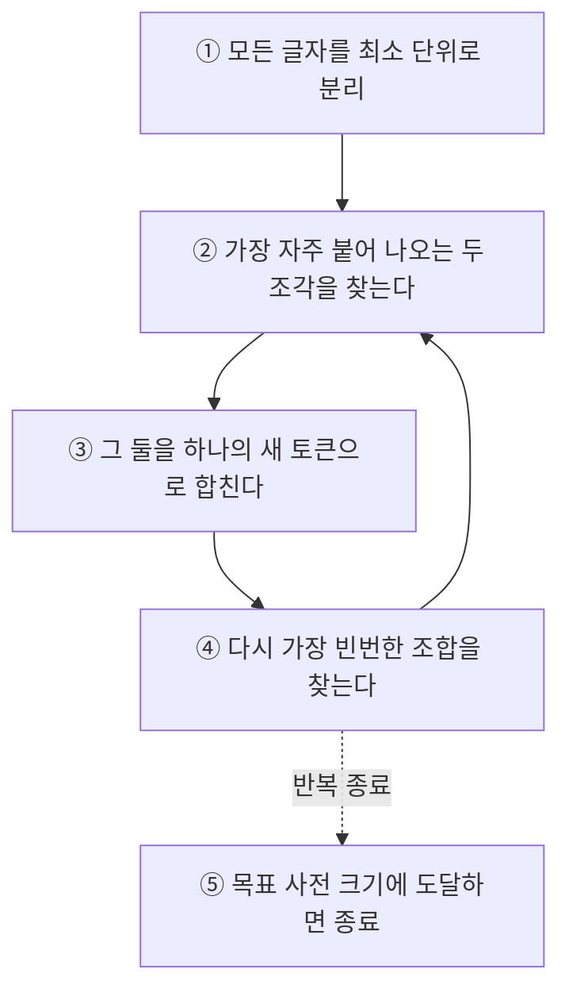
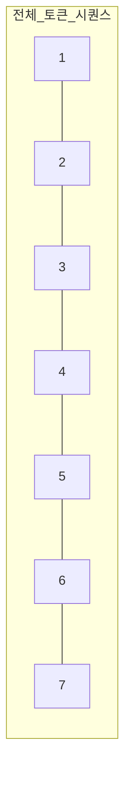
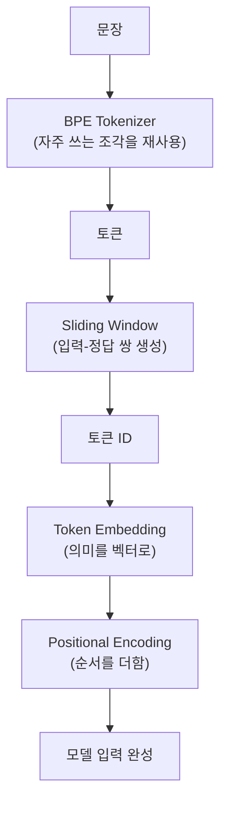

# [LLM 탐정 시리즈 #1] 문장이 숫자가 되기까지

> "안녕"이라는 두 글자를 LLM에게 던졌다. 이 모델은 이 단어를 어떻게 "읽는" 걸까. 사람처럼 눈으로 훑는 것도 아니고, 사전을 찾아보는 것도 아니다. 그런데도 뭔가를 "이해"한다. 이 편에서는 그 첫 번째 관문, 문장이 숫자로 둔갑하는 과정을 파헤친다.

## 사건의 발단: 컴퓨터는 글자를 모른다

컴퓨터 내부에서 벌어지는 모든 연산은 결국 숫자 계산이다. 덧셈, 곱셈, 행렬 연산. "사랑"이라는 글자를 컴퓨터에게 던지면, 컴퓨터는 이걸 계산할 방법이 없다. 곱하거나 더할 수 없는 값이기 때문이다.

그래서 LLM이 문장을 처리하려면 반드시 거쳐야 하는 관문이 하나 있다.

```
문장 → 숫자
```

이 단순해 보이는 화살표 하나에, 사실 여러 겹의 설계 결정이 숨어 있다. 그리고 이 설계를 어떻게 했느냐가 나중에 모델의 성능, 속도, 심지어 비용까지 결정한다. 지금은 그냥 "그렇구나" 하고 넘어가도 좋다. 이 편 끝에서 왜 이게 중요한지 다시 짚을 거니까.

## 첫 번째 용의자: 단어 단위로 쪼개기

가장 직관적인 방법부터 시도해보자. 문장을 띄어쓰기 기준으로 쪼개서, 각 단어에 번호를 매기는 거다.

```
"나는 사과를 좋아한다"
   ↓
["나는", "사과를", "좋아한다"]
   ↓
[101, 205, 890]
```

간단해 보이지만 이 방법에는 치명적인 결함이 있다. 세상에 존재하는 단어는 무한에 가깝다. `apple`, `apples`, `apple's`, `applesauce`처럼 조금씩 변형된 단어까지 전부 별도의 번호를 매겨야 한다면, 사전(vocabulary)은 순식간에 감당할 수 없는 크기로 불어난다.

더 심각한 문제는 따로 있다. 이 사전에 없는 단어가 등장하면 어떻게 될까. 모델은 그 단어를 통째로 알지 못하는 상태(unknown word)가 되어버린다. 신조어, 오타, 낯선 고유명사 하나에도 모델이 순식간에 무력해지는 셈이다. 첫 번째 용의자는 여기서 탈락이다.

## 두 번째 용의자: 글자 단위로 쪼개기

그렇다면 반대로 가보면 어떨까. 아예 글자 하나하나를 최소 단위로 삼는 거다.

```
"apple"
   ↓
["a", "p", "p", "l", "e"]
```

이러면 모르는 단어라는 개념 자체가 사라진다. 알파벳(또는 한글 자모) 몇십 개만 알고 있으면 어떤 단어든 표현할 수 있으니까. 그런데 이번엔 다른 문제가 생긴다. 문장 하나가 너무 잘게 쪼개지면서 처리해야 할 토큰 수가 폭발적으로 늘어난다. 그리고 각 글자 하나만 봐서는 의미 있는 단위를 이루지 못하니, 모델이 패턴을 학습하기도 훨씬 힘들어진다.

두 극단을 놓고 보면 이렇게 정리된다.

| 방식 | 사전 크기 | 모르는 단어 문제 | 문장당 토큰 수 |
|---|---|---|---|
| 단어 단위 | 매우 큼 | 심각함 | 적음 |
| 글자 단위 | 매우 작음 | 없음 | 매우 많음 |

둘 다 범인이 아니다. 진짜 범인은 이 둘 사이 어딘가에 숨어 있다.

## 진범 검거: 바이트 페어 인코딩(BPE)

**바이트 페어 인코딩(Byte Pair Encoding, BPE)**은 "자주 같이 등장하는 조각을 하나로 합쳐나가는" 방식으로 이 딜레마를 풀어낸다. 알고리즘 자체는 놀랍도록 단순하다.



예를 들어 훈련 데이터에 `low`, `lower`, `lowest`가 자주 등장한다고 해보자.

```
초기 상태:  l o w    l o w e r    l o w e s t

l + o → lo 로 합침 (가장 빈번한 조합)
        lo w    lo w e r    lo w e s t

lo + w → low 로 합침
        low    low e r    low e s t
```

이 과정을 계속 반복하면, `low`처럼 자주 등장하는 조각은 통째로 하나의 토큰이 되고, 드물게 등장하는 부분(`er`, `est`)은 조금 더 잘게 쪼개진 상태로 남는다. 그 결과 자주 쓰는 단어는 짧게, 낯선 단어는 익숙한 조각들의 조합으로 표현할 수 있게 된다.

`Kubernetes`라는 단어가 사전에 통째로 없어도 `Kuber` + `netes`처럼 사전에 있는 조각들의 조합으로 표현할 수 있는 이유가 바로 이거다. 심지어 그 조각조차 없다면 `Ku` + `ber` + `net` + `es`처럼 더 잘게 쪼개서라도 표현해낸다. 모르는 단어라는 개념을 사실상 없애버리는 셈이다.

여기서 한 가지 짚고 넘어갈 게 있다. **토큰은 "언제나 글자 하나"도, "언제나 단어 하나"도 아니다.** 토큰은 그저 "이 모델의 토크나이저가 텍스트를 쪼갠 결과물"일 뿐이다. `the`처럼 흔한 단어는 통째로 토큰 하나가 되고, `unbelievable` 같은 단어는 `un` + `believe` + `able`처럼 여러 토큰으로 쪼개질 수 있다. 어디까지 쪼개지는지는 그 모델이 어떤 사전을 학습했느냐에 달려 있다.

> 🧩 **여기서 떡밥 하나.** 지금은 그냥 "그렇구나" 하고 넘어가자. 하지만 이 "토큰"이라는 단위, 사실 나중에 굉장히 중요한 정체를 하나 더 갖고 있다. LLM API를 쓸 때 청구서에 찍히는 그 숫자, 그리고 응답이 느려지는 이유. 이게 전부 이 토큰이라는 단위와 관련이 있다. 이 이야기는 시리즈 마지막 편에서 완전히 회수한다.

## 잠깐, 그럼 문장이 길면 어떻게 하지?

토큰화까지는 해결했다. 그런데 또 다른 문제가 등장한다. LLM을 훈련시키려면 "이 토큰들을 보고, 다음 토큰을 맞혀봐"라는 연습 문제를 수없이 많이 만들어야 한다. 그런데 텍스트 하나가 토큰 수만 개짜리라면, 이걸 어떻게 잘라서 문제로 만들까.

여기서 등장하는 게 **슬라이딩 윈도(Sliding Window)**다. 말 그대로 일정 크기의 창을 하나 잡아놓고, 그 창을 한 칸씩 밀면서 데이터를 뽑아내는 방식이다.



윈도 크기를 4로 잡으면 이런 식으로 여러 개의 학습 샘플이 만들어진다.

```
입력: [1 2 3 4]  →  정답: 5
입력: [2 3 4 5]  →  정답: 6
입력: [3 4 5 6]  →  정답: 7
```

한 칸씩 밀면서 "지금까지 본 토큰들을 보고 다음 토큰을 맞혀라"는 문제를 계속 만들어내는 것이다. 이게 바로 LLM이 "다음 단어를 예측하는 훈련"을 어떻게 대량으로 만들어내는지에 대한 답이다. 뒤에서 다룰 훈련 과정의 뼈대가 여기서부터 이미 시작되고 있다는 걸 기억해두자.

## 숫자가 됐다고 끝이 아니다: 토큰 임베딩

자, 이제 문장은 토큰 ID라는 숫자들의 나열이 됐다.

```
"나는 Kubernetes를 좋아한다"
        ↓ BPE
"나는" | " Kuber" | "netes" | "를" | " 좋아" | "한다"
        ↓
[101, 5502, 8821, 33, 902, 210]
```

그런데 이 정수 하나로는 아직 부족하다. `101`이라는 숫자는 그냥 사전에서의 순번일 뿐, 그 자체로는 의미를 담고 있지 않다. `101`과 `102`가 이웃한 번호라고 해서 두 토큰의 뜻이 비슷하다는 보장은 전혀 없다.

그래서 각 토큰 ID를 **의미를 담을 수 있는 실수 벡터**로 바꾼다. 이게 **토큰 임베딩(Token Embedding)**이다.

```
토큰 ID 101  →  [0.21, -0.73, 0.15, 0.82, ...]
```

의미가 비슷한 토큰끼리는 이 벡터 공간에서 가까운 위치에 놓이도록 학습된다. `사과`와 `배`는 가깝게, `자동차`는 멀리. 이렇게 벡터로 바꿔야 비로소 컴퓨터가 "이 단어와 저 단어가 얼마나 비슷한가"를 수학적으로 계산할 수 있게 된다.

여기서 흔히 헷갈리는 부분이 있다. Word2Vec이나 GloVe도 결국 "단어 → 벡터"를 만드는 기술 아니었나? 맞다. 하지만 결정적인 차이가 하나 있다.

> 🧩 **또 하나의 떡밥.** Word2Vec에서 `bank`라는 단어는 "은행"으로 쓰이든 "강둑"으로 쓰이든 **항상 똑같은 벡터**를 갖는다. 문맥이 달라져도 벡터가 바뀌지 않는다는 뜻이다. LLM의 토큰 임베딩도 시작은 이와 비슷하다. 하지만 이 벡터가 모델 내부를 통과하면서 문맥에 따라 완전히 다른 표현으로 바뀌는 장치가 등장한다. 이 장치가 바로 다음 편의 주인공이다.

## 마지막 조각: 순서는 어디로 갔을까

한 가지 문제가 더 남아 있다. 토큰을 임베딩 벡터로 바꾸는 과정 자체는 각 토큰을 독립적으로 처리한다. 그런데 이러면 "나는 사과를 좋아한다"와 "사과를 나는 좋아한다"가 순서만 다를 뿐 같은 토큰들의 집합이니, 모델 입장에서는 구분이 안 될 수 있다는 뜻이다.

그래서 각 토큰이 **문장에서 몇 번째 위치에 있는지**를 알려주는 정보를 추가로 더해준다. 이걸 **위치 인코딩(Positional Encoding)**이라고 부른다.

```
토큰 임베딩      위치 인코딩       최종 입력 벡터
[0.21, -0.73]  +  [0.01, 0.05]  =  [0.22, -0.68]
```

토큰이 "무엇인가"에 대한 정보(임베딩)와 "어디에 있는가"에 대한 정보(위치 인코딩)를 더해서, 모델이 최종적으로 받아보는 입력을 완성하는 것이다.

## 이번 편의 전체 그림



문장 하나가 모델 안으로 들어가기까지, 사실 이렇게 여러 단계의 설계 결정을 거친다. 그리고 이 과정에서 심어둔 떡밥이 두 개 있다.

1. 토큰이라는 단위가 왜 나중에 "비용"과 "속도"의 정체가 되는지
2. 고정된 벡터 하나로는 풀 수 없던 "문맥에 따라 뜻이 달라지는 문제"를 무엇이 풀어냈는지

다음 편에서는 두 번째 떡밥부터 회수한다. 벡터 하나가 고정되어 있지 않고, 문맥에 따라 계속 모습을 바꾸는 마법. 그 정체는 바로 **어텐션(Attention)**이다.

---
*이 시리즈는 "밑바닥부터 만들면서 배우는 LLM"을 읽고 개인적으로 소화한 내용을 재구성한 글입니다.*
