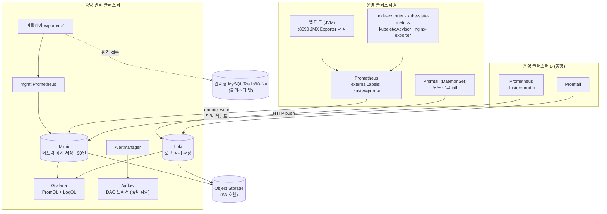

> **시리즈 소개** — 인수인계 문서 한 장 없이 물려받은 Kubernetes 모니터링 시스템(kube-prometheus-stack + Mimir + 각종 Exporter)을, 5개월간 git 커밋 히스토리만으로 역추적해 전체를 재구성한 기록입니다. 이 글은 그 프롤로그로, 어떤 상황이었고 어떤 방법으로 파악해 나갔는지를 다룹니다.

---

## 어느 날, 시스템만 남고 사람은 없었다

지금 다니는 회사의 LMS 플랫폼에는 Prometheus 기반 모니터링 시스템이 돌아가고 있었다. Grafana 대시보드도 떠 있었고, 메트릭도 수집되고 있었고, 알림 설정 비슷한 것도 있었다. 문제는 단 하나였다.

**이걸 만든 사람이 회사에 없다는 것. 그리고 문서가 한 장도 없다는 것.**

남아 있는 것은 세 가지였다.

1. 헬름 차트와 매니페스트가 들어 있는 git 레포지토리 하나
2. 클러스터에 실제로 떠 있는 파드들
3. 그리고 그 둘 사이의, 아무도 설명해줄 수 없는 간극

처음에는 대수롭지 않게 생각했다. kube-prometheus-stack이야 표준 스택이고, 나도 이전 직장들에서 모니터링을 다뤄봤으니 "보면 알겠지" 싶었다. 그런데 레포를 열어보고 생각이 바뀌었다.

`prom-values.yaml`과 `release-values.yaml`이라는, 이름만으로는 용도를 알 수 없는 values 파일이 나란히 있었다. 어떤 설정은 켜져 있고 어떤 설정은 꺼져 있는데 이유를 알 수 없었다. `mimir`라는 디렉터리가 있었고, `loki-distributed`라는 디렉터리도 있었다. 어떤 건 운영 중이고 어떤 건 시도하다 버려진 것 같았는데, **무엇이 살아있는 구성이고 무엇이 화석인지 구분할 방법이 없었다.**

운영 중인 시스템을 "잘 모르는 채로" 맡고 있다는 건 생각보다 불편한 상태다. 장애가 나면 어디부터 봐야 할지 모른다. 설정을 하나 바꾸고 싶어도, 그 설정이 왜 지금 값인지 모르니 바꾸는 게 무서워진다. 그렇다고 밀어버리고 새로 구축하자니, 이미 운영 데이터가 쌓이고 있는 시스템이었다.

그래서 결심했다. **이 시스템의 히스토리를 처음부터 끝까지 복원하자.**

## 유일한 단서: git log

설계 문서도, 위키도, 인수인계 노트도 없었다. 하지만 딱 하나, 거짓말을 하지 않는 기록이 남아 있었다. **git 커밋 히스토리**다.

이전 담당자는 문서는 남기지 않았지만, 모든 변경을 레포에 커밋했다. 커밋 메시지가 친절하진 않았지만, diff는 정직했다. 어떤 파일이 언제 생겼고, 어떤 값이 무엇에서 무엇으로 바뀌었는지는 전부 남아 있었다.

그래서 방법론은 단순하게 정했다.

> **최초 커밋부터 시간순으로, 커밋 하나하나를 읽으면서 "무엇을 바꿨는지(사실)"와 "왜 바꿨을지(추론)"를 분리해서 기록한다.**

말은 단순한데 이게 핵심이었다. 커밋에는 "무엇을"만 있고 "왜"는 없다. "왜"는 내가 채워야 하는 부분인데, 여기서 사실과 추론을 섞어버리면 나중에 내 추측을 사실로 믿게 되는 함정에 빠진다. 그래서 기록할 때 항상 이렇게 나눴다.

- **파악한 내용**: diff에서 확인된 객관적 변경 사항. 파일명, 설정 키, before/after 값.
- **→ 사유 (추정)**: 그 변경이 왜 일어났을지에 대한 나의 재구성. 공식 문서, 해당 버전의 업스트림 차트, 그리고 당시 상황 정황을 근거로.
- **과제**: "다음엔 이 커밋부터 파악하면 됨" — 다음 날의 나를 위한 북마크.

세 번째 항목이 의외로 이 작업을 지탱해준 장치였다. 이 역추적은 하루에 끝나는 일이 아니었다. 본업(운영, 배포, 다른 인프라 업무) 틈틈이 몇 커밋씩 읽어나가는 방식이었기 때문에, 매번 "내가 어디까지 봤더라"부터 시작하면 진도가 나가지 않는다. 매 세션의 끝에 다음 시작점 커밋 해시를 적어두는 것만으로, 5개월짜리 작업이 끊기지 않고 이어졌다.

## "다시는 유추해가면서 파악하는 일 없도록"

기록은 노션에 컴포넌트별로 페이지를 파고, 그 아래 날짜별 문서를 쌓는 구조로 했다.

```
prometheus stack 기반 모니터링 구축
├── kube-prometheus-stack 탐험기     ← 날짜별 기록 18건
├── mimir 탐험기                     ← 날짜별 기록 9건
├── jmx_exporter                    ← 날짜별 기록 8건
├── mysql-exporter / kafka-exporter
├── redis-exporter / nginx-exporter
├── loki 탐험기                      ← 로그 저장소
└── promtail 탐험기                  ← 로그 수집 에이전트
```

첫 페이지 상단에는 이렇게 적어뒀다.

> "지금 회사 LMS에 구축된 프로메테우스 스택을 파악하기 위해 그날그날 파악한 내용을 기록함. **다시는 이전 사람의 구축에 대해 유추해가면서 파악하는 일 없도록… 하기 위해…**"

말줄임표에 당시 심정이 다 들어 있다. 이 문장이 시리즈 전체의 목표이기도 하다. 내가 지금 겪는 이 과정을, 다음 사람은 겪지 않게 하는 것.

## 솔직한 고백: 모르는 것투성이였다

이 시리즈를 그럴듯한 성공담으로 포장하고 싶지는 않다. 시작 시점의 나는 이 스택의 상당 부분을 몰랐다.

4월의 기록에는 이런 문장이 그대로 남아 있다.

> "미안 하나도 이해가 안 된다.. MBean은 뭐고, JMX는 뭐고 하나하나 전부 모르겠어"

JVM 메트릭을 수집하는 jmx_exporter를 파악하다가 막혀서 남긴 기록이다. Mimir의 Ingester와 시리즈(series), 테넌트 개념도 처음엔 "각각은 뭔데?? 전체 하나도 모르겠어" 수준에서 출발했다.

그런데 역추적이라는 방식이 오히려 학습에는 좋은 구조였다. 추상적으로 개념부터 공부하는 게 아니라, **"이 커밋에서 이 값을 왜 바꿨을까"라는 구체적인 질문이 매번 주어지고, 그 질문에 답하기 위해 필요한 만큼만 개념을 파고드는** 방식이 되기 때문이다. `max_label_names_per_series`를 30에서 100으로 올린 커밋을 이해하려면 시리즈와 라벨 카디널리티를 알아야 하고, `X-Scope-OrgID` 헤더가 추가됐다 삭제되는 커밋들을 이해하려면 멀티테넌시를 알아야 한다. 개념이 항상 실제 운영 판단과 붙어서 들어왔다.

그렇게 5개월이 지나자, 처음엔 diff를 보고도 뭘 봐야 할지 몰랐던 사람이 나중에는 Ingester가 CrashLoopBackOff로 죽은 커밋을 보고 "extraArgs에 들어간 이 플래그, 이거 distributor용 플래그를 ingester에 복붙한 거 아닌가"를 짚어내는 수준까지 왔다. 이 변화 과정 자체가 이 시리즈에서 보여주고 싶은 것 중 하나다.

## 5개월 후: 무엇이 복원되었나

결과부터 요약하면, 다음이 전부 재구성됐다.

- **전체 아키텍처** — 멀티 클러스터의 각 Prometheus가 수집한 메트릭을 중앙 Mimir(오브젝트 스토리지 백엔드, 90일 보존)로 remote_write하고, 중앙 Grafana 한 곳에서 조회하는 구조. 그리고 테넌시 전략이 세 번 바뀐 변천사.
- **계층별 수집 체계** — 노드/K8s 인프라(node-exporter, kube-state-metrics, kubelet 계열), 애플리케이션 JVM(jmx_exporter, 그것도 빌드 파이프라인을 타고 이미지에 구워지는 독특한 주입 경로), 관리형 미들웨어(MySQL/Redis/Kafka/Nginx exporter — 관리형 서비스라 에이전트 설치가 불가능해서 나온 원격 수집 구조).
- **대시보드의 계보** — 어떤 대시보드가 어느 공개 대시보드를 원본으로 어떻게 커스터마이징됐는지, 그리고 파일 기반 프로비저닝과 Import UI 사이의 함정.
- **알림 파이프라인** — Alertmanager에서 워크플로 엔진(Airflow)으로 webhook을 쏘는 설계와, 스펙에 없는 필드들과 싸운 트러블슈팅의 전말.
- **로그 파이프라인** — 각 클러스터 노드의 Promtail이 로그를 tail해 중앙 Loki로 push하는 로그 축 전체. 폐기된 Kafka 완충 구조 4차 시도와 외부 노출 방식의 긴 방랑까지.
- **폐기된 시도들** — git-sync 기반 대시보드 동기화처럼, 레포에 화석으로 남아 후임자를 헷갈리게 할 뻔한 잔존물들의 정체.

그리고 역추적 과정에서 **이전 담당자도 인지하지 못했을 문제들**도 발견했다. 설정 간 정합성이 어긋난 지점(예: 최종 테넌트 구조와 한도 설정의 불일치), 시크릿 관리 방식의 개선 필요 지점, 미완으로 남은 대시보드 작업 등이다. 파악이 끝나자 자연스럽게 "부족한 점과 보완 과제" 목록이 나왔고, 이것이 지금 팀의 개선 백로그가 됐다.

복원된 전체 그림을 한 장으로 접으면 이렇다. (각 편에서 이 그림의 부분들을 확대해 다룬다.)



최종 산출물은 구축 배경 / 아키텍처 / 전체 플로우 / 컴포넌트별 상세(출처 포함) / 구축·변경 절차 / 일자별 파악 로그 / 개선 과제, 7개 장으로 구성된 내부 파악 문서다. 이 시리즈는 그 문서를 만들기까지의 과정을, 컴포넌트별로 한 편씩 풀어낸 것이다.

## 이 시리즈에서 다룰 것들

| 편 | 주제 |
|---|---|
| 1편 | [kube-prometheus-stack — values 파일 두 개의 수수께끼에서 시작하는 역추적](/posts/monitoring-reverse-engineering-1-kube-prometheus-stack/) |
| 2편 | [Mimir — 멀티테넌시 전략은 왜 세 번 바뀌었나](/posts/monitoring-reverse-engineering-2-mimir/) |
| 3편 | [JMX Exporter — 빌드타임에 이미지로 굽는 설정의 함정](/posts/monitoring-reverse-engineering-3-jmx-exporter/) |
| 4편 | [관리형 서비스 시대의 Exporter — MySQL/Redis/Kafka/Nginx 원격 수집기](/posts/monitoring-reverse-engineering-4-managed-service-exporters/) |
| 5편 | [Grafana — PMM 대시보드 이식기와 `__inputs`의 배신](/posts/monitoring-reverse-engineering-5-grafana/) |
| 6편 | [Alertmanager → Airflow — 스펙에 없는 필드와 싸운 기록](/posts/monitoring-reverse-engineering-6-alertmanager-airflow/) |
| 7편 | [Loki & Promtail — 로그 파이프라인: 폐기된 Kafka 완충로와 헬스체크 방랑기](/posts/monitoring-reverse-engineering-7-loki-promtail/) |
| 8편 | [에필로그 — 역추적이 남긴 것: 파악 문서, 그리고 문서화에 대하여](/posts/monitoring-reverse-engineering-8-epilogue/) |

## 프롤로그를 닫으며

이 작업을 하면서 가장 크게 느낀 것 하나만 미리 적어둔다.

**커밋 히스토리는 최후의 문서다. 하지만 문서의 대체재는 아니다.**

diff는 "무엇을"은 완벽하게 보존하지만 "왜"는 보존하지 않는다. 나는 그 "왜"를 복원하는 데 5개월을 썼고, 그마저도 상당 부분은 추정으로 남았다. 만약 이전 담당자가 각 결정마다 세 줄씩만 남겼더라면 — "이 값을 올린 이유: 수집 거부 에러 발생" 정도만이라도 — 이 시간은 며칠로 줄었을 것이다.

그래서 이 시리즈의 모든 기록은 두 가지를 병기한다. 커밋이 말해준 사실과, 내가 재구성한 추론. 다음 편부터는 그 첫 번째 대상이었던 kube-prometheus-stack으로 들어간다. 이름부터 수상한 values 파일 두 개가 우리를 기다리고 있다.

---

*이 시리즈의 모든 내용은 특정 조직·시스템을 식별할 수 없도록 도메인, 명칭, 일부 수치를 일반화/변경했습니다.*
