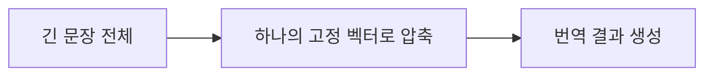
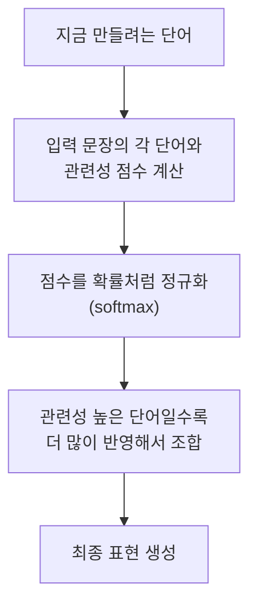
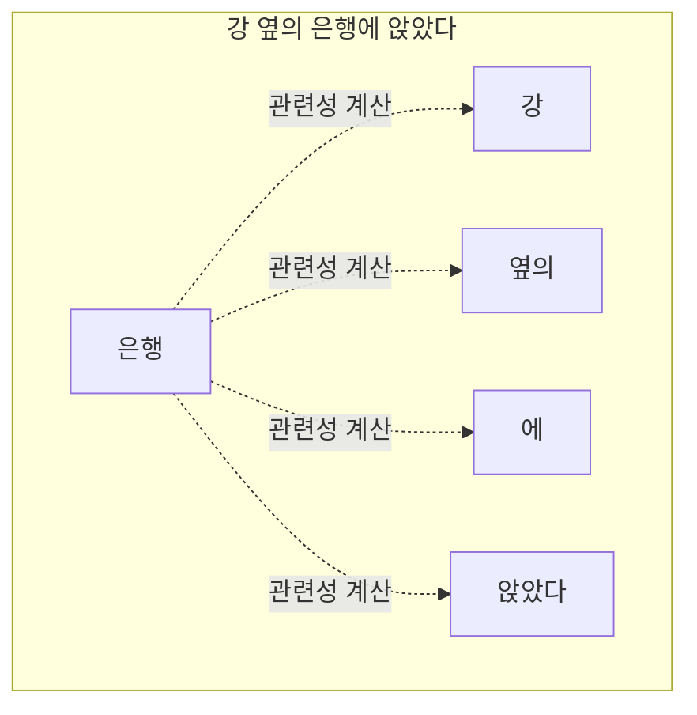
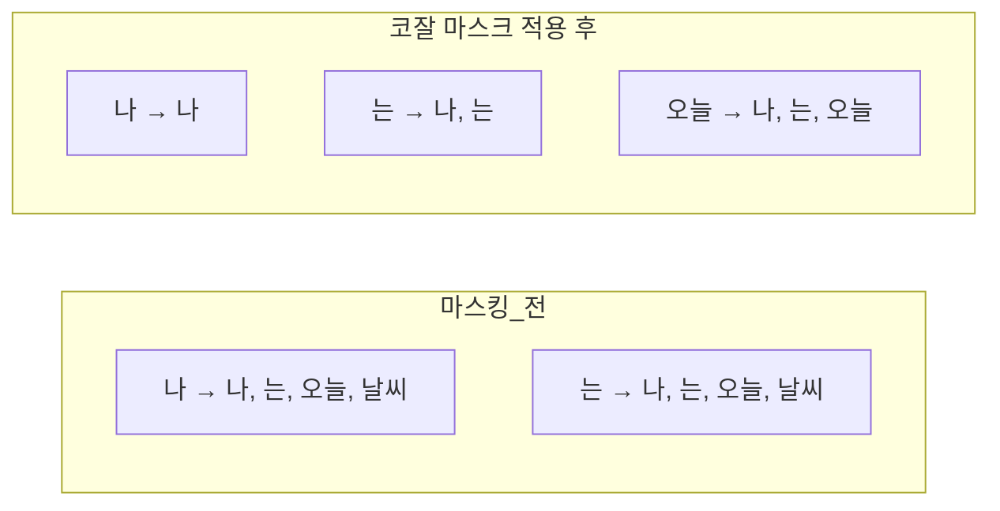
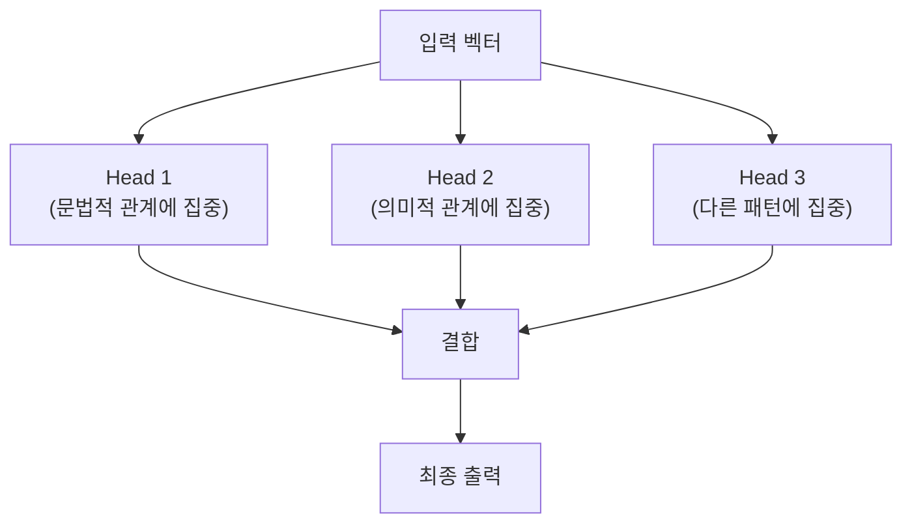
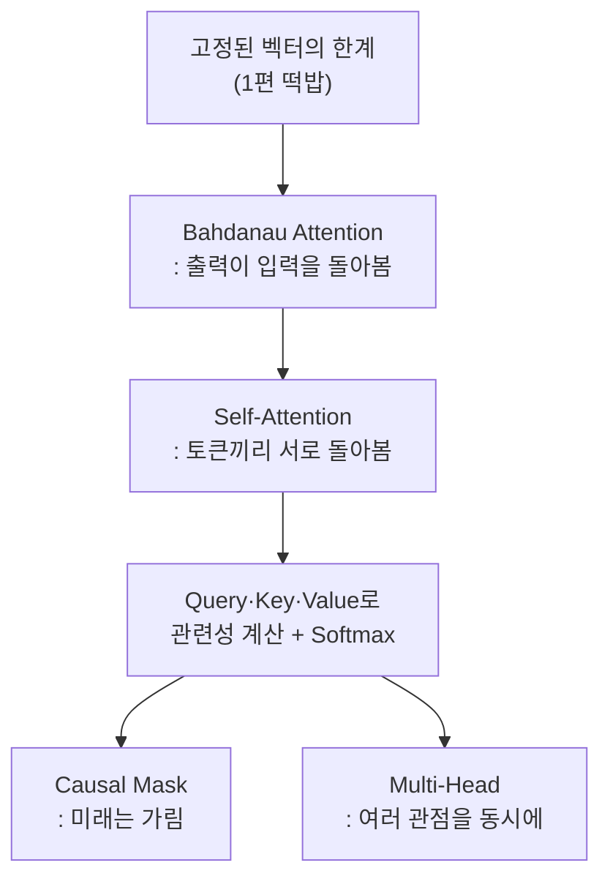

> 지난 편에서 남긴 떡밥 하나. Word2Vec 방식의 임베딩에서는 `bank`라는 단어가 "은행"으로 쓰이든 "강둑"으로 쓰이든 **항상 같은 벡터**를 가졌다. 문맥이 바뀌어도 벡터가 꿈쩍하지 않는다는 뜻이다. 그런데 지금의 LLM은 같은 단어라도 문맥에 따라 완전히 다르게 이해한다. 대체 무엇이 이 고정관념을 깬 걸까.

## 사건 재구성: 고정된 벡터의 한계

문장 두 개를 놓고 보자.

```
① 나는 은행에 돈을 맡겼다.
② 강 옆의 은행에 앉았다.
```

두 문장 모두 "은행"이라는 같은 토큰이 등장한다. 하지만 뜻은 완전히 다르다. 그런데 1편에서 만든 토큰 임베딩은 "은행"이라는 토큰 ID 하나에 벡터 하나를 대응시킬 뿐이다. 문맥이 뭐든 상관없이 같은 벡터가 나온다는 뜻이다.

이 문제를 풀려면 벡터가 "고정"되어 있으면 안 된다. **주변 단어를 살펴보고, 그에 맞게 자기 표현을 바꿀 수 있어야 한다.** 이게 이번 편의 진짜 사건이다.

## 원조 용의자: 번역기가 먼저 겪은 문제

사실 이 문제를 처음 심각하게 마주한 건 LLM이 아니라 기계 번역이었다. 초창기 번역 모델은 문장 전체를 하나의 고정 크기 벡터로 압축한 뒤, 그 벡터 하나만 보고 번역문을 생성했다.



문제는 문장이 길어질수록 이 압축 과정에서 초반 정보가 뭉개져 사라진다는 점이었다. 마치 책 한 권을 한 문장으로 요약하라는 것과 비슷하다. 요약하는 과정에서 디테일이 증발해버린다.

이 문제를 풀기 위해 등장한 게 **Bahdanau Attention**이다. 아이디어는 단순하지만 강력했다. "출력을 만들 때마다, 입력 문장 전체를 다시 한번 훑어보면서 지금 필요한 부분에 더 집중하자."



번역할 때 "고양이"라는 단어를 만들려면, 원문에서 "cat"이 있는 부분에 더 집중하고 나머지는 상대적으로 덜 본다는 뜻이다. 이게 "어텐션(주의를 기울인다)"이라는 이름의 유래다.

## 점수를 확률로 바꾸는 장치: 소프트맥스

여기서 "관련성 점수"를 계산했다고 치자. 그런데 이 점수들을 그대로 쓰면 문제가 있다. 음수가 나올 수도 있고, 합이 1이 되지도 않는다. 비중을 나눠 갖는 형태로 정리가 안 된다는 뜻이다.

그래서 이 점수들을 **소프트맥스(softmax)** 함수에 통과시킨다. 소프트맥스는 아무 실수 값들의 나열을 받아서, 전부 0과 1 사이의 값으로 바꾸고 합이 정확히 1이 되도록 만들어준다. 즉 "확률처럼 보이게" 만드는 장치다.

```
점수:      [2.0,  1.0,  0.1]
   ↓ softmax
확률처럼:   [0.66, 0.24, 0.10]   (합계 = 1.0)
```

점수가 클수록 지수함수(e^x)를 거치면서 차이가 더 크게 벌어진다. 그래서 소프트맥스를 통과하면 "가장 관련 있는 부분"이 더 도드라지게 강조되는 효과가 생긴다. 점수 차이를 "얼마나 이 부분에 집중할지"에 대한 비율로 바꿔주는 셈이다.

## 진짜 범인: Self-Attention

Bahdanau Attention은 "출력이 입력을 돌아본다"는 방식이었다. 그런데 Transformer, 그리고 GPT 계열 LLM이 쓰는 방식은 한 걸음 더 나아간다. **문장 안의 각 토큰이, 같은 문장 안의 다른 모든 토큰을 서로 돌아본다.** 이걸 **셀프 어텐션(Self-Attention)**이라고 부른다.



"은행"이라는 토큰은 문장 안의 "강", "옆의", "앉았다"와 각각 얼마나 관련 있는지를 계산한다. 이 문장에서는 "강"과 "앉았다"가 강하게 연결되면서, "은행"의 표현이 "강둑" 쪽으로 기울게 된다. 반대로 "돈을 맡겼다"라는 문장이었다면 "돈", "맡겼다"와 강하게 연결되면서 "금융기관"쪽 표현으로 기울었을 것이다.

**바로 이게 지난 편에서 던진 떡밥의 답이다.** 고정된 벡터 하나로는 풀 수 없던 문제, 문맥에 따라 뜻이 달라지는 단어의 문제. 셀프 어텐션이 각 토큰의 벡터를 주변 문맥에 맞게 매번 새로 계산해줌으로써 이걸 풀어낸다.

### 이 관련성은 어떻게 계산하나: Query, Key, Value

셀프 어텐션 내부에서는 각 토큰이 세 가지 다른 역할의 벡터를 만든다.

- **Query(질문)**: "나와 관련 있는 게 누구지?"라고 묻는 벡터
- **Key(열쇠)**: "나는 이런 특징을 갖고 있어"라고 답하는 벡터
- **Value(값)**: 실제로 정보를 담고 있는 벡터

Query와 Key를 서로 비교해서 관련성 점수를 매기고(내적 연산), 그 점수를 소프트맥스로 정규화한 뒤, 그 비율만큼 각 토큰의 Value를 섞어서 최종 표현을 만든다. 세 가지 벡터로 역할을 나눈 이유는, 하나의 벡터로 "질문하기"와 "답하기"를 동시에 하려면 표현력이 부족해지기 때문이다. 역할을 분리하면 모델이 훨씬 유연하게 "누구를 볼지"와 "무엇을 가져올지"를 따로 학습할 수 있다.

## 반전: 미래를 보면 안 되는 이유

여기까지는 순조롭다. 그런데 GPT 같은 모델에는 이상한 제약이 하나 걸려 있다. **지금 만들고 있는 토큰이, 아직 만들어지지 않은 미래의 토큰을 미리 훔쳐봐서는 안 된다**는 규칙이다.

```
"나는 오늘 [ ??? ]"
```

이 빈칸을 채울 때, 모델은 "나는 오늘"까지만 보고 다음 단어를 예측해야 한다. 만약 정답인 미래 단어를 미리 참고할 수 있다면, 그건 시험 문제를 풀 때 답안지를 미리 커닝하는 것과 같다. 실전에서는(즉 실제로 텍스트를 생성할 때는) 미래의 단어가 아예 존재하지 않으니, 훈련할 때도 똑같은 조건을 만들어줘야 한다.

그래서 등장하는 게 **코잘 마스크(Causal Mask)**다. 어텐션 점수를 계산할 때, 미래 위치에 해당하는 부분을 강제로 가려버린다.



각 토큰은 자기 자신과 그 이전 토큰들만 볼 수 있고, 그 이후 토큰은 어텐션 점수 자체가 계산되지 않도록(사실상 음의 무한대로 만들어 소프트맥스를 거치면 0이 되도록) 가려진다.

> 🧩 **여기서 새 떡밥 하나.** "미래를 보면 안 된다"는 이 제약, 왜 하필 이런 규칙을 세워뒀을까. 답의 절반은 이미 나왔다 — 시험에서 답안지를 미리 보면 안 되니까. 그런데 이 규칙이 실제로 모델을 "어떻게" 훈련시키는지는 아직 안 밝혀졌다. 이 이야기는 4편, LLM이 실제로 틀리고 배우는 과정에서 완전히 회수된다.

## 하나 더: 왜 머리(Head)를 여러 개로 나눌까

셀프 어텐션 하나만으로도 충분해 보이는데, 실제 Transformer는 이걸 여러 개 병렬로 돌린다. 이걸 **멀티 헤드 어텐션(Multi-Head Attention)**이라고 부른다.

이유는 이렇다. 문장을 이해할 때 우리는 사실 여러 관점을 동시에 고려한다. "이 단어가 문법적으로 어디에 걸리는가", "의미적으로 무엇과 연관되는가", "감정적 뉘앙스는 어떤가" 같은 것들이다. 어텐션 헤드 하나만 쓰면 이 모든 관점을 하나의 계산에 욱여넣어야 한다.



헤드를 여러 개로 나누면, 각 헤드가 서로 다른 종류의 관계에 집중하도록 독립적으로 학습될 여지가 생긴다. 그리고 이 모든 헤드의 결과를 마지막에 하나로 합쳐서, 훨씬 풍부한 표현을 만들어낸다. "헤드 = 서로 다른 관점에서 문장을 바라보는 눈"이라고 이해하면 크게 틀리지 않는다.

## 이번 편의 전체 그림



문맥에 따라 벡터가 바뀌는 문제는 이렇게 풀렸다. 그런데 이 어텐션이라는 장치 하나만으로 GPT가 완성되는 건 아니다. 어텐션 주변에는 LayerNorm, GELU, 숏컷 연결 같은 낯선 부품들이 잔뜩 붙어 있다. 이 부품들이 없으면 실제로 무슨 일이 벌어지는지, 다음 편에서 그 블록을 하나씩 열어본다.

---
*이 시리즈는 "밑바닥부터 만들면서 배우는 LLM"을 읽고 개인적으로 소화한 내용을 재구성한 글입니다.*
