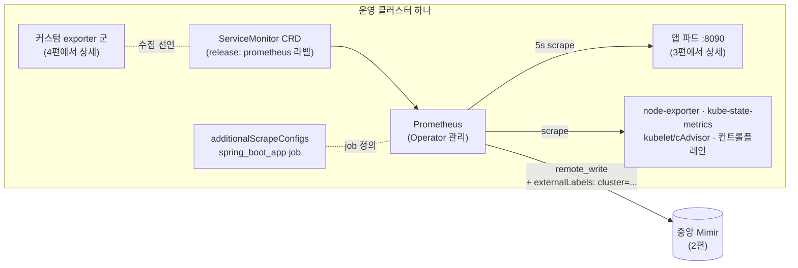

> 인수인계 문서 없이 물려받은 모니터링 시스템을 git 커밋 히스토리로 역추적한 기록, 그 첫 번째 대상은 스택의 뼈대인 kube-prometheus-stack이다. 이야기는 정체불명의 values 파일 두 개에서 시작한다.

> **이 편의 기준 버전** — kube-prometheus-stack **65.5.0** (최소구성 비교 기준: 13.10.0) · Prometheus Operator 번들

---

## 최초 커밋으로

이 편에서 다루는 범위 — 한 클러스터 안의 수집 구조 — 를 먼저 그림으로 두고 시작한다.




역추적의 규칙은 프롤로그에서 정한 대로다. 최초 커밋부터 시간순으로 읽고, "무엇을(사실)"과 "왜(추론)"를 분리해 기록하고, 매 세션 끝에 다음 시작점 커밋을 북마크한다.

레포에서 모니터링 관련 최초 커밋을 찾아 들어가 보니, 시작은 명료했다. **kube-prometheus-stack 65.5.0 버전의 헬름 차트를 업스트림(prometheus-community/helm-charts)에서 통째로 클론해서 레포에 넣은 것**이다.

여기서 첫 번째 특징이 드러난다. 이 시스템은 일반적인 방식 — `helm repo add` 후 override values 파일 하나만 관리하는 — 이 아니라, **차트 전체를 fork해서 레포 안에서 직접 수정하는 방식**을 쓴다. 서브차트(charts/grafana 등)의 values까지 직접 손대는 스타일이다. 모든 변경이 git diff로 남는다는 장점이 있고, 실제로 그 덕분에 이 역추적이 가능했다. 대신 차트 버전 업그레이드 때 업스트림 변경분과 로컬 수정분을 손으로 병합해야 하는 부채를 안는 방식이기도 하다.

## 수수께끼: prom-values.yaml과 release-values.yaml

차트가 들어온 직후의 커밋에서, 이름만으로는 용도를 알 수 없는 values 파일 두 개가 추가된다.

```
oss/kube-prometheus-stack/
├── prom-values.yaml       # ???
├── release-values.yaml    # ???
└── (65.5.0 차트 본체)
```

둘 다 values 파일인데 왜 두 개인가. 어느 쪽이 실제 배포에 쓰이는가. diff만으로는 알 수 없어서, 두 파일의 **내용의 출처**를 추적했다.

방법은 이랬다. 각 파일의 내용을 업스트림 차트의 여러 버전 values.yaml과 대조해 본 것이다. 결과가 흥미로웠다.

- **prom-values.yaml** — 65.5.0이 아니라 **13.10.0 버전**의 values.yaml과 일치했다. 그 위에 몇 가지 설정만 손댄 상태였다.
- **release-values.yaml** — 현재 사용 중인 **65.5.0 버전**의 values.yaml 기반이었다.

그리고 두 파일 모두, 손댄 부분의 패턴이 완전히 같았다. **켤 수 있는 걸 전부 끈 것이다.**

```yaml
defaultRules.create: true        → false   # 기본 알림 룰 전부 비활성
alertmanager.enabled: true       → false   # 알림 비활성
kubeApiServer.enabled: true      → false   # 컨트롤 플레인 수집 전부 비활성
kubelet.enabled: true            → false
kubeControllerManager / kubeScheduler / kubeEtcd / kubeProxy / coreDns: → false
kubeStateMetrics.enabled: true   → false   # K8s 오브젝트 상태 수집 비활성
nodeExporter.enabled: true       → false   # 노드 메트릭 수집 비활성
```

즉 남는 건 사실상 Prometheus 본체와 Grafana뿐인 **최소 구성**이다.

여기서 추론이 가능해진다. 두 파일의 정체는 이렇다:

- **prom-values.yaml** = 구버전(13.x) 기준의 최소 기능 베이스라인. 아마 이전 담당자가 과거에 다뤄봤거나 참고했던 버전의 "아는 상태"에서 출발하기 위한 기준점.
- **release-values.yaml** = 현재 버전(65.5.0) 기준의 실제 배포용 values. 이후 모든 기능 추가는 이 파일을 수정해가며 진행됨.

이 추론은 이후 커밋들이 증명해준다. 실제 변경은 전부 release-values.yaml 위에서 일어났고, prom-values.yaml은 참조용으로 남았다. (한참 뒤 release-values.yaml은 관리 클러스터용이라는 의미의 `mm-release-values.yaml`로 개명되고, 운영 클러스터별 values가 따로 분화한다 — 뒤에서 다룬다.)

**교훈 하나.** "전부 끄고 시작한다"는 접근 자체는 배울 점이 있다. 뭘 수집하는지도 모르는 상태에서 전부 켜면, 수집은 되는데 아무도 안 보는 메트릭이 리소스만 태운다. 이 시스템은 최소 구성에서 출발해 필요가 확인될 때마다 하나씩 켜는 방식으로 자랐고, 그 "켠 순서" 자체가 커밋 히스토리에 남아 이 시스템의 성장 서사가 됐다.

## 이 스위치 하나에 모든 exporter가 매달려 있다

초기 커밋들을 읽다가, 나중에 이 시스템 전체를 이해하는 열쇠가 되는 설정 하나를 만났다.

```yaml
prometheus:
  prometheusSpec:
    serviceMonitorSelectorNilUsesHelmValues: false
```

이름부터 사람을 괴롭히는 이 설정의 의미는 이렇다. Prometheus Operator 체계에서 수집 대상은 ServiceMonitor라는 CRD로 선언하는데, **기본값(true)에서는 이 Helm release가 만든 ServiceMonitor만 인식**한다. false로 바꾸면 release 소속이 아니어도, 지정된 라벨(이 시스템에서는 `release: prometheus`)만 맞으면 전부 인식한다.

당시에는 "커스텀 ServiceMonitor를 쓰려고 열어둔 거구나" 정도로 기록하고 넘어갔는데, 몇 달 뒤 exporter들을 파악하면서 이 설정의 무게를 알게 됐다. **MySQL, Redis, Kafka, Nginx exporter가 전부 직접 작성한 ServiceMonitor로 수집되고 있었고, 그 전부가 이 스위치 하나에 의존하고 있었다.** 누군가 이 값을 기본값으로 되돌리면 미들웨어 메트릭이 일제히 끊긴다. 역추적이 아니었다면, 장애가 나고 나서야 알았을 종류의 지식이다.

## 첫 가시적 성과: Grafana를 화면에 띄우다

역추적과 병행해서, 파악한 만큼을 직접 배포해보며 검증했다. 커밋을 읽기만 하면 "이해했다는 착각"에 빠지기 쉬워서, 실제로 같은 구성이 뜨는지 재현하는 과정을 넣었다.

<!-- 📸 스크린샷 #1 자리 (선택)
촬영: 로컬 kind/minikube에 kube-prometheus-stack 설치 → Prometheus UI > Status > Targets
프레임: spring_boot_app 등 job 목록과 UP/DOWN 상태가 보이게. 내부 IP는 로컬 재현이라 노출 무방
캡션 제안: "Prometheus Targets 화면 — 수집 진단의 절반은 여기서 끝난다"
-->
첫 마일스톤은 Grafana 접속이었다. 서브차트 values에서 Service 타입을 LoadBalancer로 바꾸고 클라우드 벤더용 annotation을 설정한 뒤 release-values로 helm install — 브라우저에 Grafana 로그인 화면이 뜨는 순간, 이 레포가 "읽는 대상"에서 "다룰 수 있는 대상"으로 바뀌었다. 별 것 아닌 화면 하나가 역추적 초기의 동력이 됐다.

## 운영 전환의 흔적: 스위치가 하나씩 켜진다

시간순으로 커밋을 따라가니, 어느 시점부터 꺼뒀던 스위치들이 차례로 켜지기 시작한다.

**1차: 운영 필수 3종.**

```yaml
alertmanager.enabled: false → true      # 알림이 필요해졌다 = 실운영 시작 신호
kubeStateMetrics.enabled: false → true  # 파드/디플로이 상태를 봐야 한다
nodeExporter.enabled: false → true      # 노드 리소스를 봐야 한다
```

**2차: 컨트롤 플레인 전면 수집.**

```yaml
kubelet.enabled: false → true           # 컨테이너 리소스(cAdvisor)의 원천
kubeApiServer / kubeControllerManager / kubeScheduler /
kubeEtcd / kubeProxy / coreDns: false → true
```

이 순서가 말해주는 것이 있다. 처음엔 "앱이 잘 도나"만 보다가, 운영이 시작되면서 "장애가 나면 어느 계층인지 판별할 수 있어야 한다"로 요구가 진화한 것이다. 파드가 Pending에 머물면 스케줄러 메트릭을, API가 느리면 apiserver와 etcd 메트릭을, 서비스 간 통신이 안 되면 DNS 메트릭을 본다 — 컨트롤 플레인 수집은 그 판별을 위한 기반이다.

## 애플리케이션 메트릭: additionalScrapeConfigs 해부

이 시스템에서 가장 밀도 있게 읽어야 했던 커밋은 애플리케이션(JVM) 수집 설정이 들어온 것이었다. ServiceMonitor가 아니라 `additionalScrapeConfigs`로 scrape job을 직접 정의하는 방식이다. (앱 쪽에 무엇이 있길래 :8090을 긁는지는 3편 JMX Exporter에서 다룬다. 여기서는 Prometheus 쪽 절반만.)

```yaml
additionalScrapeConfigs:
- job_name: 'spring_boot_app'
  metrics_path: '/metrics'
  scrape_interval: 5s
  kubernetes_sd_configs:
    - role: pod
      namespaces: { names: [ <서비스 네임스페이스> ] }
  relabel_configs:
    # 1) 대상 필터: 이 앱 라벨을 가진 파드만 남긴다
    - source_labels: [__meta_kubernetes_pod_label_app]
      action: keep
      regex: (backend-api)
    # 2) 수집 주소: 파드 IP에 메트릭 포트를 붙인다
    - source_labels: [__meta_kubernetes_pod_ip]
      target_label: __address__
      replacement: ${1}:8090
    # 3) 식별 라벨 부착
    - { source_labels: [__address__],                 target_label: instance }
    - { source_labels: [__meta_kubernetes_namespace], target_label: namespace }
    - { source_labels: [__meta_kubernetes_pod_name],  target_label: pod }
    # 4) 클러스터 고정 라벨
    - target_label: cluster
      replacement: prod-a
```

처음 이 블록을 봤을 때는 relabel_configs가 주문처럼 보였다. 하나씩 풀어보면 하는 일은 명료하다.

1. **service discovery** — K8s API로 해당 네임스페이스의 파드 목록을 실시간 조회한다. 파드가 재시작해 IP가 바뀌어도 자동 추적된다. static 주소 나열 방식과의 결정적 차이.
2. **keep 필터** — 네임스페이스의 전체 파드 중 우리 앱 라벨을 가진 것만 남기고 나머지는 버린다.
3. **__address__ 재작성** — 발견된 파드 IP에 `:8090`을 붙여 실제 수집 주소를 만든다. 앱 포트(8080)가 아니라 메트릭 전용 포트다.
4. **라벨 부착** — 이 시계열이 어느 네임스페이스/파드/클러스터에서 왔는지를 라벨로 박는다. 마지막 `cluster` 라벨은 source 없이 고정값을 박는 패턴인데, 이게 다음 편(중앙 저장소의 멀티 클러스터 구분)의 복선이 된다.

`scrape_interval: 5s`는 기본(보통 30s)보다 꽤 공격적인 값이다. JVM 메트릭을 세밀하게 보겠다는 의도로 읽었지만, 시리즈 카디널리티와 곱해지면 수집량에 직접 영향을 주는 값이라 "왜 5초여야 했는지"는 추론으로도 채우지 못한 항목으로 남겼다. 역추적을 하다 보면 이렇게 **끝내 '왜'를 복원하지 못하는 값**들이 남는데, 그것들은 그대로 "미확인" 딱지를 붙여 기록했다. 모르는 것을 아는 것처럼 적는 순간 문서의 신뢰가 무너진다.

## remote_write: 이 스택이 '멀티 클러스터 중앙 관제'였음을 알게 된 순간

어느 커밋에서 이 설정이 등장한다.

```yaml
prometheusSpec:
  remoteWrite:
    - url: https://<중앙 저장소 도메인>/api/v1/push
```

Prometheus가 수집분을 로컬 저장과 동시에 외부로 push하는 설정이다. push 대상의 정체는 Mimir — 이 발견으로 시스템의 큰 그림이 처음 잡혔다. **각 클러스터의 Prometheus는 "현장 수집원"이고, 장기 보관과 통합 조회는 중앙 Mimir가 맡는 구조**라는 것.

이 그림이 잡히자 이후 커밋들이 연쇄적으로 해석되기 시작했다:

- values 파일이 클러스터별로 분화한다: `release-values.yaml` → `mm-release-values.yaml`(관리 클러스터용) + `prod-a/prod-b-prometheus-values.yaml`(운영 클러스터별). 같은 차트를 클러스터마다 다른 values로 배포하는 체계.
- 각 values에 `externalLabels`가 들어온다 — 이 Prometheus가 내보내는 **모든** 시계열에 자동으로 붙는 라벨. 중앙 저장소에서 "이건 어느 클러스터 데이터인가"를 구분하는 수단이다.
- remote_write에 테넌트 헤더(`X-Scope-OrgID`)가 붙었다가, 지워졌다가, 다시 붙는다.

마지막 항목 — 테넌트 헤더의 붙었다 떨어졌다 하는 궤적 — 이 이 역추적에서 가장 재미있는 대목이었다. 클러스터별 데이터를 물리적으로 분리할 것인가(테넌트), 라벨로 논리 구분만 할 것인가, 그 사이에서 설계가 세 번 바뀐 흔적이다. 이 이야기는 저장소 쪽 사정과 얽혀 있어서, 다음 편(Mimir)에서 통째로 다룬다.

## 화석 발굴: 주석 처리된 삭제 명령

역추적 중 소름 돋았던 발견 하나로 이 편을 닫는다. 어느 values 파일 근처에 이런 라인이 주석으로 남아 있었다.

```bash
# kubectl delete all --all -n monitoring --force --grace-period=0
```

모니터링 네임스페이스의 **모든 리소스를 유예 없이 강제 삭제**하는 명령이다. 전후 커밋을 보면 맥락이 읽힌다. 그 시기는 Alertmanager 설정이 계속 반영되지 않아 config 위치를 이리저리 옮기던 트러블슈팅의 한복판이었고(6편에서 다룬다), 아마 "모르겠다, 다 밀고 재설치하자"를 실제로 실행했던 흔적이다. 지우기는 아깝고 실수로 실행되면 안 되니 주석으로 봉인해 둔 것으로 보인다.

같은 시기 커밋에는 `prometheusConfigReloader`(설정 변경을 Prometheus에 재시작 없이 반영해주는 사이드카)에 probe와 리소스 보장을 추가한 변경도 있다. 조합하면 서사가 완성된다: **설정이 반영 안 됨 → 전부 밀고 재설치 → 원인이 reloader 쪽에 있음을 파악하고 안정화 조치.** 커밋 히스토리는 이렇게, 문서에는 절대 남지 않았을 고생의 기록까지 보존하고 있었다.

## 1편 정리

- 이 스택은 kube-prometheus-stack 65.5.0을 **통째로 fork해 직접 수정**하는 방식으로 관리된다. 역추적을 가능하게 한 구조이자, 업그레이드 부채를 안는 구조.
- 수수께끼의 values 두 개는 **구버전 기준 최소구성 베이스라인 + 현행 버전 배포용**이었고, "전부 끄고 필요할 때 켠다"는 성장 방식의 출발점이었다.
- `serviceMonitorSelectorNilUsesHelmValues: false`는 이 시스템의 모든 커스텀 exporter가 매달린 단일 스위치다.
- additionalScrapeConfigs의 relabel 파이프라인과 remote_write의 등장으로, 이 시스템이 **멀티 클러스터 → 중앙 저장소** 구조임이 드러났다.
- 그리고 커밋 사이사이에는 삭제 명령의 화석 같은, 트러블슈팅의 흔적들이 묻혀 있었다.

다음 편은 그 중앙 저장소, Mimir다. 테넌트 헤더가 세 번 바뀐 이유, 한도 설정과의 숨은 정합성 문제, 그리고 Ingester가 죽었던 날의 범인 찾기까지.

---

## 부록 A — 실무 체크포인트

- **수집이 안 될 때 1순위** — Prometheus UI > Status > Targets. 해당 job이 목록에 없으면 설정 미반영, 있는데 DOWN이면 대상/네트워크 문제. 진단의 절반이 이 화면에서 끝난다.
- **커스텀 ServiceMonitor가 안 잡힐 때** — 두 가지를 순서대로:
  ```bash
  kubectl get prometheus -n <ns> -o yaml | grep -A2 serviceMonitorSelector   # nilUsesHelmValues 확인
  kubectl get servicemonitor <이름> -n <ns> -o yaml | grep -A3 labels        # release: prometheus 라벨 확인
  ```
- **remote_write 전송 상태** — 이 두 메트릭이 증가하면 중앙 저장소 쪽 수신 거부를 의심:
  ```promql
  rate(prometheus_remote_storage_samples_failed_total[5m])
  rate(prometheus_remote_storage_samples_retried_total[5m])
  ```
- **values를 바꿨는데 반영이 안 될 때** — `prometheus-config-reloader` 사이드카 컨테이너 로그부터. 본문의 "전부 밀고 재설치" 화석이 이걸 몰라서 생긴 흔적이다.
- **externalLabels 복붙 사고 예방** — 클러스터별 values를 복사해 만들 때 `cluster:` 값 치환 여부를 diff로 확인하고 배포할 것.

## 부록 B — 참고 자료

- kube-prometheus-stack 차트 (65.5.0): https://github.com/prometheus-community/helm-charts/tree/kube-prometheus-stack-65.5.0/charts/kube-prometheus-stack
- Prometheus Operator — ServiceMonitor API: https://prometheus-operator.dev/docs/api-reference/api/
- Prometheus relabel_configs 공식 문서: https://prometheus.io/docs/prometheus/latest/configuration/configuration/#relabel_config
- Prometheus remote_write 스펙: https://prometheus.io/docs/specs/prw/remote_write_spec/
- Kubernetes service discovery(kubernetes_sd_config): https://prometheus.io/docs/prometheus/latest/configuration/configuration/#kubernetes_sd_config

---

*이 시리즈의 모든 내용은 특정 조직·시스템을 식별할 수 없도록 도메인, 명칭, 일부 수치를 일반화/변경했습니다.*
