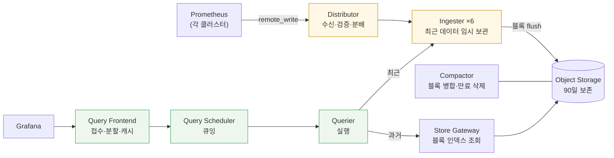
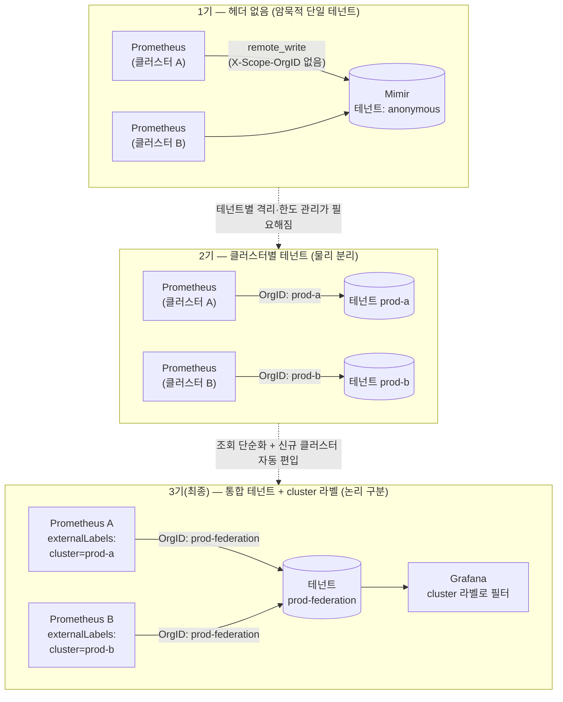

> 1편에서 각 클러스터의 Prometheus가 어딘가로 remote_write하고 있다는 것을 발견했다. 이번 편은 그 도착지, 중앙 장기 저장소 Mimir다. 커밋 히스토리에는 테넌시 설계가 세 번 바뀐 궤적, 한도 튜닝의 흔적, 그리고 Ingester가 죽었던 날의 기록이 남아 있었다.

> **이 편의 기준 버전** — Grafana Mimir — mimir-distributed 차트 **5.5.1** · Ingester ×6 · Object Storage(S3 호환) 백엔드 · 보존 90일

---

## 왜 Prometheus만으로는 안 되는가

Mimir 커밋을 읽기 전에, 이 컴포넌트가 왜 존재하는지부터 정리해야 했다. Prometheus는 훌륭한 수집기지만 저장소로서는 세 가지 한계가 있다.

1. **유실 위험** — 로컬 디스크에만 저장하므로 파드/노드 장애 시 데이터가 날아갈 수 있다.
2. **용량 한계** — 단일 인스턴스의 디스크와 메모리가 곧 한계다. 보존 기간을 늘릴수록 무거워진다.
3. **분산 조회 불가** — 클러스터가 여러 개면 Prometheus도 여러 개고, "전체를 한 화면에서" 볼 방법이 없다.

Mimir는 이 세 가지를 해결하는 수평 확장형 중앙 저장소다. 여러 Prometheus가 push한 메트릭을 받아 **객체 스토리지(S3 호환)** 에 저장하고, Prometheus와 동일한 쿼리 API를 제공해 Grafana가 그대로 붙는다. 이 시스템은 mimir-distributed 차트 5.5.1을 fork해서 쓰고 있었다.

"distributed"라는 이름대로, Mimir는 역할별 마이크로서비스로 쪼개져 배포된다. 역추적 내내 이 지도를 손에 들고 다녔다.



노랑이 쓰기 경로, 초록이 읽기 경로다.

이 지도가 있으면 장애 진입점이 정해진다. **쓰기가 안 되면 Distributor/Ingester, 조회가 느리면 Query 계열/Store Gateway, 디스크가 안 줄면 Compactor.** 이 단순한 매핑이 나중에 실제로 쓰이게 된다.

## 스토리지 설정의 성장: 커밋 세 개로 읽는 설계

Mimir 초기 커밋들은 스토리지 설정이 단계적으로 자라는 과정이었다. 세 커밋을 순서대로 보면 설계 의도가 읽힌다.

**커밋 1 — 외부 스토리지 선언.** 차트에 번들된 MinIO를 끄고(`minio.enabled: false`), `common.storage`에 클라우드 객체 스토리지(S3 호환)를 지정했다. "저장은 클러스터 밖에서"라는 방향 선언이다. 함께 들어온 값 중 눈에 띈 것:

```yaml
limits:
  compactor_blocks_retention_period: 90d   # 90일 지난 블록은 Compactor가 삭제
```

이 시스템의 메트릭 보존 기간이 90일이라는 사실을 이 커밋에서 처음 알았다. 문서 어디에도 없던, 그러나 운영상 반드시 알아야 하는 숫자다.

**커밋 2 — block_storage 분리 명시.** `common.storage`와 별도로 `block_storage`가 같은 버킷으로 명시된다. 처음엔 중복으로 보였는데, 파고 보니 Mimir 설정의 계층 구조였다. `common.storage`는 여러 컴포넌트가 공유하는 기본값(fallback)이고, `block_storage`는 실제 메트릭 TSDB 블록 전용 설정이다. Ingester가 flush하고 Compactor/Store Gateway가 읽는 대상이 이쪽이다.

**커밋 3 — 용도별 prefix 분리.** `alertmanager_storage`와 `ruler_storage`가 추가되는데, 버킷은 같고 `storage_prefix`만 다르다(alertmanager/, ruler/). 버킷을 여러 개 파는 대신 하나의 버킷 안에서 디렉터리로 용도를 구분하는 실용적 선택이다.

세 커밋을 겹치면 최종 그림이 나온다: **버킷 하나, 안에서 블록/알림상태/룰이 prefix로 구분, 90일 보존.** 커밋 단위로는 파편이던 것이 시간순으로 겹치니 설계가 됐다. 역추적의 묘미가 이런 순간에 있다.

(한 가지, 스토리지 자격증명이 관리되는 방식에서는 개선이 필요한 지점을 발견해 별도의 조치 과제로 기록했다. 구체적 내용은 성격상 생략하지만, 레거시 역추적을 하다 보면 이런 종류의 발견이 따라온다는 것, 그리고 발견 즉시 파악 문서가 아니라 **조치 백로그**에 올라가야 한다는 것만 적어둔다.)

## 작지만 중요한 커밋들

큰 줄기 사이에 낀 작은 커밋들 중에도 "이걸 몰랐으면 언젠가 당했겠다" 싶은 것들이 있었다.

**`global.dnsService: kube-dns → coredns`.** Mimir 컴포넌트들은 서로를 클러스터 DNS로 찾는데, 차트 기본값은 구식 이름인 kube-dns다. 실제 클러스터의 DNS 서비스명(coredns)과 안 맞으면 컴포넌트 간 통신이 조용히 깨진다. 한 줄짜리 diff지만 "차트 기본값과 실환경의 불일치"라는 전형적 함정의 기록이다.

**`max_label_names_per_series: 100`.** 시계열 하나가 가질 수 있는 라벨 개수 제한인데, Mimir 기본값은 30이다. 30을 넘는 메트릭이 들어오면 **수집이 거부되고 데이터가 유실**된다. 100으로 올렸다는 건 라벨이 30개를 넘는 메트릭이 실제로 있었다는 뜻이고, 나중에 JMX Exporter의 규칙 파일(3편)을 보니 라벨을 겹겹이 붙이는 메트릭들이 있어 아귀가 맞았다. 서로 다른 컴포넌트의 커밋이 이렇게 맞물릴 때, 추론이 사실에 가까워진다.

**scheduler_address의 `dns:///` 실험과 원복.** Query Frontend가 Query Scheduler를 찾는 주소를 gRPC 클라이언트 사이드 로드밸런싱 형식(`dns:///...`)으로 바꿨다가 되돌린 커밋 쌍이 있었다. headless 서비스의 여러 파드 IP로 요청을 분산하려는 시도였을 것으로 추정되나, 원복됐다는 사실 자체가 정보다. **같은 문제를 다시 만났을 때 "그 방법은 이미 시도됐고 되돌려졌다"를 아는 것**은, 시도조차 안 해본 것과는 완전히 다른 출발선이다.

## 이 편의 본론: 테넌시가 세 번 바뀐 이야기

Mimir는 멀티테넌트 저장소다. push 요청의 `X-Scope-OrgID` 헤더 값에 따라 데이터 공간을 통째로 분리해 저장·조회할 수 있다. 여러 클러스터의 데이터를 한 저장소에 모을 때 "어떻게 구분할 것인가"에 대한 답이 이 헤더다.

그런데 커밋 히스토리에서 이 헤더는 세 번 다른 모습으로 나타난다.

**1기 — 헤더 없음.** 초기 remote_write에는 테넌트 헤더가 없다. 이 경우 Mimir는 데이터를 `anonymous`라는 기본 테넌트로 분류한다. 나중에 Mimir의 테넌트 한도 설정에 `anonymous` 항목이 남아 있는 것을 보고 이 시기의 존재를 역으로 확인했다. 화석으로 남은 지층인 셈이다.

**2기 — 클러스터별 테넌트 (물리 분리).**

```yaml
# 운영 클러스터 A
remoteWrite:
  - url: https://<mimir>/api/v1/push
    headers: { X-Scope-OrgID: "prod-a" }
# 운영 클러스터 B는 "prod-b"
```

클러스터마다 다른 테넌트로 보내면 Mimir 안에서 데이터가 완전히 분리된다. 테넌트별 용량·한도 관리가 되는 대신, Grafana에서 여러 클러스터를 함께 보려면 테넌트를 오가야 한다.

**2.5기 — 헤더 삭제, 라벨로 회귀 (논리 구분).** 얼마 지나지 않아 헤더가 지워지고, 대신 node-exporter의 podLabels 등에 클러스터 식별 라벨(`origin_prometheus`)을 심는 커밋이 나온다. "물리 분리까지는 필요 없고, 어느 클러스터 데이터인지 구분만 되면 된다"는 판단으로 읽힌다. 데이터는 한 공간에 섞이되 시계열마다 출처 꼬리표가 붙는 방식이다.

**3기(최종) — 단일 통합 테넌트 + cluster 라벨.** 그리고 역추적 막바지, 파악 기간의 거의 마지막 커밋에서 결론이 나온다. **모든 클러스터가 하나의 공통 테넌트(federation 성격의 이름)로 push하고, 클러스터 구분은 각 Prometheus의 `externalLabels.cluster`로만 한다.**

```yaml
# 모든 클러스터 공통
remoteWrite:
  - url: https://<mimir>/api/v1/push
    headers: { X-Scope-OrgID: "prod-federation" }
externalLabels:
  cluster: "prod-a"     # 클러스터마다 이 값만 다름
```

이 구조의 장점은 확장성이다. Grafana datasource는 테넌트 하나만 고정해두면 되고, 특정 클러스터만 보고 싶으면 PromQL에서 `{cluster="prod-a"}`로 필터링한다. **신규 클러스터가 생겨도 Grafana 쪽은 손대지 않고, 그 클러스터의 Prometheus가 같은 테넌트로 remote_write하게만 하면 자동 편입된다.**

세 시기를 그림으로 겹쳐 보면 이렇다.



세 번의 변경을 겹쳐 보면, 이것은 갈팡질팡이 아니라 **"분리 수준을 얼마나 가져갈 것인가"에 대한 트레이드오프 탐색**이었다. 물리 분리(테넌트별 격리·관리 가능, 대신 조회가 번거로움)와 논리 구분(단순함, 대신 격리 없음) 사이를 오가다가, "관제 목적에는 라벨 구분이면 충분하고, 테넌트는 관리 단위 하나로 묶는 게 확장에 유리하다"는 결론에 도달한 것이다. 정답이 하나인 문제가 아니라서, 이 궤적 자체가 다음 담당자에게 남길 가치가 있는 기록이라고 판단했다.

## 한도 튜닝의 기록, 그리고 발견한 불일치

테넌시와 짝을 이루는 설정이 `runtimeConfig`의 테넌트별 한도다. 특정 테넌트가 폭주해도(시계열 폭증, 무거운 쿼리) 저장소 전체가 죽지 않게 하는 보호장치다.

커밋 궤적: 최초에는 예제 그대로의 `tenant-1` 항목 하나 → 실제 테넌트 4개(운영 A/B, anonymous, 관리 클러스터)로 확장 → 어느 시점에 **주요 한도가 일괄 2배 상향**된다.

```yaml
max_global_series_per_user:    1,500,000 → 3,000,000   # 테넌트당 최대 시계열 수
max_fetched_series_per_query:    100,000 →   200,000   # 쿼리 1회 조회 상한
ingestion_rate:                  100,000 →   200,000   # 초당 수집량
ingestion_burst_size:          1,000,000 → 2,000,000
```

같은 시기에 Ingester replicas가 3 → 6으로 늘고 리소스도 대폭 상향된다(요청 기준 cpu 100m/512Mi → 1000m/8Gi). 상향의 직접 원인(수집 거부 에러였는지, 선제 조치였는지)은 커밋만으로 확정하지 못해 추정으로 남겼지만, "운영 유입량이 초기 가정을 넘어섰다"는 방향성은 분명했다.

여기서 재미있는 디테일 하나. `ingestion_tenant_shard_size: 9`(테넌트 데이터를 나눠 담당할 Ingester 수)라는 값이 처음부터 끝까지 9로 유지되는데, 실제 Ingester는 최대 6개다. shard 수가 replicas를 넘으면 그냥 전체 분산으로 동작하므로 오류는 아니지만, **의도를 알 수 없는 값**이다. 애초에 replicas를 9까지 늘릴 계획이었는지, 예제 값이 그대로 남은 건지 — 이런 것도 "미확인" 딱지를 붙여 기록했다.

그리고 이 한도 설정을 최종 테넌시 구조와 나란히 놓는 순간, **역추적 전체에서 가장 중요한 발견**이 나왔다.

> 최종 remote_write는 통합 테넌트로 보내는데, **runtimeConfig의 한도 목록에는 그 테넌트가 없다.**

한도 목록에는 이제 쓰지 않는 옛 테넌트들(prod-a, prod-b, anonymous...)만 남아 있고, 정작 전 클러스터의 데이터가 합류하는 새 테넌트는 **기본 한도**를 적용받는 상태였다. Mimir 기본 한도는 커스텀 값보다 훨씬 작다. 전 클러스터 시계열이 한 테넌트로 합산되는 구조에서, 시계열 수가 기본 한도를 넘는 순간 수집 거부가 시작된다. 아직 터지지 않은, 그러나 언젠가 반드시 터질 문제다.

이 발견이 이 역추적의 가치를 스스로 증명해줬다. 개별 커밋은 각각 합리적이었다. 테넌시 통합도 맞는 방향이고, 한도 설정도 당시 기준으로는 맞았다. 문제는 **두 변경이 서로를 몰랐다**는 것이고, 이건 전체 히스토리를 꿰어 본 사람만 발견할 수 있는 종류의 버그다. 즉시 개선 백로그 1순위로 올렸다.

## Ingester가 죽었던 날

Mimir 파악의 마지막 커밋은 장애 대응의 기록이었다. Ingester가 CrashLoopBackOff로 죽어 있었고, 해당 커밋은 Ingester의 extraArgs(커맨드라인 플래그)를 대부분 걷어내는 변경이었다. "일단 다 빼고 최소 구성으로 살린다" — 전형적인 장애 복구 패턴이다.

걷어낸 플래그들을 하나씩 대조해보다가 유력한 범인을 찾았다. 지워진 것 중에 `ingester.remote-timeout`이 있었는데, 이건 **Distributor가 Ingester를 호출할 때 쓰는 타임아웃, 즉 Distributor 쪽 플래그**다. 그게 Ingester의 extraArgs에 들어가 있었다. Distributor 설정을 만들다가 Ingester에도 복붙한 것으로 보이고, 컴포넌트가 모르는 플래그를 받으면 기동 자체가 실패한다 — CrashLoopBackOff의 정황과 정확히 맞는다.

확정은 아니다. 당시 파드 로그가 남아 있지 않아 에러 메시지로 검증하지 못했고, 그래서 기록에는 "유력 추정"으로 남겼다. 하지만 이 사건에서 뽑은 운영 수칙은 확정이다:

> **extraArgs에 플래그를 추가할 때는, 그 플래그가 정확히 그 컴포넌트의 것인지 문서로 확인한다.** 분산 시스템에서 컴포넌트별 플래그의 복붙은 기동 실패 직행이다.

## 2편 정리

- Mimir는 이 시스템의 중앙 장기 저장소다. 컴포넌트 지도(쓰기/읽기/백그라운드 경로)를 쥐면 장애 진입점이 정해진다.
- 스토리지 설계는 커밋 세 개에 걸쳐 자랐다: 외부 객체 스토리지 + 버킷 하나 + prefix 분리 + 90일 보존.
- 테넌시는 세 번 바뀌었다. 헤더 없음(anonymous) → 클러스터별 물리 분리 → 라벨 논리 구분 → **통합 테넌트 + cluster 라벨**. 갈팡질팡이 아니라 분리 수준에 대한 트레이드오프 탐색이었다.
- 그리고 전체 히스토리를 꿰어야만 보이는 버그를 찾았다: **최종 테넌트에 한도 설정이 없다.** 개별 커밋의 합리성이 전체의 정합성을 보장하지 않는다.
- Ingester 크래시의 범인은 컴포넌트를 잘못 찾아간 플래그(유력 추정). 복붙은 분산 시스템의 적이다.

다음 편은 시선을 저장소에서 애플리케이션으로 옮긴다. Prometheus가 긁던 그 `:8090/metrics`의 정체 — 클러스터가 아니라 **CI 파이프라인과 Dockerfile 속에** 숨어 있던 JMX Exporter다.

---

## 부록 A — 실무 체크포인트

- **컴포넌트 전체 상태 한눈에** — Query Frontend가 노출하는 `/services` 엔드포인트. 어떤 컴포넌트가 Running이 아닌지 즉시 보인다.
- **지금 적용 중인 테넌트 한도 확인** — `/runtime_config?mode=diff` (기본값과 다른 항목만 표시). **테넌시 구조를 바꿨다면 이 화면에서 새 테넌트 키의 존재부터 확인할 것** — 본문의 한도 누락 버그가 정확히 이 확인 한 번이면 잡혔다.
- **수집 거부 의심 시** — 어떤 이유로 얼마나 버려지는지:
  ```promql
  sum by (reason) (rate(cortex_discarded_samples_total[5m]))
  ```
- **extraArgs에 플래그 추가 전** — 반드시 해당 컴포넌트의 플래그인지 공식 레퍼런스로 확인. 다른 컴포넌트 플래그를 받으면 기동 자체가 실패한다(CrashLoopBackOff).
- **조회가 느릴 때** — Query Frontend → Scheduler → Querier → Store Gateway 순으로 로그를 본다. 지도(본문 다이어그램)의 초록 경로가 진입 순서다.

## 부록 B — 참고 자료

- mimir-distributed 차트: https://github.com/grafana/mimir/tree/main/operations/helm/charts/mimir-distributed
- Grafana Mimir — runtime configuration: https://grafana.com/docs/mimir/latest/configure/about-runtime-configuration/
- Grafana Mimir — 테넌트 ID와 멀티테넌시: https://grafana.com/docs/mimir/latest/manage/secure/authentication-and-authorization/
- Grafana Mimir — limits 레퍼런스: https://grafana.com/docs/mimir/latest/configure/configuration-parameters/#limits
- Grafana Mimir 아키텍처(컴포넌트별 역할): https://grafana.com/docs/mimir/latest/references/architecture/

---

*이 시리즈의 모든 내용은 특정 조직·시스템을 식별할 수 없도록 도메인, 명칭, 일부 수치를 일반화/변경했습니다.*
