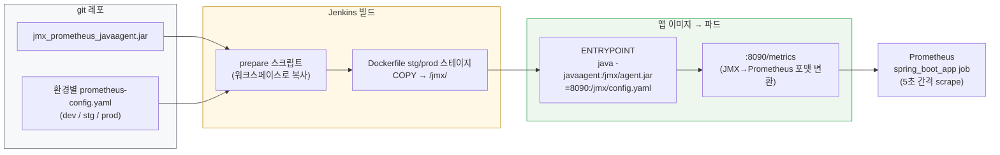

> 1편에서 Prometheus가 앱 파드의 `:8090/metrics`를 5초마다 긁고 있다는 것까지 확인했다. 그런데 클러스터를 아무리 뒤져도 그 8090 포트에서 메트릭을 만들어내는 무언가가 보이지 않았다. 이번 편은 그 범인 — 클러스터가 아니라 **CI 파이프라인과 Dockerfile 속에** 숨어 있던 JMX Exporter를 추적한 기록이다. 그리고 솔직히 말하면, 이 편은 내가 바닥부터 배워야 했던 영역의 학습기이기도 하다.

> **이 편의 기준 버전** — prometheus/jmx_exporter — javaagent **1.1.0** · 노출 포트 8090 · 빌드타임 이미지 주입(Jenkins → Dockerfile)

---

## 클러스터에 없는 exporter

미들웨어 exporter들(4편에서 다룬다)은 전부 클러스터에 Deployment로 떠 있어서 `kubectl get pods`로 바로 보였다. 그런데 JVM 메트릭은 달랐다. 앱 파드는 분명히 `:8090/metrics`로 JVM 힙, GC, 스레드 메트릭을 뱉고 있는데, 그걸 담당하는 별도 파드도, 사이드카 컨테이너도 없었다. 앱 컨테이너 하나뿐이었다.

단서는 엉뚱한 곳에서 나왔다. 모니터링 레포를 뒤지다가 이런 경로를 발견한 것이다.

```
solution/apm/prometheus/
├── jmx_prometheus_javaagent-1.1.0.jar     ← jar 파일이 왜 git에?
├── dev/prometheus-config.yaml
├── stg/prometheus-config.yaml
└── prod/prometheus-config.yaml
```

헬름 차트도 매니페스트도 아닌, **jar 바이너리와 환경별 yaml 설정 파일**이 레포에 커밋되어 있었다. jar의 정체는 prometheus/jmx_exporter 프로젝트의 javaagent 1.1.0 릴리스. 그렇다면 이 jar와 설정은 어디서 소비되는가 — 그 답이 이 편의 첫 번째 이야기다.

## 주입 경로 추적: Jenkins → Dockerfile → JVM

레포 전체에서 이 경로를 참조하는 곳을 찾아 나섰다. 첫 번째 소비자는 `prepare/conf.sh`라는 셸 스크립트였다.

```bash
#!/bin/bash
mkdir -p <젠킨스 워크스페이스>/utils/prom/conf/
cp -r <레포>/solution/apm/prometheus/* <젠킨스 워크스페이스>/utils/prom/conf/
```

Jenkins가 빌드 시 레포를 클론한 뒤, 이 스크립트로 jar와 설정을 빌드 워크스페이스로 복사한다. (나중에 신규 Jenkins 이전에 맞춰 경로를 인자로 받는 `conf-n.sh`가 추가된 것까지 확인했다 — CI 환경의 세대교체 흔적도 이렇게 파일명에 남는다.)

두 번째 소비자는 애플리케이션의 **Dockerfile**이었다. stg/prod 스테이지에 이런 블록이 있다.

```dockerfile
FROM base AS prod
COPY .../utils/prom/jmx_prometheus_javaagent-1.1.0.jar /jmx/
COPY .../utils/prom/conf/${BUILD_ENV}/prometheus-config.yaml /jmx/
...
ENV JMX_OPTS="-javaagent:/jmx/jmx_prometheus_javaagent-1.1.0.jar=8090:/jmx/prometheus-config.yaml"
ENV JAVA_OPTS="$JVM_TUNE_OPTS $JMX_OPTS"
ENTRYPOINT ["sh", "-c", "java $JAVA_OPTS ... -jar /app.jar"]
```

퍼즐이 맞춰졌다. 전체 경로는 이렇다.

```
git 레포 (jar + 환경별 규칙 yaml)
   → Jenkins prepare 스크립트 (워크스페이스로 복사)
      → Dockerfile COPY (이미지 /jmx/ 에 내장)
         → java -javaagent:...=8090:...yaml (JVM과 함께 기동)
            → :8090/metrics 노출
               → Prometheus spring_boot_app job이 5초마다 수집 (1편)
```

그림으로 정리하면 이 경로다.



이 그림에서 기억할 것은 색의 경계다. **규칙(git)을 고치는 것과 메트릭(:8090)이 바뀌는 것 사이에는 빌드와 배포라는 두 개의 관문이 있다.**

**exporter가 클러스터에 없었던 이유: 앱 이미지 안에, 앱 프로세스 안에 있었기 때문이다.** javaagent 방식은 별도 프로세스나 사이드카 없이, java 실행 옵션 한 줄로 JVM 내부에 계측기를 심는다. 앱 코드는 한 줄도 건드리지 않는다.

`-javaagent:` 뒤의 문법도 처음엔 낯설었는데, 쪼개면 단순하다: `jar경로=포트:설정파일경로`. "이 jar를 플러그인으로 붙이고, 변환 결과를 8090 포트로 열고, 무엇을 어떻게 변환할지는 이 yaml을 봐라."

여담으로, ENTRYPOINT에는 javaagent가 하나 더 있었다. 상용 APM 에이전트다. 즉 이 JVM은 **상용 APM과 자체 Prometheus 스택, 두 계측기가 동시에** 붙어 돌아가고 있었다. 오픈소스 스택이 상용 APM을 보완/대체하는 과도기의 전형적인 모습이다.

## 고백: MBean이 뭔지 몰랐다

주입 경로는 풀었지만, 정작 그 설정 파일(prometheus-config.yaml)을 열었을 때 나는 한 줄도 읽지 못했다.

```yaml
rules:
  - pattern: 'java.lang<type=Memory><HeapMemoryUsage>(\w+)'
    name: jvm_memory_heap_$1_bytes
    type: GAUGE
```

당시 기록에는 이렇게 남아 있다. **"미안 하나도 이해가 안 된다.. MBean은 뭐고, JMX는 뭐고 하나하나 전부 모르겠어."**

Java 백엔드 출신이 아닌 DevOps에게 JMX는 남의 동네 용어였다. 그래서 이 규칙 파일 하나를 읽기 위해 바닥부터 쌓아야 했다. 그때 정리한 최소한의 지도를 옮겨둔다. 나 같은 비-Java 출신 인프라 엔지니어에게 필요한 건 딱 이 네 층이었다.

1. **JVM은 실행 중 내부 상태를 노출한다** — 힙 사용량, GC 횟수, 스레드 수. 문제는 노출 방식이다.
2. **JMX** — 그 노출 창구. Java가 기본 제공하는 관리 프로토콜인데, **Java 진영 전용**이라 Prometheus가 직접 읽을 수 없다. (jconsole 같은 Java 도구로 접속하면 내부가 보인다 — 실제로 접속해보는 것이 이해에 가장 빨랐다.)
3. **MBean** — JMX 안에서 정보가 담기는 단위. `java.lang:type=Memory`라는 MBean 안에 `HeapMemoryUsage`라는 속성이 있고 그 안에 used/max/committed 값이 있는 식의, 계층적 이름을 가진 정보 묶음.
4. **jmx_exporter의 역할** — MBean의 계층적 데이터를 읽어 Prometheus가 이해하는 평평한 텍스트(`이름{라벨} 값`)로 **변환**해 HTTP로 노출한다. 그 변환 규칙이 바로 저 yaml이다.

이 지도가 생기고 나서야 규칙 한 줄이 읽혔다. `pattern`은 MBean 경로를 매칭하는 정규식이고, `(\w+)`는 캡처 — HeapMemoryUsage 아래의 used/max/committed/init 각각이 여기 잡힌다. `name`의 `$1`이 그 캡처값을 받아 `jvm_memory_heap_used_bytes` 같은 최종 메트릭 이름이 된다. `type`은 GAUGE(오르내리는 현재값)냐 COUNTER(단조 증가 누적값)냐의 의미 선언이다.

역추적 프로젝트의 부수입이 이런 것이다. "이 커밋을 이해해야 한다"는 구체적 필요가 학습의 진입점과 범위를 강제로 정해준다. JMX를 교과서 순서로 공부했다면 몇 주가 걸렸을 것을, "이 규칙 파일을 읽는다"는 목표 하나로 압축할 수 있었다.

## 규칙 파일의 3단계 진화

읽는 법을 익히고 나니, 이 파일의 커밋 히스토리가 하나의 성장 서사로 보이기 시작했다. 수십 차례의 개정을 관통하는 흐름은 세 단계였다.

**1단계 — 범용 템플릿기.** 초기 버전은 어디서 본 듯한 표준 구성이다. 힙/논힙 메모리, GC, 스레드, 클래스로딩, 여기에 Spring/Tomcat 패턴까지. 인터넷의 예제 규칙들과 골격이 유사했다. 일단 돌아가는 기본값에서 출발한 시기.

**2단계 — 전량 수집기.** 어느 커밋에서 파일이 갑자기 이렇게 줄어든다.

```yaml
lowercaseOutputName: true
lowercaseOutputLabelNames: true
whitelistObjectNames: ["*:*"]     # 모든 MBean을
rules:
  - pattern: ".*"                 # 전부 다 내보내라
```

모든 규칙을 지우고 "일단 다 뱉어"로 바꾼 것이다. 처음엔 퇴보처럼 보였는데, 뒤 커밋들과 겹쳐 보니 의도가 읽혔다. **이 JVM이 실제로 어떤 MBean을 노출하는지 전수 조사하는 탐색 단계**다. 정제된 규칙을 쓰려면 먼저 원재료 목록을 알아야 한다. `/metrics`에 쏟아지는 전체 출력을 보고, 그중 필요한 것을 고르는 순서.

**3단계 — 선별 + 식별 라벨.** 최종 방향의 규칙은 이렇게 생겼다.

```yaml
whitelistObjectNames: [
  "java.lang:type=Memory", "java.lang:type=MemoryPool,*",
  "java.lang:type=GarbageCollector,*", "java.lang:type=Threading",
  "java.lang:type=Runtime", "java.lang:type=OperatingSystem", ...
]
rules:
  - pattern: 'java.lang<type=Memory><HeapMemoryUsage>(\w+)'
    name: java_lang_Memory_HeapMemoryUsage_$1
    type: GAUGE
    labels:
      area: heap
      namespace: "${NAMESPACE:unknown}"      # ← 환경변수 치환
      service: "${SERVICE_NAME:unknown}"
      pod: "${POD_NAME:unknown}"
```

두 가지가 핵심이다. 첫째, whitelist를 필요한 MBean 도메인으로 좁혔다 — 2단계 전수조사의 결과물이다. 둘째, **모든 규칙에 namespace/service/pod 식별 라벨을 환경변수 치환으로 박았다.** 이 `${NAMESPACE}`가 어디서 오는지 추적해보니, 앱 Deployment의 env였다.

```yaml
# Deployment 쪽
env:
  - name: NAMESPACE
    valueFrom: { fieldRef: { fieldPath: metadata.namespace } }
  - name: POD_NAME
    valueFrom: { fieldRef: { fieldPath: metadata.name } }
  - name: SERVICE_NAME
    value: <서비스명>
```

K8s의 Downward API(fieldRef)로 파드 자신의 메타데이터를 환경변수로 주입하고 → JVM 안의 exporter가 그 환경변수를 라벨로 치환한다. **매니페스트와 이미지 속 설정 파일이 환경변수를 매개로 손을 잡는** 구조인데, 이 연결은 어느 한쪽 파일만 봐서는 절대 보이지 않는다. 역추적에서 "레포 전체를 가로질러 읽어야만 보이는 연결"의 대표 사례로 기록해뒀다.

그리고 2편의 복선이 여기서 회수된다. Mimir의 `max_label_names_per_series`를 30에서 100으로 올린 커밋 — 규칙마다 라벨을 겹겹이 붙이는 이 설계가 그 원인 후보였다. 서로 다른 컴포넌트의 커밋이 맞물리며 추론이 단단해지는 순간이다.

## 함정 목록: 이 영역에서 조심해야 할 것들

3단계 사이사이의 자잘한 커밋들은 대부분 함정을 밟고 고친 기록이었다. 다음 담당자를 위해 목록화했다.

**네이밍 체계가 하나가 아니다.** 최종 규칙 파일에는 자체 체계(`java_lang_Memory_HeapMemoryUsage_used`)와 표준 대시보드 호환 체계(`jvm_memory_used_bytes`)가 **혼재**한다. 같은 값이 다른 이름으로 두 번 나오기도 하고, 이름 충돌을 피하려고 `jvm_memory_committed_bytes_heap`처럼 접미사를 붙여 개명한 흔적, NonHeap 계열 규칙을 통째로 주석 처리한 흔적도 있다. **대시보드 쿼리를 쓰기 전에 반드시 현행 규칙 파일에서 실제 이름을 확인하고 시작해야 한다.** 이 영역 최대의 함정이다.

**오타는 조용히 데이터를 삭제한다.** BufferPool 규칙의 MBean 도메인이 `java.lang`으로 잘못 적혀 있다가 `java.nio`로 고쳐진 커밋이 있다. 정규식이 매칭에 실패하면 에러가 아니라 **그냥 해당 메트릭이 없는 상태**가 된다. "메트릭이 안 보인다"의 원인이 수집도 저장도 아닌, 변환 규칙의 오타일 수 있다.

**그리고 가장 큰 함정 — 반영 경로.** 이 편의 제목이기도 하다. 규칙 파일은 이미지에 굽힌다. 즉:

> **규칙을 고쳐도, 앱을 재빌드·재배포하기 전까지는 아무 일도 일어나지 않는다.**

helm upgrade로 분 단위 반영되는 다른 모든 모니터링 설정과 달리, JMX 규칙만은 CI 파이프라인과 배포 주기를 탄다. 여기서 실전 진단 수칙 하나가 나온다. "특정 JVM 메트릭이 안 보인다"는 문제가 생기면 **세 개의 실물을 대조**해야 한다:

1. git 레포의 최신 규칙 파일 (의도)
2. 배포된 이미지 안의 `/jmx/prometheus-config.yaml` (실제 굽힌 것)
3. 파드에서 `curl localhost:8090/metrics`의 실출력 (실제 나오는 것)

배포 시점에 따라 셋이 전부 다를 수 있다. 레포만 보고 "규칙이 있는데 왜 안 나오지"라고 고민하는 것은, 아직 빌드되지 않은 미래를 상대로 디버깅하는 일이다.

## 3편 정리

- `:8090/metrics`의 정체는 앱 이미지에 javaagent로 내장된 jmx_exporter였다. 주입 경로: **레포 → Jenkins prepare 스크립트 → Dockerfile COPY → `-javaagent` 기동.**
- JMX/MBean을 몰라도 괜찮다. 필요한 지도는 네 층이면 된다: JVM 내부 상태 → JMX(Java 전용 창구) → MBean(정보 단위) → jmx_exporter(Prometheus 포맷 변환기).
- 규칙 파일은 세 단계로 진화했다: 범용 템플릿 → `*:*` 전량 수집(전수조사) → whitelist 선별 + Downward API 연동 식별 라벨.
- 함정 셋: 혼재하는 네이밍 체계, 조용히 실패하는 정규식 오타, 그리고 **빌드타임 반영 경로**. 진단은 항상 레포·이미지·실출력 3자 대조로.

다음 편은 클러스터 안에 정직하게 떠 있는 exporter들 차례다. 다만 이들이 감시하는 대상 — MySQL, Redis, Kafka — 은 클러스터 밖, 클라우드 관리형 서비스에 있다. 에이전트를 설치할 수 없는 대상을 감시하는 법, 4편에서 다룬다.

---

## 부록 A — 실무 체크포인트

- **3자 대조 커맨드 세트** — "특정 JVM 메트릭이 안 보인다"의 표준 진단:
  ```bash
  # ① 실출력: 지금 파드가 실제로 뱉는 것
  kubectl exec <앱파드> -- curl -s localhost:8090/metrics | grep -i <메트릭키워드>
  # ② 굽힌 것: 배포된 이미지 안의 규칙 파일
  kubectl exec <앱파드> -- cat /jmx/prometheus-config.yaml
  # ③ 의도: 레포의 최신 규칙 (①②와 다를 수 있음 — 배포 시점 차이)
  ```
- **①에 출력 자체가 없으면** — javaagent 미기동. 파드의 java 프로세스 인자에 `-javaagent:...=8090:...`이 있는지 확인 (`kubectl exec <파드> -- ps aux | grep javaagent`).
- **①은 나오는데 Prometheus에 없으면** — 수집 쪽(1편) 문제. Targets에서 `spring_boot_app` job 확인.
- **특정 메트릭만 없으면** — 규칙 파일의 whitelistObjectNames에 해당 MBean 도메인이 있는지, pattern 정규식 오타(도메인·언더스코어) 여부. 정규식은 틀려도 에러가 없다.
- **규칙 수정 후** — 반영은 재빌드+재배포 이후다. 이미지 태그가 바뀌었는지부터 확인하고 진단할 것.

## 부록 B — 참고 자료

- prometheus/jmx_exporter (설정 문법 포함): https://github.com/prometheus/jmx_exporter
- jmx_exporter 예제 설정 모음: https://github.com/prometheus/jmx_exporter/tree/main/examples
- Kubernetes Downward API(fieldRef → env): https://kubernetes.io/docs/concepts/workloads/pods/downward-api/
- Java instrumentation(-javaagent) 개요: https://docs.oracle.com/javase/8/docs/api/java/lang/instrument/package-summary.html
- Prometheus 메트릭 타입(GAUGE/COUNTER): https://prometheus.io/docs/concepts/metric_types/

---

*이 시리즈의 모든 내용은 특정 조직·시스템을 식별할 수 없도록 도메인, 명칭, 일부 수치를 일반화/변경했습니다.*
