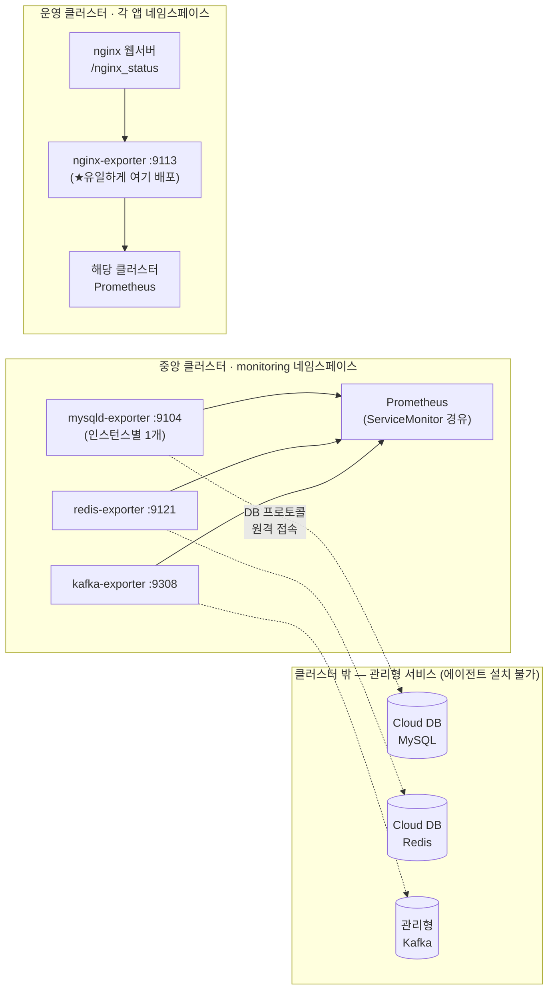

> JVM 메트릭(3편)이 이미지 속에 숨어 있었다면, 이번에 다룰 exporter들은 클러스터에 정직하게 떠 있다. 문제는 감시 대상이 클러스터 밖에 있다는 것이다. MySQL도, Redis도, Kafka도 전부 클라우드 관리형 서비스 — SSH도 안 되고 에이전트 설치도 불가능한 블랙박스들이다. 이 편은 그 블랙박스 4종(MySQL/Kafka/Redis/Nginx)의 감시 체계를 역추적하며 발견한 하나의 반복 패턴과, 그 패턴의 함정들에 대한 기록이다.

> **이 편의 기준 버전** — mysqld-exporter(:9104) · kafka-exporter(:9308) · redis-exporter(:9121) — 세 이미지는 `:latest` 태그(본문의 개선 항목) · nginx-prometheus-exporter **0.10.0**(:9113)

---

## 전제: 감시 대상이 클러스터 밖에 있다

이 시스템의 데이터 계층은 전부 클라우드 벤더의 관리형 서비스다. 관리형 MySQL(Cloud DB), 관리형 Redis, 관리형 Kafka(스트리밍 서비스). 관리형의 대가는 접근 제한이다 — VM에 들어갈 수 없으니 node-exporter 같은 에이전트를 심을 수 없고, 벤더 콘솔이 주는 지표는 Prometheus 생태계 밖에 있다.

이 제약에서 나오는 표준 해법이 **원격 수집(remote scraping) 패턴**이다.



exporter를 **클러스터 안에** Deployment로 띄우고, exporter가 대상 서비스에 **클라이언트로 원격 접속**해 상태를 조회한 뒤, 그 결과를 Prometheus 포맷으로 변환해 노출한다. exporter는 감시 대상 옆이 아니라 감시자 옆에 산다. 3편의 javaagent(대상 안에 심는 방식)와 정확히 반대 방향의 설계인데, 둘 다 "대상을 수정할 수 없다"는 같은 제약에서 나온 답이라는 점이 흥미롭다.

역추적으로 확인한 배치는 이랬다. MySQL/Redis/Kafka exporter는 중앙 관리 클러스터의 monitoring 네임스페이스에 모여 있고 — 대상이 어차피 클러스터 밖이니 어디서 접속하든 같고, 한 곳에 모으면 관리가 편하다 — Nginx exporter만 예외적으로 다른 곳에 있었다(이유는 뒤에서).

## 원형(原型)의 발견: mysqld-exporter

커밋 시간순으로 가장 먼저 등장하는 것은 mysqld-exporter다. 그리고 이 첫 매니페스트가 이후 모든 exporter의 원형이 된다.

파일 하나에 리소스 4종 세트가 들어 있는 구조다.

```yaml
# ① Service — 수집 창구
kind: Service
metadata:
  labels: { app: mysqld-exporter, release: prometheus }
spec:
  ports: [{ name: http-metrics, port: 9104 }]   # 포트 "이름"이 핵심
---
# ② Deployment — exporter 본체
kind: Deployment
spec:
  template:
    spec:
      containers:
        - image: prom/mysqld-exporter:latest
          args:
            - --config.my-cnf=/etc/mysql/my.cnf
            - --collect.global_status
            - --collect.global_variables
            - --collect.info_schema.tables
            - --collect.info_schema.innodb_metrics
---
# ③ ConfigMap — 원격 DB 접속 정보 (my.cnf)
data:
  my.cnf: |
    [client]
    host=<관리형 DB 엔드포인트>
    port=3306
    user=... / password=...
---
# ④ ServiceMonitor — Prometheus에게 보내는 수집 선언
kind: ServiceMonitor
metadata:
  labels: { release: prometheus }        # ★ 이 라벨이 없으면 수집되지 않는다
spec:
  endpoints:
    - port: http-metrics                 # ★ Service의 포트 "이름"과 일치해야 한다
      interval: 30s
```

이 4종 세트에서 두 개의 연결 고리가 생명선이다. 첫째, **ServiceMonitor의 `release: prometheus` 라벨** — 1편에서 발견했던 `serviceMonitorSelectorNilUsesHelmValues: false` 스위치가 바로 이 라벨을 보고 커스텀 ServiceMonitor를 인식한다. 1편의 복선이 여기서 회수된다. 둘째, **포트 이름 매칭** — ServiceMonitor는 포트 번호가 아니라 이름(`http-metrics`)으로 Service를 참조한다. 이름이 어긋나면 에러 없이 조용히 수집만 안 된다.

**왜 헬름 차트를 안 썼을까.** mysqld-exporter에는 멀쩡한 커뮤니티 헬름 차트가 있다. 기록을 보면 이전 담당자는 차트를 검토했고, 채택하지 않았다. 이유가 실용적이다 — 커뮤니티 차트의 포트 이름과 라벨 관례(예: `release: prometheus-operator`)가 이 환경의 관례(`release: prometheus`)와 달라서, 차트를 비틀어 맞추는 비용이 직접 쓰는 비용보다 컸던 것이다. 리소스 4개짜리 구성이면 합리적인 판단이라고 봤다. 다만 이 판단이 나중에 청구서가 되어 돌아오는데, 그건 이 편의 마지막에서.

**collector 플래그의 가감.** 이후 커밋에서 `--collect.info_schema.processlist`(실행 중 세션)와 `--collect.info_schema.threads`가 추가된다. 반대로 statement(쿼리문) 단위의 상세 수집은 **의도적으로 제외**된 흔적이 있다. SQL 텍스트가 라벨로 들어가는 순간 라벨 조합 수 — 카디널리티 — 가 폭발하고, 시계열 수가 곧 저장소 부하인 Prometheus/Mimir 체계에서 이는 자해에 가깝다. "슬로우 쿼리 분석은 slow query log 등 전용 도구의 영역으로 남긴다"는 선긋기로 읽었고, 동의하는 판단이라 파악 문서에도 그대로 계승해 적었다. **메트릭 시스템은 집계의 도구이지, 개별 이벤트 조회의 도구가 아니다.**

## 라벨링: 대시보드와의 보이지 않는 계약

mysqld-exporter 파악에서 가장 중요한 커밋은 ServiceMonitor에 이 블록이 추가된 것이었다.

```yaml
endpoints:
  - port: http-metrics
    interval: 30s
    metricRelabelings:                    # 이 exporter의 모든 메트릭에 고정 라벨 부착
      - { targetLabel: service_name, replacement: <서비스 식별자> }
      - { targetLabel: db_name,      replacement: <DB 표시명> }
      - { targetLabel: environment,  replacement: prod }
```

`metricRelabelings`는 수집되는 모든 시계열에 라벨을 추가/수정하는 규칙이다. DB 인스턴스가 여러 개인 환경에서 "이 커넥션 수치는 어느 DB 것인가"를 구분하는 수단인데 — 여기서 중요한 건 이 라벨 값들이 혼자 존재하지 않는다는 점이다.

**이 값들은 Grafana 대시보드의 변수·필터와 짝을 이루는 계약이다.** 대시보드 쿼리가 `{service=~"$database"}`로 필터링한다면, exporter 쪽 라벨과 대시보드 쪽 변수 값이 정확히 맞아야 화면에 데이터가 나온다. 역추적 중 "대시보드에 특정 DB만 안 보인다"류 문제의 원인이 거의 항상 이 계약의 어긋남이었다 — exporter는 `service_name`으로 붙이는데 대시보드는 `service`를 찾는다든가. 이 어긋남의 전말은 대시보드 이식기인 5편에서 본격적으로 다룬다. 여기서는 수칙만 남긴다:

> **exporter의 relabel 값과 대시보드의 변수/필터는 한 몸이다. 한쪽을 바꾸면 반드시 다른 쪽을 함께 봐야 한다.**

## 변주 1: kafka-exporter — 목록은 갱신을 요구한다

원형이 생기자 다음 exporter들은 빠르게 붙는다. kafka-exporter의 매니페스트는 mysqld의 4종 세트에서 이름과 args만 바뀐, 명백한 복제본이었다(접속 정보가 args로 직접 들어가 ConfigMap이 없는 정도의 차이). diff가 그 계보를 그대로 보여준다.

Kafka 특유의 디테일 몇 가지:

```yaml
args:
  - --kafka.server=<브로커1>:9092
  - --kafka.server=<브로커2>:9092
  #  ... 브로커 수만큼 나열 ...
  - --kafka.version=3.7.1
  - --use.consumelag.zookeeper=false
  - --topic.filter=.*  /  --group.filter=.*
  - --metrics.enable-consumer-group / -topic / -partition / -broker
```

- **브로커 목록의 하드코딩.** 커밋 히스토리에 브로커 주소가 무더기로 추가되는 시점이 있다 — 관리형 Kafka의 브로커 증설이 그대로 args diff로 남은 것이다. 뒤집어 말하면, **브로커가 늘어날 때 이 목록을 갱신하는 것은 사람의 일**이라는 뜻이다. 이런 "운영 이벤트에 연동된 수동 갱신 지점"은 파악 문서에 체크리스트로 격상시켜 적었다. 문서가 없으면 다음 증설 때 누군가는 반쪽짜리 메트릭을 보며 헤맬 것이다.
- `--use.consumelag.zookeeper=false` — consumer lag(컨슈머가 얼마나 밀렸는지, Kafka 모니터링의 사실상 제1지표)를 구식 ZooKeeper 경유가 아니라 Kafka 자체에서 읽는 현대적 설정.
- 필터가 전부 `.*`(전체 토픽/그룹)에 상세 메트릭 전부 활성 — 넉넉하게 열어둔 구성이다. 다만 `--log.level=debug`가 상시로 박혀 있는 건 트러블슈팅기의 잔재로 보였고, 개선 목록에 올렸다.

## 변주 2: redis-exporter — 한 걸음의 진전과 넉넉함의 양면

redis-exporter도 같은 템플릿의 변주인데, 두 가지가 눈에 띄었다.

**첫째, 4종 중 유일하게 Secret을 쓴다.** 비밀번호를 Secret → 환경변수 → 접속 URL 조합으로 주입한다(`--redis.addr=redis://<user>:$(REDIS_PASSWORD)@<호스트>:6379`). ConfigMap에 접속 정보를 평문으로 두는 mysqld 방식보다 반 걸음 나아간 형태다. 반 걸음이라고 쓴 이유는, 이 구성에도 시크릿 관리 관점의 개선 여지가 남아 있었고(상세는 비공개, 조치 백로그로 이관) 근본적으로는 외부 시크릿 관리 체계로 가야 할 영역이기 때문이다. 그래도 같은 레포 안에서 방식이 진화하는 궤적이 보인다는 것 자체가 역추적의 수확이었다 — **나중에 만든 것일수록 조금씩 낫다. 그 '조금씩'의 방향이 곧 개선 로드맵이다.**

**둘째, 수집 옵션이 최대치로 열려 있다.** `--check-keys='*'`(전체 키 패턴 모니터링), `--include-system-metrics`, `--include-config-metrics`, `--export-client-list`(접속 클라이언트 목록까지)... 얻는 것이 많은 만큼, 키가 매우 많은 인스턴스에서는 `check-keys='*'` 스캔이 exporter와 Redis 양쪽에 부하가 될 수 있는 구성이다. "Redis가 이유 없이 바쁘다"는 문제가 생기면 이 옵션 축소를 1순위 용의자로 보라고 파악 문서에 적어뒀다. 아직 문제가 된 적 없는 설정이라도, **문제가 됐을 때의 1번 용의자를 미리 지목해두는 것**이 이런 문서의 역할이다.

## 변주 3: nginx-exporter — 유일하게 규칙을 깨는 녀석

마지막 nginx-exporter는 패턴을 두 군데서 깬다. 그리고 규칙을 깨는 지점이 늘 그렇듯, 함정도 여기 몰려 있다.

**배치가 다르다.** 나머지 셋은 monitoring 네임스페이스에 모여 있는데, nginx-exporter만 **각 서비스의 애플리케이션 네임스페이스**에 배포된다. 이유는 대상의 위치다 — 감시 대상인 nginx는 관리형 서비스가 아니라 클러스터 안, 각 서비스 네임스페이스의 웹서버 파드다. exporter는 그 nginx의 `stub_status` 페이지(`/nginx_status`)를 클러스터 내부 Service DNS로 읽는다.

```yaml
# 서비스 네임스페이스 X에 배포
image: nginx/nginx-prometheus-exporter:0.10.0     # 4종 중 유일하게 버전 고정
args:
  - -nginx.scrape-uri=http://<웹서버 서비스>.<네임스페이스X>.svc.cluster.local/nginx_status
```

그런데 ServiceMonitor는 관례대로 monitoring 네임스페이스에 있다. 둘을 잇는 것이 `namespaceSelector`다.

```yaml
# ServiceMonitor는 monitoring에, 대상은 저쪽 네임스페이스에
spec:
  namespaceSelector:
    matchNames: [ <네임스페이스X> ]     # ★ 신규 서비스 추가 시 여기도 추가해야 한다
```

**exporter와 그 ServiceMonitor의 네임스페이스가 다른 유일한 컴포넌트** — 신규 서비스를 붙일 때 exporter만 배포하고 namespaceSelector 갱신을 빼먹으면, 모든 게 떠 있는데 수집만 안 되는 상태가 된다. 에러도 없다. 파악 문서의 신규 추가 체크리스트에 별표를 쳐서 넣은 이유다.

**수집 선언이 이중이다.** 이 exporter의 Service에는 `prometheus.io/scrape` 계열 어노테이션이 붙어 있는데, ServiceMonitor도 존재한다. 어노테이션 기반 수집 설정이 살아 있는 환경이라면 같은 대상을 두 번 긁는 이중 수집이 가능한 구성이다. 역추적만으로는 실제 이중 수집 여부를 확정하지 못해, "확인 후 한쪽으로 통일"을 개선 항목으로 남겼다. 두 세대의 수집 방식(어노테이션 시대와 ServiceMonitor 시대)이 한 매니페스트에 공존하는, 일종의 지질학적 단면이다.

마지막으로, stub_status의 한계도 적어둬야 공정하다. 이것이 주는 정보는 연결 수/요청 수 수준의 기본 지표뿐이다. 상태코드별, URL별 상세는 메트릭이 아니라 로그의 영역이고 — 그 로그 파이프라인(Loki)이 이 시스템의 미답지로 남아 있다는 이야기는 에필로그에서.

## 패턴의 청구서: 복붙 확장의 비용

네 exporter를 관통하는 구조를 한 장으로 접으면 이렇다.

| | 대상 위치 | 배포 위치 | 접속 정보 | 포트 |
|---|---|---|---|---|
| mysqld-exporter | 클러스터 밖 (관리형) | monitoring ns | ConfigMap (my.cnf) | 9104 |
| kafka-exporter | 클러스터 밖 (관리형) | monitoring ns | args 하드코딩 | 9308 |
| redis-exporter | 클러스터 밖 (관리형) | monitoring ns | Secret + env | 9121 |
| nginx-exporter | 클러스터 안 (앱 ns) | **각 앱 ns** | args (내부 DNS) | 9113 |

그리고 이 체계의 확장 방식은 처음부터 끝까지 **복붙**이었다. DB 인스턴스가 하나 늘 때마다: 기존 yaml 복사 → 리소스 이름 네 군데 치환 → 접속 정보 치환 → relabel 값 치환 → apply → **그리고 Grafana 대시보드의 변수 매핑에도 수동 추가**(5편). 커밋 히스토리에는 이 복붙의 흔적이 인스턴스 수만큼 쌓여 있었다.

공정하게 평가하면, 복붙은 이 시스템이 빠르게 자랄 수 있었던 이유이기도 하다. 원형 하나가 잘 잡히니 변주가 쉬웠다. 하지만 인스턴스가 계속 늘어나는 환경에서 이 방식은 치환 누락 한 번이 곧 장애 아닌 장애("떠 있는데 안 보임")로 이어지는 구조다. 파악을 마친 시점의 결론은 두 단계였다: 단기적으로는 **신규 추가 체크리스트**(치환 지점 전수 목록)로 사람의 실수를 막고, 중기적으로는 Helm 템플릿/Kustomize로 파라미터화한다. 자동화는 좋은 것이라서가 아니라, **치환 지점을 사람이 기억해야 하는 상태가 위험**해서 하는 것이다.

## 4편 정리

- 관리형 서비스 시대의 감시는 원격 수집 패턴이다: **exporter는 감시 대상이 아니라 감시자 옆에 산다.** 3편의 javaagent와는 같은 제약("대상을 수정할 수 없다")에서 나온 반대 방향의 답.
- 원형은 mysqld-exporter의 4종 세트(Service+Deployment+접속정보+ServiceMonitor)이고, 생명선은 `release: prometheus` 라벨(1편 스위치와의 계약)과 포트 이름 매칭이다.
- exporter의 relabel 값은 대시보드 변수와 한 몸이다. 한쪽만 바꾸면 화면에서 데이터가 사라진다.
- 변주마다 교훈이 하나씩: kafka는 브로커 목록이라는 수동 갱신 지점, redis는 시크릿 처리의 반 걸음 진화와 넉넉한 옵션의 양면, nginx는 네임스페이스가 어긋난 유일한 예외와 이중 수집 가능성.
- 복붙 확장은 빠르게 크는 방법이자 조용히 무너지는 방법이다. 답은 체크리스트, 그 다음은 파라미터화.

다음 편은 이 모든 메트릭이 최종적으로 도착하는 화면, Grafana다. 공개 대시보드를 이식하다가 만난 `__inputs`의 배신, uid를 둘러싼 호환성 곡예, 그리고 시도됐다가 폐기된 git-sync의 화석까지.

---

## 부록 A — 실무 체크포인트

- **exporter별 생존 신호 1개씩** — 원격 접속형 exporter는 파드 Running과 대상 접속 성공이 별개다. 접속 성공의 지표:
  ```bash
  curl -s <exporter>:9104/metrics | grep '^mysql_up'    # 1이면 DB 접속 정상
  curl -s <exporter>:9121/metrics | grep '^redis_up'
  curl -s <exporter>:9308/metrics | grep kafka_brokers   # 브로커 수가 실제와 일치하는지
  ```
- **떠 있는데 수집이 안 될 때** — 두 계약을 확인: ServiceMonitor의 `release: prometheus` 라벨, 그리고 Service 포트 **이름**(http-metrics)과 SM endpoints.port의 일치.
- **대시보드에 특정 인스턴스만 안 보일 때** — 3점 대조: SM의 metricRelabelings 값 ↔ 대시보드 `$database` 변수 매핑 ↔ 대시보드 쿼리의 라벨명(service vs service_name).
- **신규 인스턴스 추가 체크리스트** — yaml 복사 후 치환 지점: 리소스명 4곳 / 접속 정보 / relabel 값 / (nginx) SM namespaceSelector / **Grafana 변수 매핑**. 마지막 항목이 최다 누락 지점.
- **Kafka 브로커 증설 시** — `--kafka.server` 목록 갱신은 사람의 일이다. 증설 이벤트에 이 파일을 연동해둘 것.

## 부록 B — 참고 자료

- mysqld_exporter: https://github.com/prometheus/mysqld_exporter
- kafka_exporter (danielqsj): https://github.com/danielqsj/kafka_exporter
- redis_exporter (oliver006): https://github.com/oliver006/redis_exporter
- nginx-prometheus-exporter: https://github.com/nginx/nginx-prometheus-exporter
- nginx stub_status 모듈: https://nginx.org/en/docs/http/ngx_http_stub_status_module.html
- ServiceMonitor 스펙(namespaceSelector 포함): https://prometheus-operator.dev/docs/api-reference/api/#monitoring.coreos.com/v1.ServiceMonitor

---

*이 시리즈의 모든 내용은 특정 조직·시스템을 식별할 수 없도록 도메인, 명칭, 일부 수치를 일반화/변경했습니다.*
