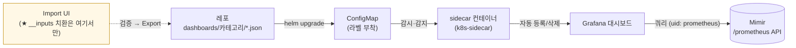

> 수집(1편)하고, 저장(2편)하고, 계측(3·4편)한 모든 메트릭이 최종적으로 도착하는 곳은 화면이다. 이번 편은 그 화면, Grafana의 역추적기다. 대시보드 JSON 하나가 화면이 되기까지의 경로, 시도됐다 폐기된 동기화 방식의 화석, 공개 대시보드를 이식하다 만난 `__inputs`의 배신, 그리고 datasource를 통째로 갈아끼우면서도 대시보드를 하나도 안 깨뜨린 uid 곡예까지.

> **이 편의 기준 버전** — Grafana **11.2.2** · sidecar: kiwigrid/k8s-sidecar **1.28.0** (kube-prometheus-stack 65.5.0 번들) · 커스텀 대시보드 원본: Percona PMM #7362 rev5, #13105

---

## Grafana는 아무것도 저장하지 않는다

Grafana 역추적의 출발점은 이 컴포넌트의 본질을 정확히 하는 것이었다. Grafana는 데이터를 저장하지 않는다. 화면을 열 때마다 **datasource**로 등록된 백엔드에 쿼리를 날려 그 결과를 그릴 뿐이다. 그리고 무엇을 어떻게 그릴지는 **대시보드 JSON**이 정의한다.

그래서 Grafana 운영의 전부는 두 질문으로 수렴한다.

1. datasource가 올바른 백엔드를 가리키는가?
2. 대시보드 JSON은 어디서 와서 어떻게 등록되는가?

커밋 히스토리도 정확히 이 두 축을 따라 움직이고 있었다. 이 편의 전반부는 2번(대시보드의 경로), 후반부는 1번(datasource 대전환)의 이야기다.

## 대시보드 JSON이 화면이 되기까지

이 시스템에서 대시보드 파일의 여정은 세 단계다.



핵심 부품은 Grafana 파드에 함께 뜨는 **sidecar 컨테이너**다. 특정 라벨이 붙은 ConfigMap을 클러스터 전체에서 감시하다가(`searchNamespace: ALL`), 발견 즉시 그 안의 JSON을 Grafana에 대시보드로 등록하고, ConfigMap이 지워지면 대시보드도 지운다. 즉 **레포에 JSON을 커밋하고 helm upgrade하면 화면이 바뀌는**, 대시보드의 GitOps다.

폴더 배치를 정하는 설정도 이때 파악했다. `foldersFromFilesStructure: true`(파일 경로가 곧 Grafana 폴더 — `dashboards/mysql/x.json`이면 mysql 폴더로), `folderAnnotation`(ConfigMap 어노테이션으로 개별 지정), `defaultFolderName`(둘 다 없으면 가는 곳). 그리고 어느 커밋에서 폴더 체계가 default/test 같은 실험용 이름들에서 **`[운영]` 접두사가 붙은 카테고리 8종**(Alertmanager / Database / Kafka / Kubernetes ×2 / LOG Viewer / Redis / Support)으로 일괄 재편된다. 이 커밋은 이 시스템의 상태 선언으로 읽혔다 — 실험이 끝나고 운영이 시작됐다는.

## 화석 발굴 2: 폐기된 git-sync의 흔적

그런데 레포에는 위 경로와 **전혀 다른 방식의 파일들**이 함께 있었다. `charts/grafana/add-on/` 아래의 git-sync.yaml과 PV/PVC 매니페스트다. git-sync는 git 레포를 주기적으로 볼륨에 동기화해주는 사이드카인데 — 이게 현행 구성인가, 화석인가?

커밋 히스토리가 답을 줬다. 이 파일들의 변경 이력은 하나의 좌절 서사였다.

- 처음엔 대시보드 저장용 PV를 노드 로컬 경로(hostPath)로 잡았다가, 여러 파드가 공유해야 하는 요건에 맞춰 NAS 기반 스토리지클래스의 PVC로 전환하고,
- git-sync의 `--dest` 인자에 레포 내 중첩 경로를 넣었다가 실패한다 — 이 인자는 하위 경로 지정이 아니라 **단일 디렉터리 이름만 허용**하는 제약이 있어서, 동기화 결과가 의도와 다른 중첩 구조로 떨어지고,
- 그 중첩 경로를 Grafana 프로비저닝 경로와 다시 맞추는 씨름이 이어지다가,
- 어느 시점 이후, 이 파일들에 대한 커밋이 **끊긴다.** 그리고 대시보드 변경은 전부 앞서 본 "파일 → ConfigMap → sidecar" 경로에서만 일어난다.

판정: **git-sync는 시도됐고, 폐기됐다.** "레포 커밋만으로 helm 없이도 대시보드가 실시간 동기화되는" 그림을 노렸던 것으로 보이나, 도구의 제약과 경로 씨름 끝에 더 단순한 ConfigMap 방식으로 회귀한 것이다.

여기서 역추적의 일반 기법 하나를 정리할 수 있었다. **어떤 파일이 화석인지 판정하는 법: 그 파일의 마지막 커밋 이후, 같은 목적의 변경이 어디서 일어나는지를 본다.** 변경의 흐름이 다른 경로로 옮겨갔다면 그 파일은 화석이다. 그리고 화석은 발견 즉시 문서에 "폐기된 시도"로 명시해야 한다 — 그러지 않으면 다음 사람이 그걸 현행 구성으로 읽고 그 위에 뭔가를 쌓는다. 폐기의 기록은 채택의 기록만큼 중요하다.

## 본론: PMM 대시보드 이식기

이 시스템의 MySQL 대시보드들은 직접 만든 것이 아니라 **Percona PMM의 공개 대시보드**(grafana.com에 공개된 MySQL Instances Overview 등)를 가져와 커스터마이징한 것이었다. 좋은 선택이다 — PMM의 MySQL 대시보드는 업계에서 가장 잘 만들어진 축에 든다. 문제는 PMM 대시보드가 **PMM 서버 환경을 전제로 설계**되어 있다는 것. 이식은 그 전제들을 하나하나 우리 환경으로 치환하는 작업이었고, 커밋에 남은 치환 목록이 곧 "공개 대시보드 이식의 체크리스트"였다.

**치환 1 — 라벨 체계.** PMM은 에이전트가 모든 메트릭에 `instance` 라벨을 자동으로 붙이고, 대시보드는 `instance=~"$host"`로 필터링한다. 우리 환경의 mysqld-exporter는 그런 라벨을 주지 않는다 — 대신 4편에서 본 metricRelabelings의 `service` 라벨이 있다. 그래서 대시보드 전체 쿼리에서:

```promql
# 원본 (PMM 전제)
mysql_global_status_uptime{instance=~"$host"}
# 이식 후
mysql_global_status_uptime{service=~"$database"}
```

**치환 2 — 변수의 동력원.** PMM의 `$host` 변수는 서버가 관리하는 인스턴스 목록에서 자동으로 채워진다. 우리 환경엔 그런 자동 감지가 없다. 그래서 `$database` 변수는 **custom 타입으로 수동 하드코딩** — "표시명 : exporter 식별자" 쌍을 사람이 나열한 목록이다. 4편에서 예고한 대가가 이것이다. **DB 인스턴스가 추가될 때마다 exporter 배포와 별개로 이 목록에도 손으로 한 줄을 추가해야 하고, 빼먹으면 그 DB는 대시보드에서 그냥 존재하지 않는다.** 에러 없이, 조용히.

**치환 3 — 관점의 전환.** 원본은 단일 인스턴스를 깊게 보는 뷰인데, 이식본에는 전체 인스턴스를 가로로 비교하는 stat 패널들(서비스 수, 최대 uptime, 커넥션 상위 등)이 추가됐다. 여러 DB를 한 화면에서 관제해야 하는 이 환경의 요구가 반영된, 단순 이식을 넘는 개작이다. (같은 맥락에서 여러 컴포넌트 상태를 육각형 타일로 요약하는 polystat 패널 플러그인이 추가된 커밋도 있었다 — 전체 Overview 화면을 향한 포석으로 읽었다.)

**치환 4 — uid에 붙은 "2".** 이식본의 uid와 제목에는 원본과 구분되는 접미사 "2"가 붙어 있다. 원본과의 충돌 방지 — 사소해 보이지만 uid가 얼마나 무서운 식별자인지는 잠시 뒤 datasource 전환에서 드러난다.

## `__inputs`의 배신

이식 과정에서 가장 값진 발견은 실패의 기록이었다. grafana.com에서 받은 대시보드 JSON의 머리에는 이런 블록이 있다.

```json
"__inputs": [{
  "name": "DS_PROMETHEUS",
  "type": "datasource", ...
}]
```

그리고 본문의 패널들이 `${DS_PROMETHEUS}`를 참조한다. "이 대시보드를 가져갈 때, 당신 환경의 datasource를 골라서 여기 끼우세요"라는 자리표시자다. 합리적인 설계다 — **단, 이 치환은 Grafana 웹 UI의 Import 기능을 통할 때만 일어난다.**

우리의 표준 경로는 무엇이었나. 파일 → ConfigMap → sidecar. 이 경로에는 Import 단계가 없다. 자리표시자는 치환되지 않은 채 그대로 등록되고, 패널들은 존재하지 않는 datasource를 찾다가 침묵한다. **모든 게 정상으로 보이는데 모든 패널이 비어 있는** 상태 — 커밋 히스토리에는 이 함정을 밟고 빠져나온 궤적이 그대로 남아 있었다.

<!-- 📸 스크린샷 #2 자리 (권장 ★)
촬영: 로컬 Grafana > Dashboards > Import > grafana.com ID 7362 입력
프레임: datasource 선택 드롭다운("DS_PROMETHEUS" 자리표시자에 무엇을 끼울지 묻는 화면)이 핵심
캡션 제안: "__inputs 치환이 일어나는 유일한 장소 — Import UI의 datasource 선택"
이 한 장이 이 편의 핵심 함정을 시각적으로 증명한다
-->
그래서 확립된 워크플로우가 이것이다. 공개 대시보드를 들여올 때는:

1. **Import UI로 먼저** 올린다 — 이때만 `__inputs` 치환이 동작하므로, datasource를 끼우고 화면을 검증한다.
2. 검증이 끝나면 UI에서 **Export한 JSON**(치환이 끝나 datasource uid가 박힌 상태)을 받아,
3. 그 JSON을 레포의 dashboards 경로에 커밋한다 — 이제부터 파일 프로비저닝의 관리 대상.

Import UI는 검증대, 레포는 영구 저장소. 두 경로의 역할을 섞으면 — Import로만 올리고 레포에 안 남기면 Grafana 재설치 때 증발하고, 원본 JSON을 그대로 레포에 넣으면 빈 화면이 된다.

## 판정 정정의 기록: grep은 구조를 보지 못한다

정직하게 남겨야 할 실수담이 하나 있다. MySQL 상세 대시보드(InnoDB Details 계열)의 어느 수정 커밋을 분석할 때였다. 파일이 수십만 자짜리 JSON이라 눈으로 diff를 볼 수 없어, 라벨 치환이 몇 군데나 반영됐는지 grep 카운트로 판정했다 — `service_name`이 여전히 800여 곳에 남아 있으니 "이 커밋, 실질적으로 거의 안 바뀌었다"고.

틀린 판정이었다. 다시 뜯어보니 이 커밋의 실체는 **패널 스키마의 세대 교체**였다. Grafana의 구형 "Graph (old)" 패널 36개가 신형 "Time series" 패널로 전환된 것 — UI의 마이그레이션 기능을 거친, 쿼리는 그대로 두고 시각화 스키마만 통째로 바뀌는 종류의 변경이다. 문자열 빈도는 거의 안 변하지만 구조는 전부 변한 커밋. **grep은 문자열의 도구이지 구조의 도구가 아니다.** 이후 대형 JSON diff는 패널 배열을 파싱해서 type/uid 단위로 비교하는 식으로 판정 방법을 바꿨다.

이 정정 덕에 해당 대시보드의 상태도 정확히 판정할 수 있었다: 시각화 스키마 최신화는 **완료**, 라벨 치환(`service_name`→`service`)과 datasource 정리는 **미완**. "작업 중인 중간 상태"라는 딱지를 붙여, 완성으로 오인되지 않게 문서에 남겼다. 역추적의 산출물에는 이렇게 **미완 판정** 자체가 포함된다 — 무엇이 끝났고 무엇이 끝난 척하고 있는지.

## uid 곡예: datasource를 갈아끼우고도 아무것도 깨지 않기

후반부, 이 편에서 가장 감탄했던 커밋이다. Grafana의 기본 datasource가 로컬 Prometheus에서 Mimir로 전환되는 변경인데, diff 세 줄에 설계가 압축되어 있었다.

```yaml
# before                              # after
name: Prometheus                      name: Mimir
url: http://<로컬 prometheus>:9090     url: https://<mimir>/prometheus
uid: prometheus                       uid: prometheus        # ← 그대로!
```

**이름과 주소는 바꾸되, uid는 안 바꿨다.** 이유는 이 시리즈를 따라온 독자라면 이제 보일 것이다 — 모든 대시보드 JSON이 datasource를 uid로 참조한다. uid를 바꾸는 순간 기존 대시보드 전부의 참조가 끊긴다. uid를 유지하면, 대시보드들은 자기가 여전히 "prometheus"라는 datasource를 보고 있다고 믿는 채로, 실제로는 Mimir에 쿼리하게 된다. **인터페이스(uid)를 고정하고 구현(백엔드)만 교체**하는, 소프트웨어 설계의 오래된 지혜가 datasource 설정에서 그대로 재현된 것이다.

url이 `/prometheus`로 끝나는 것도 같은 맥락이다. Mimir의 Query Frontend는 Prometheus 호환 API를 그 하위 경로로 노출한다(2편). Grafana 입장에서 Mimir는 그냥 아주 큰 Prometheus다.

이 전환이 시스템 전체 서사에서 갖는 의미도 크다. 2편의 remote_write가 **쓰기 경로**를 중앙으로 돌린 것이라면, 이 커밋은 **읽기 경로**를 돌린 것 — 중앙화의 마지막 조각이다. 이로써 로컬 Prometheus는 수집·전달 전담이 되고, 조회는 전부 90일치가 쌓인 Mimir를 향한다.

(부속 발견 둘. 같은 시기 sidecar가 datasource ConfigMap을 찾는 라벨이 범용 값에서 전용 값으로 좁혀졌다 — 다른 목적의 ConfigMap이 섞여 로드되는 것을 막는 격리 조치. 그리고 파악 막바지엔 검증 목적으로 datasource를 일시적으로 로컬 Prometheus로 되돌린 정황도 있어서, "현재 클러스터의 실물 datasource가 무엇인지 확정 확인"을 인수인계 항목으로 남겼다. 커밋의 최종 상태와 클러스터의 현재 상태가 같다는 보장은 어디에도 없다 — 역추적자의 마지막 겸손이다.)

마지막 잡학 하나: 이 환경은 docker.io 레지스트리가 차단되어 있어서, sidecar를 포함한 이미지들이 사내 레지스트리 미러를 거친다. "이미지를 하나 추가하려면 미러링부터"라는, 폐쇄망 계열 환경 특유의 관문도 커밋(레지스트리 주소 변경)으로 확인해 문서에 올렸다.

## 5편 정리

- Grafana 운영은 두 질문이다: datasource가 어디를 보는가, 대시보드 JSON이 어떻게 등록되는가. 이 시스템의 답: **Mimir(uid는 prometheus)**, 그리고 **파일 → ConfigMap → sidecar**.
- git-sync는 시도됐고 폐기됐다. 화석 판정법: 그 파일의 마지막 커밋 이후 같은 목적의 변경이 어디서 일어나는지를 보라. 폐기의 기록은 채택의 기록만큼 중요하다.
- 공개 대시보드 이식은 전제의 치환이다: 라벨 체계, 변수의 동력원(자동 감지 → 수동 매핑), 관점(단일 → 다중 비교).
- `__inputs` 치환은 Import UI 전용이다. 워크플로우: **Import로 검증 → Export → 레포 커밋.**
- grep은 구조를 보지 못한다 — 대형 JSON diff의 판정 방법을 바꾸게 한 실수담. 그리고 산출물에는 "미완 판정"도 포함된다.
- datasource 전환의 uid 곡예: 인터페이스를 고정하고 구현만 바꾼다. 읽기 경로의 중앙화로 큰 그림이 완성됐다.

다음 편은 이 스택의 마지막 미완 구역, 알림이다. Alertmanager에서 워크플로 엔진으로 webhook을 쏘려던 설계가, 스펙에 존재하지 않는 필드들과 싸운 트러블슈팅의 전말.

---

## 부록 A — 실무 체크포인트

- **대시보드가 화면에 안 나올 때, 경로 순서대로**:
  ```bash
  kubectl logs <grafana파드> -c <sidecar컨테이너> | tail -20        # ① sidecar가 감지했는가
  kubectl get cm -A -l <sidecar 탐색 라벨>                          # ② ConfigMap이 생겼고 라벨이 맞는가
  grep -o '"datasource"[^}]*' 대시보드.json | sort -u               # ③ JSON이 올바른 uid를 참조하는가
  ```
- **레포 커밋 전 `__inputs` 잔존 검사** — 파일 프로비저닝용 JSON에 이게 남아 있으면 빈 화면이 된다:
  ```bash
  grep -l '__inputs\|${DS_' charts/grafana/dashboards/**/*.json
  ```
- **현재 기본 datasource 실물 확인** — UI Connections > Data sources에서 default 표시와 URL. 커밋의 최종 상태와 클러스터의 현재 상태가 같다는 보장은 없다(본문 말미).
- **대형 JSON diff 판정** — grep 대신 구조로:
  ```bash
  jq '[.panels[].type] | group_by(.) | map({(.[0]): length}) | add' 대시보드.json
  ```
  두 버전의 출력을 비교하면 패널 세대 교체(graph→timeseries)가 즉시 드러난다.
- **공개 대시보드 반입 워크플로우** — Import UI(치환·검증) → Export → 레포 커밋. 순서를 섞으면 증발하거나 빈 화면.

## 부록 B — 참고 자료

- Grafana 대시보드 프로비저닝: https://grafana.com/docs/grafana/latest/administration/provisioning/#dashboards
- k8s-sidecar (ConfigMap 감시 메커니즘): https://github.com/kiwigrid/k8s-sidecar
- Percona PMM MySQL Instances Overview (#7362): https://grafana.com/grafana/dashboards/7362
- Kubernetes Dashboard by starsliao (#13105): https://grafana.com/grafana/dashboards/13105
- git-sync (폐기된 대안의 원 도구): https://github.com/kubernetes/git-sync
- grafana-polystat-panel: https://grafana.com/grafana/plugins/grafana-polystat-panel/

---

*이 시리즈의 모든 내용은 특정 조직·시스템을 식별할 수 없도록 도메인, 명칭, 일부 수치를 일반화/변경했습니다.*
