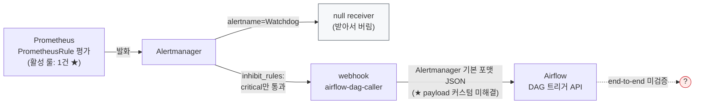

> 수집하고, 저장하고, 그리는 것까지 왔다. 남은 것은 "사람이 안 보고 있을 때"를 담당하는 알림이다. 이 시스템의 알림 설계는 특이했다 — 목적지가 Slack이 아니라 워크플로 엔진(Airflow)이었다. 그리고 커밋 히스토리에는, 그 목적지에 도달하기 위해 **Alertmanager 스펙에 존재하지 않는 필드들과 싸운** 긴 트러블슈팅의 궤적이 남아 있었다. 이번 편은 그 전말과, 이 스택 전체에서 유일하게 "동작한다고 확언할 수 없는 상태"로 남은 구역에 대한 정직한 판정이다.

> **이 편의 기준 버전** — Alertmanager — kube-prometheus-stack **65.5.0** 번들 · 수신처: Airflow DAG 트리거 REST API · 활성 커스텀 룰 1건

---

## 먼저, 역할 분담부터

이 편에서 다룰 파이프라인의 전체 그림이다.



그림에 별표(★)가 둘, 물음표가 하나 있다. 이 셋이 이 편의 이야기다.


알림 커밋을 읽으려면 이 파이프라인의 역할 분담을 정확히 쥐고 있어야 했다. 헷갈리기 쉬운데, 알림은 두 컴포넌트의 합작이다.

- **Prometheus — 룰 평가.** "이 조건이 N분간 참이면 알림을 발화하라"는 룰(PrometheusRule)을 상시 평가한다. 발화까지가 Prometheus의 일이다.
- **Alertmanager — 알림 처리.** 발화된 알림을 받아 **그룹핑**(같은 알림 묶기), **억제**(더 심각한 알림이 있으면 부수 알림 숨기기), **라우팅**(어느 수신처로), **재알림 주기**를 관리해 최종 수신처로 전달한다.

즉 "왜 알림이 안 오지?"라는 질문은 항상 둘로 쪼개야 한다. 룰이 발화를 안 한 것인가(Prometheus), 발화는 됐는데 전달이 안 된 것인가(Alertmanager). 이 구분이 이 편 내내 쓰인다.

## 설계의 특이점: 알림의 목적지가 사람이 아니다

알림 관련 커밋의 시작은 전용 values 파일(alerts/ 디렉터리)의 신설이었다. 그 안의 receiver 설정을 처음 봤을 때 이 시스템의 설계 철학 하나를 읽었다.

```yaml
receivers:
  - name: 'airflow-dag-caller'
    webhook_configs:
      - url: http://<airflow>/api/v1/dags/<트리거 대상 DAG>/dagRuns
        send_resolved: true
```

Slack도, 이메일도, 페이저듀티도 아니다. **Airflow의 DAG 트리거 REST API**다. 알림을 "사람에게 보내는 통보"가 아니라 "**자동화 파이프라인을 깨우는 트리거**"로 설계한 것이다. 알림 발생 → DAG 실행 → (아마도) 후속 처리·기록·재통보. 알림의 1차 소비자를 기계로 두는 접근인데, receiver 이름(airflow-dag-caller)부터가 그 의도를 말하고 있었다.

이 설계 자체는 흥미롭고 방향도 나쁘지 않다. 문제는 이 선택이 곧바로 만나게 되는 기술적 벽이었다 — 그게 이 편의 본론이다. 그 전에, 벽에 닿기까지의 정비 과정부터.

## 정비 1: 자기 자신을 알리는 알림 끄기 — Watchdog → null

첫 구성 직후의 커밋에서 라우팅에 이런 예외가 추가된다.

```yaml
route:
  receiver: 'airflow-dag-caller'
  routes:
    - receiver: "null"
      matchers: [ alertname = "Watchdog" ]
receivers:
  - name: "null"          # 받아서 버리는 전용 수신처
  - name: 'airflow-dag-caller'
```

Watchdog은 kube-prometheus-stack이 **일부러 상시 발화시키는** 알림이다. "알림 파이프라인 자체가 살아 있는가"를 확인하는 하트비트 — 이게 안 오면 파이프라인이 죽은 것이다. 통보형 수신처(Slack 등)라면 무시하거나 별도 채널로 빼면 그만인데, 이 시스템의 수신처는 DAG 트리거다. **하트비트가 올 때마다 DAG가 실행된다.** 상시 발화 알림 × 자동화 트리거 = 무한 실행. 그래서 Watchdog만 잡아 "받아서 버리는" null receiver로 우회시킨 것이다.

알림의 소비자가 기계가 되는 순간, 사람이라면 그냥 넘겼을 노이즈가 실행 비용이 된다 — 이 설계의 첫 번째 청구서였다.

## 정비 2: 같은 이유의 두 번째 청구서 — inhibit_rules

```yaml
inhibit_rules:
  - source_matchers: [ severity = critical ]
    target_matchers: [ severity =~ warning|info ]
    equal: [ namespace, alertname ]
```

억제(inhibition) 규칙이다. 같은 namespace/alertname에서 critical이 떠 있는 동안, 같은 사건의 warning/info는 눌러버린다. 통보형 알림에서도 노이즈 감소를 위해 쓰는 표준 기법이지만, 여기서의 동기는 역시 DAG였다 — 하나의 장애가 severity별 알림을 연달아 발화시키면 **DAG가 같은 사건으로 여러 번 실행**된다. critical 하나만 통과시켜 실행을 한 번으로 만드는 장치다.

Watchdog 우회와 inhibit, 두 커밋을 겹치면 패턴이 보인다. 이 시스템의 알림 정비는 전부 "**알림 수 = 실행 수**"라는 등식을 관리하는 작업이었다.

## 정비 3: 설정이 반영되지 않던 나날들 — config의 올바른 주소 찾기

이 시기 커밋들에는 다른 종류의 씨름도 섞여 있었다. Alertmanager 설정 블록의 **위치**가 커밋마다 옮겨 다닌 것이다.

```
1차: alertmanager.config                    → 반영 안 됨(으로 추정)
2차: alertmanager.alertmanagerSpec.config   → 여전히 안 됨
3차: alertmanager.config (+ enabled 명시)   → 정착
```

kube-prometheus-stack의 values 계층에서 Alertmanager 설정이 들어가야 할 정확한 위치를 찾는 시행착오다. yaml 계층 한 단계의 차이인데, 잘못 넣으면 **에러 없이 그냥 무시된다.** 헬름은 스키마에 없는 키를 꾸짖지 않는다. 1편에서 발굴했던 "전부 밀고 재설치" 명령의 화석이 정확히 이 시기의 것이었다 — 설정이 반영되지 않는 원인을 못 찾아 전체 재설치까지 갔던 절박함의 맥락이, 이 위치 씨름과 겹쳐지며 비로소 이해됐다.

"조용히 무시되는 설정"이라는 주제가 여기서 처음 등장한다. 그리고 본론에서, 같은 주제가 더 큰 스케일로 반복된다.

## 본론: payload 전쟁

이제 벽 이야기다. Airflow의 DAG 트리거 API는 아무 POST나 받지 않는다. 특정 형태의 JSON body를 요구한다 — `dag_run_id`, `conf`(DAG에 넘길 파라미터), 실행 시각 필드들. 한편 Alertmanager의 webhook은 **자기 고유 포맷의 JSON을 보낸다.** 알림 목록, 라벨, 시작 시각 등이 담긴, Airflow가 기대하는 것과 전혀 다른 구조다.

그러니 필요한 것은 "webhook body를 Airflow가 원하는 모양으로 바꾸는" 수단이다. 커밋 히스토리에는 그 수단을 찾는 시도가 연쇄로 남아 있었다.

**시도 1 — `body:`.** webhook_configs 아래에 body 필드를 넣고 원하는 JSON을 템플릿 문법으로 작성. 그럴듯하다. 문제는 **Alertmanager의 webhook_configs에 body라는 필드가 없다**는 것.

**시도 2 — `message:`.** 다른 알림 도구들(Slack config 등)에서 본 듯한 필드명으로 재시도. 역시 webhook_configs의 필드가 아니다.

**시도 3 — `json_fields:` + `payload:`.** 또 다른 필드명 조합. 마찬가지.

세 시도의 공통점이 이 이야기의 핵심이다. **셋 다 에러가 나지 않았다.** Alertmanager는 모르는 필드를 만나면 거부하는 대신 조용히 무시한다. 설정은 "적용"되고, Pod는 뜨고, 그러나 webhook body는 계속 기본 포맷으로 나간다. 실패의 신호가 어디에도 없으니, 다음 시도는 자연히 "다른 필드명이었나?"가 된다 — 아마 다른 알림 도구들의 설정 문서가 섞여 들어오면서, 존재하지 않는 필드의 목록만 늘어난 것으로 보인다.

config 위치 씨름의 확대판이다. yaml 한 단계가 조용히 무시되던 것이, 이번엔 필드 하나가 조용히 무시된다. 이 궤적에서 뽑은 수칙은 단순하지만 값비싸게 배운 것이다:

> **설정이 안 먹힐 때 첫 행동은 "다른 이름 시도"가 아니라 "공식 스펙에서 그 필드의 존재 확인"이다.** 조용히 무시되는 시스템에서는, 시행착오가 수렴하지 않고 발산한다.

**시도 4 — 정공법의 발견.** 그리고 어느 커밋에서 방향이 완전히 바뀐다. Alertmanager가 **실제로 지원하는** 커스터마이징 메커니즘 — Go 템플릿 파일이다.

```yaml
templateFiles:
  airflow_template.tmpl: |-
    {{ define "airflow.dag_run" }}
    {
      "dag_run_id": "alert_{{ .GroupLabels.alertname }}_{{ .StartsAt | ... }}",
      "conf": {
        "alert_name": "{{ .CommonLabels.alertname }}",
        "severity":   "{{ .CommonLabels.severity }}"
      }
    }
    {{ end }}
config:
  templates: [ '/etc/alertmanager/templates/*.tmpl' ]
  # receiver 쪽에서 template: 'airflow.dag_run' 참조
```

.tmpl 파일에 원하는 body를 Go 템플릿으로 정의하고, 설정에서 그 템플릿을 참조하는 — 문서에 있는 정식 경로다. 존재하지 않는 필드들의 무덤을 지나 마침내 공식 스펙에 도달한 순간이고, 커밋만 보면 여기서 해피엔딩이어야 했다.

**그런데 다음 커밋에서, 이 템플릿 설정이 통째로 삭제된다.**

## 판정: 이 구역은 미검증이다

삭제의 이유는 커밋에 남아 있지 않다. 템플릿 방식이 이 차트의 values 구조와 안 맞아 또 반영이 안 됐을 수도 있고, 접근 자체를 바꾸기로 했을 수도 있고, 단순히 미완인 채 멈췄을 수도 있다. 역추적으로 확정할 수 있는 것은 최종 상태뿐이다:

> **현재 레포 기준, webhook은 Alertmanager 기본 포맷 그대로 나간다. 그 포맷을 Airflow가 받아서 DAG를 실행할 수 있는지 — 즉 알림 파이프라인의 end-to-end — 는 검증된 기록이 없다.**

이 스택의 다른 구역들(수집, 저장, 조회)은 "동작 중"을 커밋과 실물로 교차 확인할 수 있었다. 알림만은 아니었다. 그래서 파악 문서에는 이 구역을 **"미검증"으로 명시**하고, 검증 절차를 인수인계 항목으로 박았다: 테스트 알림을 강제 발화시켜(항상 참인 임시 룰이면 된다) Airflow까지 도달하는지 실측할 것. 실패한다면 선택지는 둘이다 — **Airflow 쪽에 Alertmanager 기본 포맷을 파싱하는 전용 DAG/엔드포인트를 두거나**(보내는 쪽을 바꿀 수 없으면 받는 쪽이 맞춘다), **중간에 포맷 변환용 경량 webhook 어댑터를 끼우거나.** 어느 쪽이든 "존재하지 않는 필드 시도 5차전"보다는 빠를 것이다.

## 그리고 커버리지의 현실

마지막으로, 룰 쪽 현실도 기록해야 공정하다. 알림 룰 파일에는 메모리 부족, 디스크 임박, Kafka 브로커 다운, Redis 다운, MySQL 슬로우쿼리, Nginx 5xx 비율 등 **실전 룰 한 벌이 통째로 주석 처리된 채** 준비되어 있고, 활성 룰은 단 하나 — 파드 CPU 사용률 룰인데 임계값이 테스트용으로 보이는 낮은 수치다. 기본 룰 묶음(defaultRules)도 꺼져 있다.

조합하면 이 구역의 상태 판정이 완성된다: **전달 경로는 미검증, 발화 룰은 사실상 부재.** 알림 시스템의 뼈대(라우팅, 억제, 수신처 설계)는 잘 잡혀 있으나, "장애가 나면 알림이 온다"는 문장은 아직 이 시스템에서 참이 아니다. 이 판정이 개선 백로그에서 저장소 테넌트 한도 누락(2편)과 함께 최상위에 올라간 이유다. 모니터링 스택은 화면이 아무리 아름다워도, **새벽 3시에 울리지 않으면 미완성**이다.

## 6편 정리

- 알림은 두 컴포넌트의 합작이다: 발화(Prometheus 룰)와 처리(Alertmanager). "알림이 안 온다"는 항상 이 둘로 쪼개서 본다.
- 이 시스템의 알림은 통보가 아니라 **자동화 트리거**(Airflow DAG)다. 그 순간 알림 수 = 실행 수가 되고, Watchdog 우회와 inhibit_rules는 그 등식의 관리 장치였다.
- 본론은 payload 전쟁: 존재하지 않는 필드 3연속 시도 → 전부 **조용히 무시됨** → 정식 메커니즘(.tmpl Go 템플릿) 도달 → 그리고 삭제. 수칙: 설정이 안 먹히면 다른 이름을 시도하기 전에 **스펙에서 필드의 존재부터 확인**한다.
- 최종 판정: 전달 경로 미검증 + 활성 룰 사실상 부재. 역추적의 산출물에는 "무엇이 동작하는가"만큼 "**무엇이 동작한다고 확언할 수 없는가**"가 포함되어야 한다.

다음 편은 이 시리즈의 초기 계획에는 없던 편이다. 원래 "미답지, 신규 구축 권고"로 닫으려 했던 로그 파이프라인 — Loki와 Promtail — 을 결국 완주한 기록. 폐기된 Kafka 완충로 4차 시도와, 헬스체크 경로가 다섯 번 바뀐 방랑기가 기다린다.

---

## 부록 A — 실무 체크포인트

- **"알림이 안 온다"의 이분법** — 발화 문제인지 전달 문제인지부터:
  - 발화: Prometheus UI > Alerts에서 룰이 Pending/Firing인지
  - 전달: Alertmanager UI(또는 `amtool alert query`)에 그 알림이 도착했는지
<!-- 📸 스크린샷 #3 자리 (선택)
촬영: 로컬 스택에서 vector(1) 임시 룰 적용 → Prometheus UI > Alerts에서 Firing 상태
프레임: E2ETest 룰이 Firing(빨강)으로 표시된 화면
캡션 제안: "항상 참인 룰로 알림 파이프라인 전 구간을 실측한다"
-->
- **end-to-end 테스트 발화** — 항상 참인 임시 룰이 가장 간단하다:
  ```yaml
  - alert: E2ETest
    expr: vector(1)
    labels: { severity: critical }
  ```
  발화 → AM 도착 → 수신처(Airflow) 실행까지 전 구간을 실측한다. **이 테스트가 통과하기 전까지 알림 체계를 "동작함"으로 간주하지 말 것.**
- **config가 반영됐는지** — `amtool config show --alertmanager.url=<주소>` 또는 AM UI > Status. yaml 위치가 틀리면 에러 없이 무시된다(본문).
- **webhook 커스터마이징은 두 가지뿐** — 공식 스펙의 필드(url, http_config, send_resolved...)와 Go 템플릿(.tmpl). 그 외 필드명은 전부 조용히 무시된다.
- **Watchdog 활용** — 버리기 전에 역할을 기억할 것: 이 알림이 "안 오면" 파이프라인이 죽은 것이다. deadman's switch 서비스로 보내는 활용법도 있다.

## 부록 B — 참고 자료

- Alertmanager configuration (webhook_configs 스펙): https://prometheus.io/docs/alerting/latest/configuration/#webhook_config
- Alertmanager 알림 템플릿(Go template): https://prometheus.io/docs/alerting/latest/notifications/
- amtool 사용법: https://github.com/prometheus/alertmanager#amtool
- Airflow REST API — DAG Run 트리거: https://airflow.apache.org/docs/apache-airflow/stable/stable-rest-api-ref.html#operation/post_dag_run
- Awesome Prometheus Alerts (룰 임계값 참고용 모음): https://samber.github.io/awesome-prometheus-alerts/

---

*이 시리즈의 모든 내용은 특정 조직·시스템을 식별할 수 없도록 도메인, 명칭, 일부 수치를 일반화/변경했습니다.*
