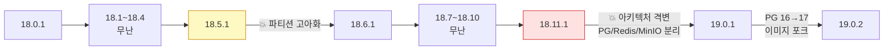
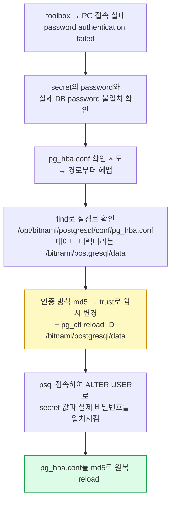

# [GitLab 마이그레이션 연대기 #4] 업그레이드 여정 — 18.x 릴레이와 3번의 DB 장애, 그리고 19.0의 격변

> 이 글에 등장하는 클러스터 등 자원 명은 실제 자원 명이 아니라, 임의로 재구성한 예시입니다. 보안상의 이유로 빠지거나 다르게 수정한 부분이 있으니, 이 점 참고해주세요.
{: .prompt-info }

Helm 전환 후에도 여정은 끝나지 않았다. 이미지 베이스 OS 관련 **CSAP 보안 취약점 대비** 목적으로 최신 GitLab으로의 업그레이드가 필요했고(사유: 최신 베이스 이미지 OS 사용), 18.0.1에서 19.0.2까지 마이너 버전 릴레이를 다시 뛰어야 했다. 이번 편은 그 과정에서 만난 장애들과, 19.0에서 GitLab 아키텍처 자체가 바뀐 이야기다.

## 1. 업그레이드의 기본기 — 차트와 앱 버전 싱크

Helm 기반 GitLab 업그레이드에서 첫 번째 규칙: **Chart 버전과 GitLab 버전은 1:1 매핑**이며, 반드시 싱크를 맞춰 마이너 단위로 진행해야 한다. (공식 version mappings 문서 기준)

| Chart | GitLab | | Chart | GitLab |
|---|---|---|---|---|
| 9.0.1 | 18.0.1 | | 9.7.1 | 18.7.1 |
| 9.1.1 | 18.1.1 | | 9.8.1 | 18.8.1 |
| 9.2.1 | 18.2.1 | | 9.9.1 | 18.9.1 |
| 9.3.1 | 18.3.1 | | 9.10.1 | 18.10.1 |
| 9.4.1 | 18.4.1 | | 9.11.1 | 18.11.1 |
| 9.5.1 | 18.5.1 | | 10.0.1 | 19.0.1 |
| 9.6.1 | 18.6.1 | | 10.0.2 | 19.0.2 |

매 단계의 실행 패턴은 동일하다. 다만, 매 단계별 실행할때 override values 파일은 달리하여 진행한다. 또한, 버전별 values 파일 또한 별도로 관리한다. 버전별 override values 파일을 따로 관리하는 이유는 **각 버전에서 어떤 값이 유효했는지 이력을 남겨 롤백·재현이 가능하게** 하기 위함이다.

```bash
# template로 렌더링 검증 후 upgrade — 매 버전 동일 패턴
## 18-1-1-version-upgrade-values.yaml의 경우, 18.1.1 버전에 대한 values.yaml 파일

helm template gitlab-n gitlab/gitlab --namespace gitlab-n \
  -f ./upgrade/18-1-1-version-upgrade-values.yaml --version 9.1.1 \
  --set global.useConfigMapForReleaseInfo=true > rendered.yaml

helm upgrade --install gitlab-n gitlab/gitlab --namespace gitlab-n \
  -f ./upgrade/18-1-1-version-upgrade-values.yaml --version 9.1.1 \
  --set global.useConfigMapForReleaseInfo=true
```

완료 판정 기준도 명확히 해뒀다: **migration 파드가 Completed가 되면 그 버전의 업그레이드가 끝난 것**이다. 웹이 뜨는 것만 보고 다음 버전으로 넘어가면 안 된다.

그리고 매 위험 구간 직전에는 toolbox에서 백업을 떴다 — "혹시나 하여". 이 습관이 아래 장애들에서 심리적·실질적 안전망이 됐다.



## 2. 장애 ①: 18.5.1 → 18.6.1 — 고아가 된 파티션들

### 현상

```text
PG::CheckViolation:
ERROR: no partition of relation "project_daily_statistics_b8088ecbd2" found for row
```

Migration이 멈추고 업그레이드가 중단됐다.

### 원인 분석 — 왜 파티션이 고아가 됐나

GitLab은 통계 데이터를 **월 단위 파티션 테이블**로 관리한다(`..._202508`, `..._202509` ...). 그런데 이전에 업그레이드가 한 번 실패하면서 **테이블 이름 변경 작업 도중 월별 파티션들이 부모 테이블에서 분리(detach)된 채 방치**된 상태였다. 파티션 테이블 자체는 존재하는데, 부모와의 연결 정보만 사라진 "고아(orphan)" 상태.

GitLab이 스스로 복구하지 못한 이유도 확인했다: 마이그레이션 코드가 **"파티션이 모두 붙어 있다"는 전제**로 작성돼 있어서, 이미 꼬인 상태에서는 진행도 복구도 못 하고 멈춘다. (Reddit의 동일 사례를 통해 교차 검증 — 커뮤니티 사례 검증은 #3의 fork_networks 때부터의 습관이다.)

```text
정상:  project_daily_statistics_b8088ecbd2
        ├─ _202508
        ├─ _202509 ...

장애:  project_daily_statistics_b8088ecbd2   ← 부모만 존재
       (고아) _202508, _202509 ...           ← 테이블은 있으나 연결 끊김
       → 2025-08 데이터 유입 시 "어느 파티션에 넣지?" 판단 불가 → CheckViolation
```

### 조치 — 생성이 아니라 "재연결"

핵심 원칙: **파티션을 새로 만드는 게 아니라, 이미 존재하는 파티션을 부모에 다시 ATTACH하는 것**이다. 데이터를 수정·삭제하지 않고 관계만 복구하므로 무결성 리스크가 없다. (fork_networks 때와 같은 철학 — 정답은 이미 DB 안에 있다.)

```bash
# 조치 전 백업 — 롤백 가능 상태 확보가 항상 1순위
pg_dump -Fc gitlabhq_production > gitlab_before_partition_fix.dump

# toolbox 파드에서 DB 접속
kubectl exec -it -n gitlab-n <toolbox-pod> -- /bin/bash
gitlab-rails dbconsole
```

```sql
-- 1. 이슈 현황 확인
SELECT relname FROM pg_class
WHERE relname = 'project_daily_statistics_b8088ecbd2';

-- 2. 고아 파티션을 월 범위 지정하여 재연결 (202508~202602, 7개 동일 패턴)
ALTER TABLE project_daily_statistics_b8088ecbd2
ATTACH PARTITION gitlab_partitions_dynamic.project_daily_statistics_b8088ecbd2_202508
FOR VALUES FROM ('2025-08-01') TO ('2025-09-01');
-- ... _202509 ~ _202602 동일하게 반복 ...

-- 3. 연결 상태 검증 — pg_inherits로 부모-자식 관계 확인
SELECT inhrelid::regclass FROM pg_inherits
WHERE inhparent = 'project_daily_statistics_b8088ecbd2'::regclass
ORDER BY 1;
```

ATTACH가 완료되자 멈췄던 GitLab Migration이 계속 진행됐고, 파티션 구조 전환(`project_daily_statistics` 생성/승격 → 구 테이블 제거)까지 정상 완료됐다. 그래도 반영이 안 될 때의 마지막 수단은 sidekiq/webservice 재기동이다:

```bash
kubectl rollout restart deploy -n gitlab-n gitlab-n-sidekiq-all-in-1-v2
kubectl rollout restart deploy -n gitlab-n gitlab-n-webservice-default
```

## 3. 장애 ②: 끝나지 않는 Batched Background Migration

### 현상

`db:migrate`가 성공한 뒤에도 일부 작업이 계속 **Pending**으로 남아 마이그레이션이 정상 종료되지 않았다.

### 원인 분석

GitLab은 대량 데이터를 한 번에 바꾸지 않고 **Batched Background Migration(BBM)** 으로 1000건씩 쪼개 처리하며, 상태를 `batched_background_migrations` 테이블에서 관리한다. 확인 결과 일부 작업이 `status = 6 (Failed)` 상태로 남아 있었고, **Failed 상태에서는 재실행 자체가 불가능**했다.

### 조치 — "성공 처리"가 아니라 "재시도 가능 상태로"

여기서 오해하면 안 되는 지점: 실패한 작업을 성공으로 조작한 것이 아니다. **재실행이 가능한 상태(1)로 되돌려서 GitLab이 스스로 다시 수행하도록 유도**한 것이다.

```sql
UPDATE batched_background_migrations
SET status = 1      -- Failed(6) → 재실행 가능 상태
WHERE status = 6;
```

```bash
gitlab-rake db:migrate
gitlab-rake db:migrate:status
gitlab-rake gitlab:background_migrations:status   # BBM 상태 별도 확인 필수
```

교훈: **`db:migrate` 성공 ≠ 업그레이드 완료.** BBM 상태까지 확인해야 다음 버전으로 넘어갈 자격이 생긴다. 이후 절차서의 버전별 완료 조건에 BBM 확인을 고정 항목으로 넣었다.

## 4. 격변: 18.11.1 → 19.0.1 — GitLab이 구조를 바꿨다

19.0은 단순 버전업이 아니었다. **GitLab 19부터 MinIO, PostgreSQL, Redis가 GitLab 차트에서 분리**되어, 이전처럼 GitLab 설치 시 자동으로 딸려 오지 않고 **별도 Helm 차트로 직접 구축**해야 한다.

```text
[~18.x]                          [19.x~]
GitLab 차트                       GitLab 차트          별도 차트들
 ├─ webservice                    ├─ webservice        ├─ bitnami/postgresql
 ├─ sidekiq                       ├─ sidekiq           ├─ bitnami/redis
 ├─ toolbox                       └─ toolbox           └─ minio/minio
 ├─ postgresql  ┐
 ├─ redis       ├ 내장            → 내장 제거, 직접 구축·운영 책임이 사용자에게 이동
 └─ minio       ┘
```

이건 사실 #1에서 이야기한 방향 — "스테이트풀 서비스는 GitLab과 분리해야 한다" — 을 GitLab 공식이 강제한 셈이기도 하다. 다만 실전은 매끄럽지 않았다. 진행 순서와 함정들을 기록한다.

### 4-1. 사전 백업과 MinIO 엔드포인트 확인

19.0.1 업그레이드를 적용하면 내장 PG/Redis/MinIO가 빠지면서 **Sidekiq/Webservice가 Init 단계에서 멈추는 게 정상**이다. 그 상태에서 스테이트풀 서비스들을 순서대로 구축한다.

함정 하나를 먼저: **MinIO 서비스 엔드포인트가 바뀐다.**

```text
내장 MinIO (18.x):   http://gitlab-n-minio-svc.gitlab-n.svc:9000
별도 구축 (19.x):    http://gitlab-n-minio.gitlab-n.svc:9000
```

values의 object storage 연결 설정에서 이 차이를 반영하지 않으면 업로드/패키지 기능이 조용히 깨진다. 사전에 반드시 확인해야 하는 이유다. 또 하나 — MinIO/PostgreSQL 시크릿의 계정 비밀번호가 여러 개 등장하므로 **어느 시크릿의 어느 키가 어느 계정인지 헷갈리지 않게 사전 정리**가 필수다(뒤의 4-3이 그 이유를 보여준다).

### 4-2. PostgreSQL/Redis/MinIO 별도 구축

```bash
# PostgreSQL — 우리 SC(Retain) 사용, 사유: 데이터 계층은 항상 보존 우선
helm install gitlab-n-postgresql bitnami/postgresql \
  -n gitlab-n \
  --set primary.persistence.storageClass=gitlab-n-postgresql-sc \
  --set primary.persistence.size=50Gi \
  --set primary.resources.requests.memory=1Gi \
  --set primary.resources.limits.memory=2Gi

# Redis — 기존 GitLab redis secret의 비밀번호를 그대로 사용
# 사유: GitLab 쪽 연결 설정을 바꾸지 않고 서비스만 교체하기 위함
REDIS_PASS=$(kubectl get secret gitlab-n-redis-secret -n gitlab-n \
  -o jsonpath='{.data.secret}' | base64 -d)
helm install gitlab-n-redis bitnami/redis \
  --namespace gitlab-n \
  --set auth.enabled=true \
  --set auth.password="$REDIS_PASS" \
  --set master.persistence.storageClass=gitlab-n-redis-sc \
  --set master.persistence.size=50Gi

# MinIO — 기존 내장 MinIO는 백업 후 helm 삭제하고 새로 구축
# 사유: 구조가 완전히 바뀌어 기존 데이터를 그대로 적용할 수 없음. 깨끗하게 새로 만들고 데이터만 이관
```

### 4-3. MinIO 데이터 이관 — mc mirror

내장 MinIO의 데이터는 `kubectl cp`로 백업해뒀다가, 새 MinIO에 **mc(MinIO Client) mirror**로 부었다. 사유: 단순 파일 복사보다 mirror가 버킷 구조 그대로 동기화해주고, 이관 후 오브젝트 수 비교로 검증까지 가능하기 때문이다.

```bash
# toolbox에 mc 설치 후
/tmp/mc alias set new-minio http://gitlab-n-minio.gitlab-n.svc:9000 \
  <ACCESS_KEY> <SECRET_KEY>     # gitlab-n-minio-secret에서 base64 디코드한 값

/tmp/mc mb new-minio/gitlab-packages
/tmp/mc mb new-minio/gitlab-uploads

/tmp/mc mirror /tmp/gitlab-packages/ new-minio/gitlab-packages/
/tmp/mc mirror /tmp/gitlab-uploads/  new-minio/gitlab-uploads/

# 검증 — 원본과 오브젝트 수 비교
/tmp/mc ls new-minio/gitlab-packages/ --recursive | wc -l
/tmp/mc ls new-minio/gitlab-uploads/  --recursive | wc -l
```

### 4-4. PostgreSQL 16 → 17 — 두 단계로 나눈 이유와 pg_hba.conf 사투

19.0.1은 PostgreSQL 17을 요구하지만, **우선 16으로 올려 안정화한 뒤 17로 올리는 2단계**로 진행했다. 사유: DB 메이저 버전과 GitLab 메이저 버전을 동시에 바꾸면 문제 발생 시 원인 분리가 불가능하기 때문이다(#2에서 세운 "한 번에 하나만 바꾼다" 원칙의 재적용).

17 전환의 실제 절차는 "백업 → GitLab 전체 중단 → 기존 PG 삭제 → PG 17 신규 설치 → 백업 복원"이다. 이때 데이터 백업은 `SKIP=uploads,builds,artifacts,lfs,packages` 옵션으로 DB 중심으로만 떴다 — 사유: 오브젝트류는 MinIO 이관으로 별도 처리되므로 중복 백업으로 시간을 쓸 이유가 없기 때문이다.

가장 애먹은 건 **인증 문제**였다. bitnami PostgreSQL 신규 설치 후 secret의 비밀번호와 실제 DB 비밀번호가 어긋나 toolbox가 DB에 붙지 못했다. 트러블슈팅 흐름을 요약하면:



핵심 조치를 명령으로 남기면:

```bash
kubectl exec -it -n gitlab-n gitlab-n-postgresql-0 -- bash

# 1) 인증을 임시로 trust로 — 사유: 비밀번호가 어긋난 상태에선 접속 자체가 안 되므로,
#    "일단 들어가서 비밀번호를 맞추기" 위한 한시적 우회
cat > /opt/bitnami/postgresql/conf/pg_hba.conf << 'EOT'
local all all trust
host all all 0.0.0.0/0 trust
host all all ::/0 trust
EOT
pg_ctl reload -D /bitnami/postgresql/data   # conf 경로가 아니라 data 디렉터리 기준!

# 2) 접속해서 secret에 기록된 값으로 실제 비밀번호를 맞춤
psql -U postgres
ALTER USER postgres WITH PASSWORD '<secret의 postgres-password 값>';
ALTER USER gitlab  WITH PASSWORD '<secret의 postgresql-password 값>';

# 3) 반드시 md5로 원복 + reload — trust 방치는 보안 사고
```

> **trust 우회에 대한 솔직한 평가**: 이 방식은 동작했지만, "수동으로 DB 인증을 우회해 정합성을 맞추는 작업"이 운영 환경에서 벌어진다는 것 자체가 보안적으로 위험 신호다. 이 경험이 #5에서 다룰 "매니지드 서비스가 필요하다"는 확신의 근거가 됐다.

복원 전엔 새 PG가 빈 DB이므로 생성부터:

```bash
kubectl exec -it -n gitlab-n gitlab-n-postgresql-0 -- \
  psql -U gitlab -d postgres -c "CREATE DATABASE gitlabhq_production OWNER gitlab;"

kubectl exec -it -n gitlab-n <toolbox-pod> -- \
  gitlab-rake gitlab:backup:restore BACKUP=<백업명> \
  SKIP=uploads,builds,artifacts,lfs,packages force=yes

kubectl scale deployment -n gitlab-n --replicas=1 --all
```

## 5. 마무리: 이미지 주권 확보 — bitnami 의존 탈피

19.0.2 안정화 후 마지막 작업은 **필수 이미지들을 NCP Container Registry로 포크·푸시**하는 것이었다.

**사유**: PostgreSQL/Redis/MinIO가 bitnami 이미지로 구축되는데, bitnami 정책 변경(bitnamilegacy 전환 등)으로 **태그 정책이 바뀌면 어느 날 갑자기 이미지 풀이 실패**할 수 있다. 외부 레지스트리의 정책 변화가 우리 GitLab의 가용성을 좌우하게 둘 수 없으므로, 필수 이미지에 한해 자체 레지스트리에서 관리하기로 했다.

```bash
# 프라이빗 레지스트리 풀 시크릿 생성
kubectl create secret docker-registry regcred \
  --docker-server=<private-ncr>.ncr.gov-ntruss.com \
  --docker-username=<username> \
  --docker-password=<password> \
  -n gitlab-n

# 예: PostgreSQL을 포크 이미지로 전환
helm upgrade gitlab-n-postgresql bitnami/postgresql -n gitlab-n \
  --reuse-values \
  --set image.registry=<private-ncr>.ncr.gov-ntruss.com \
  --set image.repository=bitnamilegacy/postgresql \
  --set-string image.tag=17 \
  --set image.pullSecrets[0]=regcred \
  --set global.security.allowInsecureImages=true
# Redis / MinIO / GitLab 주요 컴포넌트(webservice, sidekiq, gitaly, toolbox 등)도 동일 패턴
```

## 6. 이번 편 요약 — 장애 3종 세트에서 뽑은 원칙

| 장애 | 본질 | 원칙 |
|---|---|---|
| fork_networks NULL (#3) | 새 제약조건 vs 옛 데이터 | 지어내지 말고 **관계를 따라가 복원** |
| 파티션 고아화 | 실패한 마이그레이션의 잔해 | 생성이 아니라 **ATTACH로 관계 복구** |
| BBM Failed | 상태 머신이 막힘 | 성공 조작이 아니라 **재시도 가능 상태로 전환** |

공통 교훈:

1. 메이저 업그레이드의 성패는 애플리케이션 버전이 아니라 **데이터 정합성과 마이그레이션 상태**가 가른다.
2. 공식 문서 + **커뮤니티 사례 교차 검증**이 실장애 해결의 절반이다.
3. **백업 → 사전 점검 → 조치 → 검증**의 리듬을 매 위험 구간마다 반복하라. `db:migrate` 성공만 보고 넘어가지 말고 BBM까지.
4. 한 스텝에서는 한 가지만 바꾼다 — PG 16→17을 GitLab 업그레이드와 분리한 이유.

다음 편(최종화)은 이 모든 여정의 회고다 — 무엇이 좋아졌고, 무엇을 승인받지 못했으며, 무엇이 아쉬운가.
