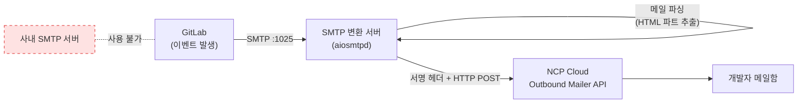

# [GitLab 마이그레이션 연대기 #5·완] 회고 — 무엇을 얻었고, 무엇이 남았나

> 이 글에 등장하는 클러스터 등 자원 명은 실제 자원 명이 아니라, 임의로 재구성한 예시입니다. 보안상의 이유로 빠지거나 다르게 수정한 부분이 있으니, 이 점 참고해주세요.
{: .prompt-info }

Omnibus 16.6.1에서 시작해 Helm 19.1까지. 이번 최종화는 성과와 한계를 같은 무게로 기록한다. 잘된 것만 적은 회고는 다음 담당자에게 도움이 되지 않기 때문이다.

## 1. 결과: 반복 장애의 종식, 그리고 신뢰의 회복

가장 중요한 결과부터. **이전에 있었던 중단 이슈는 마이그레이션 이후 재발하지 않았고, 무중단 운영을 실현했다.**

6개월간의 개선 작업 중 ROI가 가장 컸던 것을 하나만 꼽으라면 나는 주저 없이 이 마이그레이션을 꼽는다. 이유는 기술 지표가 아니다. 중단이 반복되던 시절, 개발자들은 GitLab 자체를 신뢰하지 않았다. 플랫폼에 대한 신뢰가 무너지면 그 플랫폼을 운영하는 팀에 대한 신뢰도 함께 무너진다. 마이그레이션 이후 장애 없이 운영되면서 **개발자들이 플랫폼과 DevOps팀을 다시 신뢰하기 시작**했다.


기술적으로 무엇이 바뀌어서 장애가 사라졌는지 다시 정리하면:

| AS-IS의 문제 | TO-BE의 해법 | 효과 |
|---|---|---|
| 프로세스 하나 이상 → 전체 중단 | 컴포넌트별 독립 파드 | 장애 반경이 파드 단위로 축소 |
| 백업 tar 파드 내 누적 → 디스크 풀 → PG 중단 | toolbox 백업 + 즉시 버킷 전송 | 백업이 서비스를 죽이는 구조 제거 |
| 블록 스토리지 + Delete 정책 | NAS + Retain 정책 | PVC 삭제에도 데이터 보존 |
| 수동 구성, 재현성·멱등성 없음 | values.yaml 코드 관리 | 재현 가능, 이력 추적 가능 |

## 2. SMTP-Proxy — 한마디의 자극에서 시작해, 비용 앞에 멈춘 이야기

마이그레이션 과정에서 해결한 오래된 민원이 하나 있다. **메일 알림**이다. 그리고 이 작업에는 기술보다 먼저 기록해둘 이야기가 있다.

### 연구의 계기 — "왜 이렇게 안 되는 게 많아요?"

어김없이 동일한 이슈로 깃랩이 또 중단됐던 어느 날, UI/UX 팀장이 깃랩의 불편함을 호소하며 이렇게 말했다.

> "왜 이렇게 인프라팀에서 구축한 깃랩은 안 되는 게 많아요?"

입사 초기였던 나로선 솔직히 억울했다. 내가 만든 구조도 아니었고, 매번 새벽까지 복구하던 것도 나였으니까. 하지만 사용자 입장에서 보면 "누가 만들었는가"는 중요하지 않다. 안 되는 건 안 되는 것이다. 그 말이 자극이 되어 반성하게 됐고, 장애 재발 방지(이 시리즈의 본편)와는 별개로 **어떻게든 개발자들의 불편을 하나라도 더 해소하자**는 동기가 생겼다. 그 "안 되는 것들" 목록의 대표가 메일 알림이었다 — MR 리뷰 요청도, 이슈 멘션도, 어떤 이벤트에도 메일이 오지 않는 깃랩.

### 문제와 해법

- **문제**: 회사 사정상 사내 SMTP 서버를 사용할 수 없어 GitLab의 SMTP 설정 자체가 불가능했다. GitLab은 메일 발송을 SMTP로만 하도록 되어 있는데, 보낼 곳이 없었던 것이다.
- **해법**: 별도의 **SMTP-Proxy 서버**를 구축했다. GitLab이 1025 포트로 보내는 메일 전송 요청을 이 서버가 받아 **NCP Cloud Outbound Mailer API**로 변환해 발송하는 구조다. GitLab의 SMTP 설정에는 이 서버의 도메인만 넣으면 된다.
- **사유**: "SMTP를 못 쓴다"는 제약을 바꿀 수 없다면, GitLab 입장에서는 SMTP처럼 보이는 인터페이스를 앞에 세우고 뒤에서 쓸 수 있는 수단(API)으로 변환하면 된다. GitLab 쪽에는 표준 SMTP 설정만 하면 되므로 **GitLab 설정을 전혀 특수하게 만들지 않는다**는 것이 이 구조의 장점이다. 제약 조건 안에서의 자구책이었다.

한 가지 정직하게 짚을 것 — 팀 내에서는 "SMTP 프록시"라고 불러왔지만, 엄밀히는 프록시가 아니다. 프록시는 같은 프로토콜을 중계(HTTP→HTTP)하는 것이고, 이 서버는 **SMTP를 받아 HTTP API로 바꾸는 프로토콜 변환 서버(Protocol Translator/Bridge), 혹은 SMTP 릴레이**에 가깝다. 앱(GitLab) 코드는 SMTP 라이브러리를 그대로 쓰게 두고, 실제 발송 백엔드만 HTTP 기반 메일 서비스로 교체하고 싶을 때 쓰는 전형적인 중간 변환 패턴이다.



### 동작 원리 — 개념만 잡히는 수준으로

전체 구현 코드는 이 시리즈의 범위를 넘으므로 **별도 글로 정리할 예정**이고, 여기서는 원리가 잡히는 골격만 보인다. 핵심은 `aiosmtpd`가 SMTP 세션을 대신 받아주고, 우리는 `handle_DATA()` 하나만 구현하면 된다는 것이다.

```python
# 원리 요약용 골격 코드 — 실제 구현의 에러 처리·로깅·환경변수 로딩은 생략
class SMTPHandler:
    async def handle_DATA(self, server, session, envelope):
        # 1) GitLab이 SMTP로 보낸 원문 메일을 파싱
        msg = email.message_from_bytes(envelope.content, policy=policy.default)

        # 2) multipart 메일에서 text/html 파트를 골라 본문으로 사용
        #    사유: GitLab 알림 메일은 HTML 템플릿이므로, HTML을 그대로 보내야
        #    수신자가 보는 메일 모양이 깨지지 않는다
        body = extract_html_part(msg)

        # 3) SMTP의 "누구에게, 무슨 제목, 무슨 내용"을
        #    Outbound Mailer API의 JSON 스키마로 재포장
        payload = {
            "senderAddress": SENDER_ADDRESS,          # 발신자는 고정 주소 사용
            "title": msg["Subject"],
            "body": body,
            "recipients": [{"address": envelope.rcpt_tos[0], "type": "R"}],
        }

        # 4) NCP API 게이트웨이 인증 — timestamp + HMAC 서명 헤더를 만들어
        #    Outbound Mailer API로 POST
        await post(NCP_MAILER_URL, json=payload, headers=ncp_signature_headers())

        # 5) GitLab에게는 "정상 접수"로 응답 → GitLab은 진짜 SMTP 서버와 통신했다고 인식
        return '250 Message accepted for delivery'
```

결과적으로 GitLab 내 모든 이벤트에 대해 메일 알림이 가능해졌고, 오래된 민원 하나가 닫혔다.

### 그러나 지금은 — 비용 앞에 멈춰 서다

솔직한 현재 상태를 기록한다. **이 SMTP-Proxy는 현재 운영이 중단된 상태다.** Cloud Outbound Mailer API 사용량에 따라 누적되는 비용이 우려된다는 판단 때문이다.

많이 안타깝다. 한 사람의 뼈아픈 한마디에서 시작해, 제약 조건을 우회해가며 만들어낸 개선이 결국 비용이라는 다른 제약 앞에 멈춰 섰으니까. 그리고 이 경험은 내게 질문 하나를 남겼다 — **편의성이 먼저인가, 비용이 먼저인가.** 어느 한쪽이 항상 이기는 답은 없을 것이다. 개발자 수십 명이 매일 겪는 불편의 총합과, 매달 청구서에 찍히는 숫자를 같은 저울에 올리는 일은 생각보다 어렵다. 이 상황 속에서도 어떻게 균형을 맞춰나가야 하는가 — 이것이 이 작업이 내게 남긴, 아직 풀지 못한 고민이다. (뒤에 나올 매니지드 서비스 이야기에서 같은 저울이 한 번 더 등장한다.)

다음 담당자에게: 만약 메일 알림 요구가 다시 올라온다면, 이 서버는 코드와 절차가 남아 있어 재가동 자체는 어렵지 않다. 다만 재가동 제안서에는 **예상 발송량 기반의 비용 시뮬레이션**을 반드시 붙일 것. 이번에 멈춘 이유가 바로 그 숫자의 부재였다.

## 3. 가장 뼈저린 교훈: 데이터 서비스는 매니지드로 가야 한다

이 시리즈에서 반복 등장한 장면들을 떠올려 보자. fork_networks의 NULL을 SQL로 메꾸고, 고아 파티션을 ATTACH하고, BBM 상태를 UPDATE하고, pg_hba.conf를 trust로 바꿔가며 비밀번호를 맞추던 순간들.

전부 **운영자가 프로덕션 DB에 직접 손을 대는 작업**이었다. 매번 백업을 뜨고 교차 검증을 하며 신중하게 했지만, 본질적인 문제는 남는다.

1. **보안 리스크** — 사람이 프로덕션 DB에 수동 접근하는 경로 자체가 위험이며, trust 인증 우회 같은 임시 조치는 실수 하나로 사고가 된다.
2. **정합성 이슈의 항상성** — 백업 프로세스를 아무리 잘 갖춰도, 셀프 호스팅 DB에서는 버전 업그레이드 때마다 정합성 변수가 계속 발생할 것이다. 이번에 3번 겪었다면 다음 메이저에서도 겪을 것이다.
3. **운영 부담** — Backup / Replication / Failover / Upgrade를 전부 팀이 짊어지는 구조는 팀 규모 대비 지속 가능하지 않다.

그래서 **PostgreSQL, Redis 같은 데이터 서비스는 매니지드 서비스로 분리 관리해야 한다**고 결론 내렸고, 실제로 팀장에게 제안했다. 결과는 — **비용 이슈로 승인받지 못했다.**

이 결정을 원망하지는 않는다. 비용 대비 효과의 판단은 조직의 몫이고, 당시의 무중단 운영 실적이 오히려 "지금도 잘 돌아가는데?"라는 반론의 근거가 되는 아이러니도 있었다. SMTP-Proxy 중단과 정확히 같은 저울 — 편의성·안정성 vs 비용 — 이 여기서도 작동한 것이다. 다만 다음 담당자에게 남긴다: **매니지드 전환 제안은 장애가 터졌을 때가 아니라 평온할 때 미리 준비해둘 것.** 그리고 이 시리즈의 장애 기록들이 그 제안서의 근거 자료가 되길 바란다.

## 4. 아쉬움 ①: AI 시대의 GitLab, 그러나 우리는 CE

GitLab 19로 업그레이드하며 느낀 것이 있다. 요즘 GitLab은 개발자가 소스 작업을 시작하는 순간부터 AI 에이전트를 통해 배포는 물론 코드 안정성·보안 문제까지 GitLab 안에서 해결하게 하는, AI 시대에 걸맞은 변화를 보여주고 있다.

그러나 우리는 교과서 서비스 특성상 오픈소스(CE, Community Edition)를 사용해야 하는 제약이 있어 **이 AI 기능들을 전혀 사용할 수 없다.** 최신 버전으로 올려놓고도 그 버전의 가장 큰 특수를 누리지 못한다는 점은 솔직히 아쉬운 부분이다. 업그레이드의 실익이 보안(CSAP 대비)과 안정성에 한정된다는 것을 인지하고 있어야, 향후 업그레이드 우선순위를 판단할 때 냉정할 수 있다.

## 5. 아쉬움 ②: GitLab Runner, 아직은 물음표

러너 관련해서도 많은 변화가 있었지만, **GitHub Actions만큼의 퍼포먼스를 보여주는가에 대해서는 아직 물음표**다. 현재 CI/CD의 중심이 Jenkins인 우리 구조에서 GitLab Runner로의 전환 여부는 계속 연구가 필요한 영역으로 남겨둔다. 결론을 서두르지 않는 이유: 러너 전환은 전 부서의 빌드·배포 파이프라인을 건드리는 일이고, 이번 시리즈에서 배웠듯 **영향도 조사 없는 전환은 하지 않는다**가 우리의 원칙이기 때문이다.

## 6. 다음 담당자를 위한 요약 — 이것만 기억하자

1. **장애 복구보다 구조 개선이 장기적으로 더 크게 남는다.** 운영 중인 시스템도 점진적으로 바꿀 수 있다 — 우리가 했다.
2. **Helm ≠ HA.** 진짜 가용성은 PostgreSQL·Redis·Object Storage·Gitaly까지 봐야 한다.
3. **업그레이드 전 3종 세트는 생략 불가**: 전체 백업, 마이너 단위 경로 준수, BBM 상태 확인.
4. **DB 장애의 답은 대부분 DB 안에 있다.** 지어내지 말고 관계를 따라갈 것 (fork_networks, 파티션 ATTACH의 교훈).
5. **버전별 override values 파일과 이 시리즈 문서가 지도다.** 절차는 낡아도 판단 근거는 낡지 않는다.
6. **매니지드 서비스 전환은 미완의 과제다.** 근거 자료는 여기 다 있다. 다음 제안은 다음 담당자의 몫이다.
7. **편의성과 비용의 저울은 계속 흔들린다.** SMTP-Proxy처럼 만들어놓고 멈춘 것도, 매니지드처럼 제안하고 거절된 것도 있다. 숫자(비용 시뮬레이션)를 준비한 제안만이 그 저울 위에서 버틴다.

---

이 기록이 누군가에게 지도가 되기를, 그리고 어느 조직에선가 같은 장애로 새벽에 불려 나가는 누군가에게 답이 되기를 바란다.

**— 시리즈 끝.**

## 부록: 시리즈 전체 내비게이션

| 편 | 제목| 한 줄 요약 |
|---|---|---|
| #0 | 시리즈를 시작하며 — Omnibus 16.6.1에서 Helm 19.0.2까지 | 시리즈 소개, 전제 조건, 타임라인 |
| #1 | 왜 갈아엎기로 했나 — 월 2~3회 장애의 해부 | 장애의 해부와 Helm 결정의 논리 |
| #2 | 출사표 — 설계와 계획 | 영향도 조사, 백업/롤백, 일정 산정 |
| #3 | 실전 — Omnibus에서 Helm으로 | 3단계 이관(중간 깃랩→마이너 릴레이→Helm 전환) 실전 절차 |
| #4 | 업그레이드 여정 — 18.x 릴레이와 3번의 DB 장애, 그리고 19.0의 격변 | 18.x→19.x, DB 장애 3종과 아키텍처 분리 |
| #5 | 회고 — 무엇을 얻었고, 무엇이 남았나 | 성과·교훈·아쉬움·남은 과제 |
