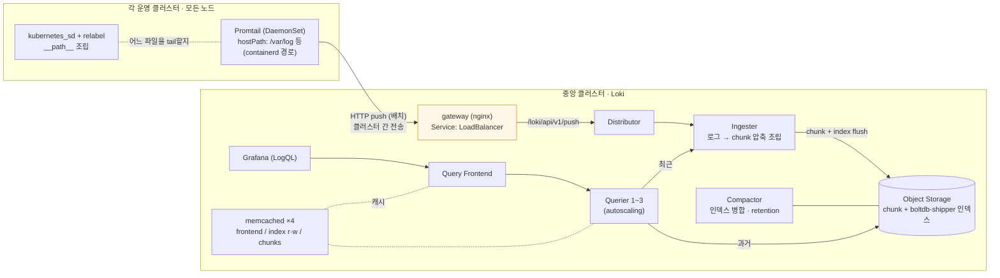
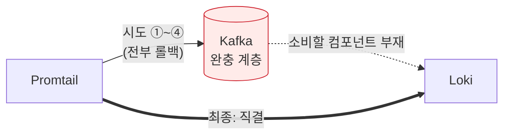

> 고백부터 하자. 이 시리즈의 초기 계획에서 로그 파이프라인은 "미답지 — 히스토리가 얇아 역추적 대신 신규 구축을 권고"로 닫을 예정이었다. 그런데 마지막에 레포를 다시 파보니, 얇다고 생각했던 지층 아래에 본격적인 히스토리가 통째로 묻혀 있었다. Kafka 완충 구조를 네 번 시도하고 네 번 접은 기록, 헬스체크 경로가 다섯 번 바뀐 방랑, 그리고 차트 템플릿을 직접 뜯어고친 지뢰까지. 이번 편은 그 로그 축 — 각 클러스터의 Promtail이 로그를 긁어 중앙 Loki로 밀어 넣는 파이프라인 — 의 완주 기록이자, "역추적의 손익분기"에 대한 내 판단이 틀렸던 이야기다.

> **이 편의 기준 버전** — Loki — loki-distributed 차트 **0.80.x** (0.80.6 이후 deprecated) · Promtail 차트 **6.16.6** / appVersion 3.0.0 (차트·앱 모두 deprecated, 후속: Alloy) · 인덱스: boltdb-shipper · memcached ×4

---

## 큰 그림: 메트릭 축과 완벽한 대칭

파악을 끝내고 보니, 로그 축은 이 시리즈 전체에서 다룬 메트릭 축과 구조적으로 대칭이었다. 그림으로 먼저 보자.



대응 관계를 나란히 놓으면:

| | 메트릭 축 | 로그 축 |
|---|---|---|
| 현장 수집원 | Prometheus (각 클러스터) | **Promtail** (각 클러스터, DaemonSet) |
| 수집 방식 | pull (대상을 방문해 scrape) | **push** (파일을 tail해 중앙으로 밀어 넣음) |
| 클러스터 간 전송 | remote_write → Mimir | HTTP push → **Loki gateway** |
| 중앙 저장소 | Mimir | **Loki** |
| 최종 저장 | Object Storage (블록) | Object Storage (**chunk + index**) |
| 조회 언어 | PromQL | **LogQL** |
| 테넌시 | 통합 테넌트 (2편) | **단일 테넌트** (`auth_enabled: false`) |

Loki는 Mimir와 같은 Grafana Labs 계열이라 내부 조직도가 거의 같다 — distributor, ingester, query frontend, querier, compactor, memberlist ring까지. 2편에서 그렸던 Mimir 지도에 "취급 품목만 로그로" 대입하면 그대로 통한다. 본질적 차이는 하나, **색인 전략**이다. Loki는 로그 본문을 색인하지 않고 라벨(`{namespace="...", pod="..."}`)만 인덱싱한다. 저장이 싸지는 대신 본문 검색은 라벨로 좁힌 범위의 chunk를 스캔하는 방식 — "로그판 Mimir"라는 별명이 정확하다.

이 대칭성이 파악 속도를 극적으로 올려줬다. 2편에서 Mimir를 바닥부터 팠던 것이 그대로 선행 학습이 된 것이다. **레거시 역추적의 순서는 중요하다 — 같은 계열의 시스템이 여럿이면, 하나를 깊게 판 뒤 나머지는 차이점만 찾는 방식이 압도적으로 빠르다.**

## Promtail: 현장 수집원의 세 가지 급소

Promtail은 각 운영 클러스터의 전 노드에 DaemonSet으로 깔려, 그 노드의 컨테이너 로그 파일을 tail하고 파드 메타데이터를 라벨로 붙여 Loki로 push한다. 설정 diff를 따라가며 확인한 급소가 셋이다.

**급소 1 — 차트 기본값은 Docker를 전제한다.** 업스트림 promtail 차트의 기본 볼륨 마운트는 `/var/lib/docker/containers`다. 그런데 이 환경의 컨테이너 런타임은 Docker가 아니라 **containerd**고, 로그는 다른 경로에 쌓인다. 커밋에는 기본 경로를 주석 처리하고 `/var/log`와 `/var/lib/containers`로 교체한 흔적이 남아 있었다. pipeline 스테이지도 `cri`(containerd의 CRI 로그 포맷 파서) 하나로 정착했다. 이 교체가 없으면 Promtail은 **정상 기동하되 읽을 파일이 없어 아무것도 수집하지 않는다** — 에러 없는 침묵, 이 시리즈의 단골 주제가 여기서도 반복된다. 교훈을 일반화하면: **헬름 차트의 기본값에는 암묵적 전제(런타임, 경로, DNS 이름)가 박혀 있고, 그 전제가 내 환경과 맞는지부터 의심해야 한다.** 1편의 kube-dns→coredns, 그리고 이 Docker→containerd가 같은 부류다.

**급소 2 — `__path__`라는 예약 라벨.** "어느 파일을 tail할지"는 특별한 설정 항목이 아니라, relabel 규칙이 조립해 `__path__`라는 예약 라벨에 담는 방식이다.

```yaml
- source_labels: [__meta_kubernetes_pod_uid, __meta_kubernetes_pod_container_name]
  target_label: __path__
  separator: /
  replacement: /var/log/pods/*$1/*.log     # 파드UID + 컨테이너명으로 실제 경로 조립
```

K8s API에서 받은 파드 UID로 로그 파일 경로를 실시간 조립하는 구조 — 1편의 additionalScrapeConfigs relabel과 같은 문법 체계라, 여기서도 선행 학습이 통했다. 무서운 점은 이 규칙이 빠지거나 라벨명이 틀리면(실제로 언더스코어 하나 빠진 `__path_` 오타 이력이 있었다) **수집 자체가 시작되지 않는다**는 것. 예약 라벨은 오타를 꾸짖지 않는다.

**급소 3 — push 목적지가 외부 도메인이다.** `clients.url`이 클러스터 내부 주소가 아니라 외부 도메인(`http://<loki-gateway 도메인>/loki/api/v1/push`)이다. 이 한 줄이 로그 축의 아키텍처를 확정해줬다 — Promtail(운영 클러스터)과 Loki(중앙 클러스터)는 서로 다른 클러스터고, 이는 메트릭의 remote_write→Mimir와 완전히 동형이다. 다만 메트릭 쪽은 https인데 **로그 쪽은 평문 http**라는 비대칭이 있다. 로그에는 스택트레이스, 때로는 실수로 찍힌 민감 정보까지 담기므로, 오히려 메트릭보다 암호화가 아쉬운 구간이다. 개선 백로그에 올렸다.

## 화석 발굴 3: Kafka 완충로, 네 번의 시도와 네 번의 롤백

Promtail 커밋 히스토리의 백미는 폐기된 구조물이었다. Promtail과 Loki 사이에 **Kafka를 완충 계층으로** 끼우려던 시도가, 형태를 바꿔가며 네 번 반복된 것이다.



의도 자체는 교과서적이다. Loki가 잠시 죽거나 밀려도 로그가 Kafka에 쌓여 유실되지 않는, 대용량 파이프라인의 표준 완충 패턴. 문제는 실행이었다. 네 번의 시도를 시간순으로:

- **① `clients.url: kafka://...`** — push 목적지 URL의 스킴만 kafka로 바꿔봄. Promtail의 clients에 그런 URL 스킴은 존재하지 않는다.
- **② pipelineStages 최상위에 `kafka:` 블록** — 파이프라인 스테이지 문법 위치에 출력 설정을 끼워 넣음. 유효한 스테이지가 아니다.
- **③ `extraScrapeConfigs`에 별도 kafka-output job** — 수집 job 정의 영역에 출력을 정의하려는 시도.
- **④ 가장 정교한 형태** — `cri → json(필드 추출) → timestamp → output + kafka(snappy 압축, acks 튜닝, 배치 설정)`까지 갖춘 완성형 파이프라인. 그리고 **다음 커밋에서 이것까지 전부 롤백, Loki 직결로 확정.**

네 시도를 겹쳐 보면 실패의 뿌리가 보인다. **방향의 문제**다. Promtail의 공식 Kafka 통합은 "Kafka에서 읽어와(consume) Loki로 보내는" **입력** 방향이 표준인데, 여기서 원한 것은 "Kafka로 내보내는" **출력** 방향이었다. 도구가 지원하지 않는 방향을 문법을 바꿔가며 계속 두드린 것이고 — 6편의 payload 전쟁과 정확히 같은 패턴이다. 존재하지 않는 필드는 조용히 무시되고, 시행착오는 수렴하지 않고 발산한다. 게다가 설령 Kafka에 넣는 데 성공했더라도, **Kafka에서 꺼내 Loki로 넣어줄 소비자 컴포넌트가 준비된 흔적이 없었다.** 파이프라인의 반쪽만 네 번 지은 셈이다.

이 화석에서 남긴 기록 두 가지: 현행 구성은 직결이며 Kafka 경유가 아니라는 명시(후임자가 ④의 정교한 설정 잔해를 현행으로 오독하지 않도록), 그리고 관리형 Kafka 쪽에 이 시도용 토픽이 실제 생성되어 있다면 정리 대상이라는 과제.

## Loki: s3 전환과 "조용히 무시"의 재림

Loki 쪽 히스토리의 첫 번째 산은 저장소였다. 초기 구성은 filesystem(파드 로컬 디스크) — 파드가 죽으면 로그가 함께 증발하는, 검증용으로만 허용되는 구성이다. 이를 Object Storage(S3 호환)로 전환하는 커밋들이 이어지는데, 그 구간이 필드명 시행착오의 연속이었다.

버킷 이름을 지정하는 필드가 `bucket_name` → `buckets` → **`bucketnames`** 로 세 번 바뀐다. 정답은 세 번째였다 — Loki의 aws 스토리지 설정 스키마가 요구하는 정확한 필드명은 `bucketnames`(복수형, 언더스코어 없음)다. 앞의 두 시도는? **에러 없이 조용히 무시됐다.** 설정은 로드되고, 파드는 뜨고, 그러나 버킷에는 아무것도 쌓이지 않는. 그 외에도 잘못된 중첩 위치에 들어간 TLS 옵션, 붙었다 사라진 `s3forcepathstyle` 등 스키마 주변의 흔적이 여럿이었다.

이 시리즈에서 "조용히 무시되는 설정"은 이제 세 번째 등장이다(6편 Alertmanager의 config 위치와 payload 필드, 이번 Loki의 s3 필드명). 세 사례가 쌓이니 수칙도 진화한다. 스펙 확인이 예방이라면, 이건 검증이다:

> **"조용히 무시하는" 시스템에서 설정 변경의 완료 조건은 "적용됐다"가 아니라 "효과를 관측했다"이다.** s3 설정을 만졌으면 ingester 로그의 에러 유무와 버킷 오브젝트 증가까지 확인해야 그 변경은 끝난 것이다.

저장 구조 자체는 이해하고 나면 우아하다. 로그 본문은 **chunk**(압축된 저장 단위)로, "어느 라벨의 로그가 어느 시간대 어느 chunk에 있는지"는 **index**(boltdb-shipper가 로컬에서 만들어 주기적으로 저장소에 배달)로 나뉘어 저장된다. 조회는 index로 대상 chunk를 좁힌 뒤 그 chunk만 스캔 — "본문은 색인하지 않는다"는 Loki 철학의 구현체다.

운영 유입 후의 한도 튜닝 흔적도 있었다. 쿼리당 최대 로그 줄 수를 기본값의 1,000배로 올린 커밋(대용량 조회의 limit 초과 에러 대응), 그리고 흥미롭게도 **쿼리 재시도 횟수를 5→1로 줄인** 커밋 — 무거운 쿼리가 실패했을 때 재시도가 오히려 부하를 증폭시키는 "재시도 폭풍"을 차단하는, 방향이 반대라 더 눈에 띄는 튜닝이다. 다만 이후 파일이 구버전으로 회귀한 커밋이 섞여 있어, 이 한도들의 현행 반영 여부는 실물 대조 과제로 남겼다.

## 헬스체크 방랑기: 다섯 번 바뀐 경로

Loki 히스토리에서 가장 긴 씨름은 **외부 노출**이었다. Promtail의 push가 클러스터 밖에서 들어오니 Loki는 외부 접점이 필요한데, 그 접점의 형태가 계속 바뀐다. ALB ingress로 시작해 도메인 표기가 두 번, 로드밸런서 이름이 세 번 개명되는 어수선한 초반을 지나면, 방랑의 본론인 **헬스체크 경로**가 나온다.

로드밸런서는 백엔드가 살아 있는지 주기적으로 특정 경로를 찔러 확인하고, 실패하면 트래픽을 끊는다. 이 경로의 변천:

```
/            → nginx가 무조건 200. "살아는 있음"만 확인, 준비 상태는 모름
/ready       → Loki 컴포넌트의 진짜 준비상태 엔드포인트. 그런데 gateway(nginx)는 이 경로를 모름
(annotations 통째 주석 → 복구)   ← 포기와 재도전의 흔적
/ready + 세부 파라미터 + success-codes: "200,404"   ← 404도 정상으로 치는 타협
/loki/api    → query-frontend 전용 경로. 컴포넌트 하나의 상태로 전체를 대변
/            → 최종 회귀
```

`success-codes: "200,404"` — 404를 건강으로 간주하는 설정 — 이 이 방랑의 성격을 압축한다. 근본 원인은 경로 선택의 문제가 아니었다. **하나의 헬스체크 경로로 이질적인 컴포넌트 여럿(distributor, querier, query-frontend...)을 동시에 검증할 수 없다**는 구조적 한계와 싸우고 있었던 것이다. 어떤 경로를 골라도 누군가에게는 404고, 각자의 `/ready`는 LB가 하나만 찌를 수 있다.

방랑의 종착지가 그래서 의미심장하다. 한때는 gateway를 완전히 끄고 ALB가 각 컴포넌트로 직접 path 라우팅하는 구조까지 갔다가 — 이 구간에는 `ingressClassName` 장기 누락이라는 함정도 있었다. ingress 리소스에 클래스명이 없으면 **컨트롤러가 그 리소스를 집어 들지 않고**, 설정을 아무리 고쳐도 반영되지 않는다. "고쳐도 반영이 안 되는" 헛수고 구간의 유력한 원인이다 — 결국 **전부 되돌리고 가장 단순한 구조로 회귀했다: gateway(nginx) 하나만 LoadBalancer로 노출하고, 헬스체크는 `/`.** gateway는 nginx라 `/`에 항상 200을 주니 헬스체크가 안정되고, 내부 컴포넌트 라우팅은 gateway가 알아서 한다.

복잡한 구조와 오래 싸운 끝의 단순 회귀 — git-sync(5편)와 Kafka 완충로(위)에 이은 세 번째 사례다. 세 번 반복되면 패턴이다. **동작하는 단순함이 동작하지 않는 정교함을 이긴다.** 그리고 그 정교한 시도들이 전부 커밋에 남아 있었기에, 나는 "왜 이렇게 단순하게 되어 있지?"가 아니라 "**단순해지기까지 무엇을 겪었는지**"를 알 수 있었다.

## 지뢰 표시: 차트 템플릿 직접 수정분

마지막으로, 후임자를 위해 깃발을 꽂아둬야 했던 발견. ALB 직결 시도 구간에서 values로 제어할 수 없는 필드를 바꾸기 위해 **차트의 templates/ 파일 자체를 패치**한 흔적이 있었다 — 여러 컴포넌트 Service의 타입을 NodePort로 하드코딩하고, 그와 양립 불가한 headless 설정을 Helm 주석으로 봉인하고, 특정 컴포넌트에 리소스를 하드코딩(Guaranteed QoS 의도)한 것.

현행 구조(gateway 경유)에서는 대부분 불필요해진 패치지만 파일에는 살아 있다. 이게 왜 지뢰인가 — **차트를 업그레이드하는 순간 templates/는 업스트림 파일로 덮이며 패치가 소리 없이 사라지거나**, 반대로 잔존한 NodePort가 의도치 않은 노드 포트 노출을 유지한다. values 수정은 업그레이드에서 살아남지만 템플릿 패치는 그렇지 않다. fork 운영 방식(1편)의 부채가 가장 날카로운 형태로 드러나는 지점이라, 파악 문서에 "업그레이드 전 정리 방향 확정"을 별도 과제로 박았다.

덧붙여, 이 축 전체에 걸린 더 큰 시한폭탄도 판정해야 했다. **loki-distributed 차트도, promtail 차트도, Promtail이라는 앱 자체도 전부 지원 종료(deprecated)다.** 후속은 통합 loki 차트와 Alloy(구 Grafana Agent). 레포에는 신형 통합 차트를 검토한 흔적(미러만 존재, 커스터마이징 없음)까지 있었다 — "신형 검토 → 보류 → 구세대가 프로덕션으로 정착"의 전형적 패턴. 지금 동작하는 것과 별개로, 이 축의 중기 로드맵은 이전(migration)일 수밖에 없다.

## 7편 정리

- 로그 축은 메트릭 축과 대칭이다: Promtail(push) → gateway → Loki → Object Storage, 조회는 LogQL. Mimir를 먼저 판 것이 그대로 선행 학습이 됐다 — **같은 계열은 하나를 깊게, 나머지는 차이점만.**
- Promtail의 급소 셋: 차트 기본값의 Docker 전제(containerd 환경에선 침묵), `__path__` 예약 라벨(오타는 수집 자체를 막는다), 평문 http로 나가는 클러스터 간 전송.
- Kafka 완충로는 네 번 시도되고 네 번 롤백됐다. 도구가 지원하지 않는 방향(출력)을 문법만 바꿔 두드린, payload 전쟁과 같은 패턴 — 그리고 소비자 없는 반쪽 파이프라인.
- "조용히 무시" 3부작 완결(s3 필드명): 변경의 완료 조건은 "적용"이 아니라 **"효과의 관측"**이다.
- 헬스체크 방랑의 결론은 단순 회귀. **동작하는 단순함이 동작하지 않는 정교함을 이긴다** — 그리고 커밋 히스토리는 그 단순함의 값을 기억한다.
- 템플릿 직접 수정분과 전면 deprecated 차트 — 이 축의 다음 이야기는 운영이 아니라 이전(migration)이다.

이로써 지도의 마지막 빈칸이 채워졌다. 다음 편이 진짜 마지막이다 — 5개월여의 역추적이 남긴 것들의 결산.

---

## 부록 A — 실무 체크포인트

- **로그가 안 들어올 때, Promtail 쪽 3단 점검** (본문의 급소 순서):
  ```bash
  kubectl -n <ns> get pods -o wide                     # ① 노드 수만큼 Running인가
  kubectl -n <ns> logs <promtail파드> | grep -i "tail\|error"   # ② 파일 tail을 시작했는가
  # ③ 실제 전송량: Promtail 자체 메트릭
  #    rate(promtail_sent_entries_total[5m]) 가 0보다 큰가
  ```
  ②에서 tail 대상이 0개면: `__path__` 조립 규칙 존재 여부 → hostPath가 containerd 경로인지 → clients.url DNS 해석 순.
- **Loki 쓰기 경로 확인** — distributor/ingester 로그에서 push 수신과 s3 에러 유무 → 오브젝트 스토리지 버킷의 오브젝트 증가. **s3 설정 변경의 완료 조건은 이 관측이다** — 필드명 오타는 에러를 내지 않는다.
- **조회 스모크 테스트** — Grafana Explore에서 최소 쿼리:
  ```logql
  {namespace="<아무 ns>"} | limit 10
  ```
- **차트 업그레이드 전 필수** — templates/ 직접 수정분 diff 확인. values는 살아남지만 템플릿 패치는 업스트림에 덮인다:
  ```bash
  diff -r <내 차트>/templates <업스트림 동일버전>/templates
  ```
- **deprecated 대응 로드맵** — 신규 기능 추가 전에 통합 loki 차트 + Alloy 이전 계획부터. 구세대 차트 위에 쌓는 모든 것이 이전 비용이 된다.

## 부록 B — 참고 자료

- loki-distributed 차트 (deprecated 고지 포함): https://github.com/grafana/helm-charts/tree/main/charts/loki-distributed
- promtail 차트: https://github.com/grafana/helm-charts/tree/main/charts/promtail
- Grafana Loki 아키텍처(컴포넌트): https://grafana.com/docs/loki/latest/get-started/architecture/
- boltdb-shipper(단일 저장소 인덱스): https://grafana.com/docs/loki/latest/operations/storage/boltdb-shipper/
- Promtail 설정(clients, pipeline_stages, __path__): https://grafana.com/docs/loki/latest/send-data/promtail/configuration/
- Promtail → Alloy 마이그레이션 가이드: https://grafana.com/docs/alloy/latest/set-up/migrate/from-promtail/
- LogQL 문법: https://grafana.com/docs/loki/latest/query/

---

*이 시리즈의 모든 내용은 특정 조직·시스템을 식별할 수 없도록 도메인, 명칭, 일부 수치를 일반화/변경했습니다.*
