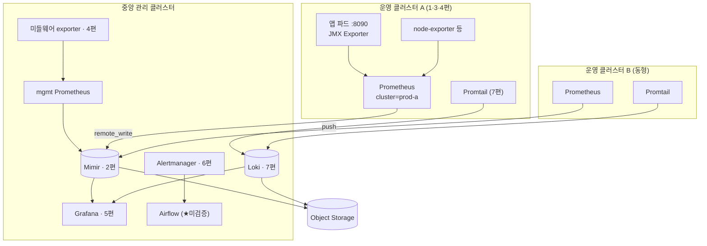

> 문서 한 장 없이 물려받은 모니터링 시스템을, 다섯 달 남짓 git 커밋 히스토리만으로 역추적한 여정의 마지막 편이다. 무엇이 만들어졌고, 무엇이 발견됐고, 무엇이 숙제로 남았는지 — 그리고 이 과정이 "문서화"라는 행위에 대한 내 생각을 어떻게 바꿨는지를 결산한다.

---

## 산출물: 한 편의 파악 문서

여정의 결과물은 물리적으로는 문서 한 편이다. 구축 배경 / 아키텍처 구성도 / 전체 플로우 / 컴포넌트별 상세(메트릭 축 10종 + 로그 축 2종) / 구축·변경 절차 / 일자별 파악 로그 / 개선 과제 — 일곱 개 장으로 구성된 내부 파악 문서. 시리즈 초기에 "미답지"였던 Loki/Promtail까지 정식 절로 편입되어, 이제 이 시스템에 지도 없는 구역은 없다.

다섯 달에 걸쳐 채워진 지도의 최종본은 이렇다. 프롤로그에서 이 그림은 예고였지만, 지금은 전부 각 편에서 확대해 본 구역들이다.

문서를 쓰면서 스스로에게 걸었던 기준이 하나 있다. **"관련 종사자가 아니어도, 이 문서만 읽으면 시스템이 이해되어야 한다."** 그래서 각 컴포넌트 설명을 같은 골격으로 통일했다: 개념(이게 뭔가) → 이 시스템에서의 배치(왜 여기 이렇게 있나) → 실제 설정 해설(왜 이 값인가) → 동작 확인 방법(문제가 생기면 어디부터 보나). 마지막 항목이 특히 중요했다. 파악 문서의 절반은 지식 전달이지만, 나머지 절반은 **미래의 장애 대응 시나리오에 대한 선물**이어야 한다고 생각했다.

거기에 두 가지를 강박적으로 붙였다. 하나는 **출처** — 모든 컴포넌트에 "어느 업스트림 차트의 어느 버전을 fork했고, 레포의 어느 파일이 그것인가"를 명시했다. 다른 하나는 **딱지** — 확정한 사실, 추정으로 남은 것, 미확인, 미검증, 폐기된 화석을 전부 구분해 표기했다. 문서의 신뢰는 아는 것을 잘 쓰는 데서가 아니라, **모르는 것을 모른다고 쓰는 데서** 나온다는 걸 이 작업 내내 확인했다.

## 발견물: 아무도 몰랐던 문제들의 목록

역추적의 가장 큰 실용적 성과는, 파악이 끝나자 **개선 백로그가 저절로 생겼다**는 것이다. 시리즈에서 다룬 것들을 모으면:

- **정합성 버그** — 최종 테넌시 구조와 저장소 한도 설정의 불일치(2편). 개별 커밋은 각각 합리적이었지만 서로를 몰랐던, 전체 히스토리를 꿴 사람만 볼 수 있는 종류의 문제. 백로그 1순위.
- **미검증 구역** — 알림 파이프라인의 end-to-end(6편). "동작한다고 확언할 수 없다"는 판정 자체가 산출물이다.
- **미완 작업** — 라벨 치환이 중간에 멈춘 대시보드들(5편), 반영 여부가 불확실해진 Loki 한도 튜닝(7편). 완성으로 오인되기 전에 "작업 중 / 실물 대조 필요" 딱지를 붙였다.
- **화석들** — 폐기된 git-sync 잔존물(5편), 봉인된 전체 삭제 명령(1편), 네 번 시도되고 롤백된 Kafka 완충로(7편). 다음 사람이 현행 구성으로 오독하지 않도록 명시적으로 사망 선고를 내렸다.
- **지뢰들** — 차트 업그레이드 때 소리 없이 사라질 templates/ 직접 패치(7편), 전면 deprecated 상태인 로그 축 차트들. "지금 동작함"과 "앞으로 안전함"은 다른 문장이다.
- **수동 갱신 지점들** — 브로커 목록, 대시보드 변수 매핑, 복붙 확장 체계(4편). 사람의 기억에 의존하는 지점 전부를 체크리스트로 격상.
- **운영 위생** — latest 태그, 상시 debug 로그, 평문 http 구간, 시크릿 관리 방식 등. (일부는 성격상 상세 비공개로, 발견 즉시 조치 트랙으로 분리했다.)

이 목록이 말해주는 게 있다. 레거시 역추적은 고고학이 아니라 **감사(audit)를 겸한다.** 히스토리를 통시적으로 읽는 사람은, 각 시점의 담당자가 가질 수 없었던 시야 — 결정들 사이의 모순 — 를 갖게 된다. 다섯 달의 비용이 아깝지 않았던 이유의 절반은 여기에 있다.

## 정정: "역추적의 손익분기"에 대하여

이 시리즈를 연재하는 중에 내 판단 하나가 뒤집혔고, 그것도 기록해야 정직하다. 원래 로그 파이프라인은 "히스토리가 얇아 역추적의 손익이 안 맞는다, 신규 구축을 권고한다"로 닫을 계획이었다. 그런데 막상 파보니(7편) 그 아래에 Kafka 4차 시도와 헬스체크 방랑이라는 두꺼운 지층이 있었다.

틀린 원인을 복기해보면, 나는 **디렉터리의 첫인상**(차트 미러와 초기 설정 몇 개)으로 지층의 두께를 추정했다. 하지만 히스토리의 두께는 파일 개수가 아니라 **커밋의 밀도**에 있었다. 그래서 수칙을 이렇게 고쳐 적는다: 역추적의 손익분기 판단은 파일 트리가 아니라 `git log --oneline -- <경로>`의 줄 수로 하라. 5분이면 되는 그 확인을 건너뛴 대가로, 나는 에필로그를 두 번 쓰게 됐다.

물론 판단이 틀려서 좋은 점도 있었다 — 지도의 빈칸이 사라졌고, 이 시리즈는 한 편 늘었다.

## 방법론 결산: 다시 한다면 그대로 할 것들

시리즈 곳곳에서 뽑았던 기법들을 한 곳에 모아둔다. 언젠가 비슷한 처지가 될 누군가(어쩌면 미래의 나)를 위한 압축본이다.

1. **사실 / 추론 / 과제의 3분리** (0편) — diff가 말해준 것과 내가 채운 것을 절대 섞지 않는다. 매 세션 끝에 다음 시작점을 북마크한다. 다섯 달짜리 작업이 끊기지 않은 유일한 비결.
2. **출처 대조로 파일의 정체 밝히기** (1편) — 정체불명의 설정 파일은 업스트림 여러 버전과 대조하면 "어느 시점의 무엇에서 파생됐는지"가 나온다.
3. **읽기만 하지 말고 재현하기** (1편) — 파악한 만큼 직접 배포해 검증한다. 읽기만 하면 "이해했다는 착각"이 쌓인다.
4. **컴포넌트 지도 먼저** (2편) — 분산 시스템은 쓰기/읽기/백그라운드 경로의 지도를 쥐고 나서 커밋을 읽는다. 장애 진입점이 지도에서 나온다.
5. **커밋 겹쳐 읽기** (2·3편) — 서로 다른 컴포넌트의 커밋이 맞물릴 때(라벨 한도 상향 ↔ 라벨 겹겹이 붙는 규칙) 추론이 사실에 가까워진다.
6. **레포를 가로질러 읽기** (3편) — 매니페스트의 env와 이미지 속 설정 파일이 환경변수로 손잡는 연결은 한 파일만 봐서는 안 보인다.
7. **3자 대조** (3편) — 빌드타임 주입 설정의 진단은 레포(의도)·이미지(굽힌 것)·실출력(나오는 것)을 반드시 함께 본다.
8. **화석 판정법** (5편) — 그 파일의 마지막 커밋 이후, 같은 목적의 변경이 어디서 일어나는지를 본다. 흐름이 옮겨갔으면 화석이다.
9. **구조는 grep으로 판정하지 않는다** (5편) — 대형 JSON의 변경은 문자열 빈도가 아니라 구조 파싱으로 비교한다.
10. **스펙 먼저** (6편) — 설정이 안 먹히면 다른 이름을 시도하기 전에 공식 스펙에서 그 필드의 존재부터 확인한다. 조용히 무시하는 시스템에서 시행착오는 발산한다.
11. **차트 기본값의 전제를 의심하기** (7편) — 헬름 기본값에는 암묵적 전제(Docker 경로, kube-dns 이름)가 박혀 있다. 내 환경과 다르면 에러가 아니라 침묵이 온다.
12. **변경의 완료 조건은 "효과의 관측"** (7편) — 조용히 무시하는 시스템에서는 "적용됐다"가 아니라 로그·버킷·메트릭으로 효과를 봐야 그 변경이 끝난 것이다.
13. **같은 계열은 하나만 깊게** (7편) — Grafana Labs 계열처럼 조직도가 같은 시스템이 여럿이면, 하나를 바닥까지 판 뒤 나머지는 차이점만 찾는다. 그리고 손익분기 판단은 파일 트리가 아니라 커밋 밀도로.

## 문서화에 대해 바뀐 생각

프롤로그에서 걸어둔 테제로 돌아온다. **커밋 히스토리는 최후의 문서다. 하지만 문서의 대체재는 아니다.**

다섯 달을 겪고 나니 이 문장을 더 구체적으로 쓸 수 있게 됐다. diff는 "무엇을"을 완벽하게, 무료로, 거짓 없이 보존한다. 그 점에서 커밋 히스토리는 과소평가된 자산이고, 이번 역추적이 가능했던 것도 이전 담당자가 최소한 **모든 것을 커밋으로 남겼기** 때문이다. 폐기된 시도들까지 — Kafka 완충로의 네 번의 형태 변화 같은 것까지 — 전부 남아 있었기에, 나는 실패의 이유까지 상속받을 수 있었다. 그 점은 지금도 고맙게 생각한다.

하지만 "왜"는 다르다. 왜 이 값인지, 왜 이 방식을 버렸는지, 왜 여기서 멈췄는지 — 이것들은 diff에 없고, 나는 그걸 복원하는 데 다섯 달을 썼으며, 그마저 일부는 영영 "추정"으로 남았다. 그리고 깨달은 것은, 그 "왜"를 남기는 비용이 놀랄 만큼 싸다는 것이다. 거창한 설계 문서가 아니어도 된다. 커밋 메시지 한 줄, 혹은 결정 하나당 세 줄 — 무엇을, 왜, 무엇을 버리고 — 면 충분했다. **작성자에게 3분인 것이, 다음 사람에게는 3일이다.** 이 환율을 몸으로 배운 것이 이 프로젝트의 가장 비싼 수업이었다.

그래서 지금 나의 작업 방식이 바뀌었다. 설정값 하나를 바꿀 때도 커밋 메시지에 "왜"를 적는다. 시도했다 버린 방식은 버렸다는 사실 자체를 기록한다. 폐기의 기록은 채택의 기록만큼 중요하다는 걸(5·7편), 미검증을 미검증이라 쓰는 게 신뢰라는 걸(6편) 배웠기 때문이다. 문서화는 미덕이 아니라 **미래의 누군가가 치를 비용의 선지불**이다 — 그 누군가가 대개는 미래의 자신이라는 점까지 포함해서.

## 그리고 개인적인 결산

마지막으로 이것도 적어둔다. 이 작업의 초반 기록에는 "미안 하나도 이해가 안 된다"가 있었고, 막바지의 기록에는 크래시 커밋을 보고 범인 플래그를 추정하고, Mimir 지도를 들고 Loki를 하루 만에 주파하는 내가 있었다. 그 사이에 있었던 것은 대단한 재능이 아니라, **구체적인 질문의 연쇄**였다. "이 커밋은 왜?"라는 질문이 매번 학습의 진입점과 범위를 강제로 정해줬고, 개념은 항상 실제 운영 판단에 붙어서 들어왔다. 모르는 시스템을 물려받는 일은 재앙처럼 보였지만, 지나고 보니 이보다 밀도 높은 커리큘럼은 설계할 수도 없었을 것이다.

이제 이 시스템은 "잘 모르는 채로 맡고 있는 것"이 아니라 "다룰 수 있는 것"이 됐다. 그리고 언젠가 이 시스템을 물려받을 다음 사람은 — 부디 이 문서와 함께 받기를. 커밋 히스토리를 다섯 달 파는 대신, 문서를 며칠 읽고 곧장 개선 백로그부터 집어들 수 있기를.

그것이 이 여정 전체의, 그리고 첫 페이지에 적어뒀던 그 문장의 결론이다.

> "다시는 이전 사람의 구축에 대해 유추해가면서 파악하는 일 없도록."

시리즈를 읽어주셔서 감사합니다.

---

**시리즈 전체 보기**
[0편 프롤로그 — 문서 없는 모니터링 시스템을 물려받았다](/posts/monitoring-reverse-engineering-0-prologue/)
[1편 kube-prometheus-stack — values 파일 두 개의 수수께끼](/posts/monitoring-reverse-engineering-1-kube-prometheus-stack/)
[2편 Mimir — 멀티테넌시는 왜 세 번 바뀌었나](/posts/monitoring-reverse-engineering-2-mimir/)
[3편 JMX Exporter — 빌드타임에 이미지로 굽는 설정의 함정](/posts/monitoring-reverse-engineering-3-jmx-exporter/)
[4편 관리형 서비스 시대의 Exporter — 에이전트를 설치할 수 없는 대상을 감시하는 법](/posts/monitoring-reverse-engineering-4-managed-service-exporters/)
[5편 Grafana — PMM 대시보드 이식기와 `__inputs`의 배신](/posts/monitoring-reverse-engineering-5-grafana/)
[6편 Alertmanager → Airflow — 스펙에 없는 필드와 싸운 기록](/posts/monitoring-reverse-engineering-6-alertmanager-airflow/)
[7편 Loki & Promtail — 로그 파이프라인: 폐기된 Kafka 완충로와 헬스체크 방랑기](/posts/monitoring-reverse-engineering-7-loki-promtail/)
8편 에필로그 — 역추적이 남긴 것 (본 편)

---

*이 시리즈의 모든 내용은 특정 조직·시스템을 식별할 수 없도록 도메인, 명칭, 일부 수치를 일반화/변경했습니다.*
