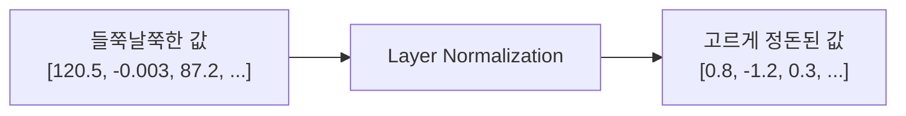
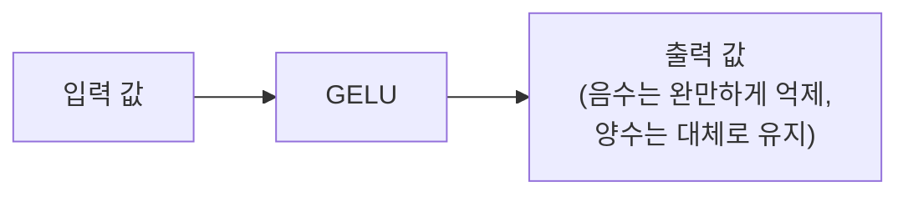
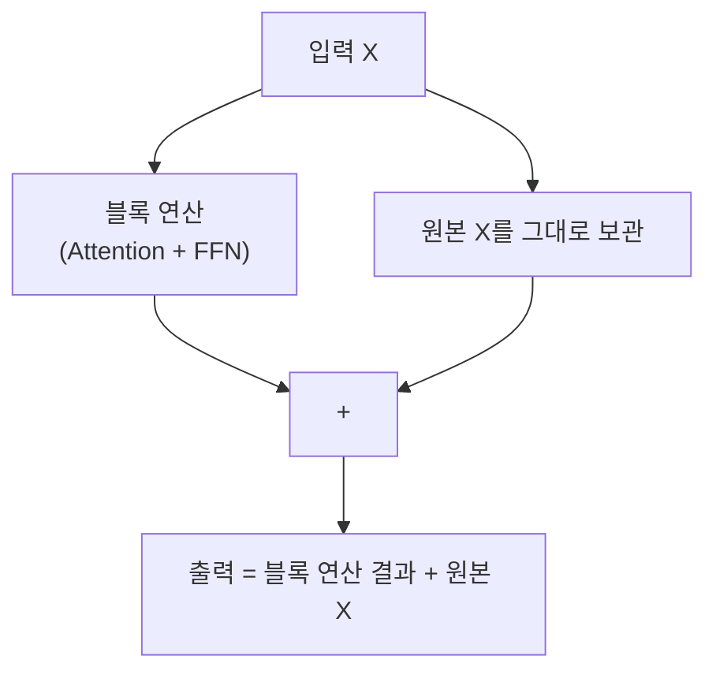
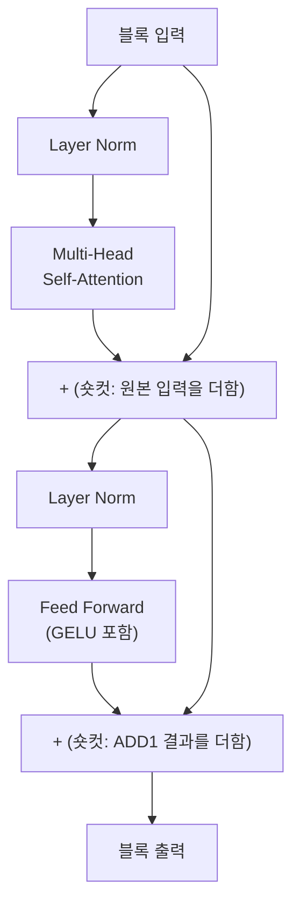
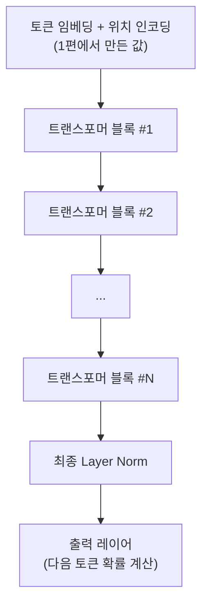
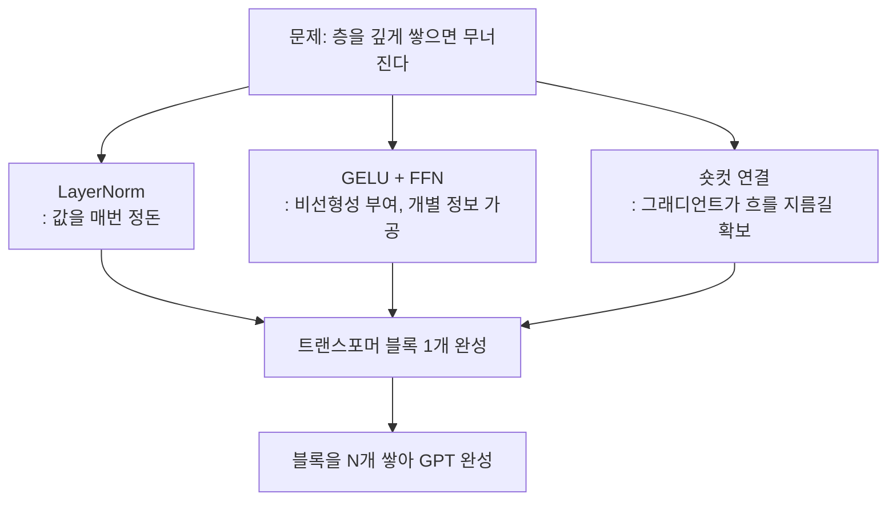

> 지난 편에서 셀프 어텐션이라는 장치를 손에 넣었다. 문맥에 따라 벡터가 바뀌는 문제는 풀렸다. 그런데 실제 GPT 내부를 열어보면, 어텐션 하나만 덩그러니 있는 게 아니다. LayerNorm, GELU, 숏컷 연결 같은 낯선 이름의 부품들이 어텐션을 둘러싸고 있다. 이 부품들, 빼면 안 되나?

## 사건의 발단: 왜 부품이 이렇게 많은가

셀프 어텐션만으로 문장 이해가 가능하다면, GPT는 그냥 어텐션 층을 여러 개 쌓기만 하면 될 것 같다. 그런데 실제로 그렇게 쌓아보면 문제가 생긴다. **층을 깊게 쌓을수록 학습이 불안정해지고, 심하면 아예 학습이 안 되는 상태에 빠진다.**

이유는 이렇다. 신경망은 층을 통과할 때마다 값이 조금씩 커지거나 작아진다. 이게 수십, 수백 개 층을 거치며 누적되면 값이 지나치게 커지거나(폭발) 지나치게 작아져서(소실) 사실상 의미 있는 신호가 남지 않게 된다. GPT처럼 트랜스포머 블록을 수십 개씩 쌓는 구조에서는 이 문제가 훨씬 치명적이다.

지금부터 살펴볼 부품들은 전부 이 "깊게 쌓아도 안 무너지게" 만들기 위한 안전장치들이다.

## 용의자 1: 층 정규화(Layer Normalization)

한 층을 통과한 값들을 살펴보면, 어떤 값은 아주 크고 어떤 값은 아주 작은, 들쭉날쭉한 상태가 되기 쉽다.

```
정규화 전: [120.5, -0.003, 87.2, 0.9, -55.1]
```

이 상태로 다음 층에 넘기면, 다음 층은 극단적인 값들 때문에 계산이 불안정해진다. **층 정규화**는 이 값들을 평균 0, 표준편차 1 근처로 다시 맞춰주는 작업이다.



값의 스케일을 매번 일정하게 맞춰주면, 층을 아무리 깊게 쌓아도 값이 걷잡을 수 없이 커지거나 작아지는 사태를 방지할 수 있다. 매 블록 입구와 출구에서 옷매무새를 가다듬어주는 장치라고 생각하면 이해하기 쉽다.

## 용의자 2: GELU 활성화 함수

신경망이 복잡한 패턴을 학습하려면 층 사이에 "비선형성"이 필요하다. 만약 모든 층이 단순한 곱셈과 덧셈만 반복한다면, 아무리 층을 많이 쌓아도 결국 하나의 큰 선형 계산으로 뭉개져 버린다. 즉 층을 깊게 쌓는 의미 자체가 사라진다.

그래서 각 층 사이에 **활성화 함수**라는 걸 끼워 넣는다. GPT 계열이 즐겨 쓰는 활성화 함수가 **GELU**다.



GELU는 입력이 크게 양수면 거의 그대로 통과시키고, 음수 쪽으로 갈수록 값을 부드럽게 줄여나간다. 이 "부드러움"이 핵심이다. 값이 갑자기 뚝 끊기지 않고 완만하게 변하기 때문에, 학습 과정에서 그래디언트(기울기)가 안정적으로 흐를 수 있다.

이 활성화 함수는 **피드 포워드 네트워크(Feed Forward Network, FFN)**라는 작은 층 안에 들어 있다. FFN은 어텐션과 역할이 다르다.

| 구성 요소 | 역할 |
|---|---|
| Self-Attention | 토큰들 사이의 **관계**를 파악 (누구를 볼지) |
| Feed Forward | 각 토큰이 가진 정보를 **개별적으로 가공** (무엇을 뽑아낼지) |

FFN은 보통 입력 차원을 몇 배로 확 넓혔다가 다시 원래 크기로 좁히는 구조를 쓴다. 잠깐 넓은 공간으로 펼쳐서 더 복잡한 패턴을 표현할 여지를 준 다음, 다시 필요한 크기로 압축해 다음 블록에 넘겨주는 방식이다.

## 용의자 3: 숏컷 연결(Shortcut Connection)

이제 가장 반직관적인 부품이다. 각 블록은 입력을 받아 어텐션과 FFN을 거쳐 출력을 낸다. 그런데 GPT는 여기에 원래 입력을 한 번 더 더해준다.



왜 굳이 원본을 다시 더해줄까. 층을 깊게 쌓다 보면, 학습 초반에는 각 층이 무슨 계산을 해야 할지 아직 잘 모르는 상태다. 이때 그래디언트(오차를 역전파로 되돌리는 신호)가 수십 개 층을 통과하면서 점점 약해지다가 거의 0에 가까워지는 문제가 생긴다. 이러면 앞쪽 층은 사실상 학습이 멈춰버린다.

숏컷 연결이 있으면, 그래디언트가 이 "지름길"을 통해 층을 건너뛰어 곧장 앞쪽까지 전달될 수 있는 통로가 하나 더 생긴다. 마치 고속도로 옆에 국도를 하나 더 뚫어두는 것과 비슷하다. 본선(블록 연산)이 막혀도, 국도(숏컷)를 통해 신호가 여전히 흐를 수 있다.

## 용의자들을 한자리에: 트랜스포머 블록

지금까지 나온 부품들을 순서대로 조립하면, GPT 내부의 기본 단위인 **트랜스포머 블록** 하나가 완성된다.



정리하면 이렇다.

1. 들어온 값을 LayerNorm으로 정돈한다
2. Multi-Head Self-Attention으로 토큰끼리의 관계를 계산한다
3. 원본 입력을 다시 더한다 (숏컷)
4. 다시 LayerNorm으로 정돈한다
5. FFN(+ GELU)으로 각 토큰의 정보를 가공한다
6. 직전 결과를 다시 더한다 (숏컷)

## 그리고 이 블록을 수십 개 쌓는다

GPT는 이 블록 하나로 끝나지 않는다. 이 블록을 예를 들어 12개, 24개, 많게는 수십 개씩 동일한 구조로 겹겹이 쌓는다.



한 블록을 통과할 때마다, 토큰의 표현은 조금씩 더 정교해진다. 앞쪽 블록은 비교적 단순한 패턴(문법적 관계 등)을 잡아내고, 뒤쪽으로 갈수록 더 추상적이고 복합적인 의미 관계를 잡아낸다고 알려져 있다. 이 블록들을 얼마나 많이, 얼마나 넓게 쌓느냐가 바로 모델의 "크기(파라미터 수)"를 결정한다. GPT-2 스몰 모델이 대략 1억 2,400만 개의 파라미터를 갖는다고 할 때, 이 숫자는 결국 이 블록들 안에 있는 가중치 행렬들(어텐션의 Query·Key·Value 행렬, FFN의 가중치 등)을 전부 더한 값이다.

## 이번 편의 전체 그림



이제 GPT의 뼈대는 다 갖춰졌다. 문장을 토큰으로 쪼개고(1편), 어텐션으로 문맥을 파악하고(2편), 그 어텐션을 안정적으로 깊게 쌓았다(3편). 그런데 이 거대한 구조물이 처음부터 뭔가를 "알고" 있던 건 아니다. 처음엔 완전히 무작위한 상태에서 시작해서, 수없이 틀리고 고쳐나가며 지금의 능력을 갖추게 된다.

다음 편에서는 이 모델이 정확히 어떻게 "틀렸다"는 걸 스스로 알아채고, 그걸 바로잡아나가는지 살펴본다. 그리고 지난 편에서 남겨둔 떡밥, "왜 미래를 보면 안 되는가"의 답도 여기서 완전히 회수된다.

---
*이 시리즈는 "밑바닥부터 만들면서 배우는 LLM"을 읽고 개인적으로 소화한 내용을 재구성한 글입니다.*
