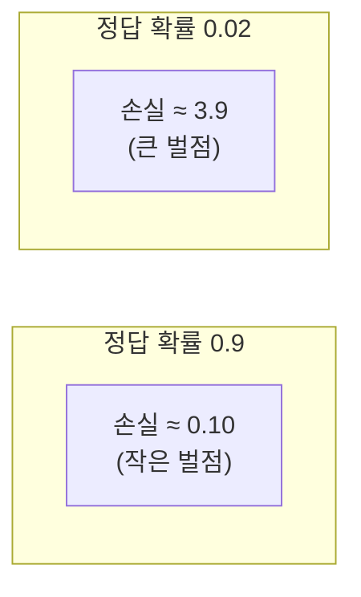
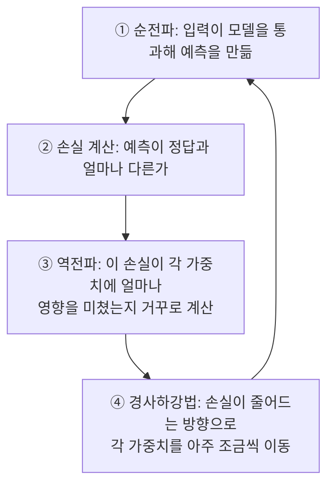
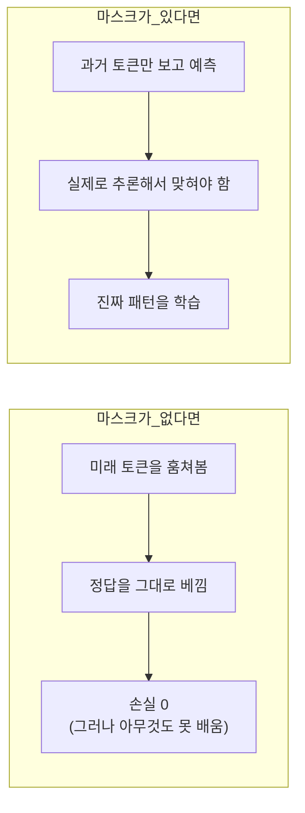
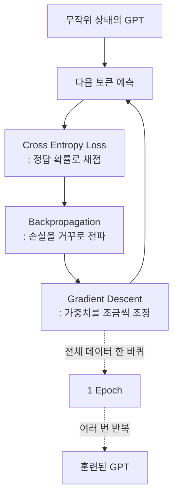

> 2편에서 던진 떡밥. 코잘 마스크는 지금 만드는 토큰이 미래의 토큰을 미리 훔쳐보지 못하게 가려버렸다. "시험에서 답안지를 미리 보면 안 되니까"라고 넘어갔지만, 이게 정확히 훈련 과정과 어떻게 맞물리는지는 미뤄뒀다. 이번 편에서 그 답을 완전히 회수한다.

## 사건의 발단: 처음의 GPT는 아무것도 모른다

3편에서 조립한 트랜스포머 블록들. 이 블록 안의 가중치 행렬들은 처음에는 전부 무작위 숫자로 채워진 상태에서 시작한다. 즉 갓 만들어진 GPT는 "나는" 다음에 무슨 단어가 와야 할지 전혀 감이 없다. 아무렇게나 확률을 뱉어내는 상태다.

```
"나는 오늘 [ ??? ]"
     ↓ 훈련 안 된 모델
"밥" 15%   "자동차" 14%   "학교" 13%   "먹었다" 12%   ... (거의 균등)
```

이 상태를 "실제로 그럴듯한 다음 단어를 높은 확률로 예측하는 상태"로 바꿔나가는 과정, 이게 바로 **훈련(training)**이다. 그리고 이 훈련이 가능하려면 딱 하나가 필요하다. **"지금 얼마나 틀렸는지"를 숫자로 채점할 방법.**

## 채점관 등장: 크로스 엔트로피 손실

모델이 다음 토큰을 예측하면, 사전에 있는 모든 토큰 각각에 대해 "이게 정답일 확률"을 하나씩 내놓는다. 정답 토큰이 무엇인지는 우리가 이미 알고 있다(원본 텍스트에 실제로 등장했던 토큰이니까). 그러니 "모델이 정답 토큰에 얼마나 높은 확률을 줬는가"를 보면 이 예측이 얼마나 잘했는지 알 수 있다.

```
정답 토큰: "먹었다"

모델 A의 예측: "먹었다"에 0.7의 확률 부여 → 꽤 잘 맞힘
모델 B의 예측: "먹었다"에 0.02의 확률 부여 → 완전히 헤맴
```

**크로스 엔트로피 손실(Cross Entropy Loss)**은 이 "정답에 부여한 확률"을 손실(loss)이라는 하나의 숫자로 바꿔주는 함수다. 핵심 원리는 이렇다.

```
손실 = -log(정답 토큰에 부여한 확률)
```

로그 함수를 씌우는 이유가 재미있다. 확률이 1에 가까울수록(정답을 거의 확신했을수록) 손실은 0에 가까워진다. 반대로 확률이 0에 가까울수록(정답을 거의 배제했을수록) 손실은 무한대에 가까울 정도로 폭증한다.



이 비대칭성이 중요하다. "정답이 아니라고 확신했는데 사실 정답이었던" 경우를 특히 강하게 벌준다. 애매하게 틀린 것과 자신만만하게 틀린 것을 다르게 취급하는 셈이다.

## 이 손실을 어떻게 줄이나: 역전파와 경사하강법

손실이라는 숫자 하나가 나왔다. 이제 이 숫자를 줄이는 방향으로 모델의 가중치들(3편에서 본 그 수많은 행렬들)을 조금씩 조정해야 한다. 여기서 등장하는 게 **역전파(Backpropagation)**와 **경사하강법(Gradient Descent)**이다.



역전파는 "이 가중치를 조금 늘리면 손실이 늘어날까 줄어들까"라는 정보(그래디언트)를 출력층에서 입력층 방향으로 거꾸로 흘려보내며 계산한다. 3편에서 봤던 숏컷 연결이 바로 이 그래디언트가 층을 깊게 통과하면서도 사라지지 않도록 지름길을 뚫어준 장치였다.

경사하강법은 이 그래디언트 정보를 받아서, 손실이 줄어드는 방향으로 가중치를 아주 조금씩 밀어준다. 이 과정을 문장 수백만, 수십억 개에 대해 반복하면, 모델은 점점 "그럴듯한 다음 단어"를 높은 확률로 예측하도록 스스로를 조정해나간다.

## 여기서 코잘 마스크의 정체가 드러난다

이제 2편의 떡밥을 회수할 차례다. 왜 미래 토큰을 가려야 했을까.

이 훈련 과정 자체가 **"주어진 문맥까지 보고 다음 토큰을 맞혀라"**라는 문제를 수없이 반복해서 푸는 구조다. 그런데 만약 모델이 어텐션 계산 중에 미래 토큰(즉 지금 맞혀야 할 정답)을 슬쩍 훔쳐볼 수 있다면 어떻게 될까. 모델은 그냥 "미리 본 정답"을 그대로 베껴서 손실을 0으로 만들어버릴 것이다. 겉으로는 완벽해 보이지만, 실제로는 아무것도 배우지 못한 가짜 학습이 된다.



즉 코잘 마스크는 단순히 "규칙이니까 지킨다"가 아니라, **훈련 시점에 모델이 정답을 커닝하지 못하게 막아서, 진짜로 문맥을 읽고 추론하는 능력을 갖추게 만드는 핵심 장치**였다. 1편의 슬라이딩 윈도(입력-정답 쌍을 만드는 방식), 2편의 코잘 마스크(미래를 가리는 장치), 그리고 이번 편의 크로스 엔트로피 손실(얼마나 틀렸는지 채점)이 여기서 하나로 이어진다.

## 한 바퀴 다 도는 데 걸리는 시간: 에포크

훈련 데이터 전체를 한 번 다 보는 것을 **1 에포크(epoch)**라고 부른다. 그런데 모델은 데이터를 딱 한 번만 보고 끝나지 않는다. 보통 같은 데이터를 여러 번 반복해서 본다.

```
1 epoch: 전체 데이터를 처음부터 끝까지 한 번 통과
2 epoch: 같은 데이터를 처음부터 끝까지 한 번 더 통과
...
```

왜 여러 번 반복할까. 데이터를 한 번 보는 것만으로는 가중치가 아주 조금씩만 이동하기 때문에, 안정적인 패턴을 충분히 학습하기 어렵다. 같은 데이터를 여러 각도(그 시점의 가중치 상태)에서 반복해서 보며, 손실을 점점 더 낮은 지점으로 밀어붙이는 것이다.

다만 무조건 많이 돌린다고 좋은 건 아니다. 너무 여러 번 반복하면 모델이 훈련 데이터의 세세한 패턴(심지어 노이즈)까지 통째로 외워버리는 **과대적합(overfitting)** 상태에 빠질 수 있다. 이걸 감시하기 위해 훈련에 쓰지 않은 별도의 검증 데이터에 대한 손실도 함께 추적한다. 훈련 손실은 계속 떨어지는데 검증 손실이 오히려 올라가기 시작하면, 그게 바로 "이제 그만 암기하기 시작했다"는 신호다.

## 이번 편의 전체 그림



이제 모델은 손실을 줄여가며 "다음 토큰을 그럴듯하게 예측하는 법"을 익혀나간다. 그런데 여기서 재미있는 질문이 하나 남는다. 같은 문장을 몇 번을 물어봐도, LLM은 매번 똑같은 답만 내놓지 않는다. 어떤 때는 딱딱하게, 어떤 때는 창의적으로 답한다. 확률로 정답을 맞히도록 훈련받은 모델이, 대체 왜 매번 다른 답을 내놓을 수 있는 걸까.

다음 편에서 그 비밀, "무작위성의 온도"를 다룬다.

---
*이 시리즈는 "밑바닥부터 만들면서 배우는 LLM"을 읽고 개인적으로 소화한 내용을 재구성한 글입니다.*
