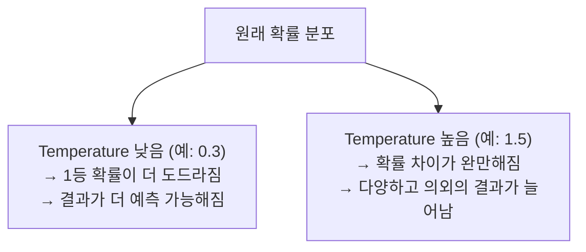
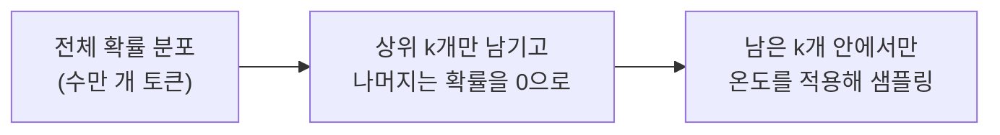
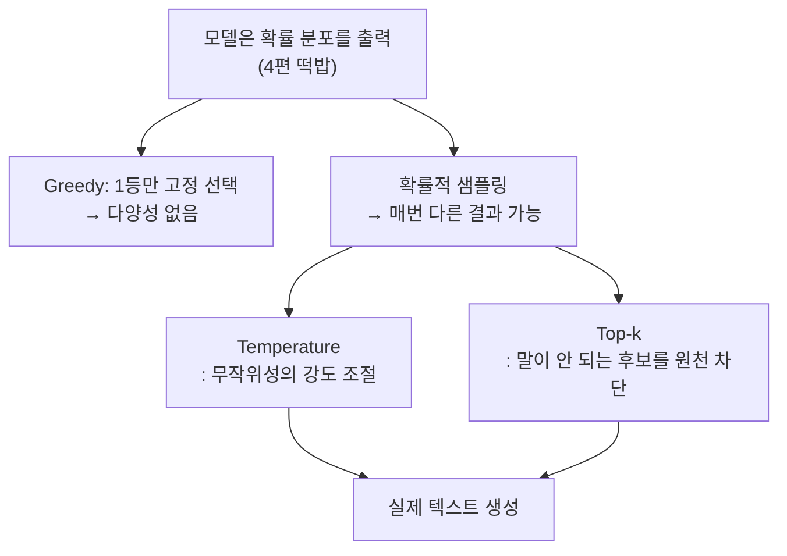

> 4편에서 확인했다. LLM은 크로스 엔트로피 손실을 채점관 삼아, "정답 토큰에 높은 확률을 주도록" 훈련된다. 그렇다면 같은 질문을 두 번 던지면 항상 같은 답이 나와야 하지 않을까. 그런데 실제로는 그렇지 않다. 어떤 때는 딱딱하게, 어떤 때는 의외의 답을 내놓는다. 확률 기계가 왜 매번 다른 선택을 하는 걸까.

## 사건의 발단: 모델은 답 하나가 아니라 확률 분포를 내놓는다

먼저 바로잡을 오해가 하나 있다. GPT는 "다음 토큰이 무엇이다"라고 딱 잘라 답하지 않는다. 사전에 있는 모든 토큰 각각에 대해 "이게 다음 토큰일 확률"을 전부 계산해서 내놓는다.

```
"나는 오늘 [ ??? ]"
     ↓
"밥"     42%
"학교"   18%
"영화"   11%
"친구"    9%
...(사전에 있는 나머지 수만 개 토큰)  나머지 20%
```

이 확률 분포에서 실제로 어떤 토큰을 "선택"할지는 별도의 규칙이 필요하다. 이 선택 규칙을 **디코딩 전략(decoding strategy)**이라고 부른다.

## 첫 번째 용의자: 항상 1등만 뽑기 (Greedy / Argmax)

가장 단순한 방법은 매번 확률이 가장 높은 토큰을 그대로 뽑는 것이다. 이걸 **탐욕적 디코딩(Greedy Decoding)**, 또는 최댓값을 고르는 연산 이름을 따서 **Argmax**라고 부른다.

```
"밥" 42% ← 1등, 무조건 이걸 선택
```

이 방식은 같은 입력에 대해 언제나 같은 출력을 내놓는다. 예측 가능하다는 장점이 있지만, 동시에 치명적인 단점도 있다. **항상 가장 무난하고 뻔한 답만 고른다.** 창의적인 글쓰기나 다양한 답변이 필요한 상황에서는 재미없고 반복적인 결과가 나오기 쉽다. 게다가 실제로 문장을 여러 토큰에 걸쳐 생성할 때, 1등만 계속 고르는 방식은 종종 이상하게 반복되는 문장("그리고 그리고 그리고...")을 만들어내기도 한다. 이 용의자는 기각이다.

## 진범: 확률 자체를 주사위 삼아 뽑기

그래서 실제 서비스에서 쓰는 방식은 다르다. 확률 분포 그 자체를 **주사위의 눈금**처럼 활용해서, 확률에 비례하는 만큼 그 토큰이 뽑힐 기회를 준다. "밥"이 42%라면 42%의 확률로, "학교"가 18%라면 18%의 확률로 실제로 뽑히는 것이다. 이러면 매번 똑같은 답이 아니라, 확률 분포를 따르는 범위 안에서 결과가 조금씩 달라진다.

**바로 이게 4편 떡밥의 답이다.** LLM이 같은 질문에도 매번 다른 답을 내놓을 수 있는 이유는, 모델이 확률을 잘못 계산해서가 아니라 **애초에 확률에 따라 무작위로 뽑는 방식으로 설계되어 있기 때문**이다. 확률 기계이기 때문에 결정론적이지 않은 결과가 나오는 것, 이게 겉보기 모순처럼 느껴졌던 부분의 정체다.

## 이 무작위성의 강도를 조절하는 손잡이: 온도(Temperature)

그런데 이 무작위성을 아무 제어 없이 그대로 쓰면, 가끔 터무니없는 저확률 토큰이 튀어나올 수 있다. 그래서 확률 분포의 "날카로움"을 조절하는 손잡이를 하나 마련해뒀다. 이게 **온도(Temperature)**다.



동작 원리는 각 토큰의 확률 점수를 소프트맥스에 넣기 전에, 온도 값으로 나눠주는 것이다.

```
조정된 점수 = 원래 점수 / Temperature
```

온도가 1보다 작으면(예: 0.3), 점수를 나누는 값이 작으니 원래 점수 차이가 더 크게 벌어진다. 그러면 소프트맥스를 거쳤을 때 1등 토큰의 확률이 더욱 도드라지게 강조된다. 결과적으로 "안전하고 무난한" 답이 나올 확률이 높아진다.

반대로 온도가 1보다 크면(예: 1.5), 점수 차이가 완만해지면서 확률 분포가 평평해진다. 원래는 확률이 낮았던 토큰들도 뽑힐 기회가 늘어난다. 결과적으로 더 다양하고, 때로는 더 창의적인(혹은 더 엉뚱한) 답이 나올 가능성이 커진다.

```
온도 낮음(0.3):   "밥" 78%   "학교" 12%   "영화" 5%    ...
원래 분포(1.0):    "밥" 42%   "학교" 18%   "영화" 11%   ...
온도 높음(1.5):   "밥" 28%   "학교" 20%   "영화" 16%   ...
```

숫자 자체보다 방향을 기억하는 게 중요하다. **온도를 낮추면 안정적이고 뻔해지고, 온도를 높이면 다양하고 예측 불가능해진다.** 실무에서 코드를 생성할 때는 온도를 낮게, 창작 글쓰기를 시킬 때는 온도를 다소 높게 잡는 이유가 여기에 있다.

## 마지막 안전장치: 탑-k 샘플링

온도만으로는 부족한 경우가 있다. 온도를 아무리 높여도, 사전 전체(수만 개 토큰)에 걸쳐 극히 낮은 확률이 배분되어 있는 토큰이 여전히 뽑힐 여지가 남는다. 극단적으로 낮은 확률이라도 "0이 아니면" 언젠가는 뽑힐 수 있다는 뜻이다. 이런 경우 문법이 깨지거나 전혀 맥락에 안 맞는 토큰이 튀어나올 위험이 있다.

그래서 **탑-k 샘플링(Top-k Sampling)**을 함께 쓴다. 방법은 단순하다. 확률이 가장 높은 상위 k개의 토큰만 후보로 남기고, 나머지는 아예 후보에서 제외해버린다.



예를 들어 k=3이라면, "밥", "학교", "영화" 세 개만 후보로 남기고 나머지는 아무리 확률이 있어도 뽑히지 않는다. 이러면 "말이 안 되는 토큰이 우연히 뽑힐" 위험을 원천적으로 차단하면서도, 1등만 고정으로 뽑는 것보다는 다양성을 유지할 수 있다. 온도와 탑-k는 보통 같이 쓰인다. 탑-k로 후보를 추려낸 다음, 그 후보들 안에서 온도로 무작위성의 강도를 조절하는 식이다.

## 이번 편의 전체 그림



이제 LLM이 왜 매번 다른 답을 내놓을 수 있는지, 그리고 그걸 어떻게 제어하는지까지 확인했다. 그런데 여기서 궁금증이 하나 남는다. 이렇게 처음부터 몇 시간, 며칠씩 걸려 훈련한 모델을, 매번 처음부터 다시 훈련해야 할까. 다행히 그럴 필요가 없다. 이미 방대한 데이터로 훈련된 "뇌"를 통째로 빌려와서, 원하는 용도에 맞게 다시 손보는 방법이 있다.

다음 편에서는 이미 훈련된 가중치를 불러와, 그걸 새로운 목적에 맞게 재활용하는 과정을 다룬다.

---
*이 시리즈는 "밑바닥부터 만들면서 배우는 LLM"을 읽고 개인적으로 소화한 내용을 재구성한 글입니다.*
