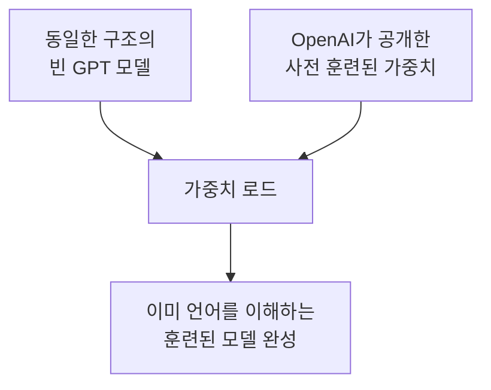
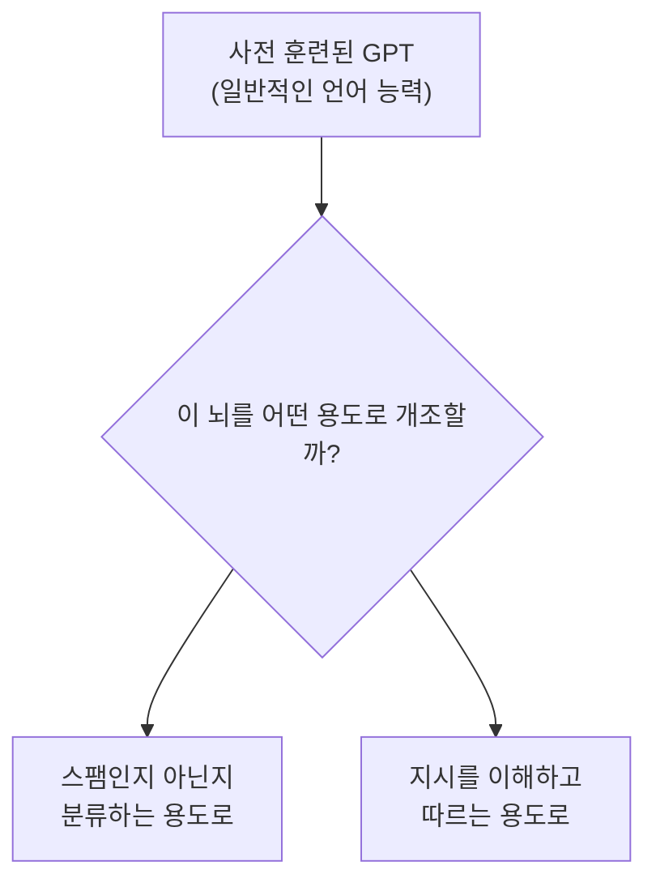
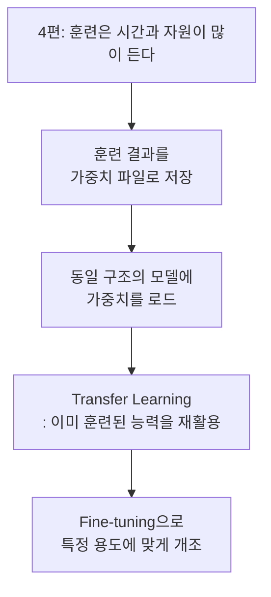

> 4편에서 GPT를 처음부터 훈련시키는 과정을 봤다. 무작위 상태에서 시작해서, 손실을 줄여가며 서서히 똑똑해지는 과정. 그런데 이 훈련, 실제로는 대규모 데이터로 며칠에서 몇 주씩 걸린다. 매번 이걸 처음부터 다시 해야 한다면 아무도 LLM을 실제로 못 썼을 거다. 다행히 그럴 필요가 없다.

## 사건의 발단: 가중치란 결국 숫자 뭉치다

3편에서 GPT의 정체를 이렇게 정리했다. 트랜스포머 블록이 여러 개 쌓여 있고, 그 안에는 어텐션의 Query·Key·Value 행렬, FFN의 가중치 행렬 같은 수많은 숫자들이 들어차 있다고. 4편에서는 이 숫자들이 훈련 과정을 거치며 조금씩 "더 나은 값"으로 조정된다는 것도 확인했다.

여기서 중요한 사실 하나. **훈련이 끝난 모델이란, 결국 "잘 조정된 숫자들의 거대한 표"에 불과하다.** 이 표(가중치)를 파일로 저장해두면, 나중에 다시 불러와서 그대로 재사용할 수 있다.

이게 바로 모델을 "저장하고 불러온다(save & load)"는 개념의 핵심이다. 며칠씩 걸린 훈련 결과를 파일 하나(정확히는 숫자들의 스냅샷)에 통째로 담아두는 것이다.

## 진짜 사건: 남이 이미 훈련시킨 뇌를 빌려올 수 있다

여기서 한 걸음 더 나아가면 훨씬 흥미로운 일이 가능해진다. 내가 직접 훈련시키지 않고, **다른 누군가가 이미 방대한 데이터로 훈련시켜 둔 가중치**를 그대로 가져다 쓰는 것이다.

예를 들어 GPT-2 같은 모델은, 이미 인터넷의 방대한 텍스트로 훈련된 가중치가 공개되어 있다. 이 가중치를 다운로드해서, 내가 3편에서 조립한 것과 동일한 구조의 GPT 모델에 그대로 끼워 넣을 수 있다.

여기서 결정적인 전제 조건이 하나 있다. **모델의 구조(트랜스포머 블록 개수, 각 층의 차원 크기 등)가 정확히 일치해야 한다.** 가중치는 결국 "이 위치에는 이런 숫자가 들어간다"는 표이기 때문에, 그릇(모델 구조)의 모양이 다르면 그 표를 그대로 부어 넣을 수 없다. 마치 특정 자동차 부품이 그 차종에만 맞는 것과 비슷하다.

## 이게 왜 중요한가: 밑바닥부터 vs 빌려서 시작하기

지금까지 1편부터 4편까지 다룬 내용은 사실 "밑바닥부터 GPT를 직접 훈련시키는" 이야기였다. 그런데 실무에서는 이 과정을 처음부터 전부 밟는 경우가 오히려 드물다.

| 방식 | 특징 |
|---|---|
| 밑바닥부터 훈련 (Pretraining from scratch) | 막대한 데이터·시간·연산 자원 필요, 언어의 기초 문법·상식·패턴을 통째로 처음부터 습득 |
| 사전 훈련된 가중치 로드 | 이미 언어 전반을 이해하는 상태에서 시작, 필요한 만큼만 추가로 다듬으면 됨 |

즉 사전 훈련(pretraining)은 "일반적인 언어 능력"을 갖추는 매우 비싼 과정이고, 이미 그 결과물(가중치)이 존재한다면 이걸 재사용하는 게 압도적으로 효율적이다. 이런 접근을 **전이 학습(Transfer Learning)**이라고 부른다. 한 곳에서 배운 지식을 다른 용도로 옮겨서(transfer) 재활용한다는 뜻이다.

## 그럼 이 "빌린 뇌"로 뭘 할 수 있나

여기서 중요한 질문이 남는다. 이미 훈련된 가중치를 통째로 빌려왔다고 해서 끝이 아니다. 이 모델은 지금 "다음에 올 그럴듯한 단어를 예측하는" 일반적인 능력만 갖고 있을 뿐, 내가 원하는 특정 작업(예: 스팸 메일 분류, 특정 지시를 따르는 응답 생성)에 맞춰져 있지는 않다.

이렇게 이미 훈련된 모델을 가져와서, 특정 목적에 맞게 추가로 조정하는 과정을 **미세 튜닝(Fine-tuning)**이라고 부른다. 처음부터 다시 훈련시키는 게 아니라, 이미 갖춰진 언어 능력 위에 "특정 임무 수행법"만 얹어주는 방식이다.

## 이번 편의 전체 그림

이제 준비는 다 됐다. 이미 언어를 이해하는 뇌를 손에 넣었다. 그런데 이 뇌를 실제로 개조하려면, 데이터를 모델이 소화할 수 있는 형태로 깔끔하게 다듬어서 먹여야 한다. 그리고 바로 여기서, 당신이 이 책을 읽으며 가장 오래 붙잡고 씨름했던 구간이 등장한다. 문장 길이가 제각각인 데이터를 어떻게 하나의 배치로 묶는가. 다음 편에서 이 문제를 정면으로 파헤친다.

---
*이 시리즈는 "밑바닥부터 만들면서 배우는 LLM"을 읽고 개인적으로 소화한 내용을 재구성한 글입니다.*
