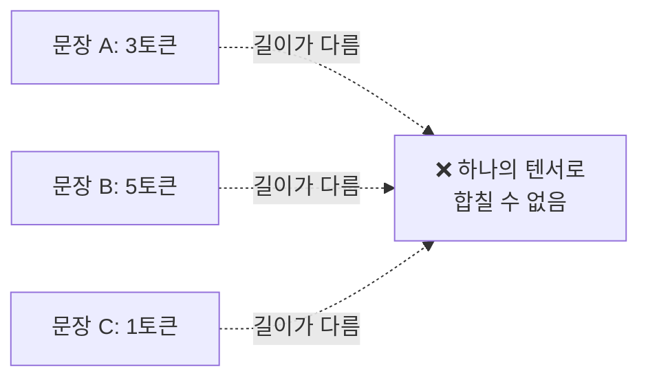
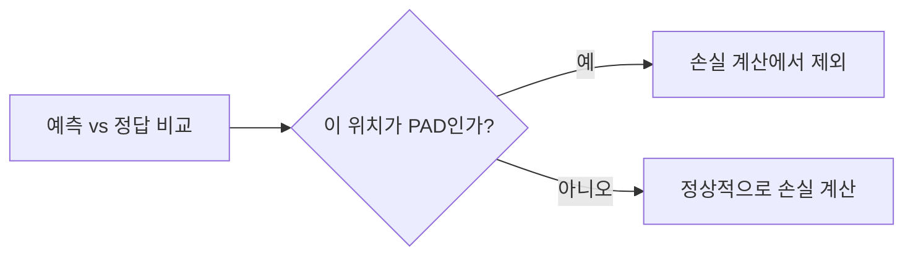
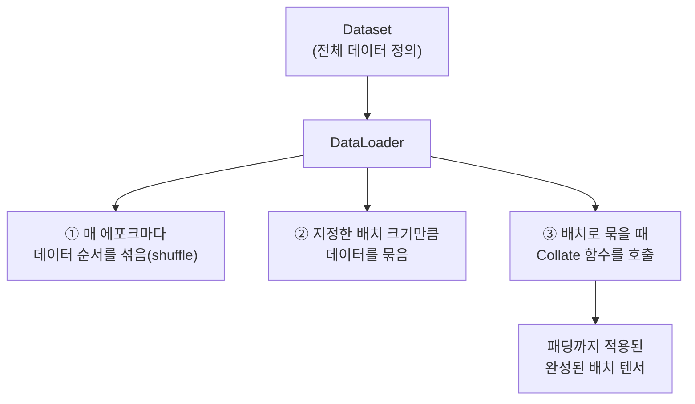
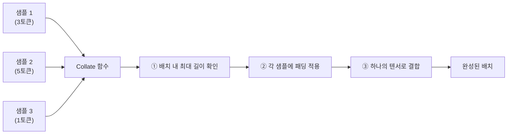
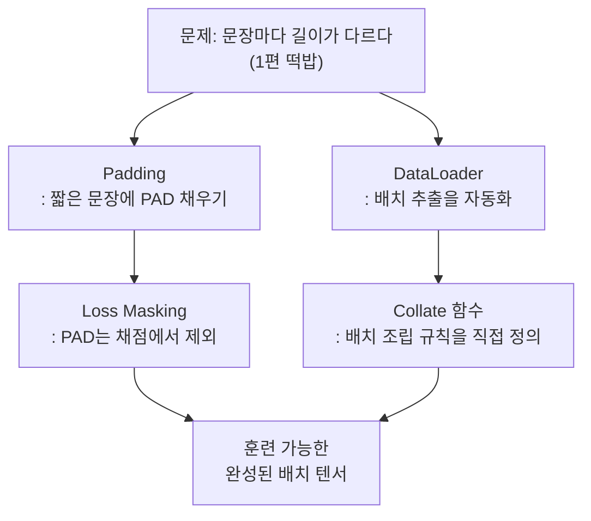

> 1편 마지막에 슬쩍 스치듯 지나간 문제가 하나 있었다. 문장마다 토큰 개수가 다 다른데, 이걸 어떻게 컴퓨터가 한꺼번에 처리할 수 있는 고정된 크기의 숫자 뭉치로 만들까. 지금까지는 이 질문을 미뤄뒀다. 이번 편에서 정면으로 마주한다.

## 사건의 발단: 컴퓨터는 들쭉날쭉한 걸 싫어한다

훈련 데이터를 아무 문장 세 개만 가져와보자.

```
"나는 밥을 먹었다"       → 토큰 3개
"어제 친구를 만나서 정말 즐거웠다" → 토큰 5개
"안녕" → 토큰 1개
```

GPT를 훈련시킬 때는 이런 문장들을 하나씩 개별로 처리하지 않는다. 여러 개를 한 번에 묶어서(배치, batch) 처리해야 GPU 연산을 효율적으로 쓸 수 있다. 그런데 GPU가 처리하는 연산 단위인 텐서(tensor)는 **행렬처럼 정해진 고정 크기**를 가져야 한다. 즉 한 배치 안에 있는 문장들은 전부 같은 길이여야 한다는 뜻이다.



여기서 딱 두 가지 선택지가 있다. 문장 하나씩 따로따로 처리하거나, 아니면 길이를 억지로 맞춰서 한꺼번에 처리하거나. 전자는 GPU의 병렬 연산 능력을 거의 쓰지 못해서 극도로 느리다. 그래서 실무에서는 후자를 택한다. 길이를 맞추는 이 작업이 바로 **패딩(Padding)**이다.

## 첫 번째 장치: 패딩(Padding)

패딩은 단순하다. 배치 안에서 가장 긴 문장을 기준으로 삼고, 나머지 짧은 문장들 뒤에 의미 없는 특수 토큰(보통 `<PAD>`)을 채워 넣어 길이를 강제로 맞춘다.

```
가장 긴 문장 기준: 5토큰

"나는 밥을 먹었다"                  → [나는, 밥을, 먹었다, PAD, PAD]
"어제 친구를 만나서 정말 즐거웠다"    → [어제, 친구를, 만나서, 정말, 즐거웠다]
"안녕"                              → [안녕, PAD, PAD, PAD, PAD]
```

이제 세 문장 모두 5개 토큰짜리로 통일됐다. 이러면 하나의 텐서로 깔끔하게 묶여서 GPU에 한꺼번에 올릴 수 있다.

하지만 여기서 중요한 함정이 하나 있다. **`<PAD>`는 진짜 단어가 아니다.** 만약 이 패딩 토큰을 다른 진짜 단어들처럼 손실 계산에 그대로 포함시켜버리면, 모델은 "의미 없는 채움 토큰을 잘 예측하는 법"까지 열심히 학습하게 된다. 쓸데없는 일에 학습 능력을 낭비하는 셈이다.

그래서 손실을 계산할 때, 패딩 토큰이 있는 위치는 마스킹(masking)해서 아예 손실 계산에서 제외한다. "이 자리는 채우기용일 뿐이니 채점 대상에서 빼라"고 표시해주는 것이다.



한 가지 더. 패딩을 문장 뒤에 붙일지(right padding) 앞에 붙일지(left padding)도 상황에 따라 다르다. 텍스트를 생성하는 용도(다음 토큰을 계속 이어 붙이는 경우)에서는, 진짜 마지막 토큰 뒤에 패딩이 끼면 "다음 토큰"의 위치가 헷갈릴 수 있어 왼쪽 패딩을 쓰는 경우가 흔하다. 반대로 분류처럼 문장 전체를 한 번에 보고 판단하는 작업에서는 오른쪽 패딩이 자연스러운 경우가 많다. 정답이 하나로 정해진 규칙은 아니고, 작업의 목적에 따라 결정되는 부분이다.

## 두 번째 장치: 이 모든 걸 자동으로 해주는 DataLoader

패딩까지는 이해했다. 그런데 매번 배치를 만들 때마다 이 작업(가장 긴 문장 찾기 → 나머지에 패딩 붙이기 → 텐서로 변환하기)을 손으로 반복할 순 없다. 데이터가 수백만 개라면 더더욱 그렇다.

이 반복 작업을 자동화해주는 게 파이토치의 **DataLoader**다. DataLoader를 이해하려면 먼저 역할이 다른 두 가지 개념을 구분해야 한다.

| 구성 요소 | 역할 |
|---|---|
| **Dataset** | 전체 데이터가 어디 있고, 하나씩 어떻게 꺼내오는지 정의 (창고 목록) |
| **DataLoader** | Dataset에서 여러 개를 꺼내와 배치로 묶고, 순서를 섞고, 반복적으로 공급 (창고에서 실제로 물건을 꺼내 트럭에 싣는 역할) |



DataLoader는 훈련 루프(4편에서 본 그 반복 과정)가 도는 동안, "다음 배치 주세요"라고 요청할 때마다 자동으로 몇 개의 샘플을 골라 하나의 배치로 조립해서 건네준다.

## 세 번째 장치: Collate 함수, 조립 방법을 정하는 설계도

DataLoader가 배치를 "묶는다"는 건 알겠는데, 정확히 어떤 방식으로 묶을지는 누가 정할까. 여기서 등장하는 게 **Collate 함수(collate_fn)**다.

`collate`는 "한데 모아서 정리하다"는 뜻이다. DataLoader가 Dataset에서 개별 샘플 여러 개를 꺼내오면, 이 낱개 샘플들을 어떻게 하나의 배치 텐서로 합칠지 정확히 지시하는 함수가 바로 Collate 함수다.



기본 Collate 함수는 단순한 경우(길이가 이미 같은 이미지 데이터 등)에는 그냥 텐서를 쌓기만 하면 되지만, LLM처럼 문장 길이가 제각각인 경우에는 **직접 정의한 Collate 함수**가 필요하다. 이 함수 안에 "배치에서 가장 긴 길이를 찾고, 나머지에 패딩을 채우고, 패딩 위치는 손실 계산에서 제외하도록 표시한다"는 로직을 전부 넣어준다.

정리하면 이렇게 역할이 나뉜다.

```
Dataset       → "데이터가 어디 있고 어떻게 하나씩 꺼내는가"
DataLoader    → "언제, 몇 개씩, 어떤 순서로 꺼내는가"
Collate 함수  → "꺼낸 것들을 정확히 어떻게 하나의 배치로 조립하는가"
```

**바로 이게 1편에서 슬쩍 지나갔던 질문의 답이다.** "왜 개수를 맞춰야 하고, 데이터 로더는 왜 필요한가"라는 질문은, 결국 GPU가 고정 크기의 텐서만 처리할 수 있다는 제약에서 시작해서, 패딩(길이 맞추기) → DataLoader(반복 자동화) → Collate 함수(정확한 조립 규칙)라는 3단 구조로 풀린다.

## 이번 편의 전체 그림



이 구간이 왜 유독 까다롭게 느껴졌는지 이해가 간다. 패딩, 마스킹, DataLoader, Collate 함수가 서로 맞물려 있는데, 책에서는 이 각각을 코드 조각으로 흩어서 보여주다 보니 전체 그림이 한눈에 안 들어오기 쉬운 구조였다. 하지만 결국 이 넷은 "고정 크기가 필요한 GPU"와 "제각각인 문장 길이" 사이의 간극을 메우는 하나의 파이프라인일 뿐이다.

이제 데이터를 배치로 만드는 법까지 갖췄다. 다음 편에서는 이렇게 준비한 데이터로, 6편에서 빌려온 뇌를 실제로 "스팸 메일을 판별하는 판사"로 개조하는 과정을 다룬다.

---
*이 시리즈는 "밑바닥부터 만들면서 배우는 LLM"을 읽고 개인적으로 소화한 내용을 재구성한 글입니다.*
