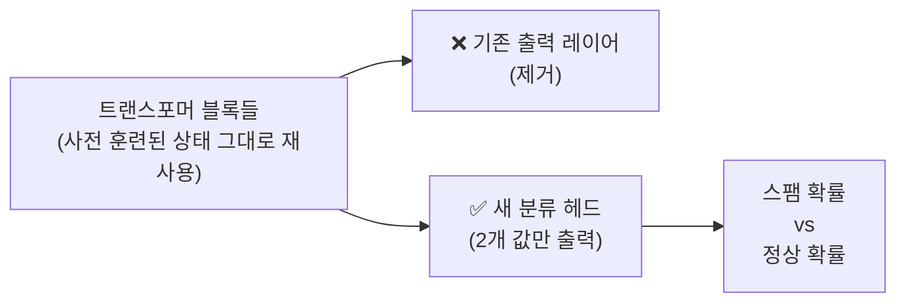
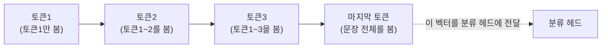
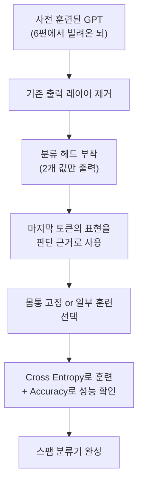

> 6편에서 예고했다. 사전 훈련된 뇌를 빌려왔으니, 이걸 특정 용도로 "개조"해야 한다고. 7편에서는 데이터를 깔끔한 배치로 만드는 법을 갖췄다. 이제 재료는 다 준비됐다. 이번 편에서 그 뇌를, "스팸 메일인지 아닌지 판단하는 판사"로 실제로 개조해본다.

## 사건의 발단: GPT는 원래 판사가 아니다

지금까지 GPT가 하는 일은 딱 하나였다. **"주어진 문맥을 보고, 다음에 올 토큰의 확률을 계산한다."** 3편에서 본 GPT 구조의 맨 끝을 다시 떠올려보자.


출력 레이어는 "사전 크기(수만 개)"만큼의 값을 내놓는다. 각 값이 "이 토큰이 다음에 올 확률"을 의미한다. 그런데 스팸 분류라는 작업은 이것과 전혀 다르다. 필요한 건 딱 두 가지 값뿐이다. "스팸이다" 또는 "스팸이 아니다."

즉 지금 이 모델의 출력 방식 자체가 스팸 분류라는 목적에 맞지 않는다. 그렇다고 모델 전체를 처음부터 다시 만들 필요는 없다. **딱 마지막 부분만 갈아 끼우면 된다.**

## 첫 번째 수술: 출력 레이어를 분류 헤드로 교체

수술은 간단하다. "사전 크기만큼의 확률을 내놓던" 기존 출력 레이어를 떼어내고, 그 자리에 **"딱 두 개의 값(스팸 / 스팸 아님)만 내놓는 작은 레이어"**를 새로 붙인다. 이걸 **분류 헤드(Classification Head)**라고 부른다.



여기서 중요한 지점이 있다. **몸통(트랜스포머 블록들)은 그대로 재사용한다.** 이 블록들은 이미 방대한 텍스트로 훈련되면서 "문맥을 이해하는 능력" 자체를 익힌 상태다. 문법, 단어 간 관계, 대략적인 의미 파악 능력 같은 건 처음부터 다시 배울 필요가 없다. 바꾸는 건 오직 "그 이해를 바탕으로 최종 판단을 어떻게 내리는가"라는 마지막 판단 부분뿐이다.

## 어느 토큰의 표현을 판단 근거로 쓸까

한 가지 더 결정해야 할 게 있다. 문장 하나가 트랜스포머 블록들을 통과하면, 사실 토큰 개수만큼의 벡터 표현이 나온다. "이 메일은 무료 상품에 당첨되셨습니다"라는 문장이 10개 토큰이라면, 10개의 벡터가 나오는 것이다. 그런데 판단(스팸 여부)은 딱 하나만 필요하다. 어떤 벡터를 기준으로 판단할까.

GPT 계열처럼 코잘 마스크(2편 참고)를 쓰는 모델은, **마지막 토�큰의 표현**을 이 문장 전체를 대표하는 값으로 사용하는 경우가 많다. 왜 마지막 토큰일까. 코잘 마스크 구조 때문에 각 토큰은 자기 이전의 토큰들만 볼 수 있었다. 즉 **문장의 맨 마지막 토큰은, 그 문장 전체(처음부터 끝까지)를 다 보고 만들어진 유일한 위치**다. 앞쪽 토큰들은 아직 뒤에 뭐가 올지 모르는 상태에서 만들어진 표현이지만, 마지막 토큰은 전체 문맥을 다 반영한 표현이라는 뜻이다.



## 두 번째 수술: 어디까지 다시 훈련시킬 것인가

몸통을 그대로 두고 분류 헤드만 새로 붙였다고 해서, 몸통을 아예 건드리지 않는다는 뜻은 아니다. 여기서 선택지가 갈린다.

| 전략 | 설명 |
|---|---|
| 몸통을 완전히 고정(freeze) | 새로 붙인 분류 헤드만 훈련. 빠르고 데이터가 적어도 되지만, 몸통이 이 작업에 맞게 미세 조정되지는 않음 |
| 몸통 일부(마지막 블록들)만 함께 훈련 | 분류 헤드 + 마지막 몇 개 블록을 함께 업데이트. 조금 더 많은 계산이 필요하지만, 이 작업에 맞게 표현을 더 정교하게 다듬을 수 있음 |
| 몸통 전체를 함께 훈련 | 가장 유연하지만, 사전 훈련된 능력이 오히려 무너질 위험(과대적합)도 있고 계산 비용도 가장 큼 |

실무에서는 데이터 양과 컴퓨팅 자원 사정에 따라 이 중 하나를 고른다. 데이터가 적다면 몸통은 최대한 고정해두는 쪽이 안전하다. 이미 잘 훈련된 부분을 적은 데이터로 어설프게 흔들어놓으면, 오히려 원래 갖고 있던 좋은 능력을 잃어버릴 수 있기 때문이다.

## 채점 방식도 달라진다: 분류 손실과 정확도

4편에서 크로스 엔트로피 손실을 "정답 토큰에 얼마나 높은 확률을 줬는가"로 계산했던 걸 기억할 것이다. 분류 작업에서도 크로스 엔트로피를 그대로 쓴다. 다만 이번엔 "다음 토큰"이 아니라 "스팸이다 / 아니다"라는 두 개의 선택지 중 정답에 얼마나 높은 확률을 줬는지를 채점한다.

```
"무료 상품에 당첨되셨습니다"
     ↓ 분류 헤드 통과
스팸일 확률: 0.94    정상일 확률: 0.06
     ↓ 실제 정답: 스팸
크로스 엔트로피 손실 = -log(0.94) ≈ 매우 작음 (잘 맞힘)
```

그리고 분류 작업에는 손실 외에 훨씬 직관적인 지표가 하나 더 있다. **정확도(Accuracy)**, 즉 "전체 판단 중 몇 %를 실제로 맞혔는가"다. 손실은 학습을 위한 채점 기준이고, 정확도는 사람이 실제 성능을 가늠하기 위한 지표라고 구분하면 이해가 쉽다.

## 이번 편의 전체 그림



**이게 6편 떡밥의 첫 번째 회수다.** "빌린 뇌를 어떻게 내 것으로 만드는가"라는 질문의 답은, 몸통은 최대한 보존하고 마지막 판단 부위만 목적에 맞게 갈아 끼우는 방식이었다.

그런데 스팸 분류는 사실 "정해진 선택지 중 하나를 고르는" 비교적 단순한 개조였다. 요즘 흔히 쓰이는 ChatGPT 같은 모델은 이보다 훨씬 복잡한 일을 한다. "이메일 요약해줘", "이 코드 버그 찾아줘" 같은, 사실상 무한한 형태의 지시를 이해하고 그에 맞는 자유로운 형태의 답변을 만들어낸다. 이건 두 개의 값 중 하나를 고르는 것과는 차원이 다른 개조가 필요하다.

다음 편에서 이 두 번째 개조, **지시를 이해하고 따르는 모델**을 만드는 과정을 다룬다.

---
*이 시리즈는 "밑바닥부터 만들면서 배우는 LLM"을 읽고 개인적으로 소화한 내용을 재구성한 글입니다.*
