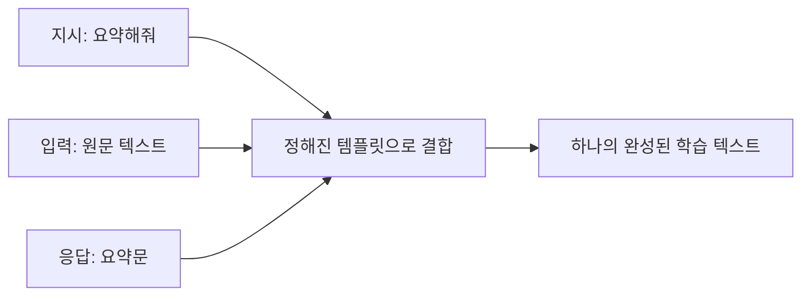
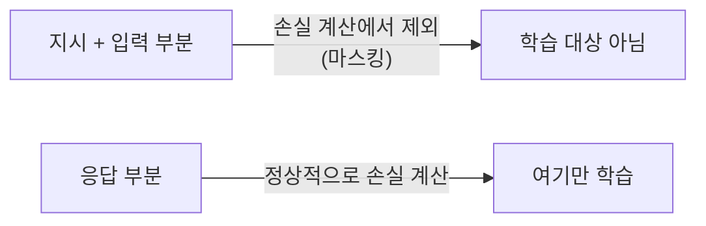
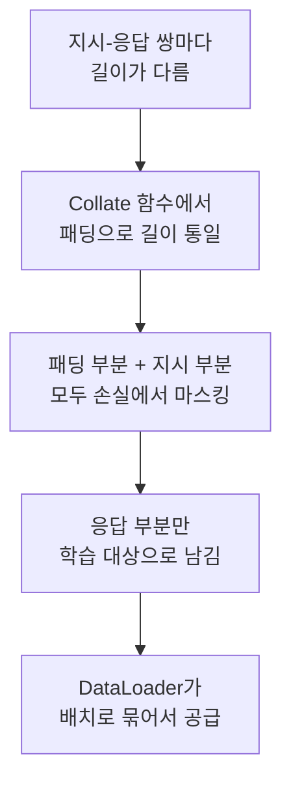
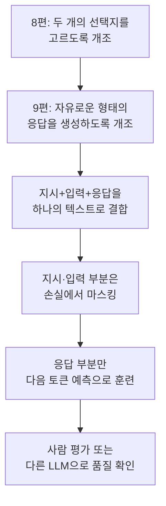

> 8편에서 뇌를 개조하는 첫 번째 방법을 봤다. 몸통은 그대로 두고, 판단 부위만 갈아 끼우는 방식으로 "스팸이다 / 아니다"라는 두 개의 선택지 중 하나를 고르게 만들었다. 그런데 ChatGPT는 "이 이메일 요약해줘"처럼 사실상 무한한 형태의 요청을 받아, 그때그때 자유로운 형태의 답을 만들어낸다. 두 개의 선택지와는 완전히 다른 문제다. 이걸 어떻게 가르칠까.

## 사건의 발단: 선택지가 없으면 어떻게 채점하나

8편의 스팸 분류기는 "스팸" 또는 "정상" 중 하나를 고르는 문제였다. 정답이 명확하게 두 가지뿐이니 채점이 쉬웠다. 그런데 "파리 여행 3박 4일 일정을 짜줘"라는 지시에는 정해진 정답이 하나가 아니다. 그럴듯한 답이 수없이 많을 수 있다.

여기서 발상을 바꿔야 한다. **"정확히 어떤 문장을 만들어야 하는가"를 미리 정해두고, 그 문장을 토큰 하나하나 순서대로 예측하도록 훈련시키면 된다.** 사실 이건 완전히 새로운 방식이 아니다. 1편부터 계속 봐온 "다음 토큰을 예측하는" 그 기본 원리를, 지시-응답이라는 형태의 데이터에 그대로 적용하는 것뿐이다.

## 첫 단추: 지시 데이터셋 준비하기

지시 미세튜닝(Instruction Fine-Tuning)에 쓰는 데이터는 이런 모양을 하고 있다.

```
지시(Instruction): "다음 문장을 한 문장으로 요약해줘."
입력(Input, 선택적): "긴 원문 텍스트..."
응답(Response): "요약된 한 문장."
```

이 세 부분을 하나의 프롬프트 형식으로 합쳐서, 모델에게 통째로 하나의 긴 텍스트처럼 보여준다.



여기서 중요한 건, 이렇게 만든 텍스트 전체를 그냥 "다음 토큰 예측" 훈련에 넣는다는 점이다. 모델은 "지시와 입력이 이렇게 주어졌을 때, 그다음에 응답 부분의 토큰들이 순서대로 이어진다"는 패턴을 반복해서 학습한다.

## 여기서 다시 등장하는 손실 마스킹

7편에서 패딩 토큰을 손실 계산에서 제외했던 걸 기억할 것이다. 지시 미세튜닝에서도 비슷한 장치가 하나 더 필요하다. **지시와 입력 부분까지 모델이 "예측"해야 할 대상으로 채점하면 곤란하다.** 우리가 원하는 건 "응답 부분을 잘 생성하는 능력"이지, "지시문 자체를 잘 예측하는 능력"이 아니기 때문이다.



그래서 훈련 배치를 만들 때, 지시와 입력 부분의 토큰들은 손실 계산에서 마스킹으로 제외하고, 오직 응답 부분의 토큰들만 실제로 "이걸 잘 맞혀라"는 채점 대상으로 삼는다. 7편의 패딩 마스킹과 원리가 완전히 같다. 다만 "PAD라서 빼는가" 대신 "지시문이라서 빼는가"라는 차이만 있을 뿐이다.

## 훈련 배치 만들기: 이번에도 등장하는 익숙한 얼굴들

지시 데이터도 결국 문장이니, 지시마다 길이가 제각각이다. 7편에서 봤던 패딩, DataLoader, Collate 함수가 여기서도 똑같이 필요하다.



이 지점에서 시리즈 전체가 하나로 겹쳐지는 게 보인다. 1편의 토큰화, 2편의 어텐션, 3편의 GPT 블록, 4편의 손실 계산과 훈련 루프, 6편의 사전 훈련된 가중치, 7편의 패딩과 배치 처리. 이 모든 장치가 지금 이 순간, "지시를 이해하고 응답하는 모델을 만든다"는 하나의 목표를 위해 그대로 재사용되고 있다.

## 훈련이 끝나면: 실제로 잘 따르는지 어떻게 확인하나

8편의 스팸 분류기는 정확도(맞았다/틀렸다) 하나로 성능을 쉽게 잴 수 있었다. 그런데 지시 미세튜닝은 그렇게 간단하지 않다. "파리 여행 일정을 짜줘"라는 지시에 대한 응답은, 정답이 하나로 정해져 있지 않기 때문에 단순히 "맞았다/틀렸다"로 채점할 수 없다.

그래서 실무에서는 이런 방식들을 함께 쓴다.

- 모델이 생성한 응답을 사람이 직접 읽고 품질을 평가
- 더 크고 성능이 검증된 다른 LLM에게 "이 응답이 지시를 잘 따랐는지" 채점을 맡기는 방식
- 정해진 평가 데이터셋(벤치마크)에 대해 점수를 매기는 방식

핵심은, 스팸 분류처럼 "정답이 명확한 문제"와 달리 지시를 따르는 능력은 본질적으로 "얼마나 그럴듯하고 유용한가"라는 다소 주관적인 기준으로 평가된다는 점이다.

## 이번 편의 전체 그림



**이게 6편 떡밥의 두 번째, 마지막 회수다.** 빌린 뇌를 내 것으로 만드는 두 가지 방식을 이제 다 확인했다. 정해진 선택지 중 고르게 만들거나(8편), 자유로운 응답을 생성하도록 만들거나(9편). 둘 다 원리는 같았다. 몸통(언어 이해 능력)은 최대한 보존하고, 목적에 맞게 마지막 단계만 다시 훈련시키는 것.

이제 1편부터 여기까지 뿌려둔 모든 떡밥이 사실상 다 회수됐다. 딱 하나만 남았다. 아주 처음, 1편에서 던졌던 그 질문. "토큰이라는 단위가 왜 나중에 비용과 속도의 정체가 되는가." 다음 편, 이 시리즈의 마지막 편에서 이 모든 조각을 한 줄로 꿰어 완성된 그림을 보여준다.

---
*이 시리즈는 "밑바닥부터 만들면서 배우는 LLM"을 읽고 개인적으로 소화한 내용을 재구성한 글입니다.*
