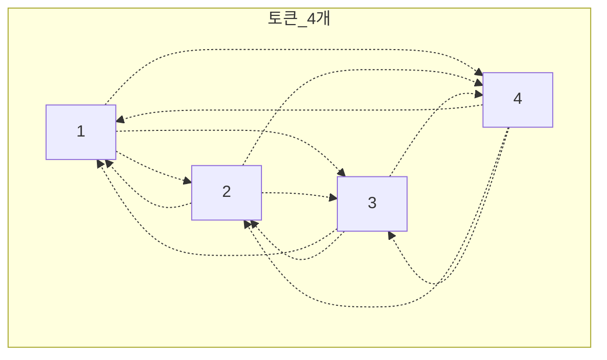
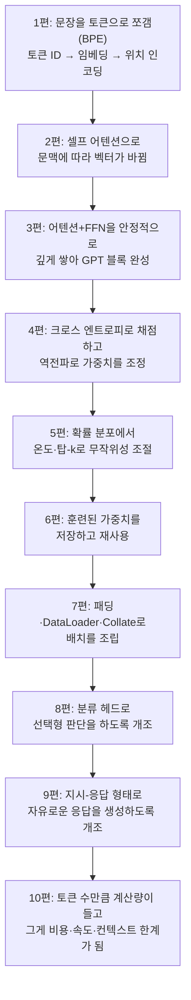

> 1편, 이 시리즈의 첫 문장으로 돌아간다. BPE로 문장을 토큰으로 쪼개면서 이렇게 적어뒀다. "토큰 하나에 값이 매겨진다는 건 무슨 뜻일까." 아홉 편을 돌아 이제 그 답을 완전히 회수할 시간이다. 그리고 이 마지막 편에서, 지금까지 뿌려둔 조각들을 한 줄로 꿰어 완성된 그림을 그려본다.

## 마지막 사건: 토큰이 왜 돈이고 속도인가

LLM API를 써본 적이 있다면 청구서에서 이런 표현을 봤을 것이다. "입력 토큰 1,000개당 얼마, 출력 토큰 1,000개당 얼마." 왜 하필 "글자 수"나 "단어 수"가 아니라 "토큰 수"로 과금할까. 지금까지 시리즈를 따라왔다면 이제 이 질문에 스스로 답할 수 있다.

**모델이 실제로 처리하는 최소 단위가 토큰이기 때문이다.** 1편에서 봤듯이 문장은 BPE를 거쳐 토큰으로 쪼개지고, 그 이후의 모든 연산(임베딩, 어텐션, 트랜스포머 블록 통과)은 전부 이 토큰 단위로 이뤄진다. 즉 토큰 수가 늘어난다는 건, 모델이 실제로 수행해야 하는 계산량이 그만큼 늘어난다는 뜻이다. 계산량이 늘어나면 그만큼의 컴퓨팅 자원(GPU 시간, 전력)이 들고, 그게 그대로 비용과 응답 속도로 이어진다.

## 왜 하필 이렇게 급하게 늘어나는가: 어텐션의 대가

여기서 2편에서 다룬 셀프 어텐션을 다시 떠올려보자. 셀프 어텐션은 **문장 안의 모든 토큰이 서로를 돌아보며 관련성을 계산**하는 방식이었다.



토큰이 4개면 서로 돌아보는 관계의 수는 대략 4×4 = 16가지다. 그런데 토큰이 8개로 늘어나면 8×8 = 64가지, 16개면 16×16 = 256가지로 늘어난다. **토큰 수가 늘어나는 속도보다, 계산량이 늘어나는 속도가 훨씬 가파르다.** 이걸 "제곱에 비례해서 늘어난다(quadratic)"고 표현한다.

```
토큰 2배 → 계산량 4배
토큰 4배 → 계산량 16배
```

이게 바로 긴 문서를 통째로 넣거나, 긴 대화를 계속 이어갈수록 응답이 느려지고 비용이 눈에 띄게 늘어나는 이유다. 단순히 "글자가 많아서"가 아니라, 셀프 어텐션이라는 구조 자체가 토큰 수의 제곱에 비례하는 계산을 요구하기 때문이다.

## 여기서 "컨텍스트 윈도"라는 말의 정체도 풀린다

"이 모델은 컨텍스트 윈도가 128K 토큰입니다" 같은 표현도 이제 명확해진다. 컨텍스트 윈도는 **모델이 한 번에 고려할 수 있는 최대 토큰 수**다. 왜 무한하지 않고 한계가 있을까. 어텐션 계산이 토큰 수의 제곱에 비례해서 늘어나니, 어느 지점을 넘어서면 계산량과 메모리가 감당할 수 없는 수준으로 폭증하기 때문이다. 그래서 모델마다 "여기까지만 한 번에 볼 수 있다"는 실질적인 한계선을 그어둔 것이다.

그리고 시스템 프롬프트, 대화 기록, 첨부한 문서, 실제 질문까지 전부 이 컨텍스트 윈도 안에 있는 토큰 수에 포함된다. 대화가 길어질수록 이전 대화 기록까지 매번 다시 토큰으로 계산해서 처리해야 하니, 그만큼 매 요청마다 처리해야 할 토큰 수가 계속 늘어나는 것이다.

## 시리즈 전체를 한 줄로 꿰기

이제 아홉 편에 걸쳐 심어둔 모든 조각을 하나로 이어볼 시간이다.



문장 하나가 토큰으로 쪼개지고(1편), 그 토큰들이 서로의 문맥을 파악하고(2편), 그 파악 과정이 안정적으로 깊게 반복되고(3편), 그 결과가 얼마나 정확한지 채점받아 조금씩 개선되고(4편), 최종적으로 확률에 따라 다음 토큰을 골라 텍스트를 만들어내고(5편), 이 모든 능력을 다시 훈련하지 않고 재사용할 수 있고(6편), 실제 데이터를 처리 가능한 형태로 배치화하고(7편), 그렇게 훈련된 능력을 특정 목적(선택형 판단이든 자유 응답이든)에 맞게 개조하는(8, 9편) 이 모든 과정이, 결국 **"토큰 하나하나를 처리하는 비용"**이라는 하나의 물리적 제약 위에서 이뤄지고 있었다(10편).

## 이걸 알고 나면 실제로 뭐가 달라지나

이 시리즈의 원래 목표는 "LLM을 잘 쓰기 위함"이었다. 지금까지 파헤친 내부 원리는 실전에서 이렇게 연결된다.

- **프롬프트가 길어질수록 느려지고 비싸지는 이유**를 알면, 불필요하게 긴 시스템 프롬프트나 반복적인 대화 기록을 정리해야 할 이유가 명확해진다
- **컨텍스트 윈도의 한계**를 알면, 방대한 문서를 통째로 넣기보다 필요한 부분만 발췌해서 넣거나(RAG 같은 접근이 여기서 등장하는 이유), 대화가 길어지면 새 세션으로 정리해야 하는 이유를 이해하게 된다
- **온도(Temperature)의 원리**를 알면, 코드 생성처럼 정확성이 중요한 작업엔 낮은 온도를, 아이디어 브레인스토밍처럼 다양성이 중요한 작업엔 높은 온도를 의도적으로 선택할 수 있다
- **미세 튜닝이 몸통을 보존하고 마지막 부분만 개조하는 방식**이라는 걸 알면, "완전히 새로운 모델을 처음부터 훈련하는 것"과 "이미 있는 모델을 특정 목적에 맞게 조정하는 것"이 왜 이렇게 비용 차이가 큰지 감이 잡힌다

## 마치며

이 책을 처음 읽기 시작했을 때, 챕터가 뒤로 갈수록 이해가 흐릿해지는 걸 느꼈다. 특히 코드와 수식이 함께 등장하는 4장부터, 그리고 패딩·데이터로더·콜레이트 함수가 뒤엉킨 6장에서 가장 크게 막혔었다. 이번 시리즈는 그 막혔던 지점들을 순서를 바꾸고, 떡밥과 회수라는 구조로 다시 엮어서, 각 개념이 "왜 필요했는가"라는 질문에서 출발하도록 재구성한 결과물이다.

LLM은 결국 블랙박스가 아니다. 문장을 숫자로 바꾸고, 그 숫자들 사이의 관계를 계산하고, 틀린 만큼 조금씩 고쳐나가는, 그리고 그 모든 과정이 "토큰 하나를 처리하는 비용"이라는 물리적 제약 안에서 이뤄지는, 추적 가능한 파이프라인이다. 이 열 편이, LLM을 "그냥 잘 되는 신기한 도구"가 아니라 "원리를 아는 도구"로 다루는 데 도움이 되길 바란다.

---
*이 시리즈는 "밑바닥부터 만들면서 배우는 LLM"을 읽고 개인적으로 소화한 내용을 재구성한 글입니다. (전 10편 완결)*
