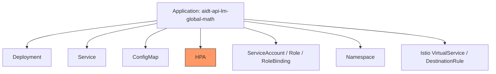
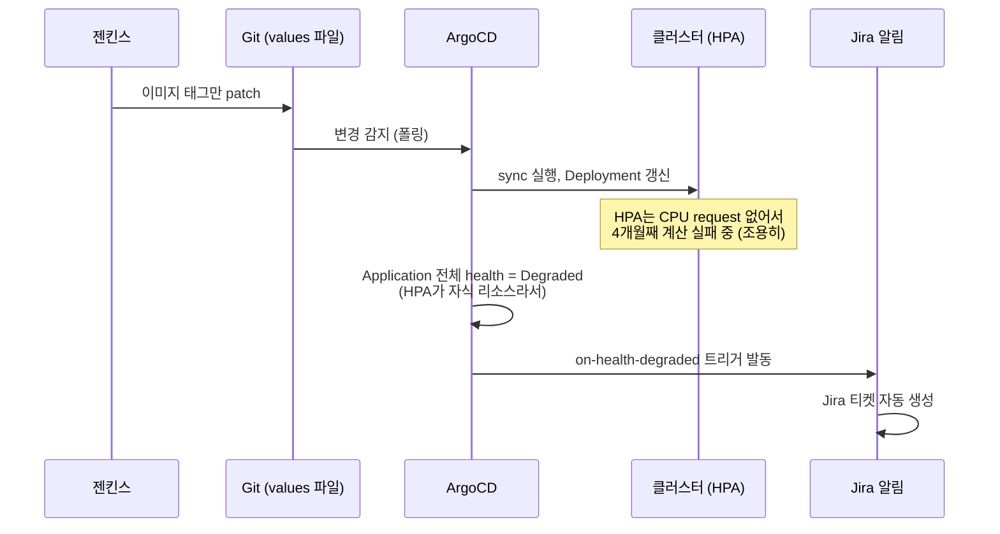

> 새벽에 Jira 알림이 하나 떴다. "sync는 성공했는데 상태가 비정상"이라는, 만든 지 얼마 안 된 그
> 알림이었다. 근데 알림이 짐작한 원인(파드 문제)은 틀렸고, 진짜 원인은 전혀 다른 곳에 4개월째
> 조용히 숨어있었다. 이 글은 그 원인을 찾아가는 과정과, 이게 왜 "지금은 괜찮지만 나중엔 진짜
> 문제가 될 수 있는" 이슈인지를 정리한 기록이다.

---

## 1. 배경 — 왜 이 알림이 애초에 존재했는가

이 알림은 ArgoCD를 GitOps 배포 도구로 도입하면서 같이 구축한 Jira 자동 알림 체계의 일부다. 처음엔 단순하게 성공/실패 두 가지만 만들었다.

```
on-sync-succeeded : 배포 성공
on-sync-failed    : 배포 실패
```

근데 실제로 운영하다 보니, 이 두 개만으로는 못 잡는 상황이 있다는 걸 알게 됐다. **"배포(sync)는 성공적으로 끝났는데, 그 결과로 뜬 리소스가 실제로는 비정상"**인 경우다. sync 성공/실패는 "Git 내용을 클러스터에 적용하는 작업 자체가 성공했는가"만 보는 거라, 그 이후에 실제로 뭐가 잘 도는지는 별개의 문제였다.

이 사각지대를 메우려고 세 번째 트리거를 추가했다.

```yaml
trigger.on-health-degraded: |
  - when: app.status.health?.status == 'Degraded'
    oncePer: app.status.sync.revision
    send: [app-health-degraded]
```

이번에 다룰 이야기가, **바로 이 세 번째 트리거가 실전에서 처음으로 뭔가를 잡아낸 사례**다.

---

## 2. 사건 발생 — 새벽에 뜬 알림

Jira에 이런 티켓이 자동으로 생성됐다.

```
Application: aidt-api-lm-global-math
Sync Status: Synced
Health Status: Degraded
```

알림 템플릿에 미리 적어둔 설명은 이랬다.

> sync는 성공했지만 실제 리소스 상태가 비정상입니다. 파드가 CrashLoopBackOff 등에 빠졌을 가능성이 있습니다.

당연히 제일 먼저 의심한 건 파드였다.

---

## 3. 첫 번째 삽질 — 짐작이 빗나갔다

파드 상태부터 확인했다.

```bash
kubectl get pods -n global-math
```

```
NAME                             READY   STATUS    RESTARTS   AGE
aidt-api-lm-84fff55ff5-85lxk     1/1     Running   0          45d
```

**AGE 45일, RESTARTS 0회.** 재시작 이력이 전혀 없다는 건, 이 파드가 45일 내내 한 번도 죽은 적이 없다는 뜻이다. CrashLoopBackOff였다면 RESTARTS 숫자가 계속 올라가거나, 최소한 AGE가 훨씬 짧아야 정상인데(재시작될 때마다 새 파드로 카운트되니까) 둘 다 아니었다.

**알림이 짐작한 원인이 틀렸다.** 파드는 멀쩡했다.

---

## 4. 왜 짐작이 틀렸는지 — ArgoCD의 Health 판정 원리부터 다시 봐야 했다

여기서 짚고 넘어가야 할 게 있었다. ArgoCD 공식 문서에 이렇게 나와 있다.

> Application의 health는, 그 Application이 관리하는 모든 자식 리소스 중 **가장 나쁜 상태 하나**를 그대로 물려받는다.

즉 `Health Status: Degraded`가 뜬다고 해서 무조건 "메인 애플리케이션(파드)이 문제"라는 뜻이 아니다. 이 Application이 관리하는 리소스 목록을 다시 떠올려봤다.



Deployment(=파드)는 멀쩡했으니, **나머지 리소스 중 하나가 범인**이라는 뜻이었다. 이 중 ArgoCD가 자체적으로 상태를 판정하는(= Degraded를 만들어낼 수 있는) 리소스 종류가 정해져 있는데, 그 목록에 **HPA(HorizontalPodAutoscaler)**가 포함돼 있었다.

---

## 5. 진짜 원인 — HPA가 넉 달째 계산을 못 하고 있었다

```bash
kubectl get hpa -n global-math -o yaml
```

```yaml
status:
  conditions:
  - type: AbleToScale
    status: "True"
    reason: SucceededGetScale
  - type: ScalingActive
    status: "False"
    reason: FailedGetResourceMetric
    message: 'the HPA was unable to compute the replica count: failed to get cpu
      utilization: missing request for cpu in container aidt-api-lm of Pod ...'
    lastTransitionTime: "2026-06-04T06:17:08Z"
```

**`ScalingActive: False`.** 메시지를 그대로 읽으면 원인이 명확했다 — **"컨테이너에 CPU request가 설정돼 있지 않아서, CPU 사용률을 계산할 수 없다."**

HPA가 "CPU 사용률 70% 넘으면 스케일업"이라는 목표(`targetCPUUtilizationPercentage: 70`)를 쓰고 있는데, **사용률(%)이라는 건 반드시 분모가 있어야 계산되는 값이다.** 그 분모가 바로 `resources.requests.cpu`인데, 이게 컨테이너에 아예 없었다. HPA 입장에선 "100 중에 몇을 쓰고 있는지" 물어봤는데 그 "100"이 정의돼 있지 않은 상태였던 거다.

그리고 `lastTransitionTime`을 보면, **이 상태가 벌써 넉 달 가까이 지속돼 있었다.** 오늘 갑자기 생긴 문제가 아니라, 원래부터 있던 문제가 이번에 `on-health-degraded` 트리거를 통해 처음으로 감지된 거였다.

---

## 6. 왜 지금까지 아무 사고도 안 났는가 — `min=max=1`이 우연히 문제를 가려주고 있었다

이 서비스의 HPA 설정을 다시 보면:

```yaml
hpa:
  minReplicas: 1
  maxReplicas: 1
```

**최소·최대가 똑같이 1이다.** 즉 이 HPA는 애초에 "1개에서 1개로" 조정하는, 조정할 폭이 0인 상태다. **HPA가 사용률 계산에 실패하든 성공하든, 최종 결론(replica 1개)은 어차피 똑같다.** 이게 이 버그가 넉 달 동안 아무 사고 없이 조용히 숨어있을 수 있었던 이유다 — **증상이 결과에 아무 영향을 안 줬으니까.**

---

## 7. 그런데도 이게 "당장은 괜찮지만 나중엔 진짜 문제"인 이유 — 두 갈래

### ① 나중에 스케일링이 실제로 필요해지는 순간, 조용히 작동을 안 한다

`maxReplicas`를 2 이상으로 올리는 순간부터, 이 HPA는 "필요할 때 늘려야 하는데 사용률을 못 읽어서 못 늘리는" 상태가 된다. 그리고 이게 무서운 이유는 **에러가 요란하게 나는 게 아니라 그냥 조용히 안 늘어난다는 것**이다. 트래픽이 몰릴 때(제일 안 좋은 타이밍)에야 "왜 스케일업이 안 되지?" 하고 뒤늦게 알아차리게 될 가능성이 높다.

### ② 이건 사실 HPA만의 문제가 아니라, 더 큰 구멍의 증거다

`requests.cpu`가 없다는 건, **이 파드가 스케줄될 때 쿠버네티스가 "얘한테 CPU를 얼마나 확보해줘야 하는지" 전혀 모른다**는 뜻이다. request가 없는 파드는, 같은 노드의 다른 파드와 자원을 두고 경쟁할 때 아무 보호도 못 받는다. 노드 자원이 빠듯해지는 순간(운영 트래픽이 몰리는 시점과 정확히 겹친다) 이 파드가 자원 경쟁에서 밀려날 위험이 있다.

**즉 HPA 에러 하나가, "이 서비스는 아직 request/limit을 제대로 정한 적이 없다"는 훨씬 근본적인 미해결 과제를 실제 증거로 보여준 셈이다.**

---

## 8. 지금까지 만들어온 구조와 어떻게 연결되는지

이번 사건이 흥미로웠던 건, 지금까지 순서대로 구축해온 것들이 한 줄로 다 이어졌기 때문이다.



- **values 파일 구조**: `values-stg-common.yaml`에 애초에 `resources.requests.cpu` 필드 자체가 없었다 — AS-IS 전수조사 때 "나중에 실측해서 채우자"로 남겨뒀던 항목이 바로 이거였다.
- **ApplicationSet**: `global-math`, `global-eng`가 이 공통 파일을 같이 쓰는 구조라, **한쪽에서 발견된 문제가 다른 쪽에도 똑같이 있을 가능성이 높다.**
- **Jira 알림 3종 체계**: 성공/실패 알림만 있었다면 이 문제는 계속 안 보이는 채로 남아있었을 거다. **"성공"이라는 신호 하나만 보고 안심하면, 그 뒤에 조용히 곪고 있는 문제를 놓친다**는 걸 이번에 직접 확인한 셈이다.

---

## 9. 해결 방향

| 옵션 | 내용 | 비고 |
|---|---|---|
| 1안 | `resources.requests.cpu`를 채워서 HPA가 정상 계산하게 함 | 지금은 정확한 값보다 "계산이 되게" 하는 게 우선, 정교한 값은 추후 부하 테스트로 재산정 |
| 2안 | 지금처럼 `min=max=1`이라 스케일링을 실질적으로 안 쓰고 있으니, HPA 자체를 제거하고 고정 `replicas`로 전환 | 문제 자체를 원천 제거, 나중에 진짜 오토스케일링이 필요해지는 시점에 제대로 다시 도입 |

개인적으로는 2안 쪽으로 기운다 — 지금 안 쓰는 기능을, 어설프게 값만 채워서 "일단 동작하게" 만드는 것보다는, 필요해지는 시점에 제대로(실측 기반으로) 다시 켜는 게 나아 보인다.

---

## 10. 마무리 — 배운 것

이번 일로 다시 확인한 건 하나다. **"성공했다"는 신호는, 그 신호가 측정하는 범위 안에서만 성공이라는 뜻이다.** sync 성공은 "Git 내용을 클러스터에 반영하는 작업"의 성공이지, "그 결과로 뜬 시스템이 온전히 건강하다"는 보장이 아니었다. 그 간극을 메우려고 만든 알림 하나가, 실제로 넉 달간 조용히 숨어있던 문제를 찾아냈다는 게 이번 사건의 제일 큰 소득이었다.

그리고 하나 더 — **원인을 짐작(파드 문제)으로 단정하지 않고, "45일간 재시작 0회"라는 실제 데이터로 그 짐작을 반증한 다음, ArgoCD의 판정 원리 자체를 다시 확인해서 진짜 원인을 찾아간 것.** 지금까지 이 프로젝트 전체를 관통해온 원칙 — 짐작이 아니라 실제로 확인해서 판단한다 — 이 이번에도 그대로 적용됐다.
