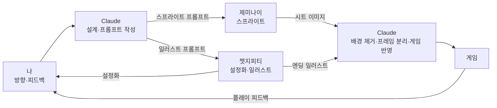
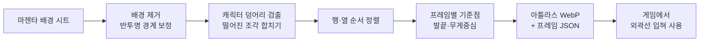

> **로그 제작기 시리즈**
> 1. [게임은 어떻게 만들어지는가, 그 궁금증에서 시작했다](/posts/log-game-01-why/)
> 2. [세계관부터 세웠다 — 동양 신화와 현대의 결합](/posts/log-game-02-worldbuilding/)
> 3. [연옥으로의 초대 — 세계관 일러스트로 먼저 보는 로그의 세계](/posts/log-game-03-gallery/)
> 4. 용도별 AI 협업과 프롬프트 — 그림을 만들어 게임에 넣기까지 ← 지금 글
> 5. [PoC에서 열두 개의 문까지 — 제작 과정 전체](/posts/log-game-05-making/)
> 6. [게임 시스템 설계 — 넋칼, 요괴, 십이지신, 스테이지](/posts/log-game-06-systems/)
> 7. [아키텍처와 흐름 — 한 파일짜리 PoC를 관리 가능한 프로젝트로](/posts/log-game-07-architecture/)
> 8. [한계와 과제, 그리고 3D라는 욕심](/posts/log-game-08-limits-and-next/)

## 용도에 따라 AI 모델을 나눠 썼다

이 게임은 AI 하나로 만들지 않았다. 해보니 모델마다 잘하는 일이 분명히 달라서, **용도에 맞춰 모델을 나눠 쓰는 것**이 결과물의 질을 가장 크게 좌우했다.

| 모델 | 맡은 일 | 이 모델을 고른 이유 | 한계 |
|---|---|---|---|
| **Claude** | 기획, 세계관 정리, 게임 설계, 코드 전체, 다른 AI에 넣을 프롬프트 작성, 받은 그림의 가공, 자동 테스트, 문서화 | 코드 작성과 구조 설계에 최적화되어 있었다. 긴 대화 맥락을 유지하며 세계관과 규칙을 일관되게 관리했고, 실제로 파일을 만들고 실행해서 결과를 확인한 뒤 고쳤다. 1,400줄을 31개 모듈로 나누는 리팩터링, 성능 측정과 원인 추적처럼 "만들고 검증하는" 일에 강했다 | 이미지를 직접 생성하지 못한다 |
| **제미나이** | 캐릭터·요괴·보스 스프라이트 시트, 공격 모션, 포옹 스프라이트, 아이템 | 그림 작업에서 가장 좋았다. 첨부한 로그 스프라이트의 화풍을 잘 따라 그려서 수십 장을 받아도 한 게임처럼 보였고, 마젠타 배경·격자 배치 같은 게임용 규격도 잘 지켰다 | 요청과 다른 소품(짧은 칼자루 대신 긴 막대), 요청과 다른 행 개수, 시트마다 제각각인 캐릭터 크기, 오른쪽 아래 워터마크 |
| **챗지피티** | 세계관 설정화, 캐릭터 설정화, 스토리 컷, 엔딩 일러스트 | 한 장짜리 일러스트의 구도·분위기·밀도가 뛰어났다. 세계관 문서를 통째로 넘기면 그걸 한 장의 설정화로 풀어냈다 | 한국 전통 문화와 일본 전통 문화를 혼동하고, 그림 속 한글을 자주 틀리고, 설정 디테일(깃털 수, 귀 색)을 놓쳤다 |

모델끼리는 이렇게 이어졌다. Claude가 세계관과 게임 규격을 반영해 프롬프트를 쓰면, 내가 그 프롬프트로 제미나이·챗지피티에서 그림을 받고, 다시 Claude가 그 그림을 가공해 게임에 넣는다.



Claude가 쓴 프롬프트는 두 모델의 성향에 맞춰 달랐다. 제미나이에는 "같은 채팅에서 이어서", "원본 첨부", "마젠타 배경"을 강조했고, 챗지피티에는 "투명 배경 PNG로"(실제로 투명 배경을 만들 수 있어서), "2단계로 나눠서(캐릭터 확정 → 스프라이트 시트)", "문장으로 설명"을 강조했다. 같은 요청이라도 받는 모델에 따라 프롬프트를 바꾸는 게 효과가 컸다.

## 스프라이트 시트 프롬프트의 원칙

게임에 넣을 그림은 "예쁜 그림"과 조건이 다르다. 몇 번 실패하며 정리한 원칙이다.

1. **배경은 단색 마젠타(#FF00FF).** 이미지 생성 AI는 진짜 투명 배경을 잘 못 만든다. "transparent"라고 쓰면 체크무늬가 그려져 나오는 경우가 많다. 자연에 거의 없는 색을 배경으로 받고 나중에 그 색만 지우는 게 안정적이다.
2. **캐릭터에는 분홍·마젠타 금지.** 배경색과 비슷한 색은 배경을 지울 때 같이 지워진다.
3. **빛 번짐·그림자·후광 금지.** 반투명한 빛이 배경과 섞이면 깨끗하게 떼어낼 수 없다. 빛은 게임 코드에서 따로 그린다.
4. **한 장에 모든 동작을 격자로.** 동작마다 따로 생성하면 매번 얼굴과 비율이 조금씩 달라진다.
5. **원본 캐릭터 이미지를 첨부.** "Attached image is the main character"로 시작해 화풍과 크기를 맞춘다.
6. **같은 인물의 추가 포즈는 같은 채팅에서.** 새 채팅에서 요청하면 다른 사람처럼 그려진다.
7. **영어 틀 + 한국어 묘사.** "pixel art", "no anti-aliasing" 같은 스타일 용어는 영어가 더 정확하게 먹히고, 캐릭터 묘사는 한국어로 써도 잘 알아듣는다.

### 주인공 프롬프트

```
2D pixel art sprite sheet for a side-scrolling platformer game.
Character: '로그'라는 이름의 작은 탐정. 한국 삼국 시대 고구려·백제 양식을 현대적이고 판타지스럽게
재해석한 디자인. 머리에는 고구려 고분벽화 속 조우관처럼 새 깃털 두 개가 위로 솟은 작은 관모를 썼다.
한쪽 눈에는 청동거울 조각으로 만든 원형 단안경을 꼈고 렌즈는 청록색이다. 고구려식 저고리를 현대적으로
짧고 날렵하게 재단한 먹색 코트를 입었고, 소매 끝과 깃에는 주홍색 띠, 옷감에는 작은 황토색 점무늬가 있다.
허리에 금색 장식 띠를 맸고, 통 넓은 바지 끝을 발목에서 묶었다. 한 손에 백제 금동대향로를 작게 줄인 듯한
금색 향로 랜턴을 들고 있다. 머리가 약간 크고 팔다리가 짧은 귀여운 비율이지만 노련한 탐정의 분위기.
Color palette limited to ink black, vermilion, ochre, teal, and gold, like Goguryeo tomb murals.
Side view, facing right. 48x48 pixel style, clean pixel edges, no anti-aliasing.
Arrange frames in a grid on one image:
- Row 1: idle (2 frames)  - Row 2: walk cycle (4 frames)
- Row 3: jump, fall (2 frames)  - Row 4: hurt (1 frame)
Same character design and size in every frame, evenly spaced.
Solid flat magenta (#FF00FF) background, no shadows, no text, no grid lines.
```

{: w="700"}
_제미나이가 그린 로그. 11프레임 내내 얼굴과 옷이 거의 흔들리지 않았다_

### 요괴·보스 프롬프트 틀

요괴와 보스는 같은 틀에 묘사만 바꿔 넣었다. 보스는 로그의 1.5배 크기에 공격 동작을 두 종류 받았다.

```
Attached image is the main character of my game. Create a boss sprite sheet in exactly the same art style:
2D pixel art, same outline thickness, same shading, same level of detail.
Boss: 인간화된 십이지신 중 오(午), 말. 말의 머리에 사람의 몸을 가진 장수로, 고구려 개마무사처럼 비늘 갑옷을
입고 긴 창을 들었다. 갑옷 위에 현대식 가죽 라이더 재킷을 걸쳤고, 갈기는 주홍색이다.
눈은 오류에 오염되어 청록색이고 갑옷 틈새로 청록색 균열 무늬가 보인다.
Palette: ink black, vermilion, ochre, teal, gold, muted purple. No pink or magenta on the character.
Side view, facing left. About 1.5 times the height of the attached character.
Grid layout on one image:
- Row 1: idle (2)  - Row 2: move (4)  - Row 3: attack A (3)  - Row 4: attack B (3)
- Row 5: hurt (1)  - Row 6: defeated (1)
Solid flat magenta (#FF00FF) background, no glow effects, no shadows, no text, no grid lines.
```

{: w="600"}
_하회 양반탈을 쓴 안개 요괴. 쓰러질 때 탈과 갓이 벗겨지는 컷까지 그려줬다_

{: w="600"}
_어둑시니. 커지는 단계를 행별로 따로 받아 "쳐다볼수록 커진다"를 구현했다_

{: w="600"}
_쇠를 먹는 불가사리. 입에 신호등 조각이 물려 있다_

{: w="600"}
_자(子) 도둑 쥐. 쥐 떼로 분열하는 동작이 인상적이다_

{: w="600"}
_묘(卯) 달토끼. 등에 절구를 메고 있지만 절구공이는 없다(로그가 가진 칼자루의 복선)_

{: w="600"}
_진(辰) 금관의 용. 정장 위에 금관을 쓴 최종 보스_

{: w="600"}
_해(亥) 부자 돼지. 구르는 공 모양 프레임이 그대로 굴러 돌진 패턴이 됐다_

### 그림이 설정과 다를 때 — 오히려 설정을 바꾼 경우

로그가 칼자루를 쥐고 휘두르는 공격 모션을 요청하면서 "칼날 없이 짧은 칼자루만"이라고 했는데, 제미나이는 **긴 나무 막대**를 그려왔다.

{: w="600"}
_짧은 칼자루를 요청했는데 긴 막대가 왔다_

다시 뽑을까 하다가, 이 칼자루의 정체가 **달토끼의 절구공이**라는 설정을 떠올렸다. 절구공이는 원래 긴 나무 막대다. 넋이 없을 땐 나무 막대를 휘두르고, 넋이 모이면 막대 끝에서 청록 넋날이 자라나는 모습이 오히려 설정을 더 잘 보여줬다. AI의 "실수"가 설정을 풍부하게 만든 경우다.

## 받은 그림을 게임에 넣는 과정

그림을 받은 뒤 게임에 넣기까지는 매번 같은 단계를 거쳤다. 나중에 이 과정을 `tools/sprite_pipeline.py` 한 명령으로 자동화했다.



- **배경 제거**: "이 색이면 투명"으로 단순히 지우면 가장자리에 분홍 테두리가 남는다. 각 픽셀이 마젠타와 얼마나 섞였는지 계산해 그만큼 반투명하게 만들고, 색에서 마젠타 성분을 걷어낸다.
- **프레임 분리**: AI가 그린 격자는 간격이 제각각이라 균등 분할이 안 된다. 불투명한 덩어리를 찾아 자르고, 떨어져 나온 조각(쓰러질 때 날아간 탈, 모자, 파편)은 가까운 덩어리에 붙인다. 창이나 채찍이 이웃 프레임과 붙어버린 경우는 자를 위치를 지정해 나눈다.
- **기준점**: 프레임마다 폭이 달라서 이미지 가운데를 기준으로 그리면 걸을 때 캐릭터가 좌우로 떨린다. 발끝(가장 아래 불투명 픽셀)과 머리 쪽 무게중심을 기준점으로 삼았다.
- **외곽선**: 어두운 배경에 먹색 코트가 묻혀서, 게임이 불러올 때 스프라이트 둘레에 은은한 밝은 테두리를 입힌다.

{: w="800"}
_배경을 지우고 프레임을 잘라낸 로그. 랜턴의 빛 번짐은 지우고 코드로 다시 그렸다_

## 업로드 사고들

생각보다 자주 일어난 일이 **같은 파일이 여러 번 올라가는 것**이었다. 쥐·소·호랑이·토끼를 보냈다고 했는데 실제로는 쥐 시트 네 장이었던 적도 있고, 한 번은 채팅 화면에 호랑이가 두 번 보였지만 폴더에는 토끼 파일이 따로 올라와 있었던 적도 있다. Claude가 파일 해시를 비교해서 중복을 잡아냈다. 에셋을 사람 손으로 옮기는 과정은 생각보다 실수가 많아서, 파이프라인에 **중복·누락 검사**가 필요하다는 걸 배웠다.

## 설정화와 일러스트

설정화와 엔딩 일러스트는 챗지피티에 세계관 문서를 넘겨 받았다. 설정과 어긋난 부분은 "고칠 부분만 고치고 나머지는 그대로"로 요청했다. 처음부터 새로 그리게 하면 잘 나온 구도까지 바뀌기 때문이다.

```
첨부한 이미지는 내 게임의 재회 장면이야. 아래 부분만 고쳐서 다시 그려줘.
두 인물의 자세, 구도, 조명, 배경 분위기는 그대로 유지해.
1. 오른쪽의 붉은 문을 한국의 홍살문으로 바꿔줘. 붉은 둥근 기둥 두 개 위에 곧은 가로대 두 줄을
   수평으로 걸고, 위쪽 가로대 위에 화살처럼 끝이 뾰족한 붉은 나무 살을 촘촘하게 세워.
   가운데에 태극 문양. 도리이처럼 휘어진 가로대나 지붕은 없다.
2. 로그의 관모 깃털을 정확히 두 개로 고쳐줘. 흰 깃털 하나, 붉은 깃털 하나.
3. 달토끼의 귀를 안쪽까지 흰색으로, 눈동자를 연한 회청색으로 바꿔줘. 분홍색은 쓰지 않는다.
```

{: w="800"}
_재회 장면 설정화_

엔딩은 픽셀 컷신으로 이야기를 다 따라온 뒤, 마지막에 한 번만 일러스트로 바꿨다. 중간에 넣으면 픽셀 장면으로 돌아올 때 격차가 도드라지지만, 마지막 한 장은 보상처럼 느껴지기 때문이다.

{: w="600"}
_엔딩용으로 받은 포옹·동행 스프라이트_

{: w="800"}
_엔딩 일러스트. 검던 해가 금빛으로 돌아오고, 발밑에는 끊어진 청록 사슬이 흩어져 있다_

## 아이템

{: w="700"}
_빈 칼자루, 넋창 자루, 넋활, 넋 구슬, 기억의 조각_

아이템 이미지는 HUD의 무기 아이콘, 요괴가 떨구는 넋 구슬, 용의 여의주 탄, 랜턴으로 찾는 기억 조각으로 재활용했다. 칼날은 넋 수에 따라 길이가 변해야 해서 이미지에 넣지 않고 코드로 그린다.

## AI가 자주 틀린 것과 조치

### 1. 한국 전통 문화와 일본 전통 문화의 혼동

가장 반복된 문제다. 설정화에서 "붉은 홍살문"이라고 캡션을 달아 놓고 그림은 **일본 도리이**를 그렸다. 문 양옆의 석상도 한국 해태보다 일본 신사의 고마이누에 가까웠다. 재회 장면, 전투 장면에서도 같은 문이 반복됐다.

{: w="600"}
_캡션은 홍살문, 그림은 도리이_

원인은 학습 데이터의 쏠림으로 보인다. 세계적으로 유통되는 애니메이션·게임 그림에서 "동양 전통 판타지"의 대부분이 일본 양식이라, 모델은 "동양의 붉은 문"을 요청받으면 가장 흔한 답인 도리이로 끌려간다. 한국 요소일수록 이름만으로는 부족하다.

**조치**
- **이름이 아니라 구조를 설명했다.** "붉은 둥근 기둥 두 개, 곧은 가로대 두 줄, 위쪽 가로대 위에 화살 모양 붉은 살을 촘촘히, 가운데 태극, 지붕 없음."
- **무엇이 아닌지 명시했다.** "It is NOT a Japanese torii."
- **고칠 곳만 부분 수정으로 요청했다.** 전체를 다시 그리게 하면 잘 나온 구도까지 바뀐다.
- **게임 안의 홍살문은 AI 그림을 쓰지 않고 코드로 직접 그렸다.** 자주 틀리는 핵심 요소는 사람이 통제할 수 있는 쪽으로 옮기는 게 가장 확실했다.

**앞으로 필요한 것**
- 실제 홍살문·해태·한복 사진을 **레퍼런스 이미지로 함께 첨부**하는 방식
- 한국 문화 요소 **검수 체크리스트**: 문(도리이 여부), 지붕 곡선, 복식(기모노 옷깃과 한복 고름의 차이), 석상, 문양
- 반복해서 쓰는 요소는 **한 번 제대로 만든 그림을 재사용**하고, 매번 새로 생성하지 않기

### 2. 한글 오류

그림 속 한글이 자주 틀렸다.

{: w="600"}
_"해시(돼지)"가 "혜시(돼지)"로. "유시(닭)"의 "닭"도 뭉개졌다_

{: w="500"}
_"나도… 사랑해"가 "다도…"로_

{: w="400"}
_"겨눌 수 없어"가 "겨을 수 없어"로_

"열두 시진"이 "얼두 시진"이 된 곳도 있었다. 이미지 생성 모델은 글자를 "쓰는" 게 아니라 글자처럼 보이는 모양을 "그리기" 때문에, 받침이 복잡하거나 덜 흔한 음절일수록 비슷한 모양의 다른 글자로 새는 것으로 보인다.

**조치**
- **그림 안에 글자를 넣지 않았다.** 엔딩 일러스트 프롬프트에 "이미지 안에 글자는 넣지 마"를 명시하고, 대사는 게임 자막으로, 설명은 블로그 캡션으로 얹었다. 수정하기도 훨씬 쉽다.
- 글자가 꼭 필요하면 **짧게** 요청하고, 결과가 틀리면 "글자 외에는 아무것도 바꾸지 말고 ○○를 △△로만 고쳐줘"처럼 범위를 좁혀 다시 요청한다.
- 앞으로 글자가 들어간 그림은 **생성 후 편집 도구로 글자만 교체**하는 단계를 파이프라인에 넣는 게 맞다.

### 3. 설정 디테일 누락

로그의 깃털은 두 개인데 세 개로, 토끼의 흰 귀는 분홍으로 그려졌다. 엔딩 일러스트 한 버전은 해가 금빛으로 돌아온 장면인데도 **검은 일식**이 그대로였다. 바로 앞 장면에서 "검은 해에 빛이 돌아왔다"고 해놓고 검은 해가 보이면 이야기 순서가 뒤집힌다. 세 번 바꿔 끼운 끝에 해가 밝게 떠 있는 버전으로 정했다.

{: w="700"}
_이야기상 해가 돌아온 뒤인데 검은 해가 남아 있다_

**조치**: 세계관의 "변하면 안 되는 설정"을 목록으로 만들어 모든 프롬프트 앞에 붙였다(깃털 두 개, 흰 귀, 홍살문 구조, 시진 이름 표기). 이런 목록을 **세계관 스타일 가이드**로 문서화해두면, 모델이 바뀌어도 같은 기준으로 검수할 수 있다.

## 배운 것

- **용도에 맞는 모델을 고르는 것**이 프롬프트를 다듬는 것보다 효과가 컸다. 코드는 Claude, 스프라이트는 제미나이, 일러스트는 챗지피티.
- AI 그림은 **"게임 규격"을 프롬프트에 명시해야** 쓸 수 있다. 배경색, 금지 색, 효과 금지, 격자 배치, 크기 기준.
- 한국 문화 요소는 **일본 양식으로 끌려가기 쉽다.** 이름이 아니라 구조를 설명하고, 아닌 것을 명시하고, 핵심 요소는 직접 통제한다.
- **그림 속 한글은 믿지 않는다.** 글자는 그림 밖에서 얹는다.
- 결과가 설정과 다르면 무조건 다시 뽑기보다, **설정을 바꾸는 편이 나은 경우**도 있다.
- 사람이 파일을 옮기는 과정은 실수가 생긴다. **검증 단계**가 파이프라인에 있어야 한다.

다음 편에서는 이 그림들이 붙으며 게임이 자라난 순서를 따라간다.
