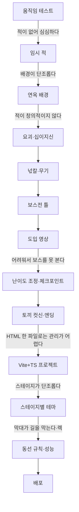

> **로그 제작기 시리즈**
> 1. [게임은 어떻게 만들어지는가, 그 궁금증에서 시작했다](/posts/log-game-01-why/)
> 2. [세계관부터 세웠다 — 동양 신화와 현대의 결합](/posts/log-game-02-worldbuilding/)
> 3. [연옥으로의 초대 — 세계관 일러스트로 먼저 보는 로그의 세계](/posts/log-game-03-gallery/)
> 4. [용도별 AI 협업과 프롬프트 — 그림을 만들어 게임에 넣기까지](/posts/log-game-04-ai-assets/)
> 5. PoC에서 열두 개의 문까지 — 제작 과정 전체 ← 지금 글
> 6. [게임 시스템 설계 — 넋칼, 요괴, 십이지신, 스테이지](/posts/log-game-06-systems/)
> 7. [아키텍처와 흐름 — 한 파일짜리 PoC를 관리 가능한 프로젝트로](/posts/log-game-07-architecture/)
> 8. [한계와 과제, 그리고 3D라는 욕심](/posts/log-game-08-limits-and-next/)

게임은 기획서를 다 쓰고 만든 게 아니다. **돌아가는 걸 먼저 만들고, 직접 해보고, 부족한 걸 찾아 고치는** 반복으로 자랐다. 게임 업계에서 말하는 반복(iteration)과 플레이테스트가 이런 거라는 걸 이 과정에서 체감했다.

## 1. 움직임 테스트

주인공 스프라이트 한 장을 받자마자, 방향키로 걷고 점프만 되는 테스트 페이지부터 만들었다. 이 단계의 목적은 "그림이 게임 안에서 움직이는가"를 확인하는 것뿐이다.

{: w="800"}
_첫 테스트. 코드로 그린 임시 배경 위에서 걷고 뛰기만 된다_

여기서 이미 몇 가지 결정이 나왔다.

- **가변 점프**: 점프 키를 길게 누르면 높이 뛴다. 손맛을 좌우하는 기본기다.
- **코요테 타임과 점프 버퍼**: 발판 끝에서 살짝 늦게 눌러도, 착지 직전에 미리 눌러도 점프가 된다. 플레이어가 "눌렀는데 안 뛰었다"고 느끼지 않게 하는 흔한 기법이다.
- **프레임 기준점**: 프레임마다 폭이 달라 캐릭터가 떨리는 문제를 발끝·머리 기준점으로 해결했다.

## 2. "적이 없어서 심심하다"

코드로 그린 임시 적 세 종류(오류 벌레, 도깨비불, 그림자 잡귀)와 체력을 넣었다. 그림자 잡귀는 **랜턴을 비춰야 멈춘다**는 규칙을 줬다. 랜턴이 단서 찾기에만 쓰이면 있어도 그만인 버튼이 되기 때문이다.

{: w="800"}
_임시 적과 체력 하트. 이 시점의 배경은 아직 단순했다_

## 3. "배경이 단조롭다" — 연옥

"판타지스럽고도 한국 삼국 시대, 현대적인 게 콜라보된 연옥 같은 세계"라는 방향이 나왔다. 검은 해, 장군총과 기와 빌딩, 떠 있는 섬의 석탑과 연등, 장승·솟대·청사초롱 가로등을 층층이 그렸다. 캐릭터가 어두운 배경에 묻혀서 스프라이트에 외곽선을 입힌 것도 이때다.

{: w="800"}
_처음 그린 연옥. 이후 설정화를 참고해 다시 그렸다_

## 4. "적이 창의적이지 않다" — 요괴와 십이지신

하회탈, 한국 요괴, 인간화된 십이지신으로 적을 전부 바꿨다(2편). 스프라이트를 받자 전설을 행동으로 옮겼다. 어둑시니는 랜턴을 비추면 커지고, 장산범은 1초 늦게 따라 하고, 불가사리는 쇠 발판을 먹는다.

{: w="800"}
_창귀, 초랭이탈, 양반탈이 들어간 제1문_

## 5. 넋칼

"칼자루를 먼저 얻고, 요괴를 죽일 때마다 영혼이 저장되며 칼날이 자라는" 무기를 넣었다. 넋 하나마다 조금씩 강해지면 체감이 안 되니, 칼날 길이가 눈에 띄게 달라지는 **단계**로 나눴다(6편).

{: w="800"}
_요괴를 쓰러뜨리면 넋이 빨려 들어오고, "넋날이 자랐다"며 단계가 오른다_

## 6. 보스전의 틀

첫 보스인 쥐로 **전용 방, 타이틀, 체력 게이지, 출구 문**이라는 공통 틀을 만들었다. 이후 보스는 이 틀에 패턴만 갈아 끼웠다. 쥐가 분열하면 본체가 무적이 되는데, 그동안 할 일이 없으면 지루해서 **새끼 쥐 셋을 다 잡으면 본체가 두 배 피해를 받는** 기회로 바꿨다.

{: w="800"}
_자시의 문. 보스가 등장할 때 타이틀 카드가 뜬다_

## 7. 도입 영상

"토끼가 첩자로 접근했다가 사랑하게 되고, 칼을 건네고, 정신개조를 당한다"는 이야기를 게임 시작 전 영상으로 만들었다. 처음엔 환웅과 토끼를 코드로 그렸는데 "비주얼이 영 아니다"라는 피드백을 받았다. 환웅은 목소리만 남기고, 토끼는 스프라이트로 바꿨다. 첩자 시절은 같은 스프라이트를 **어두운 실루엣**으로 보여주는 연출로 해결했다. 새 그림 없이 "정체를 숨긴 사람"을 표현한 것이다.

{: w="800"}
_도입 영상 첫 버전. 코드로 그린 환웅과 토끼가 캐릭터와 어울리지 않았다_

{: w="800"}
_개선 후. 환웅은 빛기둥과 목소리로, 토끼는 스프라이트로_

## 8. "어려워서 보스를 보기도 전에 죽는다"

PoC 단계라 요괴를 동작 확인용으로 빽빽하게 넣어뒀더니 너무 어려웠다. 체력을 3칸에서 5칸으로, 맞은 뒤 무적 시간을 1.7초로 늘리고, **장승 체크포인트**를 세웠다. 장승은 원래 마을 경계를 지키는 존재라, 연옥의 길을 기억해주는 역할로 딱 맞았다.

{: w="800"}
_소, 호랑이, 토끼 보스전_

## 9. "토끼가 안 죽는 것 같다"

토끼는 원래 칼로는 쓰러지지 않고 랜턴으로 오염을 걷어내는 보스였는데, 그 방법을 알려주는 문구가 전투 시작에 잠깐 뜨고 사라지는 게 전부였다. 버그처럼 느껴질 수밖에 없었다. **설계를 전달하지 못한 것도 버그다.** 전투 내내 방법을 보여주고, 빛이 닿고 있을 때 눈에 띄는 피드백을 주도록 고쳤다.

{: w="800"}
_"빛이 그녀에게 닿고 있다". 정화 게이지가 차오르며 "로…그…?"_

## 10. 되찾았다가, 다시 잃는다

"토끼를 이기면 원래 모습으로 돌아와 서로 좋아하고, 감격해 울지만, 최종 보스가 다시 납치하고 주인공이 절규한다"는 전개를 컷신으로 넣었다. 네 번째 문에서 되찾았다가 잃으면, 나머지 여덟 문을 넘어야 할 감정적 이유가 생긴다.

{: w="800"}
_재회, 눈물, 용의 그림자, 납치, 절규_

## 11. 여덟 보스, 무기, 엔딩

남은 여덟 보스는 보스마다 코드를 따로 짜지 않고 **동작 이름과 숫자만 적으면 돌아가는 공통 틀**로 만들었다. 오(말)를 쓰러뜨리면 넋창, 인(호랑이)을 쓰러뜨리면 넋활을 얻는다. 엔딩은 풀려난 토끼와 포옹하고, 검던 해에 빛이 돌아오고, 환웅이 있는 하늘의 궁으로 함께 걸어가는 장면이다.

{: w="800"}
_뱀, 개마무사, 도사 양, 광대 원숭이, 전령 닭, 삽살개, 부자 돼지, 금관의 용_

{: w="800"}
_공격 모션 적용. 절구공이 끝에서 넋날이 뻗는다_

{: w="800"}
_포옹, 해가 돌아오는 장면, 하늘의 궁으로 가는 길, 엔딩 일러스트_

## 12. 프로젝트로 다시 태어나다

여기까지는 **1,400줄짜리 HTML 한 파일**에 이미지까지 base64로 박혀 있었다. 블로그에 올리고 계속 관리하려면 구조를 바꿔야 했다. Vite + TypeScript로 옮기면서 요괴 구간 → 보스 구조의 스테이지, 저장·이어하기, 소리, 난이도 상향을 함께 넣었다(7편).

## 13. 플레이테스트가 찾아낸 것들

프로젝트로 옮긴 뒤에도 직접 해보며 나온 피드백으로 계속 고쳤다.

- **"스테이지 배경이 단조롭고 맵도 다채롭지 않다"** → 열두 테마에 각각 다른 배경, 바닥, 입자, 지형 규칙을 넣었다(6편).
- **"미시에서 막대바가 동선을 고려하지 않은 것 같다"** → 발판 높이를 땅 기준 오프셋으로만 정해서, 높이가 다른 땅에 걸친 발판이 **머리 높이에 떠서 길을 막았다.** 전 스테이지를 자동 검사해보니 45군데였다. 로그의 키와 점프 높이에서 역산한 규칙으로 바꿨다.
- **"렉이 걸린다"** → 소리 파형을 매번 새로 계산하고, 바닥 무늬를 매 프레임 다시 그린 게 원인이었다(7편).
- **"해시에서 특정 바 위치가…"** → 한쪽으로만 오르는 계단이 꼭대기에 절벽을 만들고, 다섯 개가 늘어서 기둥 벽처럼 보였다. 오르내리는 금화 더미로 바꿨다.

{: w="800"}
_동선 규칙을 적용한 스테이지들_

사람이 직접 해봐야만 보이는 문제가 많았다. 자동 테스트는 "돌아가는가"는 알려주지만 "재밌는가, 답답한가"는 알려주지 않는다.

## 이 과정에서 배운 것

1. **작게 시작해서 돌아가는 걸 먼저 본다.** 움직임 테스트 없이 세계관부터 완성하려 했다면 금방 지쳤을 것이다.
2. **피드백은 구체적일수록 빨리 고쳐진다.** "단조롭다"보다 "미시에서 막대가 동선을 막는다"가 훨씬 빨리 원인에 닿았다.
3. **설계는 전달돼야 설계다.** 토끼 사례처럼, 의도가 화면에 드러나지 않으면 플레이어에게는 버그다.
4. **숫자로 만든 규칙이 감으로 놓은 배치보다 오래 간다.** 발판 규칙을 로그의 몸 크기에서 역산한 뒤로는 맵이 바뀌어도 같은 문제가 생기지 않았다.

다음 편에서는 게임 속 시스템을 하나씩 뜯어본다.
