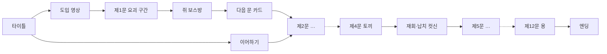
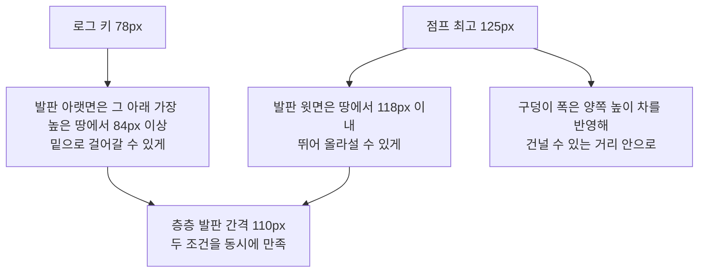

> **로그 제작기 시리즈**
> 1. [게임은 어떻게 만들어지는가, 그 궁금증에서 시작했다](/posts/log-game-01-why/)
> 2. [세계관부터 세웠다 — 동양 신화와 현대의 결합](/posts/log-game-02-worldbuilding/)
> 3. [연옥으로의 초대 — 세계관 일러스트로 먼저 보는 로그의 세계](/posts/log-game-03-gallery/)
> 4. [용도별 AI 협업과 프롬프트 — 그림을 만들어 게임에 넣기까지](/posts/log-game-04-ai-assets/)
> 5. [PoC에서 열두 개의 문까지 — 제작 과정 전체](/posts/log-game-05-making/)
> 6. 게임 시스템 설계 — 넋칼, 요괴, 십이지신, 스테이지 ← 지금 글
> 7. [아키텍처와 흐름 — 한 파일짜리 PoC를 관리 가능한 프로젝트로](/posts/log-game-07-architecture/)
> 8. [한계와 과제, 그리고 3D라는 욕심](/posts/log-game-08-limits-and-next/)

이 편은 게임 안의 규칙을 정리한다. 모든 규칙에는 세계관의 이유가 있고, 세계관의 설정에는 규칙의 역할이 있다는 걸 보여주는 게 목표다.

## 게임 전체 흐름



각 문은 **요괴 구간 → 홍살문 → 보스 방 → 출구 문** 순서다. 문을 넘을 때 "제n문 · ○시" 카드가 뜨고 자동 저장된다.

## 조작과 손맛

| 입력 | 동작 | 설계 이유 |
|---|---|---|
| ← → | 이동(가속·감속) | 즉시 최고 속도가 나면 미세 조작이 어렵다 |
| Space | 점프(길게 누르면 높이) | 점프 높이를 플레이어가 조절할 수 있어야 한다 |
| Z | 공격 | |
| X | 랜턴 | 이 게임만의 핵심 도구 |
| C | 무기 전환 | |

모바일에서는 같은 동작을 터치 버튼으로 한다. 가로 화면에서는 휴대용 게임기처럼 왼손 방향·오른손 행동 버튼을 게임 화면 위에 반투명하게 겹치고, 세로 화면에서는 화면이 작아 버튼을 아래로 뺀다. 방향 버튼은 한 영역에서 손가락 위치로 좌우를 판단해, 손가락을 미끄러뜨려 방향을 바꿔도 입력이 끊기지 않는다.

점프에는 **코요테 타임**(발판 끝에서 0.1초 늦게 눌러도 점프)과 **점프 버퍼**(착지 0.12초 전에 눌러도 점프)를 넣었다. 물리는 1/120초 고정 간격으로 돈다. 모니터 주사율에 따라 점프 높이가 달라지면 안 되기 때문이다.

## 넋칼: 쓰러뜨린 것이 힘이 된다

게임 초반, 달토끼가 숨겨둔 **빈 칼자루(절구공이)** 를 얻는다. 요괴를 쓰러뜨리면 넋이 구슬로 튀어나와 칼자루에 모이고, 모인 넋의 수에 따라 칼날이 단계적으로 자란다.

| 단계 | 필요한 넋 | 특징 |
|---|---|---|
| 빈 칼자루 | 0 | 칼날 없음 |
| 넋 단검 | 1 | 짧은 칼날 |
| 넋 장검 | 4 | 사거리 증가 |
| 넋 대검 | 8 | 피해 증가, 랜턴 없이도 그림자 잡귀를 벤다 |
| 천넋검 | 13 | 최대 피해, 휘두를 때 검기가 날아간다 |

- **칼자루를 얻기 전에 잡은 요괴의 넋은 흩어진다.** 흩어지는 걸 보여줘야 "칼자루가 있었으면 내 것이었겠구나"를 스스로 깨닫는다.
- **단계로 나눈 이유**: 넋 하나마다 조금씩 강해지면 체감이 안 된다. 칼날 길이가 눈에 띄게 달라지는 순간이 있어야 모으는 재미가 생긴다.
- **넋 대검에서 규칙이 바뀐다**: 초반엔 랜턴이 필수인 적을, 성장하면 랜턴 없이 벨 수 있다. 성장한 만큼 게임 방식이 바뀌어야 보상감이 있다.
- 덩치 큰 요괴일수록 넋을 많이 떨군다(불가사리·두억시니 3, 양반탈·장산범 2, 보스 6).

{: w="800"}
_"넋날이 자랐다 · 넋 장검"_

보스 보상으로 무기가 늘어난다. 세 무기는 **넋 저장소를 공유**한다. 무기마다 넋을 따로 모으면 무기를 바꾸는 순간 손해라, 결국 하나만 쓰게 되기 때문이다.

| 무기 | 얻는 곳 | 특징 |
|---|---|---|
| 넋칼 | 제1문 제단 | 기본. 넋에 따라 칼날이 자란다 |
| 넋활 | 인(호랑이) | 넋 화살을 쏜다. 넋이 1 이상이어야 한다 |
| 넋창 | 오(말) | 더 길게 찌르고, 한 줄의 적을 모두 꿰뚫는다 |

## 랜턴: 켜야 이기는 적, 꺼야 이기는 적

랜턴은 숨은 **기억의 조각**을 드러내고, 그림자 잡귀를 멈추고, 달토끼의 오염을 걷어낸다. 반대로 **어둑시니는 랜턴을 비출수록 커진다.** 켜야 이기는 적과 꺼야 이기는 적을 같은 구간에 두면, 언제 빛을 쓸지 판단하는 재미가 생긴다.

## 요괴 행동 설계

| 요괴 | 행동 | 공략 포인트 |
|---|---|---|
| 양반탈 | 느긋하게 걷다 가까우면 부채 휘두르기 | 부채 휘두를 때만 앞쪽 판정이 길어진다 |
| 초랭이탈 | 깡충깡충 빠르게 왕복 | 가볍지만 타이밍을 재야 한다 |
| 이매탈 | 목적 없이 비틀거리며 방향 전환 | 예측이 어렵다 |
| 어둑시니 | 랜턴 빛을 받으면 커진다 | 가장 커지면 밟을 수 없고 칼도 더 맞아야 한다 |
| 장산범 | 로그의 입력을 1초 늦게 재생 | 따라 하다 구덩이에 빠지게 유도할 수 있다 |
| 불가사리 | 쇠 발판 밑에서 발판을 먹는다 | 빨리 잡을지 돌아갈지 선택 |
| 두억시니 | 발판 위에 숨어 있다 밑으로 지나가면 낙하 | 착지 충격파 |
| 창귀 | 요괴를 불러 주변을 1.3배 빠르게 | 먼저 처리하는 게 이득 |

## 보스 패턴

### 이야기와 묶인 네 보스

| 보스 | 패턴 | 공략 | 이야기와의 연결 |
|---|---|---|---|
| 자(쥐) | 쌍단검, 돌진, 쥐 셋으로 분열 | 분열한 쥐를 다 잡으면 본체가 두 배 피해 | 토끼가 흘린 약점 |
| 축(소) | 망치 충격파, 뿔 돌진 | 돌진을 피해 벽에 박게 하면 기절 | 토끼가 흘린 약점 |
| 인(호랑이) | 환두대도, 포물선 덮치기, 창귀 소환 | 창귀를 먼저 처리 | 호랑이의 종 창귀 전설 |
| 묘(토끼) | 도약 내리찍기, 절구 충격파 | 칼은 통하지 않는다. 랜턴으로 정화 | 칼자루가 그녀의 것 |

토끼전은 **이기는 게 아니라 되찾는** 싸움이다. 칼로 베면 "칼날이 그녀를 비껴간다"고 뜨고, 랜턴 빛을 맞히는 동안 정화 게이지가 찬다. 25·50·75%마다 "로…그…?", "빛이 따뜻해", "기억나… 내 절구공이…"라고 조금씩 돌아온다.

### 데이터로 정의한 여덟 보스

나머지 여덟은 **동작 종류와 숫자**로 정의한다. 보스마다 코드를 짜지 않고 데이터만 적으면 공통 엔진이 돌린다.

```ts
horse: {
  moves: [
    // 창을 겨누고 방 끝까지 달렸다가, 벽에서 돌아서 한 번 더 돌진
    { type: 'dash', w: [6], a: [7], r: [9], tw: 0.42, dur: 3, speed: 720,
      rng: [200, 900], wall: 'stop', twice: true, cd: 1.5 },
    // 가까우면 창 휘두르기
    { type: 'melee', w: [8], a: [10], r: [11], tw: 0.3, ta: 0.2, tr: 0.32,
      rng: [0, 200], hb: [-50, 190, 0, 120], cd: 0.7 },
  ],
},
```

- `w`, `a`, `r`: 예고·실행·회복 동작에 쓸 스프라이트 프레임
- `tw`: 예고 시간. 줄이면 반응하기 어려워진다
- `rng`: 이 공격을 쓰는 거리
- `cd`: 다음 공격까지 간격. 줄이면 몰아친다

동작 종류는 근접, 돌진, 도약, 투사체, 낙뢰, 소환 여섯 가지다. 여기에 공통 규칙을 얹었다. **체력 절반에서 분노**하면 청록 기운이 돌며 빨라지고, 공격 후 45% 확률로 쉬지 않고 다음 공격을 잇는다.

| 보스 | 핵심 패턴 |
|---|---|
| 사(뱀) | 멀리 닿는 채찍, 감았다 튀어나오는 돌진, 소리 파동 |
| 오(말) | 왕복 기마 돌진, 창 휘두르기 |
| 미(양) | 양털 구름(닿으면 느려짐), 박치기 돌진 |
| 신(원숭이) | 갈고리에 맞으면 **랜턴을 빼앗긴다**. 화면이 어두워지고, 세 번 때려야 되찾는다 |
| 유(닭) | 확성기 파동, 울음소리로 요괴 소환 |
| 술(개) | 창 찌르기, 물어뜯기 돌진. 가장 빠르게 추적 |
| 해(돼지) | 구르기 돌진. 벽에 한 번 튕긴 뒤에야 뒤집히고, 뒤집힌 배를 밟으면 크게 튀어 오른다 |
| 진(용) | 여의주 탄막, 발밑 낙뢰, 꼬리 휩쓸기, 비행 돌진 |

## 스테이지: 테마와 지형 규칙

제1문은 튜토리얼 역할이라 손으로 배치했다. 제2문부터는 생성기가 **스테이지 번호를 시드로** 지형을 만든다. 시드가 고정이라 매번 같은 맵이 나온다. 무작위로 매번 바뀌면 "이 구간 어렵다"는 피드백을 재현할 수 없기 때문이다.

테마 하나는 **배경 네 겹, 바닥 질감, 대기 입자, 화면 연출, 지형 규칙**을 한 묶음으로 가진다. 배경만 바뀌고 지형이 같으면 다시 단조로워지기 때문이다.

| 문 | 테마 | 지형 | 입자·연출 |
|---|---|---|---|
| 자시 | 가라앉은 도시 | 손 배치 | 혼불, 잿불 |
| 축시 | 제철소 | 층층 철골, 쇠 발판 | 불똥, 열기 |
| 인시 | 대숲 산성 | 계단식 언덕 | 댓잎 |
| 묘시 | 달의 정원 | 연못 위 징검돌 | 꽃잎, 물결 |
| 사시 | 서낭당 늪 | 물웅덩이, 움직이는 발판 | 반딧불 |
| 오시 | 성벽 아래 벌판 | 긴 평지, 울타리 | 흙먼지 |
| 미시 | 구름 위 산사 | 높이가 다른 구름 섬 | 솜털 |
| 신시 | 남사당 장터 | 차양 발판, 줄타기 | 오색 종이 |
| 유시 | 노을 송신탑 | 탑처럼 쌓인 발판 | 잿불 |
| 술시 | 순라길 성곽 | 성벽 구간, 바리케이드 | 눈, 탐조등 |
| 해시 | 황금 곳간 | 금화 더미 | 금가루 |
| 진시 | 폭풍의 용궁 | 조각난 섬, 움직이는 발판 | 비, 번개 |

하늘 색은 **열두 시진의 흐름**을 따른다. 문을 넘을 때마다 연옥의 하루가 흐른다는 걸 설명 없이 색으로 느끼게 하려는 것이다.

### 동선 규칙: 로그의 몸에서 역산한다

처음 생성기는 발판을 "놓는 지점의 땅에서 일정 높이"로만 띄웠다. 높이가 다른 땅에 걸친 발판은 높은 쪽 기준으로 **머리 높이에 떠서** 걷지도 오르지도 못하는 막대가 됐다. 그래서 로그의 키(78px)와 점프 높이(약 125px)에서 역산한 규칙으로 바꿨다.



- 움직이는 발판은 구덩이 안에서만 움직여 땅 위로 넘어오지 않는다.
- 계단은 공중에 뜬 발판이 아니라 **올라갔다 내려오는 더미**로 만든다. 한쪽으로만 오르면 꼭대기에 절벽이 생긴다.
- 장애물과 계단 위에는 발판을 두지 않고, 요괴도 그 안에 생기지 않는다.

{: w="800"}
_해시 맵을 위에서 본 모습. 금화 더미, 발판, 요괴 위치를 검사할 때 이런 지도를 뽑아 봤다_

{: w="800"}
_해시의 금화 더미. 오르내리는 모양이라 절벽이 없다_

이 규칙을 넣은 뒤 열두 스테이지를 자동 검사해서 **막힌 발판 0, 건널 수 없는 구덩이 0**을 확인했다.

## 난이도

| 항목 | 값 | 이유 |
|---|---|---|
| 체력 | 하트 5칸 | 3칸일 땐 보스를 보기 전에 죽었다 |
| 피격 후 무적 | 1.7초 | 요괴가 몰린 곳에서 연달아 맞고 죽는 걸 막는다 |
| 체크포인트 | 스테이지당 3~4개 장승 | 지나가면 체력 회복, 죽으면 그 앞에서 부활 |
| 보스 방 재시작 | 보스 방 입구에서 | 보스까지 다시 걸어오는 건 벌이 아니라 지루함이다 |
| 요괴 속도 | 스테이지마다 4.5%씩 증가 | 후반으로 갈수록 긴장감 |
| 문 처음부터(R) | 시작 시점의 넋으로 되돌림 | 재시작을 반복해 넋을 불리는 걸 막는다 |

다음 편에서는 이 시스템들이 코드에서 어떻게 구성되는지 본다.
