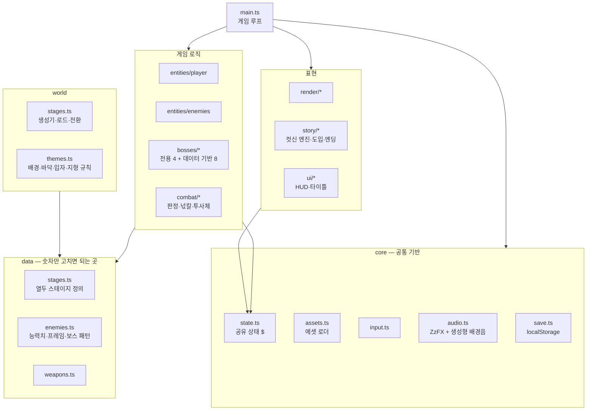
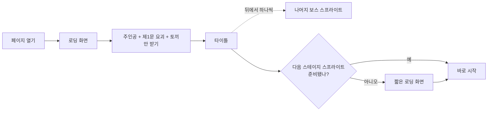
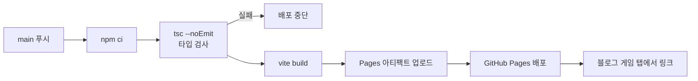

> **로그 제작기 시리즈**
> 1. [게임은 어떻게 만들어지는가, 그 궁금증에서 시작했다](/posts/log-game-01-why/)
> 2. [세계관부터 세웠다 — 동양 신화와 현대의 결합](/posts/log-game-02-worldbuilding/)
> 3. [연옥으로의 초대 — 세계관 일러스트로 먼저 보는 로그의 세계](/posts/log-game-03-gallery/)
> 4. [용도별 AI 협업과 프롬프트 — 그림을 만들어 게임에 넣기까지](/posts/log-game-04-ai-assets/)
> 5. [PoC에서 열두 개의 문까지 — 제작 과정 전체](/posts/log-game-05-making/)
> 6. [게임 시스템 설계 — 넋칼, 요괴, 십이지신, 스테이지](/posts/log-game-06-systems/)
> 7. 아키텍처와 흐름 — 한 파일짜리 PoC를 관리 가능한 프로젝트로 ← 지금 글
> 8. [한계와 과제, 그리고 3D라는 욕심](/posts/log-game-08-limits-and-next/)

## 출발점: HTML 한 파일

PoC 단계의 로그는 **HTML 파일 하나**였다. 코드 약 1,400줄에 스프라이트와 일러스트까지 base64로 박혀 8MB가 넘었다. 빠르게 고치고 바로 확인하기엔 이게 최선이었다. 파일 하나를 고치면 끝이고, 링크 하나로 바로 플레이할 수 있기 때문이다.

하지만 블로그에 올리고 계속 관리하려니 한계가 분명했다. 어디를 고쳐야 하는지 찾기 어렵고, 이미지 하나 바꾸려면 코드 파일을 통째로 다시 만들어야 하고, 변경 이력을 봐도 무엇이 바뀌었는지 알 수 없었다.

## 프레임워크 선택: 게임 엔진은 쓰지 않았다

"프레임워크를 써서, 향후 코드로 관리하는 걸 염두에 두고 설계하라"는 방향으로 옮겼다. 선택지는 두 갈래였다.

| 선택지 | 장점 | 단점 |
|---|---|---|
| Phaser 같은 게임 엔진 | 씬 관리, 물리, 입력, 오디오가 준비되어 있다 | 이미 만든 물리·판정·컷신을 사실상 전부 다시 짜야 하고, 그 과정에서 지금의 손맛이 달라진다 |
| Vite + TypeScript | 모듈 분리, 개발 서버, 배포 빌드, 타입 검사 | 게임 기능은 직접 유지해야 한다 |

결정은 **Vite + TypeScript**였다. 관리를 어렵게 만든 진짜 원인은 "엔진이 없어서"가 아니라 **한 파일 구조**와 **코드에 박힌 에셋**이었다. 그 원인만 정확히 없애고, 이미 검증된 동작은 그대로 옮기는 게 위험이 적다고 판단했다.

## 모듈 분리는 자동으로 했다

1,400줄을 사람이 손으로 쪼개면 전역 변수 참조를 빠뜨리기 쉽다. 그래서 **Babel로 구문 트리를 분석**해서 분리했다.

1. 최상위 `let` 변수(여러 함수가 함께 읽고 쓰는 가변 상태)를 전부 찾는다.
2. 그 변수를 가리키는 모든 참조를 `$.변수명`으로 바꾼다. 같은 이름의 지역 변수는 스코프 분석으로 건드리지 않는다.
3. 최상위 함수·상수를 도메인별 모듈에 배정하고, 서로 참조하는 이름을 분석해 `import`/`export`를 자동 생성한다.
4. Prettier로 정렬한다.

ES 모듈에서는 다른 모듈의 `let` 변수에 직접 대입할 수 없어서, 가변 상태를 한 객체(`core/state.ts`의 `$`)로 모았다. 상태가 한곳에 있으니 저장·디버그·테스트에서 들여다보기도 쉬워졌다.

옮긴 모듈에는 `// @ts-nocheck`가 붙어 있다. 한 번에 엄격한 타입을 붙이면 수백 군데를 고치다 버그가 섞이기 쉬워서, **동작을 그대로 옮기는 것**을 먼저 하고 타입은 파일 단위로 붙여가는 방식을 택했다. 새로 짠 진입점, 에셋 로더, 테마 모듈은 처음부터 strict 타입이다.

## 전체 구조



| 폴더 | 역할 | 분리한 이유 |
|---|---|---|
| `data/` | 스테이지·적·무기 수치 | 난이도 조절이 코드 수정 없이 끝나게 |
| `world/` | 지형 생성, 테마 | 맵 규칙을 한곳에서 바꾸게 |
| `bosses/` | 보스 로직 | 전용 규칙 보스와 데이터 기반 보스를 구분 |
| `story/` | 컷신 엔진과 대본 | 대사·연출을 게임 로직과 떼어 두려고 |
| `tools/` | 스프라이트·배경 변환 도구 | 에셋 작업을 명령 한 줄로 재현 가능하게 |

## 게임 루프

```mermaid
sequenceDiagram
  participant RAF as requestAnimationFrame
  participant Loop as main.loop
  participant Step as step(1/120s)
  participant Render as render
  RAF->>Loop: 매 프레임
  Loop->>Loop: 경과 시간 누적
  loop 누적이 1/120초 이상인 동안
    Loop->>Step: 입력 → 이동·충돌 → 적·보스 → 넋칼 → 입자
  end
  Loop->>Render: 배경 → 지형 → 적 → 로그 → 효과 → HUD
```

화면 갱신과 물리 갱신을 분리했다. 60Hz와 144Hz 모니터에서 점프 높이가 같아야 하기 때문이다. 모드(`title`, `intro`, `game`, `loading`)에 따라 같은 루프가 타이틀, 컷신, 게임, 로딩 화면을 그린다.

## 컷신 엔진

도입 영상, 토끼 재회·납치, 엔딩, 스테이지 카드는 모두 같은 엔진을 쓴다. 장면은 **대사 목록과 그리기 함수**로 정의한다.

```ts
{ lines: [['토끼', '로그…!'], ['로그', '이번엔 놓치지 않아.']],
  draw(s) { drawBackdrop(...); drawLogAt(...); drawSprAt('rabbit', 13, ...); } }
```

한 글자씩 찍히는 자막, 클릭·스페이스로 넘기기, 자동 진행, 건너뛰기, 장면 전환 페이드가 공통으로 붙는다. 새 컷신을 추가할 때 연출만 신경 쓰면 된다.

## 에셋 로딩



- 스프라이트와 일러스트는 **WebP**로 바꿨다. 같은 화질에서 5.8MB가 2.1MB가 됐다.
- 첫 화면에 필요한 것만 먼저 받고, 나머지는 플레이하는 동안 뒤에서 받는다.
- `import.meta.glob`으로 에셋을 불러와서, 폴더에 파일을 추가하면 코드 수정 없이 포함된다.

{: w="700"}
_첫 로딩 화면_

## 소리

효과음은 오픈소스 **ZzFX**(MIT)로 코드에서 합성한다. 음원 파일이 없어 용량이 늘지 않고, 숫자 배열만 바꾸면 소리를 다듬을 수 있다. 배경음은 낮은 드론 위에 **평조 5음 음계**를 무작위로 뜯는 생성형 음악이다. 음원 없이 국악의 느낌을 내려는 선택이다. 보스전에서는 템포가 빨라지고 북소리가 섞인다.

## 성능: "렉이 걸린다"

직접 플레이하다 렉 제보가 나왔다. CPU를 일부러 6배 느리게 만든 환경에서 측정하고, 프로파일러로 원인을 찾았다.

| 원인 | 증상 | 해결 |
|---|---|---|
| 소리를 낼 때마다 파형을 새로 계산 | 1초 넘게 울리는 배경음 한 음마다 화면이 멈칫 | 한 번 만든 파형을 재사용, 타이틀에서 미리 조금씩 생성 |
| 수천 px짜리 바닥 무늬를 매 프레임 다시 그림 | 계속 무거움 | 스테이지 로드 때 한 번 그려 캔버스로 재사용 |
| 빛 효과(방사형 그라데이션)를 매 프레임 생성 | 요괴가 많을 때 무거움 | 크기·색별로 한 번 그려 재사용 |

같은 조건에서 **초당 36~50프레임에 0.1초 넘게 멈추던 것이 47~56프레임에 최대 0.03초**로 줄었다. 평소 모니터링 스택을 다루며 "추측하지 말고 측정하라"를 자주 떠올리는데, 게임에서도 똑같았다. 처음 떠오른 원인(그림이 너무 많다)은 틀렸고, 실제 병목은 소리였다.

## 자동 검증

게임은 "돌아가는가"와 "재밌는가"가 다르지만, 적어도 "돌아가는가"는 자동으로 확인할 수 있다. 개발 중에는 Playwright로 이런 것들을 확인했다.

- 타이틀 → 새로 시작 → 도입 영상 → 제1문 진입
- 열두 스테이지 전부 로드, 보스 방 진입, 보스 처치 후 다음 문으로 전환
- 저장 후 이어하기
- **레벨 검사**: 모든 스테이지에서 머리 높이에 걸린 발판, 건널 수 없는 구덩이 개수 세기

`?debug`를 붙여 열면 게임 상태를 `window.__game`으로 노출해서 이런 테스트가 가능하다.

## 배포 파이프라인

게임은 블로그 저장소와 **별도 저장소**로 두고, 그 저장소의 GitHub Pages로 배포해 블로그 게임 탭에서 링크한다. 블로그 저장소에 빌드 결과를 넣으면 게임을 고칠 때마다 해시가 붙은 이미지가 블로그 이력에 쌓이고, 글 이력과 게임 이력이 섞이기 때문이다.



타입 검사를 통과하지 못하면 배포가 멈춘다. 깨진 버전이 올라가는 걸 막는 가장 싼 안전장치다. `base: './'`로 빌드해서 저장소 이름이나 경로가 바뀌어도 에셋 경로를 고칠 필요가 없다.

블로그 쪽 작업은 `_data/games.yml`에 항목 하나를 추가하는 것뿐이다. 게임 탭은 이 파일을 읽어 카드를 만들고, 카드를 누르면 탭 안의 플레이어(iframe)에서 게임을 연다. 블로그의 서비스 워커도 같은 파일에서 게임 경로를 읽어 캐시에서 제외한다. 게임을 배포하기 전에 방문한 사람의 브라우저에 404가 캐시되어 계속 남는 문제를 예전에 겪어서 이렇게 해뒀다.

```yaml
- title: 로그 — 열두 시진의 문
  url: https://noah2byte.github.io/log-game/
  category: 2D 액션
  icon: 🏮
  controls: ←/→ 이동, Space 점프, Z 공격, X 랜턴, C 무기 전환
  source: https://github.com/noah2byte/log-game
  thumbnail: /assets/img/games/log-game.webp
```

게임은 자기가 iframe 안에서 열렸는지 감지해서, 제목과 설명을 숨기고 화면을 게임에 양보한다. 플레이어 창의 높이가 제한되어 있어 페이지 장식이 있으면 캔버스가 잘리기 때문이다. 블로그와 게임이 같은 도메인이라 저장 공간(localStorage)을 함께 쓰지만, 저장 키에 게임 이름 접두어를 붙여 다른 게임과 겹치지 않게 했다.

## 사용한 오픈소스

| 이름 | 용도 | 라이선스 |
|---|---|---|
| Vite | 개발 서버·번들링 | MIT |
| TypeScript | 타입 검사 | Apache-2.0 |
| ZzFX | 효과음·배경음 합성 | MIT |
| vite-plugin-singlefile | 한 파일 미리보기 빌드 | MIT |
| Prettier | 코드 정렬 | MIT |
| Babel | 모듈 자동 분리(일회성 도구) | MIT |
| 고운바탕·고운돋움 | 글꼴 | SIL OFL |

다음 편에서는 지금의 한계와 앞으로의 계획을 정리한다.
